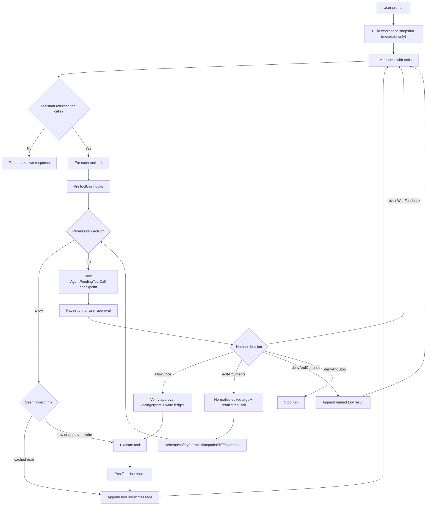

# 任务书 32：AI Lab Swift AgentLoopRunner

更新时间：2026-05-05

> 本任务书承接任务书 30/31，并吸收 `DOC/Comment.md` 的总体意见。当前不立即把 agent 主控切到 LangGraph sidecar，而是先把 Sci-Station 已有 Swift App、Repository、Permission Dock、Session Event、Paper Tools 串成一个真正可运行的 `model -> tool_call -> tool_result -> model` loop。这样后续接 MCP / LangGraph 时，UI 与权限边界已经稳定。

## 1. 背景

已完成：

1. Markdown + KaTeX 渲染器已落地，最终回答可以正确展示段落、代码块与公式。
2. Threads 已迁移到全局 store，workspace 作为标签/过滤器存在。
3. `list_papers`、`read_paper`、`read_paper_section`、`search_papers` 已作为只读工具进入默认 registry。
4. `AgentWorkspaceContextBuilder` 默认 metadata-only，不再把论文全文无条件塞进 prompt。

仍缺：

1. `SciStationAgentService.run` 仍主要是一次 planner call 后执行工具，没有工具结果回注后的二次模型合成。
2. `OpenAICompatibleProvider.streamResponse` 目前只处理文本 delta，未把 streaming tool call delta 汇总成 `AgentToolCall`。
3. 高风险工具的 approval 暂停/恢复还停留在 plan 执行阶段，没有 loop 内的 pending state。
4. Session timeline 虽能展示事件，但还没有完整表达多轮 assistant/tool/tool_result 的顺序。

## 2. 本轮目标

新增 Swift-native `AgentLoopRunner`，让 conversation 模式默认走可控多步 loop：

```text
User goal
  -> build metadata-only workspace context
  -> model response
  -> if tool_calls:
       evaluate permission
       auto-run read-only allowed tools
       pause on ask/deny writes
       append tool_result messages
       continue model call
  -> final assistant markdown
```

本轮仍保留 `AgentPlanner` / `AgentPlanParser` 作为 legacy fallback；不引入 LangGraph、不启动 MCP、不做外部代码执行。P32 可以先定义运行中需要的 checkpoint / pending call 草案，但最终事件、approval、error code、MCP envelope 等共享契约由 P33 冻结。

共享类型归属声明：P32 中的 `AgentHumanDecisionAction`、`AgentApprovalRequest`、`AgentToolRisk` 等跨 P32/P33/P34 类型只是 loop 开发所需的 provisional 草案；最终以 P33 `Agent Protocol Contracts` 为准。P32 合并 P33 后应删除或迁移重复定义，只保留 loop 内部模型。

## 3. 实施任务

- [x] [P32.1] 新增 loop 状态模型。
  - 建议文件：`Sci-Station/Agent/AgentLoopModels.swift`。
  - 增加 `AgentLoopOptions`：`maxSteps` 默认 8、`maxToolCalls` 默认 16、`maxContextCharacters` 默认 80_000、`maxToolResultCharactersPerCall` 默认 12_000、`maxAccumulatedToolResultCharacters` 默认 40_000、`autoApproveReadOnly` 默认 true、`allowProviderNativeTools` 默认 true。
  - 增加 `AgentLoopStep` / `AgentLoopResult` / `AgentLoopPauseReason`，用于测试、run log、UI timeline 复用。
  - 增加 `AgentPendingToolCall`，保存 runID、stepIndex、toolCall、approvalRequest、`messagesBeforePause`、createdAt、expiresAt。
  - 增加 `AgentToolCallFingerprint`，用 normalized arguments hash + target paths hash 做同一 run 内的幂等键。

- [x] [P32.2] 扩展 chat message/tool call wire-format。
  - 当前 `LLMChatMessage` 只有 `role/content/name/toolCallID`；OpenAI tool loop 需要 assistant message 能携带 `tool_calls`。
  - 增加 `toolCalls: [AgentToolCall]` 可选字段，`OpenAICompatibleProvider.messagePayload(from:)` 在 assistant message 中序列化 `tool_calls`。
  - tool result message 使用 `role == .tool`、`tool_call_id`、`name`、`content`。

- [x] [P32.3] 修正 provider-native tool calling。
  - `OpenAICompatibleProvider.respond` 已能解析 non-streaming `tool_calls`，优先用它完成 loop MVP。
  - `streamResponse` 本轮至少保持文本流式；如 provider 返回 tool delta，可先在 completed 阶段补全 `toolCalls`，后续再做细粒度 delta。
  - `buildChatRequest` 需要确认 `tools` 非空时发送 OpenAI function tool schema，并设置 `tool_choice: "auto"`。

- [x] [P32.4] 新增 `AgentLoopRunner` actor。
  - 建议文件：`Sci-Station/Agent/AgentLoopRunner.swift`。
  - 输入：goal、workspace snapshot、conversation history、tool definitions、`AgentToolContext`、configuration、apiKey、hook engine、permission evaluator、event logger。
  - 输出：`AgentLoopResult`，包含最终 markdown、全部 tool results、暂停原因、session id、step summaries。

- [x] [P32.5] 在 loop 内执行权限与 hooks。
  - 每个 tool call 先跑 `PreToolUse` hook，再跑 `AgentPermissionEvaluator`。
  - `risk == .readOnly` 且 permission 为 allow 时自动执行。
  - `writesWorkspace` / `network` / `externalSideEffect` 如果 decision 为 ask，则写入 `permissionRequested` 事件与 `AgentPendingToolCall` checkpoint，并暂停，不自动执行。
  - Permission Dock 批准后，从 `messagesBeforePause + tool_result` 继续模型调用，不能从 user prompt 重新开始。
  - Human decision 必须区分 `allowOnce`、`denyAndContinue`、`denyAndStop`、`reviseWithFeedback`、`editArguments`；危险写入默认 `denyAndStop`，普通工具拒绝可回注 denied result 后继续。
  - `editArguments` 不能直接执行；必须 normalize edited arguments，重建 tool call，重新跑 schema validation、deterministic safety policy、permission evaluator、target path normalization、diff preview 与 fingerprint 计算。如果新参数仍需审批，则再次进入 `approvalRequired`。
  - Deny 来源必须分层：deterministic safety deny 与 secret/path 类 hook deny 默认 fatal；permission policy ask 进入 Permission Dock；human `denyAndContinue` 回注 denied result 并允许模型改方案；human `denyAndStop` 终止 run；tool execution denied 作为 tool result 回注。
  - 同一 run 内重复 read-only fingerprint 可直接返回缓存结果；write call resume 后必须检查 approval id / fingerprint，避免重复执行已批准写入。
  - tool 执行后跑 `PostToolUse`，loop 结束跑 `Stop`。

- [x] [P32.6] 工具结果回注与截断策略。
  - 对每个 `AgentToolResult.message` 应用 `AgentToolDefinition.outputPolicy.maxCharacters`。
  - 将结果包装为稳定 JSON，禁止使用 YAML/JSON-ish 非稳定格式；字段至少包含 `schema_version`、`tool_name`、`tool_call_id`、`succeeded`、`content`、`summary`、`modified_paths`、`evidence`、`error`。
  - 对失败工具也回注结果，让模型能解释失败或选择替代工具。

- [x] [P32.7] 接入 `SciStationAgentService`。
  - conversation 默认走 `AgentLoopRunner`。
  - plan-only / legacy execute-approved 保留当前路径，作为 fallback 和回归开关。
  - `responseDeltaHandler` 继续服务最终回答的文本流；工具事件通过 `AgentSessionEventLogger` 展示。

- [x] [P32.8] UI timeline 适配。
  - AI Lab 现有 runtime 事件行已经支持折叠详情，本轮补齐事件顺序：`userMessage -> assistantMessage/toolCallStarted/toolCallCompleted -> assistantMessage`。
  - 工具卡片显示：工具名、risk、permissionKey、参数、结果摘要、modified paths。
  - pending approval 时输入区不丢草稿，显示「等待批准」状态；app 重启后可从 checkpoint 恢复 pending call。

- [x] [P32.9] CoreTestRunner 覆盖。
  - `agentLoopRunnerCallsReadOnlyToolThenContinues`：mock provider 第一轮返回 `read_paper_section`，第二轮返回最终 markdown。
  - `agentLoopRunnerPausesForWorkspaceWrite`：模型请求 `create_todo`，runner 写 permissionRequested 并暂停。
  - `agentLoopRunnerStopsAtMaxSteps`：provider 持续返回工具调用时触发上限。
  - `agentLoopRunnerInjectsToolResultMessages`：验证第二轮 request 包含 tool result。
  - `agentLoopRunnerResumesPendingApproval`：写入工具暂停后，批准一次可继续生成最终 assistant message。
  - `agentLoopRunnerDoesNotRepeatApprovedWriteOnResume`：resume 后不会重复执行已执行的写入 call。
  - `agentLoopRunnerEditArgumentsRevalidatesBeforeExecution`：用户编辑参数后重新验证 schema、权限、fingerprint 和 diff，而不是直接执行。
  - `agentLoopRunnerSafetyDenyIsFatal`：deterministic safety deny 或高风险 hook deny 会终止 run。
  - `agentLoopRunnerCachesRepeatedReadOnlyToolCall`：同 fingerprint 的只读调用在同一 run 内复用缓存。
  - `agentLoopRunnerStopsAtContextBudget`：累计 tool result 超过 budget 时停止或压缩。
  - `openAIProviderPayloadIncludesToolChoiceAuto`：验证工具 schema 与 `tool_choice`。

- [x] [P32.10] 验证与交付记录。
  - 跑 `swift run SciStationCoreTestRunner`。
  - 跑 `xcodebuild -project Sci-Station.xcodeproj -scheme Sci-Station -destination 'platform=macOS' build`。
  - 手动验证：询问「基于当前论文第 5 节总结公式」，timeline 能看到 `read_paper_section`，最终回答能渲染公式。

## 4. 关键模型草案

注意：下面的 `AgentHumanDecisionAction` 仅作为 P32 loop 内 provisional 草案，P33 冻结共享契约后以 P33 定义为准；P32 合并 P33 后应迁移或删除重复定义。

```swift
public struct AgentPendingToolCall: Codable, Sendable, Identifiable {
    public var id: String
    public var runID: String
    public var stepIndex: Int
    public var toolCall: AgentToolCall
    public var approvalRequest: AgentApprovalRequest
    public var messagesBeforePause: [LLMChatMessage]
    public var createdAt: Date
    public var expiresAt: Date?
}

public struct AgentToolCallFingerprint: Hashable, Codable, Sendable {
    public var toolName: String
    public var normalizedArgumentsHash: String
    public var targetPathsHash: String?
}

public enum AgentHumanDecisionAction: String, Codable, Sendable {
    case allowOnce
    case denyAndContinue
    case denyAndStop
    case reviseWithFeedback
    case editArguments
}
```

工具结果回注必须是稳定 JSON：

```json
{
  "schema_version": 1,
  "tool_name": "read_paper_section",
  "tool_call_id": "call_123",
  "succeeded": true,
  "content": "...",
  "summary": "Read section 5 from garani2024dark.",
  "modified_paths": [],
  "evidence": [
    {
      "relative_path": "library/papers/xxx/paper.md",
      "lines": [10, 25]
    }
  ],
  "error": null
}
```

## 5. 伪代码

```swift
public actor AgentLoopRunner {
    public func run(_ request: AgentLoopRequest) async throws -> AgentLoopResult {
        var messages = request.initialMessages
        var steps: [AgentLoopStep] = []
        var toolCallCount = 0
        var accumulatedToolCharacters = 0

        for stepIndex in 1...request.options.maxSteps {
            guard request.contextBudget.accepts(messages, accumulatedToolCharacters) else {
                return AgentLoopResult(paused: .contextLimitExceeded, steps: steps)
            }

            let llmRequest = LLMProviderRequest(
                messages: messages,
                tools: request.toolDefinitions.map(LLMToolSpecification.init(agentTool:)),
                options: request.providerOptions
            )

            let response = try await request.provider.respond(
                to: llmRequest,
                configuration: request.configuration,
                apiKey: request.apiKey
            )

            messages.append(LLMChatMessage(
                role: .assistant,
                content: response.message.content,
                toolCalls: response.toolCalls
            ))

            guard !response.toolCalls.isEmpty else {
                return AgentLoopResult(finalResponse: response.message.content, steps: steps)
            }

            for call in response.toolCalls {
                toolCallCount += 1
                let fingerprint = AgentToolCallFingerprint(call: call)
                guard toolCallCount <= request.options.maxToolCalls else {
                    return AgentLoopResult(paused: .maxToolCallsExceeded, steps: steps)
                }

                if let cached = request.toolResultCache[fingerprint], cached.isReadOnly {
                    messages.append(cached.asToolMessage(callID: call.id))
                    continue
                }

                let safetyDecision = request.safetyPolicy.evaluateToolCall(call, context: request.toolContext)
                guard !safetyDecision.isFatalDeny else {
                    return AgentLoopResult(paused: .safetyPolicyBlocked, steps: steps)
                }

                let decision = await request.permissionPolicy.decision(for: call)
                guard decision.action == .allow else {
                    let pending = AgentPendingToolCall(
                        call: call,
                        approvalRequest: decision.approvalRequest,
                        messagesBeforePause: messages,
                        stepIndex: stepIndex
                    )
                    try await request.checkpointStore.save(pending)
                    return AgentLoopResult(paused: .approvalRequired(call), steps: steps)
                }

                guard !request.writeLedger.hasExecuted(fingerprint) else {
                    messages.append(request.writeLedger.priorResult(for: fingerprint).asToolMessage(callID: call.id))
                    continue
                }

                let result = await request.toolExecutor.executeOne(call, context: request.toolContext)
                await request.eventLogger.toolCompleted(call, result)
                let toolMessage = result.asStableJSONToolMessage(callID: call.id)
                accumulatedToolCharacters += toolMessage.content.count
                messages.append(toolMessage)
            }
        }

        return AgentLoopResult(paused: .maxStepsExceeded, steps: steps)
    }
}
```

Resume 时如果用户选择 `editArguments`，runner 不能使用原 pending call 直接执行：

```swift
func resumeEditedArguments(_ pending: AgentPendingToolCall, edited: JSONValue) async throws -> AgentLoopResult {
    let rebuiltCall = try toolHost.rebuildCall(pending.toolCall, editedArguments: edited.canonicalized())
    try toolHost.validateSchema(rebuiltCall)

    let safety = safetyPolicy.evaluateToolCall(rebuiltCall, context: toolContext)
    guard !safety.isFatalDeny else { return .blockedBySafety(safety) }

    let approval = try await approvalBuilder.rebuildApprovalRequest(for: rebuiltCall)
    let fingerprint = AgentToolCallFingerprint(call: rebuiltCall)
    guard permissionEvaluator.evaluate(approval).action == .allow else {
        try await checkpointStore.save(pending.replacing(call: rebuiltCall, approvalRequest: approval))
        return .pausedForApproval(approval)
    }

    return try await executeApprovedCall(rebuiltCall, fingerprint: fingerprint, after: pending.messagesBeforePause)
}
```

## 6. 流程图



## 7. 验收标准

1. AI Lab conversation 模式可以自动调用至少一个只读 paper tool，并基于 tool result 继续生成最终回答。
2. workspace 写入工具不会自动执行，会暂停并进入 Permission Dock。
3. loop 有硬上限，不会无限调用工具。
4. Session timeline 中能按顺序看到用户消息、assistant 工具请求、工具结果、最终 assistant 消息。
5. 写入工具触发 approval 后，批准一次可以从 pending tool call 恢复并继续生成最终 assistant message；拒绝时不会执行工具，timeline 中能看到拒绝事件。
6. 同一 run 内重复只读工具调用使用缓存；resume 后不会重复执行已批准写入。
7. tool result message 是包含 `schema_version` 的稳定 JSON，供 P33/P34 runtime 与 sidecar 读取。
8. 旧 plan-only 路径仍可用，不影响任务书 30/31 已完成能力。

## 8. 非目标

- 不接入 LangGraph sidecar。
- 不启动真实 MCP server。
- 不做 SQLite FTS 或向量索引。
- 不实现 shell/python sandbox。
- 不自动合并任何 workspace 写入。

## 9. 本轮实施记录

### 9.1 实施前审阅

- 任务范围可执行：现有代码已经具备 `AgentToolDefinition`、`AgentToolCall`、`AgentToolResult`、`AgentPermissionEvaluator`、`AgentHookEngine`、`AgentSessionEventLogger`、paper read tools 与 workspace write tools，可在 Swift core 内直接串成 loop。
- 本轮保持 P32 的 provisional 类型边界：新增 loop 运行模型只服务 Swift-native loop；跨 P33/P34 的共享协议仍由 P33 冻结。
- 接入策略：conversation 默认优先使用 `LLMChatProvider` 的 provider-native tool calling；plan-only 与 execute-approved 继续保留 legacy planner / executor 路径。
- 验证策略：优先补齐 `SciStationCoreTestRunner` 中的 loop 与 OpenAI payload 测试，再运行 SwiftPM core validation 与 Xcode app build。

### 9.2 实现情况

- 新增 `Sci-Station/Agent/AgentLoopModels.swift`：实现 `AgentLoopOptions`、`AgentLoopStep`、`AgentLoopResult`、`AgentLoopPauseReason`、`AgentPendingToolCall`、`AgentApprovalRequest`、`AgentHumanDecisionAction`、`AgentToolCallFingerprint`。
- 新增 `Sci-Station/Agent/AgentLoopRunner.swift`：实现 Swift-native `model -> tool_call -> tool_result -> model` loop、read-only fingerprint cache、write ledger、pending checkpoint、approval resume、`editArguments` 重新验证、稳定 JSON tool result 回注、context/tool-call/max-step 上限。
- 扩展 `LLMChatMessage`：assistant message 可携带 `toolCalls`，tool result message 使用 `role == .tool`、`tool_call_id`、`name`、`content`。
- 更新 `OpenAICompatibleProvider`：非流式 response 保留 `toolCalls` 到 message，chat payload 在 tools 非空时发送 `tool_choice: "auto"`，assistant `tool_calls` 可序列化，streaming delta 在 completed 阶段补全聚合到的 tool calls。
- 新增 `AgentPromptBuilder.buildToolLoopChatMessages`：conversation loop 使用 provider-native tools，不再沿用旧的“Conversation 不调用工具”提示。
- 更新 `SciStationAgentService`：conversation loop policy 走 `AgentLoopRunner`；plan-only / execute-approved legacy 路径保留；新增 `resumePendingToolCall`，从 checkpoint 的 `messagesBeforePause` 继续。
- 更新 `AppViewModel` 与交互模式：conversation 默认启用 read-only auto loop；写入 pending 时 Permission Dock 可显示并调用 resume；等待审批时保留输入草稿并显示等待状态。
- 扩展 CoreTestRunner：覆盖只读工具后继续、写入暂停、max steps、tool result 注入、approval resume、防重复写入、edit arguments 重新审批、安全 deny、只读缓存、context budget、OpenAI `tool_choice` payload。

### 9.3 验证记录

- `get_errors`：新增/修改的 Swift 文件无诊断错误。
- `swift run SciStationCoreTestRunner`：通过；新增 P32 loop tests 随核心套件通过。
- `xcodebuild -project Sci-Station.xcodeproj -scheme Sci-Station -destination 'platform=macOS' build`：通过。
- 手动 UI/API 验证说明：本轮未在真实 AI Lab 窗口中用真实模型执行「基于当前论文第 5 节总结公式」；等接入真实 provider 后，需要在 app 内确认 timeline 能看到 `read_paper_section`，最终回答能渲染公式。

### 9.4 遗留风险

- P32 的 `AgentApprovalRequest` / `AgentHumanDecisionAction` / checkpoint shape 仍是 provisional；P33 需要冻结共享协议并迁移/去重。
- Permission Dock 的 `editArguments` / `reviseWithFeedback` UI 语义尚未完整产品化；runner 已支持，UI 第一版仍主要使用 Allow once / Deny。
- P32 稳定 JSON tool result 的 `evidence` 仍为空数组；P33/P34 需要补 line range、source hash、evidence refs。
- write ledger 目前是 runner actor 内存态，足以防同一进程 resume 重复写入；P33 需要把 idempotency ledger 纳入持久 checkpoint/事件契约。
- Xcode build 仍有既有 `ChatMarkdownWebView` WebKit main-actor warning；不是本轮新增失败。
