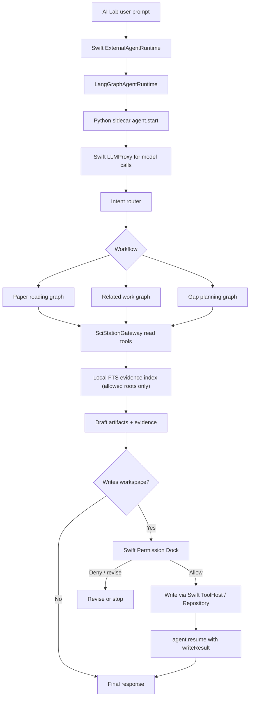

# 任务书 34：Fake Sidecar First、LangGraph Sidecar、Local RAG 与科研 Workflow MVP

更新时间：2026-05-05

> 本任务书承接任务书 32/33，并真正开始落地 `DOC/Comment.md` 的推荐主架构：Sci-Station 保留 Swift App、Repository、Permission Dock 与本地数据模型；新增本地 Python LangGraph sidecar 负责 durable agent 编排、checkpoint、human-in-the-loop 与科研 workflow；通过任务书 33 的 runtime façade / ToolHost / MCP Gateway 调用 Sci-Station 能力。P33 dependency gate 已通过，本任务书已从设计讨论收敛为执行型 sidecar MVP：先用 fake sidecar 固化协议与恢复路径，再接真实 sidecar handshake、Swift LLMProxy、read-only Gateway、FTS evidence 与单篇论文精读。

## 1. 背景

任务书 33 已完成并通过验证，系统边界已经可以进入 sidecar MVP 执行阶段：

```text
AI Lab UI
  -> ExternalAgentRuntime
  -> LegacySwiftAgentRuntime
  -> LangGraphAgentRuntime (本轮新增)
  -> SciStationToolHost / AgentMCPGateway
  -> Swift Permission Layer
```

本轮不要追求“万能科研 agent”，也不要一开始把 sidecar、双向 JSON-RPC、LLMProxy、FTS、approval/resume 与三个完整 production graph 全压到同一个 MVP。先做一个可恢复、可审计、能输出 evidence 的 sidecar MVP，并按分层目标推进三个高价值 workflow：

1. 单篇论文精读：P34 MVP 的真实 workflow。
2. 项目 related work 草稿：第一轮可用 sample/fake graph 或 beta graph 验证协议。
3. research gap / task planning：第一轮可用 sample/fake graph 或 beta graph 验证协议。

## 2. 本轮目标

1. P33 dependency gate 已通过：event envelope、P32 schema migration、Legacy runtime wrapper、ToolHost、MCP Gateway、run directory、persistent ledger 已可用；P34 不再讨论兼容 P32 legacy pending 文件。
2. 在不引入 LangGraph 的情况下先实现 fake sidecar protocol harness，覆盖 initialize、health、agent.start、approval_required、agent.resume、final_response、run_failed。
3. 新增 `AgentRuntime/` Python 包，启动本地 LangGraph sidecar，并让 Swift 侧 `LangGraphAgentRuntime` 复用同一协议。
4. sidecar 通过任务书 33 的 MCP Gateway / `SciStationGatewayClient` 调用 Sci-Station read tools；写入请求必须回到 Swift approval。
5. `llm.respond` request 显式携带 `toolCallPolicy`，MVP 默认禁用 provider-native free tool calling；graph 需要工具时显式走 Gateway，避免 Python graph tool loop 与 provider-native tool loop 双重循环。
6. 建立本地 SQLite FTS evidence index 第一版，不急着上 embedding；文件发现优先使用 Swift 授权的 `IndexableDocumentSnapshot`。
7. P34 MVP 强制落地单篇论文精读 workflow；related work / gap planning 先作为 sample/fake 或 beta workflow 分阶段验收。
8. MVP 中 sidecar 不持有 API key、不直接请求模型、不直接写 workspace；LLM、tools、approval、log event 都通过 Swift 代理或 ToolHost。

## 3. 实施任务

- [x] [P34.0] P33 dependency gate。
  - P34 开始前必须满足：P33 `AgentRuntimeEventEnvelope` 已落地。
  - P32 provisional `AgentApprovalRequest` / pending checkpoint / stable tool result 已迁移到 P33 schema。
  - `LegacySwiftAgentRuntime` 可包装 P32 `AgentLoopRunner`。
  - `SciStationToolHost` 已成为唯一工具入口。
  - MCP Gateway V1 可列 `tools/list`、调用 `tools/call`，并对写入返回 `result.status == approval_required`。
  - run directory / checkpoint / approvals / persistent tool ledger 已可读写。
  - Gate 已由任务书 33 完成记录确认：`swift run SciStationCoreTestRunner` 与 `xcodebuild -project Sci-Station.xcodeproj -scheme Sci-Station -destination 'platform=macOS' build` 均通过；P34 不需要兼容 P32 legacy pending 文件。

- [x] [P34.0a] Fake sidecar protocol harness。
  - 在不引入真实 LangGraph 的情况下，实现 fake sidecar 进程。
  - 覆盖 `sidecar.initialize`、`sidecar.health`、`agent.start`、`runtime.event`、`approval_required`、`agent.resume`、`final_response`、`run_failed`。
  - Fake sidecar 的事件序列必须使用 JSON fixture 文件驱动，避免测试逻辑写死在 Python 代码里。
  - Fake sidecar fixtures 同时作为协议 golden fixtures；Swift 侧解析后必须生成稳定的 `AgentRuntimeEventEnvelope` 序列快照。
  - 第一批 fixture：`run_success_paper_reading.jsonl`、`run_approval_then_resume.jsonl`、`run_failed.jsonl`、`sidecar_crash_after_approval.jsonl`、`handshake_timeout.jsonl`。
  - 第一批 golden fixture 测试：`langGraphRuntimeReplaysGoldenFixtureRunSuccess`、`langGraphRuntimeReplaysGoldenFixtureApprovalResume`、`langGraphRuntimeRejectsInvalidFixtureSchemaVersion`、`langGraphRuntimeCanonicalizesSidecarLocalSequence`。
  - Swift `LangGraphAgentRuntime` 先只对接 fake sidecar；fake sidecar 通过后再接真实 LangGraph graph。
  - 用 fake sidecar 先验证 Swift `Process` 管理、stdio JSON-RPC 双向调用、event envelope parsing、sequence canonicalization、approval resume、fallback。

- [x] [P34.1] 新增 Python sidecar 目录。
  - 建议结构：

```text
AgentRuntime/
├── pyproject.toml
├── sci_station_agent/
│   ├── main.py
│   ├── server.py
│   ├── transport/
│   │   ├── stdio_jsonrpc.py
│   │   └── schemas.py
│   ├── graph/
│   │   ├── state.py
│   │   ├── router.py
│   │   ├── paper_reading.py
│   │   ├── related_work.py
│   │   └── gap_planning.py
│   ├── mcp_client/
│   │   └── sci_station_gateway.py
│   ├── rag/
│   │   ├── fts_index.py
│   │   ├── retriever.py
│   │   └── evidence.py
│   ├── safety/
│   │   └── approvals.py
│   └── storage/
│       ├── checkpoints.py
│       └── events.py
└── tests/
    └── fixtures/
        ├── run_success_paper_reading.jsonl
        ├── run_approval_then_resume.jsonl
        ├── run_failed.jsonl
        ├── sidecar_crash_after_approval.jsonl
        └── handshake_timeout.jsonl
```

- [x] [P34.2] Python runtime 基础协议。
  - 支持方法：`sidecar.initialize`、`sidecar.initialized`、`sidecar.health`、`agent.start`、`agent.resume`、`agent.cancel`、`agent.checkpoint`。
  - 启动后必须先完成 capability handshake，校验 `protocolVersion`、`schemaVersion`、capabilities、Python dependencies、workspace allowed roots；版本不兼容或 5 秒内未响应时 Swift 回退 Legacy runtime。
  - 事件流对齐任务书 33 的 `AgentRuntimeEventEnvelope`：`run_started`、`node_started`、`tool_call_requested`、`tool_call_completed`、`approval_required`、`artifact_draft`、`checkpoint_saved`、`final_response`、`run_failed`。
  - checkpoint 落到统一 run 目录，sidecar 崩溃后可恢复。
  - Sidecar 不理解 P32 legacy checkpoint；所有 checkpoint / approvals / tool calls 都通过 P33 run directory schema。
  - stdio JSON-RPC 必须支持双向调用：Swift -> Sidecar 为 `sidecar.initialize/health` 与 `agent.start/resume/cancel/checkpoint`；Sidecar -> Swift 为 `runtime.event/tools.list/tools.call/resources.list/resources.read/approval.request/llm.respond/llm.stream/log.event`。
  - 所有 JSON-RPC request 必须带唯一 `id`；response 必须按 `id` correlation，不依赖返回顺序。
  - stdio transport 必须支持 interleaved request / response / notification；不能假设 sidecar 一次 request 完成后才会发送下一条消息。
  - MVP 固定语义：`runtime.event` 使用 JSON-RPC notification，不等待 sidecar 或 Swift ack；`tools.list`、`tools.call`、`resources.list_indexable_documents`、`resources.read`、`llm.respond` 使用 request-response。
  - `agent.start` 在 sidecar 接收 run 后返回 accepted；后续进度全部通过 `runtime.event` notification 推送，避免 sidecar 在长 workflow 中阻塞 stdio request。

- [x] [P34.3] Swift `LangGraphAgentRuntime`。
  - 建议文件：`Sci-Station/Agent/LangGraphAgentRuntime.swift`、`Sci-Station/Agent/SidecarProcessSupervisor.swift`。
  - 新增 `SidecarProcessSupervisor` actor，专管 Python 路径、环境变量、stderr 收集、启动超时、崩溃检测、stop/restart 与 health；`LangGraphAgentRuntime` 只专注 `ExternalAgentRuntime` 协议与 run lifecycle。
  - 最小接口建议：`start() async throws -> SidecarConnection`、`stop() async`、`restart() async throws -> SidecarConnection`、`health() async -> SidecarHealth`。
  - 用 `SidecarProcessSupervisor` 启动 bundled/local Python sidecar，第一版走 stdio JSON-RPC。
  - 复用 `ExternalAgentRuntime`，让 AI Lab 可在设置中切换 `Swift Loop` / `LangGraph Sidecar`。
  - P34 MVP 中，sidecar 不直接读取 Keychain、不持有 API key、不直接请求模型；所有 LLM 调用通过 Swift `LLMProxy` 完成，Swift 继续使用现有 provider / Keychain。
  - 新增 sidecar lifecycle events：`sidecarStarting`、`sidecarReady`、`sidecarUnavailable`、`sidecarCrashed`、`fallbackToLegacyRuntime`。
  - 正常启动、handshake 失败、运行中崩溃、用户选择恢复都必须有固定事件顺序，供 UI 与 tests 断言。

- [x] [P34.4] MCP Gateway client。
  - Python sidecar 只通过 `SciStationGatewayClient.call_tool()` 访问 Sci-Station tools。
  - Read-only tools 可自动调用。
  - 新增 Swift-owned `LLMProxy` bridge；sidecar 不持有 API key、不直接访问 provider credential，也不把 credential ref 原文写入 request。
  - P34 MVP 中 `llm.respond` request 必须显式携带 `toolCallPolicy: "disabled"`，默认不开放 provider-native free tool calling；graph 需要工具时显式调用 Gateway。
  - `toolCallPolicy` 可选值为 `disabled`、`structured_only`、`tool_calling_node_only`；MVP 默认 `disabled`。
  - `llm.respond` 的 `modelOptions` 只能包含非敏感字段；request/response 落盘前必须复用 P33 `AgentRedactionPolicy`。
  - usage 可以进入 events/debug 元数据；prompt 与 response 默认不写盘，显式 debug 时也只能保存 redacted 数据。
  - 只有专门的 ToolCallingNode 可使用 `tool_calling_node_only` 并允许 `llm.respond(tools:)` 返回 toolCalls；返回后也必须重新路由到 `SciStationGatewayClient`，不能由 Python 私有执行。
  - 写入工具返回 `approval_required` 后，sidecar graph interrupt，等待 Swift 携带 decision / writeResult 调用 `agent.resume`。
  - sidecar 不直接调用 `write_file`、`patch_file`、`create_todo`、`update_metadata`；workflow 只生成 `AgentArtifactDraft`，真正写入必须由 Swift ToolHost/Repository 在 approval 后执行。
  - 对 draft artifact 的最终写入，用户 Allow once 后由 Swift ToolHost/Repository 立即执行，并把 `AgentToolResult` / `writeResult` 随 `agent.resume` 回传 sidecar；sidecar 不二次发起同一写入 call。

- [x] [P34.5] SQLite FTS evidence index V1。
  - 目标路径：`.sci-station/index/chunks.sqlite`。
  - 索引内容：`paper.md`、`annotations.md`、`wiki/**/*.md`、`projects/**/wiki/**/*.md`、可见 `materials` Markdown/Text。
  - chunk 字段：`schema_version`、`source_type`、`source_id`、`relative_path`、`heading`、`start_line`、`end_line`、`text`、`content_hash`、`updated_at`。
  - 先用 FTS5 + metadata filter；embedding 留到后续任务。
  - P34 MVP 中 `.sci-station/index/chunks.sqlite` 的 writer 是 sidecar；Swift 是授权文档清单与写入锁协调者，后续可迁移为 Swift-owned index service。
  - 文件发现、workspace root、allowed roots、ignored globs 必须由 Swift 传入；Python 只能读取 Swift 明确授权的资源。
  - 优先使用 Swift `resources/list_indexable_documents` 提供的 `IndexableDocumentSnapshot`：`resource_id`、`relative_path`、`source_type`、`source_id`、`updated_at`、`content_hash`、`parser_hint`。
  - Python 读取内容时优先调用 `resources/read(resource_id 或 relative_path)`，不默认接收真实 file URL，也不直接 open workspace 文件。
  - `resources/read` 必须支持 `maxBytes` / `maxCharacters` 与可选 `range`；单个文档超限时返回 `truncated: true` 或要求分片读取。
  - `resources/read` 请求示例：`{"resource_id":"paper:demo:paper.md","maxBytes":1048576,"range":null}`；返回至少包含 `resource_id`、`content`、`content_hash`、`truncated`、`encoding`。
  - FTS chunker 只索引允许的文本类型与大小范围；遇到大文件、二进制、生成输出或未知编码时必须跳过或截断，并在 retrieval trace 中记录原因。
  - Python sidecar 不直接 walk 整个 workspace；只有 development mode fallback 才按 allowed roots + ignored globs walk 文件，且必须继续禁止 hidden/system dirs。
  - 索引更新必须使用 write lock，避免 Swift 正在写文件时 Python 同时重建；文件修改后按 `relative_path + updated_at/content_hash` 增量失效；`schema_version` 不匹配时删除并重建。

- [x] [P34.6] Evidence 输出契约。
  - 所有科研 synthesize 节点必须输出 evidence table。
  - 每条 claim 至少包含：claim、source_type、paper_id/path、line range、short quote、confidence、source_hash、chunk_id、retrieved_at。
  - 写入 Wiki/plan 时保留 citation block，避免普通聊天式无来源总结。
  - read tools / FTS retriever 返回 `AgentEvidenceRef`，并填充 P32/P33 stable tool result JSON 的 `evidence` 字段。
  - `AgentArtifactDraft.evidenceRefs` 引用 evidence table 中的 id；最终 Wiki citation block 从 `evidenceRefs` 生成。
  - `AgentEvidenceRef.id` 必须稳定生成；推荐使用 `sha256(source_type + source_id + relative_path + start_line + end_line + source_hash)`，或以 `chunk_id` 作为 evidence ref 主键并单独维护 claim-evidence edge id。
  - 同一个 run 内 evidence id 必须稳定；`source_hash` 变化后 evidence 视为 stale。
  - Artifact draft 只能引用当前 evidence table 中存在的 evidence id；最终 Wiki citation block 必须保留 enough metadata 以便 UI 跳回源文件 line range。

- [x] [P34.7] Workflow 1：单篇论文精读。
  - 触发：当前选中论文 + 用户说「精读/结构化笔记/生成待办」。
  - 节点：load metadata -> read abstract/intro -> read method -> read experiments -> extract contributions/limitations -> draft note -> approval。
  - 草稿产物：`wiki/papers/{citekey}.md`、todo drafts。
  - 最低 evidence 验收：`contributions` 至少 3 条且均有 `evidenceRefs`；`methods` 至少 2 条且均有 `evidenceRefs`；`limitations` 至少 2 条，允许标记 low confidence 但必须说明来源；todo drafts 可选，如生成必须引用对应 paper id 与 evidence。
  - 如果 `paper.md` 不存在、为空、未 OCR、未转换或内容过短，workflow 必须降级读取 `meta.yaml`、abstract、annotations；有 PDF 但无可用 Markdown 时，只生成“需要转换/OCR/补全文本”的 artifact/todo draft，不生成无来源精读总结。

- [x] [P34.8] Workflow 2：项目 related work。
  - P34 第一轮可作为 sample/fake graph 或 beta graph，不阻塞 MVP 完成。
  - 触发：当前 project + 用户说「related work/综述/相关工作」。
  - 节点：load project overview -> list core papers -> retrieve evidence -> cluster by theme -> draft related_work -> citation critic -> approval。
  - 草稿产物：`projects/{project-id}/wiki/related_work.md`、`.sci-station/agent/runs/{run_id}/evidence.json`。

- [x] [P34.9] Workflow 3：research gap / task planning。
  - P34 第一轮可作为 sample/fake graph 或 beta graph，不阻塞 MVP 完成。
  - 触发：当前 project + 用户说「research gaps/下一步/拆任务」。
  - 节点：load project context -> load core papers -> load existing tasks -> synthesize gaps -> propose hypotheses -> generate todos -> approval。
  - 草稿产物：`projects/{project-id}/wiki/research_plan.md`、todo drafts。

- [x] [P34.10] Approval/resume。
  - LangGraph 节点中遇到写入请求时使用 interrupt。
  - Swift Permission Dock 展示 `AgentApprovalRequest`。
  - 用户 Allow once 后，Swift 按 `approvalID + toolCallID + fingerprint` 检查 P33 persistent ledger。
  - 未执行过：Swift 先写 pending/executing ledger，再由 ToolHost/Repository 执行真实写入，成功后写 completed ledger。
  - 已执行过：Swift 读取 prior `AgentToolResult` / `writeResult`，不得重新调用真实写入工具。
  - Swift 将 `AgentToolResult` / `writeResult` 随 `agent.resume(runID, decision, writeResult)` 回传 sidecar；sidecar 将 writeResult 写入 graph state 后继续生成 `final_response`，不再二次发起同一写入 call。
  - 用户 Deny/Ask revise 后，sidecar 将反馈加入 graph state，重新生成草稿或结束。
  - approval 必须引用 P33 的 `AgentApprovalRequest.id/runID/toolCallID`；resume 时按 sequence 去重，避免 sidecar 崩溃恢复后重复写入。

- [x] [P34.10a] Sidecar crash/resume event order。
  - 正常启动：`sidecarStarting -> sidecarReady -> runStarted -> ...`。
  - handshake 失败：`sidecarStarting -> sidecarUnavailable -> fallbackToLegacyRuntime`。
  - 运行中崩溃：`sidecarCrashed -> checkpointSaved` 或 `checkpointLoadFailed` -> `fallbackToLegacyRuntime` 或 `waitingForUserRecovery`。
  - 用户选择恢复：`sidecarStarting -> sidecarReady -> checkpointLoaded -> runResumed`。

- [x] [P34.11] 测试。
  - Python tests：router 选择 workflow、FTS chunking、evidence schema、approval interrupt。
  - Swift CoreTestRunner：`langGraphRuntimeParsesRuntimeEvents`、`langGraphRuntimeMapsApprovalRequired`、`agentRuntimeSelectionKeepsLegacyFallback`。
  - 增加 `langGraphRuntimePerformsInitializeHandshake`、`langGraphRuntimeExecutesApprovedWriteInSwiftOnce`、`ftsIndexRebuildsOnSchemaMismatch`。
  - 增加 fake sidecar golden fixture tests：`langGraphRuntimeReplaysGoldenFixtureRunSuccess`、`langGraphRuntimeReplaysGoldenFixtureApprovalResume`、`langGraphRuntimeRejectsInvalidFixtureSchemaVersion`、`langGraphRuntimeCanonicalizesSidecarLocalSequence`。
  - 必须提供 fake sidecar 进程，覆盖 `agent.start`、`approval_required`、`agent.resume`、`final_response`、`run_failed` 事件回放，避免 Swift 协议测试依赖真实 LangGraph。
  - Fake sidecar tests 必须从 `AgentRuntime/tests/fixtures/*.jsonl` 回放事件，确保 fixture 可被后续真实 sidecar 回归复用。
  - 增加 `langGraphRuntimeFallsBackWhenInitializeTimesOut`、`langGraphRuntimeDoesNotLoseApprovalWhenSidecarCrashes`、`langGraphRuntimeReloadsCheckpointAfterRestart`。
  - 真实 LangGraph workflow tests 作为 Python tests 单独运行。

- [x] [P34.12] 验证与交付记录。
  - 跑 `swift run SciStationCoreTestRunner`。
  - 跑 Python sidecar test（建议 `python -m pytest AgentRuntime/tests` 或项目选定命令）。
  - 跑 `xcodebuild -project Sci-Station.xcodeproj -scheme Sci-Station -destination 'platform=macOS' build`。
  - 手动验证 fake sidecar、真实 sidecar initialize/health、sidecar read-only tools、FTS 检索、单篇论文精读 workflow。
  - related work / gap planning 可先用 sample/fake graph 验证，不要求 P34 MVP 全量真实可用。

### 3.1 分层验收顺序

```text
P34-M1: fake sidecar + stdio JSON-RPC harness
P34-M2: real sidecar initialize / health + lifecycle events
P34-M3: Swift LLMProxy + Gateway read-only tools
P34-M4: FTS index + AgentEvidenceRef bridge
P34-M5: 单篇论文精读 workflow
```

P34 第一轮强制验收只覆盖 M1-M5。related work / gap planning 可以先用 sample graph、fake graph 或 beta graph 验证 runtime 协议，但 production 化放入 P35 或之后。

## 4. Sidecar 边界与打包策略

### 4.1 Sidecar handshake

Swift 启动 sidecar 后必须先发送 `sidecar.initialize`，并等待 `sidecar.initialized` / `sidecar.health` 通过后再允许 `agent.start`。初始化参数至少包含协议版本、schema 版本、app 版本、workspace root、allowed roots 与 Swift 侧可提供的能力：

```json
{
  "jsonrpc": "2.0",
  "id": "init_001",
  "method": "sidecar.initialize",
  "params": {
    "protocolVersion": "1.0",
    "schemaVersion": 1,
    "appVersion": "0.x",
    "workspaceRoot": "...",
    "allowedRoots": ["library/papers", "wiki", "projects", "materials"],
    "capabilities": {
      "llmProxy": true,
      "mcpGateway": true,
      "approvalResume": true,
      "ftsIndex": true
    }
  }
}
```

sidecar 返回自身版本与能力；`protocolVersion` / `schemaVersion` 不匹配、allowed roots 接收失败、dependency import 失败或 5 秒内无响应时，Swift 必须发出 `sidecarUnavailable` 并回退 Legacy Swift Runtime。

```json
{
  "jsonrpc": "2.0",
  "id": "init_001",
  "result": {
    "protocolVersion": "1.0",
    "schemaVersion": 1,
    "sidecarVersion": "0.1.0",
    "capabilities": {
      "paperReading": true,
      "relatedWork": true,
      "gapPlanning": true
    }
  }
}
```

### 4.2 LLM 边界

P34 MVP 中，sidecar 只负责编排，不直接持有 API key，也不直接请求模型。Python 需要模型时通过双向 JSON-RPC 请求 Swift：

```json
{
  "jsonrpc": "2.0",
  "id": "llm_req_001",
  "method": "llm.respond",
  "params": {
    "messages": [],
    "tools": [],
    "toolCallPolicy": "disabled",
    "modelOptions": {}
  }
}
```

Swift 收到后使用现有 `OpenAICompatibleProvider` / Keychain / settings 执行，并把 redacted response 回给 sidecar。

`llm.respond` 的 request / response / usage 落盘策略必须固定：request 与 response 默认不写盘；usage、finish reason、model id 等非敏感元数据可以写入 runtime events 或 debug metadata；用户显式开启 debug 时，也只能保存经过 P33 `AgentRedactionPolicy` 处理后的 prompts/responses。`modelOptions` 不得包含 API key、credential ref 原文、环境变量值或 Keychain 标识符。

P34 MVP 中，`llm.respond` 默认禁用 provider-native free tool calling。LangGraph 节点需要工具时，应显式调用 `SciStationGatewayClient.call_tool()`；只有专门的 ToolCallingNode 才允许 `llm.respond(tools:)` 返回 tool calls，且返回的 tool calls 必须重新路由到 `SciStationGatewayClient`，不能由 Python 私有执行。

`toolCallPolicy` 语义固定为：`disabled` 表示禁止 provider-native tool calls；`structured_only` 表示允许结构化 JSON 输出但不允许 tool calls；`tool_calling_node_only` 只允许专门 ToolCallingNode 使用。MVP 所有普通 `llm.respond` request 必须传 `disabled`。

`llm.respond` 返回结构必须对齐 P32/P33 provider response，支持普通文本、structured JSON、tool calls、usage 与 finish reason：

```json
{
  "message": {
    "role": "assistant",
    "content": "..."
  },
  "toolCalls": [],
  "structuredOutput": null,
  "usage": {
    "inputTokens": 1234,
    "outputTokens": 456
  },
  "finishReason": "stop"
}
```

### 4.3 Workspace 读写边界

Python sidecar 只能读取 Swift 授权路径：

```json
{
  "workspace_root": "...",
  "allowed_roots": [
    "library/papers",
    "wiki",
    "projects",
    "materials"
  ],
  "ignored_globs": [
    "**/.git/**",
    "**/.sci-station/agent/runs/**",
    "**/node_modules/**",
    "**/.venv/**"
  ]
}
```

写入 workspace 的最终动作必须由 Swift ToolHost/Repository 执行。Sidecar 只能生成 `AgentArtifactDraft` 与 `AgentApprovalRequest`。

FTS 与 read resources 优先使用 Swift 授权快照，而不是让 Python 重新实现完整文件发现逻辑。MVP 默认不把真实 file URL 交给 Python；Python 通过 `resources/read` 请求 Swift 返回授权内容：

```json
{
  "resource_id": "paper:demo:paper.md",
  "relative_path": "library/papers/demo/paper.md",
  "source_type": "paper",
  "source_id": "demo",
  "updated_at": "2026-05-05T12:00:00Z",
  "content_hash": "sha256:...",
  "parser_hint": "markdown"
}
```

Swift 应提供 `resources/list_indexable_documents` 或等价方法；Python 优先消费 `IndexableDocumentSnapshot`，再调用 `resources/read(resource_id 或 relative_path)` 获取内容。只有 development mode fallback 才允许 Python 按 `allowedRoots + ignoredGlobs` walk 文件，且不得读取 hidden/system dirs。

`resources/read` 必须带读取限额，避免 FTS 建索引拖垮 UI 或读取大型生成文件：

```json
{
  "resource_id": "paper:demo:paper.md",
  "maxBytes": 1048576,
  "maxCharacters": 500000,
  "range": null
}
```

返回必须标记内容是否截断：

```json
{
  "resource_id": "paper:demo:paper.md",
  "content": "...",
  "content_hash": "sha256:...",
  "truncated": false,
  "encoding": "utf-8"
}
```

P34 MVP 中 `chunks.sqlite` 的 writer 是 sidecar；Swift 提供授权文档清单、资源读取与 write lock 协调。Swift 不同时写同一个 FTS index，避免双 writer 造成锁与 schema 漂移。

### 4.4 Run 目录

Run 目录由 P33 `AgentRunDirectoryStore` 定义，P34 sidecar 只能按该 schema 读写，不再兼容 P32 legacy pending 文件。

```text
.sci-station/agent/runs/{run_id}/
├── checkpoint.json
├── events.jsonl
├── tool_calls.jsonl
├── approvals.jsonl
├── evidence.json
├── artifacts/
│   ├── related_work.md
│   └── research_plan.md
└── debug/
    ├── enabled.flag
    ├── prompts.redacted.jsonl
    ├── llm_responses.redacted.jsonl
    └── redaction_failures.jsonl
```

`tool_calls.jsonl` 是 Swift-owned persistent execution ledger；写入类工具必须先查 ledger，再决定执行真实写入还是读取 prior result。Sidecar 不拥有写入重试权。

`debug/` 默认关闭，不写 prompts/responses。只有开发模式或用户显式开启后才创建 `enabled.flag` 并保存 redacted prompts/responses；redaction 失败时不得写盘，只记录不含原文的 `redaction_failures.jsonl` 元数据。

P34 debug redaction 必须复用 P33 `AgentRedactionPolicy`。`runtime.event`、`llm.respond` request/response、tool result、approval request、artifact draft 落盘前都必须经过同一 redaction policy，避免 Python debug 已脱敏但 Swift events/session log 泄露敏感内容。

### 4.5 Python 打包

第一版开发模式：

```text
使用系统 python 或用户指定 python。
从 AgentRuntime/ 启动。
启动前做 health check：`python --version >= 3.11`、`import langgraph` 成功、`import sci_station_agent` 成功、`sidecar.initialize` 在 5 秒内响应、`protocolVersion/schemaVersion` 匹配、workspace allowed roots 接收成功、fake `agent.start` 能返回 `sidecarReady`。
失败时自动回退 Legacy Swift Runtime。
```

后续产品模式：

```text
bundle Python standalone runtime。
pin dependencies。
sidecar crash 自动降级并保留 checkpoint。
```

## 5. LangGraph State 伪代码

```python
from typing import TypedDict, Literal

class SciStationAgentState(TypedDict):
    run_id: str
    thread_id: str | None
    project_id: str | None
    selected_paper_id: str | None
    user_goal: str
    intent: Literal["paper_reading", "related_work", "gap_planning", "general"] | None
    messages: list[dict]
    evidence: list[dict]
    draft_artifacts: list[dict]
    pending_approval: dict | None
    final_response: str | None

def approval_gate(state: SciStationAgentState):
    risky = [
        artifact for artifact in state["draft_artifacts"]
        if artifact.get("risk") in {"writes_workspace", "runs_code", "external_side_effect"}
    ]
    if not risky:
        return {"pending_approval": None}

    return interrupt({
        "type": "approval_required",
        "run_id": state["run_id"],
        "actions": risky,
    })
```

## 6. Workflow Router 伪代码

```python
def route_intent(state: SciStationAgentState) -> str:
    goal = state["user_goal"].lower()

    if state.get("selected_paper_id") and any(k in goal for k in ["精读", "paper note", "结构化笔记"]):
        return "paper_reading"

    if state.get("project_id") and any(k in goal for k in ["related work", "相关工作", "综述"]):
        return "related_work"

    if state.get("project_id") and any(k in goal for k in ["gap", "下一步", "拆任务", "research plan"]):
        return "gap_planning"

    return "general"
```

## 7. 总流程图



## 8. Evidence 表格式

```json
{
  "claim": "该论文把蒸发率写成与局域热平衡分布相关的积分形式。",
  "evidence": [
    {
      "source_type": "paper",
      "paper_id": "garani2024dark",
      "relative_path": "library/papers/Dark-Matter/garani2024dark/paper.md",
      "heading": "5 Evaporation",
      "lines": [210, 238],
      "source_hash": "sha256:...",
      "chunk_id": "paper:garani2024dark:210-238",
      "retrieved_at": "2026-05-05T00:00:00Z",
      "quote": "短摘录，不超过必要长度",
      "confidence": 0.82
    }
  ]
}
```

## 9. 验收标准

### 9.1 强制 MVP 验收

1. P33 dependency gate 已通过，P34 不再兼容 P32 legacy pending 文件。
2. Fake sidecar fixtures 通过，并可作为协议 golden fixtures 回放稳定 `AgentRuntimeEventEnvelope` 序列。
3. `LangGraphAgentRuntime` 可通过 `SidecarProcessSupervisor` 启动 fake sidecar，完成 stdio JSON-RPC request/response correlation、runtime.event notification parsing、sequence canonicalization、approval resume 与 run_failed 处理。
4. 真实 sidecar `sidecar.initialize` / `sidecar.health` 通过；handshake 失败、超时或崩溃时按固定 lifecycle event order fallback 或等待用户恢复。
5. Swift-owned `LLMProxy` 可完成一次 redacted `llm.respond`；sidecar 不持有 API key，不直接访问 Keychain，不把 prompt/response 明文默认写盘。
6. Sidecar 能通过 Sci-Station Gateway 调用 read-only paper/wiki/task/material tools；写入类工具只能返回 `approval_required` 并 interrupt。
7. `resources/list_indexable_documents` 与 `resources/read` 可从 Swift 授权快照读取内容；`resources/read` 支持读取限额、截断标记与 content hash。
8. FTS index 可通过授权资源建立并检索 line range、source_hash、chunk_id；schema mismatch 可重建，content_hash 变化可增量失效。
9. Stable tool result JSON、FTS retriever、artifact draft 与 final Wiki citation block 通过同一 `AgentEvidenceRef` 串联；evidence id 稳定，source_hash 变化后标记 stale。
10. 单篇论文精读生成 `AgentArtifactDraft` + `evidenceRefs`，满足最低 evidence 验收；无可用 `paper.md` 时降级为转换/OCR/补全文本任务草稿，不生成无来源总结。
11. Approval 写入仍由 Swift Permission Dock、ToolHost 与 Repository 执行；sidecar 不直接写 workspace，不重复执行已由 P33 persistent ledger 记录的写入。
12. `swift run SciStationCoreTestRunner`、`python -m pytest AgentRuntime/tests` 与 `xcodebuild -project Sci-Station.xcodeproj -scheme Sci-Station -destination 'platform=macOS' build` 均通过，或在交付记录中说明具体环境阻塞。

### 9.2 Beta / 后续验收

1. Related work beta graph 可使用 sample/fake/beta 路径验证协议，但 production 质量放到 P35。
2. Gap planning beta graph 可使用 sample/fake/beta 路径验证协议，但 production 质量放到 P35。
3. ToolCallingNode provider-native toolCalls、真实 LangGraph crash resume、Python standalone bundle、embedding、citation critic、代码 sandbox 均不阻塞 P34 MVP。

## 10. 非目标

- 不上 embedding/vector database。
- 不做完整 OpenAI Agents SDK sandbox。
- 不允许 sidecar 直接绕过 Swift Repository 写 workspace。
- 不做 shell/python 执行 workflow。
- 不发布 plugin marketplace。
- 不在 P34 MVP 中让 Python sidecar 直接读取 Keychain 或持有 API key。
- 不要求 P34 MVP 同时完成 related work 与 gap planning 的 production graph。
- 不让 Python sidecar 兼容 P32 legacy pending checkpoint；该迁移属于 P33。
- 不在默认 graph 中开放 provider-native free tool calling。

## 11. P34 完成输出与 P35 输入

P34 完成时必须留下稳定接口与可复用资产，供 P35 直接接续，而不是重写 sidecar 基础设施：

- `AgentRuntime/` Python package skeleton。
- fake sidecar fixtures 与 golden fixture tests。
- stdio JSON-RPC transport 与 request/response correlation。
- `LangGraphAgentRuntime` + `SidecarProcessSupervisor`。
- Swift-owned `LLMProxy` bridge。
- `SciStationGatewayClient` read-only tools bridge。
- FTS index V1 与 `resources/list_indexable_documents` / `resources/read` 契约。
- `AgentEvidenceRef` bridge、stable evidence id 与 stale 判断。
- `paper_reading` graph MVP。

## 12. 后续任务候选

1. Embedding 检索：sqlite-vec / LanceDB / Qdrant local。
2. Code sandbox：`.sci-station/agent/runs/{run_id}/sandbox/`。
3. Plugin package：`.codex-plugin` / `.claude-plugin` / Sci-Station preset importer。
4. Multi-agent：research-explorer、citation-critic、experiment-planner。

## 13. P34 启动记录（P33 完成后）

任务书 33 已完成 P34 dependency gate：P33 runtime event envelope、schema migration、run directory、persistent execution ledger、ToolHost、MCP Gateway、deterministic safety policy 与 Skill loader core 均已落地并通过验证。

已验证状态：

- `swift run SciStationCoreTestRunner`：通过。
- `xcodebuild -project Sci-Station.xcodeproj -scheme Sci-Station -destination 'platform=macOS' build`：通过。
- 已覆盖 fake/legacy runtime event stream、event dedupe、MCP read/write approval、legacy pending migration、persistent ledger、approval fingerprint、Skill progressive loading、prompt secret block 与 hook deny。

下一轮剩余风险：

- P34 不应把 fake sidecar、真实 sidecar、FTS、LLMProxy 与三个 workflow 一次性强耦合；必须按 M1-M5 分层验收。
- Python sidecar 不得直接持有 API key、直接写 workspace 或兼容 P32 legacy checkpoint。
- Skill trust prompt、Tier 3 resource browser、sidecar UI runtime selector 等产品化细节可以随 P34 UI 接入推进，但不应阻塞 fake sidecar protocol harness。
- Xcode build 仍有既有 `ChatMarkdownWebView` WebKit actor-isolation warnings；不属于 P34 gate，但后续可单独清理。

P34 第一批建议执行顺序：

1. 完成 fake sidecar fixture 与 stdio JSON-RPC harness。
2. 新增 Swift `LangGraphAgentRuntime`，先只对接 fake sidecar。
3. 新增 `AgentRuntime/` Python package skeleton 与 initialize/health。
4. 接入 Swift-owned LLMProxy 与 MCP Gateway read-only tools。
5. 建立 FTS evidence index V1 与单篇论文精读 artifact draft。

## 14. P34 完成交付记录

本轮已完成 P34-M1 到 P34-M5：fake sidecar + stdio JSON-RPC harness、real sidecar initialize/health、Swift LLMProxy + Gateway bridge、FTS index + `AgentEvidenceRef` bridge、单篇论文精读 workflow MVP。

已交付资产：

- `AgentRuntime/` Python sidecar package skeleton、stdio JSON-RPC transport、fixture schema 与 fake sidecar server。
- Golden fixtures：`run_success_paper_reading.jsonl`、`run_approval_then_resume.jsonl`、`run_failed.jsonl`、`sidecar_crash_after_approval.jsonl`、`handshake_timeout.jsonl`、`invalid_schema_version.jsonl`。
- Swift `SidecarProcessSupervisor` 与 `LangGraphAgentRuntime`，支持 request/response correlation、runtime.event notification、sidecar lifecycle、fallback、approval checkpoint 与 resume。
- Swift-owned `SidecarLLMProxy`，默认禁用 provider-native free tool calling；sidecar 不持有 API key。
- Python `SciStationGatewayClient` stub、Swift MCP/ToolHost bridge、授权资源 `resources.list_indexable_documents` / `resources.read` bridge。
- SQLite FTS5 helper、stable evidence id / stale detection、单篇论文精读 artifact draft 与 evidence refs。
- Related work 与 gap planning 在 P34 以 beta/sample artifact 路径验证 protocol shape；production graph 已转入 P35。

本轮验证：

- `swift run SciStationCoreTestRunner`：通过。
- `/Users/funyday/Documents/Sci-Station/.venv/bin/python -m pytest AgentRuntime/tests`：12 passed。
- `xcodebuild -project Sci-Station.xcodeproj -scheme Sci-Station -destination 'platform=macOS' build`：通过。

实现中发现并修复的关键问题：`FileHandle.readabilityHandler` 可能触发多个 stdout drain task，Swift actor reentrancy 会打乱 sidecar notification 的 accept/yield 顺序，导致 approval 事件晚于 checkpoint。`SidecarConnection` 现使用 `isDrainingOutput` 串行 drain buffer，保证 fixture 与真实 sidecar 的事件顺序稳定。

P35 输入：citation critic / evidence critic、单篇论文精读 production 化、evidence UI/source jump、related work production、gap planning production、run replay/debug bundle、runtime UI 产品化、embedding retrieval V1。

## 15. Questions

1. P34 是否确认按 `fake sidecar -> real sidecar handshake -> read-only tools -> FTS evidence -> 单篇论文精读` 顺序推进？当前建议为确认，先隔离协议问题再接 LangGraph 复杂度。
2. Related work 与 gap planning 在 P34 第一轮是否接受 sample/fake/beta graph？当前建议为接受，把 production 质量放到后续 retrieval、citation critic 与 project context 任务。
3. FTS 第一版是否优先由 Swift 提供 `resources/list_indexable_documents` + `resources/read`？当前建议为优先做授权快照与 Swift 资源读取，只有 development mode 保留 Python walk fallback。
