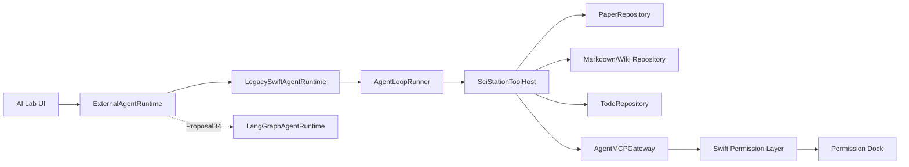

# 任务书 33：Agent Protocol Contracts、Runtime Façade 与 MCP Gateway

更新时间：2026-05-05

> 本任务书承接任务书 32，并落实 `DOC/Comment.md` 中「Sci-Station 做 Agent Host、MCP 作为工具/知识接口标准、Swift 继续掌控权限」的架构建议。本轮目标不是替换为 LangGraph，而是冻结 Swift loop、MCP Gateway、未来 LangGraph sidecar 共同使用的协议边界，再把 Swift agent loop 外面包出稳定 runtime façade。

## 1. 背景

任务书 32 完成后，AI Lab 应该已经具备 Swift-native tool loop。但如果继续把 UI 直接绑在 `AgentLoopRunner` / `AgentToolExecutor` 上，后续切 LangGraph sidecar 会很痛。因此本轮要先冻结边界：

```text
AI Lab UI
  -> ExternalAgentRuntime protocol
  -> LegacySwiftAgentRuntime (wraps AgentLoopRunner)
  -> future LangGraphAgentRuntime
```

同时，现有 MCP 只在 UI/配置面板展示状态，还不是工具协议层。本轮先做一个保守的本地 gateway，让 Sci-Station 内部工具可以按 MCP 风格描述、分级、审计，并为任务书 34 的 Python sidecar 做准备。

## 2. 本轮目标

1. 冻结共享 schema：runtime event envelope、run state、approval、artifact、tool result、checkpoint、MCP envelope、error code。
2. 用 `LegacySwiftAgentRuntime` 包装任务书 32 的 loop，保持现有体验。
3. 建立 `ExternalAgentRuntime`，让 UI 不再直接依赖具体 runner。
4. 建立唯一工具入口 `SciStationToolHost` / `AgentMCPGateway`，把本地 read/write tools 分层暴露。
5. 完成 P1.4/P1.5 遗留：skill 三级披露、确定性安全 hooks、Claude Code hook 事件名补齐。
6. 让 Permission Dock 的审批对象从「工具名」升级为「工具 + 参数 + risk + target path + diff/summary」。

## 3. 共享协议契约

P33 之后，Swift loop、MCP Gateway、LangGraph sidecar、AI Lab UI 都必须使用同一组 schema。新增字段时只能向后兼容；breaking change 必须提升 `schemaVersion`。

### 3.1 Run 状态机

```text
created
running
waiting_for_approval
resuming
completed
failed
cancelled
```

### 3.2 Runtime event envelope

```swift
public struct AgentRuntimeEventEnvelope: Codable, Sendable, Identifiable {
    public var id: String
    public var schemaVersion: Int
    public var runID: String
    public var threadID: String?
    public var sequence: Int
    public var timestamp: Date
    public var event: AgentRuntimeEvent
}

public enum AgentRuntimeEvent: Codable, Sendable {
    case runStarted(AgentRunStarted)
    case nodeStarted(AgentNodeStarted)
    case assistantDelta(AgentAssistantDelta)
    case assistantMessage(AgentAssistantMessage)
    case toolCallRequested(AgentToolCallRequested)
    case toolCallCompleted(AgentToolCallCompleted)
    case approvalRequired(AgentApprovalRequest)
    case artifactDraft(AgentArtifactDraft)
    case checkpointSaved(AgentCheckpointSummary)
    case finalResponse(AgentFinalResponse)
    case runCancelled(AgentRunCancelled)
    case runFailed(AgentRunFailed)
    case sidecarStarting
    case sidecarReady
    case sidecarUnavailable(AgentRuntimeError)
    case sidecarCrashed(AgentRuntimeError)
    case fallbackToLegacyRuntime(AgentRuntimeError)
}
```

`assistantDelta` 只用于流式 UI 展示，不保证完整；`assistantMessage` 是可落库的完整消息；`finalResponse` 是 run 的最终自然语言总结，通常等价于最后一条 assistant message。

跨语言 JSON wire-format 必须使用外部 tagged union，不依赖 Swift `Codable enum` 默认格式。Swift 内部可以继续使用 enum，但落库、MCP Gateway、LangGraph sidecar 与 UI 传输时必须固定为 `event.type` + `event.payload`：

```json
{
  "schemaVersion": 1,
  "id": "evt_001",
  "runID": "run_123",
  "threadID": "thread_456",
  "sequence": 12,
  "timestamp": "2026-05-05T12:00:00Z",
  "event": {
    "type": "tool_call_completed",
    "payload": {
      "tool": "read_paper_section",
      "toolCallID": "call_001",
      "summary": "Read section 5."
    }
  }
}
```

`sequence` 归属规则：每个 run 内 sequence 单调递增；`LegacySwiftAgentRuntime` 由 Swift runtime 分配 sequence；LangGraph sidecar 可产生 local sequence，但 Swift Host 接收后必须 canonicalize 为 host sequence，落库与 UI 只使用 host sequence；checkpoint 恢复后从最后一个 committed sequence + 1 继续；重复 `eventID` 直接丢弃，不再分配新 sequence。

### 3.3 Error code

```swift
public enum AgentRuntimeErrorCode: String, Codable, Sendable {
    case invalidRequest
    case providerUnavailable
    case toolNotFound
    case toolSchemaInvalid
    case permissionDenied
    case approvalRequired
    case checkpointNotFound
    case sidecarUnavailable
    case sidecarCrashed
    case maxStepsExceeded
    case maxToolCallsExceeded
    case contextLimitExceeded
    case safetyPolicyBlocked
    case internalError
}
```

`approvalRequired` 可用于 Swift runtime 内部状态或 legacy 兼容错误码；MCP Gateway 的正常审批暂停不得把 `approval_required` 编码成 JSON-RPC error。

### 3.4 Approval 与 artifact

```swift
public struct AgentApprovalRequest: Codable, Sendable, Identifiable {
    public var id: String
    public var runID: String
    public var toolCallID: String
    public var tool: String
    public var risk: AgentToolRisk
    public var permissionKey: String
    public var arguments: JSONValue
    public var targetPaths: [String]
    public var diffPreview: String?
    public var summaryPreview: String?
    public var reason: String
    public var rollbackHint: AgentRollbackHint?
    public var expiresAt: Date?
    public var suggestedDecisions: [AgentHumanDecisionAction]
}

public struct AgentArtifactDraft: Codable, Sendable, Identifiable {
    public var id: String
    public var runID: String
    public var kind: String
    public var proposedPath: String?
    public var title: String
    public var content: String
    public var diffPreview: String?
    public var evidenceRefs: [AgentEvidenceRef]
    public var risk: AgentToolRisk
}
```

`JSONValue` canonicalization 规则：所有 tool arguments、approval request hash、fingerprint、diff hash 与 idempotency key 在计算前必须 canonicalize。规则至少包括 object key 排序、number 编码稳定、`null` 保留/移除策略固定、workspace path 归一化、string 使用固定 Unicode normalization。未经 canonicalize 的 JSON 不得用于 approval hash 或 fingerprint。

### 3.5 Tool risk taxonomy

`AgentToolRisk` 保留现有值并向前扩展：`readOnly`、`writesWorkspace`、`modifiesMetadata`、`network`、`externalSideEffect`、`runsCode`、`destructive`、`credentialAccess`。旧数据解码时未知 risk 必须降级为 `externalSideEffect` 或 ask。

## 4. 实施任务

- [ ] [P33.1] 新增 runtime façade 模型。
  - 建议文件：`Sci-Station/Agent/AgentRuntimeProtocol.swift`。
  - 定义 `AgentRuntimeRequest`、`AgentRuntimeEventEnvelope`、`AgentRuntimeEvent`、`AgentHumanDecision`、`AgentCheckpointSummary`、`AgentRuntimeErrorCode`。
  - 所有 runtime event 必须带 `schemaVersion`、event id、run id、sequence、timestamp，Swift loop 与 LangGraph sidecar 都按此 envelope 发事件。
  - Runtime event 的 JSON wire-format 必须使用 `event.type` + `event.payload`；Swift `Codable enum` 默认格式只能作为进程内实现细节。
  - Swift Host 是最终 sequence owner；sidecar event 可带 local sequence，但落库、UI 与 checkpoint 使用 host canonical sequence。
  - 明确 `assistantDelta` / `assistantMessage` / `finalResponse` 的关系，避免 UI 重复落库。

- [ ] [P33.2] 实现 `LegacySwiftAgentRuntime`。
  - 建议文件：`Sci-Station/Agent/LegacySwiftAgentRuntime.swift`。
  - 内部调用 `AgentLoopRunner`。
  - 把 loop steps 映射为统一 `AgentRuntimeEvent`。
  - `resumeRun` 第一版可以只支持 approval 后继续当前 Swift loop；若当前实现难度过大，先把 pending call 与 messages 落到 checkpoint 文件，再恢复。

- [ ] [P33.3] 调整 AI Lab 依赖方向。
  - `AppViewModel` 不直接调用 `SciStationAgentService.run` 的 conversation 主路径，而是调用 `ExternalAgentRuntime.startRun`。
  - `SciStationAgentService` 继续保留 thread/draft/run log/tool definition 等 service 能力。
  - UI timeline 只消费 `AgentRuntimeEventEnvelope` 与 session events，不关心底层是 Swift loop 还是 sidecar。
  - 新增 `FakeExternalAgentRuntime`，能回放 `runStarted/toolCallRequested/approvalRequired/finalResponse/runFailed`，验证 UI 不依赖 LegacySwiftRuntime 内部细节。

- [ ] [P33.4] 新增 `SciStationToolHost`。
  - 建议文件：`Sci-Station/Agent/SciStationToolHost.swift`。
  - 聚合 Paper/Wiki/Task/Material/Project tools。
  - 对每个工具统一输出：name、description、input schema、risk、permission key、source、output policy。
  - 第一批 read-only tools：`list_papers`、`read_paper`、`read_paper_section`、`search_papers`、`search_wiki`、`read_wiki_page`、`list_tasks`、`list_materials`。
  - P33 之后，所有 agent 可调用工具必须注册到 `SciStationToolHost`；Legacy Swift loop、MCP Gateway、LangGraph sidecar 都只能通过 ToolHost 获取定义和调用工具，不允许维护独立工具列表。
  - 禁止新增绕过 `SciStationToolHost` 的 agent tool registry；任何新工具必须先注册 ToolHost，再暴露给 Legacy loop / MCP Gateway / sidecar。

- [ ] [P33.5] MCP Gateway V1。
  - 建议文件：`Sci-Station/Agent/AgentMCPGateway.swift`。
  - 先不要求完整 stdio server；先实现尽量贴近真实 MCP 的 JSON-RPC 2.0 envelope 与 tool list/call 抽象，供测试和 LangGraph sidecar 对接设计复用。
  - 支持方法：`tools/list`、`tools/call`、`resources/list`、`resources/read`。
  - request 必须有 `jsonrpc`、`id`、`method`、`params`；error 使用 JSON-RPC error code；tool input 使用 JSON Schema。
  - tool result 使用 MCP 风格 `content: [{type: "text", text: "..."}]` 与 `structuredContent`，并保留 `annotations` 标记 read-only / destructive / idempotent / open-world。
  - 所有写入/外部 side-effect call 必须返回 `approval_required`，不能绕过 Swift permission layer。
  - `approval_required` 属于正常 control flow，作为 JSON-RPC `result.status` 返回；真正异常才使用 JSON-RPC `error`。同时 runtime event stream 也必须发出 `approval_required` 事件。

- [ ] [P33.6] Skill 三级披露。
  - 扫描路径：`~/.claude/skills/`、`{root}/.claude/skills/`、`Sci-Station/.claude/skills/`。
  - Tier 1：只把 frontmatter metadata 注入常驻 prompt。
  - Tier 2：按关键词/用户意图命中后读取 `SKILL.md` body。
  - Tier 3：`references/`、`scripts/` 只作为可发现资源，不自动执行。
  - 加入 trust policy：app-bundled skill 可信但 scripts 仍不可自动执行；user-global skill 默认 trusted metadata；workspace skill 默认 untrusted，首次使用需要提示或记录。
  - skill metadata 至少要求 `name`、`description`、`version`、`author`、`capabilities`、`risk`、`allowed_tools`。
  - 新增 `AgentSkillLoader` 与 `AgentSkillSelection`.

- [ ] [P33.7] Hook 安全收口。
  - `AgentHookEventName` 补齐 `Notification`、`PreCompact`，保持已有拼写兼容。
  - 默认 hooks 新增：
    - `UserPromptSubmit`：拦截 `sk-`、`ghp_`、`AKIA`、常见 JWT/私钥片段。
    - `PreToolUse`：拦截写入 `~/.ssh`、`~/.aws`、`*.env`、keychain/credential 路径。
    - `PostToolUse`：如果 `modified_paths` 命中 workspace 外路径，记录高风险审计事件。
  - hook result 的 `permissionDecision == .deny` 必须能阻断 prompt 或 tool call。
  - 新增不可绕过的 `AgentDeterministicSafetyPolicy`，覆盖 prompt、tool call、tool result；hooks 是可扩展机制，deterministic policy 是内核安全规则。

- [ ] [P33.8] Permission request schema 升级。
  - 新增 `AgentApprovalRequest`：id、runID、toolCallID、tool、risk、permissionKey、arguments、targetPaths、diffPreview、summaryPreview、reason、rollbackHint、expiresAt、suggestedDecisions。
  - 写 Markdown/Todo/Paper metadata 工具尽量生成 diff/summary 后再请求审批。
  - Permission Dock 支持 `Allow once`、`Deny`、`Edit arguments`、`Ask agent to revise` 的事件语义；UI 第一版可先实现前两项，后两项落为 structured feedback。

- [ ] [P33.9] 测试。
  - `externalAgentRuntimeStreamsLegacyLoopEvents`。
  - `mcpGatewayListsReadOnlySciStationTools`。
  - `mcpGatewayRequiresApprovalForWorkspaceWrites`。
  - `skillLoaderLoadsMetadataThenBodyOnMatch`。
  - `agentSafetyHookBlocksSecretInPrompt`。
  - `agentApprovalRequestIncludesTargetPathAndDiff`。
  - `fakeExternalRuntimeDrivesAITimeline`。
  - `runtimeEventEnvelopeSequencesAreStableAndDeduplicated`。

- [ ] [P33.10] 验证与交付记录。
  - 跑 `swift run SciStationCoreTestRunner`。
  - 跑 `xcodebuild -project Sci-Station.xcodeproj -scheme Sci-Station -destination 'platform=macOS' build`。
  - 手动验证：MCP status panel 能显示本地 gateway 工具分层；prompt 粘贴疑似 key 会被阻断；写入工具会产生 richer approval request。

## 5. Runtime 协议伪代码

```swift
public protocol ExternalAgentRuntime: Sendable {
    func startRun(_ request: AgentRuntimeRequest) async throws
        -> AsyncThrowingStream<AgentRuntimeEventEnvelope, Error>

    func resumeRun(runID: String, decision: AgentHumanDecision) async throws
    func cancelRun(runID: String) async throws
    func loadCheckpoint(runID: String) async throws -> AgentCheckpointSummary?
}

public actor LegacySwiftAgentRuntime: ExternalAgentRuntime {
    private let loopRunner: AgentLoopRunner
    private let checkpointStore: AgentCheckpointStore

    public func startRun(_ request: AgentRuntimeRequest) async throws
        -> AsyncThrowingStream<AgentRuntimeEventEnvelope, Error> {
        AsyncThrowingStream { continuation in
            Task {
                continuation.yield(.make(runID: request.runID, sequence: 1, event: .runStarted(...)))
                let result = try await loopRunner.run(request.asLoopRequest())
                for envelope in result.runtimeEventEnvelopes {
                    continuation.yield(envelope)
                }
                continuation.finish()
            }
        }
    }
}
```

## 6. MCP Gateway 伪代码

```swift
public actor AgentMCPGateway {
    private let toolHost: SciStationToolHost
    private let permissionEvaluator: AgentPermissionEvaluator

    public func handle(_ request: MCPEnvelope, context: AgentToolContext) async throws -> MCPEnvelope {
        switch request.method {
        case "tools/list":
            return .result([
                "tools": toolHost.definitions().map(MCPTool.init)
            ])

        case "tools/call":
            let call = try request.decodeToolCall()
            let definition = try await toolHost.definition(named: call.name)
            let decision = permissionEvaluator.evaluate(call.permissionRequest(definition))

            guard decision.action == .allow else {
                return .result([
                    "status": "approval_required",
                    "approvalRequest": AgentApprovalRequest(call: call, decision: decision)
                ])
            }

            let result = try await toolHost.invoke(call, context: context)
            return .result([
                "content": result.asMCPContent(),
                "structuredContent": result.structuredContent
            ])

        default:
            return .error("Unsupported MCP method")
        }
    }
}
```

## 7. MCP envelope 示例

```json
{
  "jsonrpc": "2.0",
  "id": "req_001",
  "method": "tools/call",
  "params": {
    "name": "read_paper_section",
    "arguments": {
      "paper_id": "garani2024dark",
      "heading": "5 Evaporation"
    }
  }
}
```

写入或外部副作用工具需要审批时，MCP Gateway 返回 result 而不是 error：

```json
{
  "jsonrpc": "2.0",
  "id": "req_001",
  "result": {
    "status": "approval_required",
    "approvalRequest": {
      "id": "apr_001",
      "runID": "run_123",
      "toolCallID": "call_001",
      "tool": "patch_wiki_page",
      "risk": "writesWorkspace",
      "targetPaths": ["projects/demo/wiki/related_work.md"]
    }
  }
}
```

```json
{
  "jsonrpc": "2.0",
  "id": "req_001",
  "result": {
    "content": [
      {
        "type": "text",
        "text": "..."
      }
    ],
    "structuredContent": {
      "paper_id": "garani2024dark",
      "lines": [210, 238]
    }
  }
}
```

## 8. 流程图



## 9. 验收标准

1. AI Lab conversation 主路径通过 `ExternalAgentRuntime` 运行，而不是直接耦合具体 loop 实现。
2. 所有 runtime events 都通过 `AgentRuntimeEventEnvelope` 传递，wire-format 使用 `event.type` + `event.payload`，sequence 由 Swift Host canonicalize 后可排序、可去重、可重放。
3. 本地工具可以通过 `SciStationToolHost` 统一列出、调用、分级和审计，Legacy loop / MCP Gateway / sidecar 不维护独立工具列表。
4. MCP Gateway V1 能列出 read-only tools，并对写入工具以 `result.status == approval_required` 返回审批请求；envelope 贴近 JSON-RPC/MCP 风格。
5. Skill body 在命中时进入 prompt，不再只是 UI metadata，并遵守 trust policy。
6. 默认安全 hooks 与 deterministic safety policy 能阻断疑似密钥与敏感路径写入。
7. Permission Dock 的 pending item 包含 id、runID、toolCallID、工具、参数、risk、permission key、目标路径和 diff/summary。
8. Fake runtime 能驱动 AI Lab timeline，证明 UI 已经从 LegacySwiftRuntime 内部细节解耦。
9. tool arguments、approval hash、fingerprint 与 diff hash 均基于 canonical JSON 计算。

## 10. 非目标

- 不把 LangGraph sidecar 作为默认 runtime。
- 不要求实现完整 MCP spec 的所有 resources/prompts/roots 能力。
- 不执行 shell/python/install package。
- 不做 plugin marketplace。
- 不做远程 MCP OAuth。
- 不允许新增绕过 `SciStationToolHost` 的 agent 工具注册表或 sidecar 私有工具列表。

## 11. Questions

1. P33 第一优先级应先落 `ExternalAgentRuntime` / `LegacySwiftAgentRuntime` façade，还是先落 `SciStationToolHost` / `AgentMCPGateway`？推荐先做 façade，让 AI Lab 依赖方向尽早稳定。
2. Skill 三级披露、安全 hooks、richer approval request 是否都放进 P33 同一轮完成？推荐保留在 P33，但按测试可切片交付，避免 runtime schema 尚未稳定时提前扩大 UI 面。
3. P34 的 LangGraph sidecar 是否应在 P33 完成后立刻推进？推荐等 P33 的 event envelope、checkpoint、approval、ToolHost/MCP Gateway 都通过 Swift core tests 后再接 sidecar。
