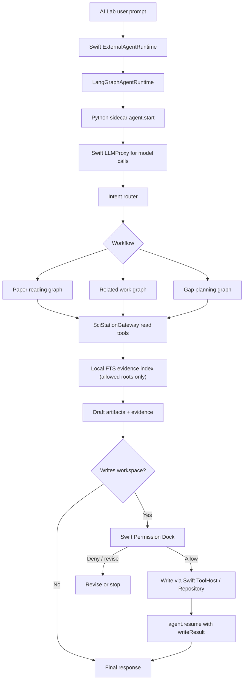

# 任务书 34：LangGraph Sidecar、Local RAG 与科研 Workflow MVP

更新时间：2026-05-05

> 本任务书承接任务书 32/33，并真正开始落地 `DOC/Comment.md` 的推荐主架构：Sci-Station 保留 Swift App、Repository、Permission Dock 与本地数据模型；新增本地 Python LangGraph sidecar 负责 durable agent 编排、checkpoint、human-in-the-loop 与科研 workflow；通过任务书 33 的 runtime façade / MCP Gateway 调用 Sci-Station 能力。

## 1. 背景

完成任务书 33 后，系统边界应变成：

```text
AI Lab UI
  -> ExternalAgentRuntime
  -> LegacySwiftAgentRuntime
  -> LangGraphAgentRuntime (本轮新增)
  -> SciStationToolHost / AgentMCPGateway
  -> Swift Permission Layer
```

本轮不要追求“万能科研 agent”。先做一个可恢复、可审计、能输出 evidence 的 sidecar MVP，并实现三个高价值 workflow：

1. 单篇论文精读。
2. 项目 related work 草稿。
3. research gap / task planning。

## 2. 本轮目标

1. 新增 `AgentRuntime/` Python 包，启动本地 LangGraph sidecar。
2. Swift 侧新增 `LangGraphAgentRuntime`，通过 stdio JSON-RPC 或 localhost HTTP 与 sidecar 通讯。
3. sidecar 通过任务书 33 的 MCP Gateway 调用 Sci-Station read tools；写入请求必须回到 Swift approval。
4. 建立本地 SQLite FTS evidence index 第一版，不急着上 embedding。
5. 落地三个 workflow 的最小可用 graph，并把产物写成草稿/approval request。
6. MVP 中 sidecar 不持有 API key、不直接请求模型、不直接写 workspace；LLM、tools、approval、log event 都通过 Swift 代理或 ToolHost。

## 3. 实施任务

- [ ] [P34.1] 新增 Python sidecar 目录。
  - 建议结构：

```text
AgentRuntime/
├── pyproject.toml
├── sci_station_agent/
│   ├── main.py
│   ├── server.py
│   ├── transport/
│   │   ├── stdio_jsonrpc.py
│   │   └── schemas.py
│   ├── graph/
│   │   ├── state.py
│   │   ├── router.py
│   │   ├── paper_reading.py
│   │   ├── related_work.py
│   │   └── gap_planning.py
│   ├── mcp_client/
│   │   └── sci_station_gateway.py
│   ├── rag/
│   │   ├── fts_index.py
│   │   ├── retriever.py
│   │   └── evidence.py
│   ├── safety/
│   │   └── approvals.py
│   └── storage/
│       ├── checkpoints.py
│       └── events.py
└── tests/
```

- [ ] [P34.2] Python runtime 基础协议。
  - 支持方法：`sidecar.initialize`、`sidecar.initialized`、`sidecar.health`、`agent.start`、`agent.resume`、`agent.cancel`、`agent.checkpoint`。
  - 启动后必须先完成 capability handshake，校验 `protocolVersion`、`schemaVersion`、capabilities、Python dependencies、workspace allowed roots；版本不兼容或 5 秒内未响应时 Swift 回退 Legacy runtime。
  - 事件流对齐任务书 33 的 `AgentRuntimeEventEnvelope`：`run_started`、`node_started`、`tool_call_requested`、`tool_call_completed`、`approval_required`、`artifact_draft`、`checkpoint_saved`、`final_response`、`run_failed`。
  - checkpoint 落到统一 run 目录，sidecar 崩溃后可恢复。
  - stdio JSON-RPC 必须支持双向调用：Swift -> Sidecar 为 `sidecar.initialize/health` 与 `agent.start/resume/cancel/checkpoint`；Sidecar -> Swift 为 `runtime.event/tools.list/tools.call/resources.list/resources.read/approval.request/llm.respond/llm.stream/log.event`。

- [ ] [P34.3] Swift `LangGraphAgentRuntime`。
  - 建议文件：`Sci-Station/Agent/LangGraphAgentRuntime.swift`。
  - 用 `Process` 启动 bundled/local Python sidecar，第一版走 stdio JSON-RPC。
  - 复用 `ExternalAgentRuntime`，让 AI Lab 可在设置中切换 `Swift Loop` / `LangGraph Sidecar`。
  - P34 MVP 中，sidecar 不直接读取 Keychain、不持有 API key、不直接请求模型；所有 LLM 调用通过 Swift `LLMProxy` 完成，Swift 继续使用现有 provider / Keychain。
  - 新增 sidecar lifecycle events：`sidecarStarting`、`sidecarReady`、`sidecarUnavailable`、`sidecarCrashed`、`fallbackToLegacyRuntime`。

- [ ] [P34.4] MCP Gateway client。
  - Python sidecar 只通过 `SciStationGatewayClient.call_tool()` 访问 Sci-Station tools。
  - Read-only tools 可自动调用。
  - 写入工具返回 `approval_required` 后，sidecar graph interrupt，等待 Swift 携带 decision / writeResult 调用 `agent.resume`。
  - sidecar 不直接调用 `write_file`、`patch_file`、`create_todo`、`update_metadata`；workflow 只生成 `AgentArtifactDraft`，真正写入必须由 Swift ToolHost/Repository 在 approval 后执行。
  - 对 draft artifact 的最终写入，用户 Allow once 后由 Swift ToolHost/Repository 立即执行，并把 `AgentToolResult` / `writeResult` 随 `agent.resume` 回传 sidecar；sidecar 不二次发起同一写入 call。

- [ ] [P34.5] SQLite FTS evidence index V1。
  - 目标路径：`.sci-station/index/chunks.sqlite`。
  - 索引内容：`paper.md`、`annotations.md`、`wiki/**/*.md`、`projects/**/wiki/**/*.md`、可见 `materials` Markdown/Text。
  - chunk 字段：`schema_version`、`source_type`、`source_id`、`relative_path`、`heading`、`start_line`、`end_line`、`text`、`content_hash`、`updated_at`。
  - 先用 FTS5 + metadata filter；embedding 留到后续任务。
  - 第一版可由 Python 建索引，但文件发现、workspace root、allowed roots、ignored globs 必须由 Swift 传入；Python 只能读取 Swift 明确授权的路径。
  - 索引更新必须使用 write lock，避免 Swift 正在写文件时 Python 同时重建；文件修改后按 `relative_path + updated_at/content_hash` 增量失效；`schema_version` 不匹配时删除并重建。

- [ ] [P34.6] Evidence 输出契约。
  - 所有科研 synthesize 节点必须输出 evidence table。
  - 每条 claim 至少包含：claim、source_type、paper_id/path、line range、short quote、confidence、source_hash、chunk_id、retrieved_at。
  - 写入 Wiki/plan 时保留 citation block，避免普通聊天式无来源总结。

- [ ] [P34.7] Workflow 1：单篇论文精读。
  - 触发：当前选中论文 + 用户说「精读/结构化笔记/生成待办」。
  - 节点：load metadata -> read abstract/intro -> read method -> read experiments -> extract contributions/limitations -> draft note -> approval。
  - 草稿产物：`wiki/papers/{citekey}.md`、todo drafts。

- [ ] [P34.8] Workflow 2：项目 related work。
  - 触发：当前 project + 用户说「related work/综述/相关工作」。
  - 节点：load project overview -> list core papers -> retrieve evidence -> cluster by theme -> draft related_work -> citation critic -> approval。
  - 草稿产物：`projects/{project-id}/wiki/related_work.md`、`.sci-station/agent/runs/{run_id}/evidence.json`。

- [ ] [P34.9] Workflow 3：research gap / task planning。
  - 触发：当前 project + 用户说「research gaps/下一步/拆任务」。
  - 节点：load project context -> load core papers -> load existing tasks -> synthesize gaps -> propose hypotheses -> generate todos -> approval。
  - 草稿产物：`projects/{project-id}/wiki/research_plan.md`、todo drafts。

- [ ] [P34.10] Approval/resume。
  - LangGraph 节点中遇到写入请求时使用 interrupt。
  - Swift Permission Dock 展示 `AgentApprovalRequest`。
  - 用户 Allow once 后，Swift ToolHost/Repository 执行真实写入，并将 `AgentToolResult` / `writeResult` 随 `agent.resume(runID, decision, writeResult)` 回传 sidecar；sidecar 将 writeResult 写入 graph state 后继续生成 `final_response`，不再二次发起同一写入 call。
  - 用户 Deny/Ask revise 后，sidecar 将反馈加入 graph state，重新生成草稿或结束。
  - approval 必须引用 P33 的 `AgentApprovalRequest.id/runID/toolCallID`；resume 时按 sequence 去重，避免 sidecar 崩溃恢复后重复写入。

- [ ] [P34.11] 测试。
  - Python tests：router 选择 workflow、FTS chunking、evidence schema、approval interrupt。
  - Swift CoreTestRunner：`langGraphRuntimeParsesRuntimeEvents`、`langGraphRuntimeMapsApprovalRequired`、`agentRuntimeSelectionKeepsLegacyFallback`。
  - 增加 `langGraphRuntimePerformsInitializeHandshake`、`langGraphRuntimeExecutesApprovedWriteInSwiftOnce`、`ftsIndexRebuildsOnSchemaMismatch`。
  - 必须提供 fake sidecar 进程，覆盖 `agent.start`、`approval_required`、`agent.resume`、`final_response`、`run_failed` 事件回放，避免 Swift 协议测试依赖真实 LangGraph。
  - 真实 LangGraph workflow tests 作为 Python tests 单独运行。

- [ ] [P34.12] 验证与交付记录。
  - 跑 `swift run SciStationCoreTestRunner`。
  - 跑 Python sidecar test（建议 `python -m pytest AgentRuntime/tests` 或项目选定命令）。
  - 跑 `xcodebuild -project Sci-Station.xcodeproj -scheme Sci-Station -destination 'platform=macOS' build`。
  - 手动验证三个 workflow 至少各跑一次 fake/sample workspace。

## 4. Sidecar 边界与打包策略

### 4.1 Sidecar handshake

Swift 启动 sidecar 后必须先发送 `sidecar.initialize`，并等待 `sidecar.initialized` / `sidecar.health` 通过后再允许 `agent.start`。初始化参数至少包含协议版本、schema 版本、app 版本、workspace root、allowed roots 与 Swift 侧可提供的能力：

```json
{
  "jsonrpc": "2.0",
  "id": "init_001",
  "method": "sidecar.initialize",
  "params": {
    "protocolVersion": "1.0",
    "schemaVersion": 1,
    "appVersion": "0.x",
    "workspaceRoot": "...",
    "allowedRoots": ["library/papers", "wiki", "projects", "materials"],
    "capabilities": {
      "llmProxy": true,
      "mcpGateway": true,
      "approvalResume": true,
      "ftsIndex": true
    }
  }
}
```

sidecar 返回自身版本与能力；`protocolVersion` / `schemaVersion` 不匹配、allowed roots 接收失败、dependency import 失败或 5 秒内无响应时，Swift 必须发出 `sidecarUnavailable` 并回退 Legacy Swift Runtime。

```json
{
  "jsonrpc": "2.0",
  "id": "init_001",
  "result": {
    "protocolVersion": "1.0",
    "schemaVersion": 1,
    "sidecarVersion": "0.1.0",
    "capabilities": {
      "paperReading": true,
      "relatedWork": true,
      "gapPlanning": true
    }
  }
}
```

### 4.2 LLM 边界

P34 MVP 中，sidecar 只负责编排，不直接持有 API key，也不直接请求模型。Python 需要模型时通过双向 JSON-RPC 请求 Swift：

```json
{
  "jsonrpc": "2.0",
  "id": "llm_req_001",
  "method": "llm.respond",
  "params": {
    "messages": [],
    "tools": [],
    "modelOptions": {}
  }
}
```

Swift 收到后使用现有 `OpenAICompatibleProvider` / Keychain / settings 执行，并把 redacted response 回给 sidecar。

`llm.respond` 返回结构必须对齐 P32/P33 provider response，支持普通文本、structured JSON、tool calls、usage 与 finish reason：

```json
{
  "message": {
    "role": "assistant",
    "content": "..."
  },
  "toolCalls": [],
  "structuredOutput": null,
  "usage": {
    "inputTokens": 1234,
    "outputTokens": 456
  },
  "finishReason": "stop"
}
```

### 4.3 Workspace 读写边界

Python sidecar 只能读取 Swift 授权路径：

```json
{
  "workspace_root": "...",
  "allowed_roots": [
    "library/papers",
    "wiki",
    "projects",
    "materials"
  ],
  "ignored_globs": [
    "**/.git/**",
    "**/.sci-station/agent/runs/**",
    "**/node_modules/**",
    "**/.venv/**"
  ]
}
```

写入 workspace 的最终动作必须由 Swift ToolHost/Repository 执行。Sidecar 只能生成 `AgentArtifactDraft` 与 `AgentApprovalRequest`。

### 4.4 Run 目录

```text
.sci-station/agent/runs/{run_id}/
├── checkpoint.json
├── events.jsonl
├── tool_calls.jsonl
├── approvals.jsonl
├── evidence.json
├── artifacts/
│   ├── related_work.md
│   └── research_plan.md
└── debug/
    ├── enabled.flag
    ├── prompts.redacted.jsonl
    ├── llm_responses.redacted.jsonl
    └── redaction_failures.jsonl
```

`debug/` 默认关闭，不写 prompts/responses。只有开发模式或用户显式开启后才创建 `enabled.flag` 并保存 redacted prompts/responses；redaction 失败时不得写盘，只记录不含原文的 `redaction_failures.jsonl` 元数据。

### 4.5 Python 打包

第一版开发模式：

```text
使用系统 python 或用户指定 python。
从 AgentRuntime/ 启动。
启动前做 health check：`python --version >= 3.11`、`import langgraph` 成功、`import sci_station_agent` 成功、`sidecar.initialize` 在 5 秒内响应、`protocolVersion/schemaVersion` 匹配、workspace allowed roots 接收成功、fake `agent.start` 能返回 `sidecarReady`。
失败时自动回退 Legacy Swift Runtime。
```

后续产品模式：

```text
bundle Python standalone runtime。
pin dependencies。
sidecar crash 自动降级并保留 checkpoint。
```

## 5. LangGraph State 伪代码

```python
from typing import TypedDict, Literal

class SciStationAgentState(TypedDict):
    run_id: str
    thread_id: str | None
    project_id: str | None
    selected_paper_id: str | None
    user_goal: str
    intent: Literal["paper_reading", "related_work", "gap_planning", "general"] | None
    messages: list[dict]
    evidence: list[dict]
    draft_artifacts: list[dict]
    pending_approval: dict | None
    final_response: str | None

def approval_gate(state: SciStationAgentState):
    risky = [
        artifact for artifact in state["draft_artifacts"]
        if artifact.get("risk") in {"writes_workspace", "runs_code", "external_side_effect"}
    ]
    if not risky:
        return {"pending_approval": None}

    return interrupt({
        "type": "approval_required",
        "run_id": state["run_id"],
        "actions": risky,
    })
```

## 6. Workflow Router 伪代码

```python
def route_intent(state: SciStationAgentState) -> str:
    goal = state["user_goal"].lower()

    if state.get("selected_paper_id") and any(k in goal for k in ["精读", "paper note", "结构化笔记"]):
        return "paper_reading"

    if state.get("project_id") and any(k in goal for k in ["related work", "相关工作", "综述"]):
        return "related_work"

    if state.get("project_id") and any(k in goal for k in ["gap", "下一步", "拆任务", "research plan"]):
        return "gap_planning"

    return "general"
```

## 7. 总流程图



## 8. Evidence 表格式

```json
{
  "claim": "该论文把蒸发率写成与局域热平衡分布相关的积分形式。",
  "evidence": [
    {
      "source_type": "paper",
      "paper_id": "garani2024dark",
      "relative_path": "library/papers/Dark-Matter/garani2024dark/paper.md",
      "heading": "5 Evaporation",
      "lines": [210, 238],
      "source_hash": "sha256:...",
      "chunk_id": "paper:garani2024dark:210-238",
      "retrieved_at": "2026-05-05T00:00:00Z",
      "quote": "短摘录，不超过必要长度",
      "confidence": 0.82
    }
  ]
}
```

## 9. 验收标准

1. AI Lab 可以切换到 LangGraph sidecar runtime，并收到结构化 runtime events。
2. Sidecar 不直接持有 API key；所有 LLM 调用通过 Swift LLMProxy 完成。
3. Sidecar 能通过 Sci-Station Gateway 调用 read-only paper/wiki/task/material tools。
4. Sidecar 不直接写 workspace；三个 workflow 只生成草稿 artifact，最终写入由 Swift ToolHost/Repository 在 approval 后执行。
5. 写入 workspace 前必须在 Swift Permission Dock 暂停审批，approval/resume 能按 id/runID/toolCallID 精确恢复。
6. FTS index 能检索 paper/wiki chunks，并返回 line range、source hash、chunk id。
7. FTS index 带 `schema_version`、`content_hash`、write lock 与增量失效策略；schema 不兼容时可重建。
8. Debug prompts/responses 默认不写盘；显式开启后也只能保存 redacted 数据，redaction 失败不得落盘。
9. Fake sidecar integration test 必须通过；真实 LangGraph tests 与 Swift 协议测试解耦。
10. Sidecar 启动失败、handshake 失败或崩溃时，AI Lab 自动回退 Legacy Swift runtime。

## 10. 非目标

- 不上 embedding/vector database。
- 不做完整 OpenAI Agents SDK sandbox。
- 不允许 sidecar 直接绕过 Swift Repository 写 workspace。
- 不做 shell/python 执行 workflow。
- 不发布 plugin marketplace。
- 不在 P34 MVP 中让 Python sidecar 直接读取 Keychain 或持有 API key。

## 11. 后续任务候选

1. Embedding 检索：sqlite-vec / LanceDB / Qdrant local。
2. Code sandbox：`.sci-station/agent/runs/{run_id}/sandbox/`。
3. Plugin package：`.codex-plugin` / `.claude-plugin` / Sci-Station preset importer。
4. Multi-agent：research-explorer、citation-critic、experiment-planner。
