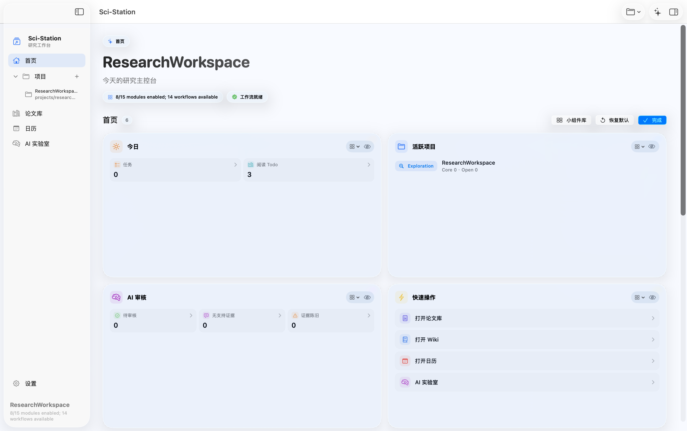

# Sci-Station

> 当前版本：Beta 0.1.0
> 面向平台：macOS
> 当前状态：正在开发中，测试版会放在 Release 中供下载和测试。

Sci-Station 是一个面向科研工作的本地优先工作站。它把论文库、项目知识、PDF 阅读、材料文件、任务日历和可选 AI 实验室放在同一个 macOS 应用里，并把主要数据保存到用户选择的本地科研根目录中。

英文文档见 [docs/README.en.md](docs/README.en.md)。完整中文教程见 [docs/TUTORIAL.zh-CN.md](docs/TUTORIAL.zh-CN.md)。

## 截图



## 基本介绍

科研项目常常散落在 PDF、笔记、代码、数据、图表、任务、链接和研究计划草稿里。Sci-Station 的目标是把这些内容收束成一个可见、可审计、可带走的本地科研工作区：用户选择一个科研根目录，应用在其中组织论文、项目、知识库、材料、任务和 AI 运行记录。

核心原则：

- **本地优先**：论文、笔记、项目文件、任务和运行日志保存在用户自己的目录中。
- **科研原生**：围绕论文、项目、引用、材料、图表、输出和实验记录组织信息。
- **可审计 AI**：AI 是可选能力；凭据进入 macOS 钥匙串，写入动作经过权限确认，运行结果可回看。

## 基本功能

- **工作区管理**：创建、打开、修复科研根目录，并恢复最近使用的工作区。
- **论文库**：支持 PDF 拖入、文件选择、DOI、arXiv、PDF 链接和普通链接导入。
- **元数据管理**：保存标题、作者、年份、摘要、标签、阅读状态、优先级、评分、BibTeX 和标识符。
- **PDF Reader**：支持搜索、翻页、缩放、论文笔记、相关任务、引用、链接和文件面板。
- **项目空间**：为每个研究项目维护项目简介、核心论文、项目文档、任务和研究流程。
- **Markdown 知识库**：支持源码、预览、分屏、元信息、`[[wikilink]]`、反向链接、表格、代码块、图片和 KaTeX。
- **材料区**：统一管理数据、代码、图表、脚本、提示词、输出等真实工作文件，并可从应用打开到 VS Code 或外部工具。
- **任务与日历**：提供本地待办、日历视图，并可选接入 Apple Calendar / Reminders。
- **AI 实验室 V1**：支持项目会话、计划审查、权限面板、运行历史、钩子、MCP 预设展示和审计日志。
- **发布测试**：测试版会放在 Release 中，就像普通 macOS 软件一样下载、安装和测试。

## 当前状态

- 当前版本为 **Beta 0.1.0**。
- 软件会放在 Release 中，用户可以像安装普通 macOS 软件一样下载 DMG 并安装。
- 项目仍在开发中，功能、界面和文档会持续更新。

## 接下来会开发

- **签名与公证**：完善 Developer ID 签名、公证和 Gatekeeper 友好的分发流程。
- **AI 实验室深化**：继续接入边车运行时、工具权限、证据引用、产物和调试包。
- **论文图谱与推荐**：增强论文关系、研究队列、阅读计划和推荐工作流。
- **工作区模板**：提供更清晰的项目模板、模块设置和初始化流程。
- **导入与转换质量**：继续提升 DOI、arXiv、网页导入、PDF 转 Markdown 和元数据补全。
- **稳定性与本地化**：扩大手动回归覆盖，完善中英文文案、教程和测试数据。

## 快速开始

使用测试版：

1. 从 Release 下载 Sci-Station 的 DMG。
2. 打开 DMG，将 `Sci-Station.app` 拖入 `/Applications`。
3. 如果 macOS 提示无法验证开发者，右键应用并选择 `Open`。
4. 首次启动后选择 `Create Workspace`，创建一个空文件夹作为科研根目录。
5. 在 Library 导入 PDF，或用 DOI、arXiv、PDF URL、网页链接添加论文。
6. 创建项目，在项目概览中开始写项目简介、笔记和任务。

## 工作区结构

科研根目录是一个普通本地目录，主要结构如下：

```text
ResearchRoot/
├── .sci-station/
├── library/
│   └── papers/{paper-id}/
│       ├── paper.pdf
│       ├── paper.md
│       ├── meta.yaml
│       ├── annotations.md
│       └── figures/
├── projects/{project-id}/
│   ├── project.yaml
│   ├── shared_research.md
│   ├── wiki/
│   ├── tasks/
│   ├── data/
│   ├── code/
│   ├── figures/
│   └── outputs/
├── wiki/
├── refs/
├── settings/
├── tasks/
├── imports/
├── data/
├── prompts/
├── scripts/
├── code/
├── figures/
├── outputs/
├── shared_research.md
└── researchflow.sqlite
```

大多数内容是 Markdown、YAML、PDF、BibTeX、源码、图片或数据文件。即使离开应用，用户也可以用 Finder、VS Code、Git 或备份工具继续管理这些文件。

## 隐私与凭据

- 仓库和构建产物不应包含 API Key、OAuth token、refresh token、client secret、private key、本机 MCP 配置或私人研究数据。
- LLM API Key 和 MinerU API Token 通过安全输入保存到 macOS 钥匙串。
- `settings.yaml` 只保存 base URL、model、temperature、max tokens 等非敏感设置。
- 论文、笔记、任务、Agent 日志和生成文件保存在用户选择的科研根目录中。
- `.env*`、本机配置、打包产物和私人科研根目录不应提交到 Git。

## 相关文档

- [docs/README.en.md](docs/README.en.md)：英文项目介绍。
- [docs/TUTORIAL.zh-CN.md](docs/TUTORIAL.zh-CN.md)：中文试用教程。
- [docs/TUTORIAL.md](docs/TUTORIAL.md)：英文试用教程。
- [docs/DEVELOPER.md](docs/DEVELOPER.md)：开发者文档。
- [.sci-ai/README.md](.sci-ai/README.md)：AI 配置边界。
- [.sci-ai/sci-station/README.md](.sci-ai/sci-station/README.md)：内置 AI preset 说明。
- [docs/development/](docs/development/)：开发任务书、提案和手动测试记录。

## 许可证

本项目采用 [MIT 许可证](LICENSE) 开源。
