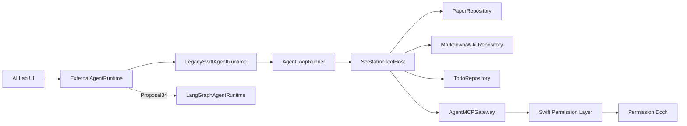

# 任务书 33：P32 Agent Protocol Migration、Runtime Façade 与 MCP Gateway

更新时间：2026-05-05

> 本任务书承接任务书 32 已经落地的 Swift-native agent loop，并落实 `docs/development/Comment.md` 中「Sci-Station 做 Agent Host、MCP 作为工具/知识接口标准、Swift 继续掌控权限」的架构建议。本轮目标不是替换为 LangGraph，也不是继续扩未来概念，而是把 P32 provisional approval、checkpoint、tool result、write ledger、event、tool registry 与 hook/permission 语义迁移成长期协议，再把 Swift agent loop 外面包出稳定 runtime façade。

## 1. 背景

任务书 32 完成后，AI Lab 已经具备可运行的 Swift-native tool loop：`AgentLoopRunner`、`AgentLoopModels`、pending checkpoint、read-only cache、write ledger、stable JSON tool result、approval resume 与 `editArguments` 重验证都已经进入源码。剩余风险也因此更明确：P32 的 approval/checkpoint 类型仍是 provisional，write ledger 仍是内存态，stable tool result 的 `evidence` 暂未形成跨 runtime 契约，UI 与 service 仍容易直接耦合具体 runner。

因此本轮要先冻结并迁移边界：

```text
AI Lab UI
  -> ExternalAgentRuntime protocol
  -> LegacySwiftAgentRuntime (wraps AgentLoopRunner)
  -> future LangGraphAgentRuntime
```

同时，现有 MCP 只在 UI/配置面板展示状态，还不是工具协议层。本轮先做一个保守的本地 gateway，让 Sci-Station 内部工具可以按 MCP 风格描述、分级、审计，并为任务书 34 的 fake sidecar 与 Python sidecar 做准备。P34 不应该再理解 P32 的 legacy pending 文件或 provisional approval shape；这些兼容工作必须在 P33 完成。

## 2. 本轮目标

1. 先完成 P32 provisional schema migration：approval、human decision、pending tool call、tool fingerprint、pause reason、stable tool result 与 legacy pending checkpoint 都迁移到 P33 共享协议。
2. 冻结共享 schema：runtime event envelope、run state、approval、artifact、tool result、checkpoint、MCP envelope、error code、run directory、persistent execution ledger。
3. 明确 `argumentsJSON` 到 `JSONValue` / canonical JSON 的兼容路线，避免一次性重写 P32 loop 与旧 run log。
4. 用 `LegacySwiftAgentRuntime` 包装任务书 32 的 loop，保持现有体验，并把 P32 session events / loop steps 映射为 runtime event envelope。
5. 建立 `ExternalAgentRuntime`，让 UI 不再直接依赖具体 runner。
6. 建立唯一工具入口 `SciStationToolHost` / `AgentMCPGateway`，第一版 ToolHost 先包装现有 `AgentToolRegistry`，再逐步补 target paths、diff preview、MCP annotations 与 structuredContent。
7. 完成 P1.4/P1.5 遗留：skill 三级披露、确定性安全 hooks、Claude Code hook 事件名补齐，并让 hook ask/deny 语义与 P32 当前行为对齐。
8. 让 Permission Dock 的审批对象从「工具名」升级为「工具 + 参数 + risk + target path + diff/summary + rollback/idempotency」。

## 3. 共享协议契约

P33 之后，Swift loop、MCP Gateway、LangGraph sidecar、AI Lab UI 都必须使用同一组 schema。新增字段时只能向后兼容；breaking change 必须提升 `schemaVersion`。

### 3.0 P32 provisional protocol migration

P33 的第一优先级是把 P32 已经真实使用的临时协议迁移为长期协议，而不是并行新增一套相似类型。

- `AgentApprovalRequest` 迁移到 P33 版本，保留 legacy decode，兼容缺少 `runID`、`toolCallID`、`targetPaths`、`diffPreview`、`summaryPreview`、`rollbackHint`、`fingerprint` 的旧 checkpoint。
- `AgentHumanDecisionAction` 迁移到 P33 定义，删除或废弃 P32 重复定义；P33 固定枚举值为 `allowOnce`、`denyAndContinue`、`denyAndStop`、`reviseWithFeedback`、`editArguments`。legacy alias 必须保持向后兼容：`deny -> denyAndStop`，`askAgentToRevise -> reviseWithFeedback`。
- `AgentPendingToolCall`、`AgentToolCallFingerprint` 迁入共享协议，fingerprint 一律基于 canonical arguments、tool name、risk、permission key 与 target paths。
- `AgentLoopPauseReason` 映射为 P33 `AgentRuntimeErrorCode`、run state 与 `approvalRequired` runtime event；正常审批暂停不得被编码成 JSON-RPC error。
- `.sci-station/agent/pending_tool_calls.jsonl` 作为 legacy fallback 读取；读取后补齐 run id、tool call id、target paths、summary preview，并迁入 run directory。
- P32 stable JSON tool result 继续作为 `AgentToolResultWireFormat` schema version 1，供 runtime event、MCP structuredContent 与 P34 evidence bridge 复用。

### 3.1 Run 状态机

```text
created
running
waiting_for_approval
resuming
completed
failed
cancelled
```

### 3.2 Runtime event envelope

```swift
public struct AgentRuntimeEventEnvelope: Codable, Sendable, Identifiable {
    public var id: String
    public var schemaVersion: Int
    public var runID: String
    public var threadID: String?
    public var sequence: Int
    public var timestamp: Date
    public var event: AgentRuntimeEvent
}

public enum AgentRuntimeEvent: Codable, Sendable {
    case runStarted(AgentRunStarted)
    case nodeStarted(AgentNodeStarted)
    case assistantDelta(AgentAssistantDelta)
    case assistantMessage(AgentAssistantMessage)
    case toolCallRequested(AgentToolCallRequested)
    case toolCallCompleted(AgentToolCallCompleted)
    case approvalRequired(AgentApprovalRequest)
    case artifactDraft(AgentArtifactDraft)
    case checkpointSaved(AgentCheckpointSummary)
    case finalResponse(AgentFinalResponse)
    case runCancelled(AgentRunCancelled)
    case runFailed(AgentRunFailed)
    case sidecarStarting
    case sidecarReady
    case sidecarUnavailable(AgentRuntimeError)
    case sidecarCrashed(AgentRuntimeError)
    case fallbackToLegacyRuntime(AgentRuntimeError)
}
```

`assistantDelta` 只用于流式 UI 展示，不保证完整；`assistantMessage` 是可落库的完整消息；`finalResponse` 是 run 的最终自然语言总结，通常等价于最后一条 assistant message。

跨语言 JSON wire-format 必须使用外部 tagged union，不依赖 Swift `Codable enum` 默认格式。Swift 内部可以继续使用 enum，但落库、MCP Gateway、LangGraph sidecar 与 UI 传输时必须固定为 `event.type` + `event.payload`：

```json
{
  "schemaVersion": 1,
  "id": "evt_001",
  "runID": "run_123",
  "threadID": "thread_456",
  "sequence": 12,
  "timestamp": "2026-05-05T12:00:00Z",
  "event": {
    "type": "tool_call_completed",
    "payload": {
      "tool": "read_paper_section",
      "toolCallID": "call_001",
      "summary": "Read section 5."
    }
  }
}
```

`sequence` 归属规则：每个 run 内 sequence 单调递增；`LegacySwiftAgentRuntime` 由 Swift runtime 分配 sequence；LangGraph sidecar 可产生 local sequence，但 Swift Host 接收后必须 canonicalize 为 host sequence，落库与 UI 只使用 host sequence；checkpoint 恢复后从最后一个 committed sequence + 1 继续；重复 `eventID` 直接丢弃，不再分配新 sequence。

### 3.3 Error code

```swift
public enum AgentRuntimeErrorCode: String, Codable, Sendable {
    case invalidRequest
    case providerUnavailable
    case toolNotFound
    case toolSchemaInvalid
    case permissionDenied
    case approvalRequired
    case checkpointNotFound
    case sidecarUnavailable
    case sidecarCrashed
    case maxStepsExceeded
    case maxToolCallsExceeded
    case contextLimitExceeded
    case safetyPolicyBlocked
    case internalError
}
```

`approvalRequired` 可用于 Swift runtime 内部状态或 legacy 兼容错误码；MCP Gateway 的正常审批暂停不得把 `approval_required` 编码成 JSON-RPC error。

### 3.4 Approval 与 artifact

```swift
public enum AgentHumanDecisionAction: String, Codable, Sendable {
    case allowOnce
    case denyAndContinue
    case denyAndStop
    case reviseWithFeedback
    case editArguments
}

public struct AgentApprovalRequest: Codable, Sendable, Identifiable {
    public var id: String
    public var runID: String
    public var toolCallID: String
    public var tool: String
    public var risk: AgentToolRisk
    public var permissionKey: String
    public var arguments: AgentToolArguments
    public var targetPaths: [String]
    public var fingerprint: String
    public var diffPreview: String?
    public var summaryPreview: String?
    public var reason: String
    public var rollbackHint: AgentRollbackHint?
    public var expiresAt: Date?
    public var suggestedDecisions: [AgentHumanDecisionAction]
}

public struct AgentArtifactDraft: Codable, Sendable, Identifiable {
    public var id: String
    public var runID: String
    public var kind: String
    public var proposedPath: String?
    public var title: String
    public var content: String
    public var diffPreview: String?
    public var evidenceRefs: [AgentEvidenceRef]
    public var risk: AgentToolRisk
}

public struct AgentToolArguments: Codable, Hashable, Sendable {
    public var rawJSON: String
    public var canonicalJSON: String
    public var value: JSONValue
}
```

`AgentApprovalRequest.fingerprint` 是 Permission Dock、persistent ledger、resume 去重共用的 idempotency fingerprint。它必须在 ToolHost preview / approval build 阶段基于 canonical arguments、tool name、risk、permission key 与 target paths 生成，并随 approval request 一起落盘/传输；UI、sidecar、ledger 不得各自重新计算不同版本。

`AgentToolCall.argumentsJSON` 暂时保留，作为 P32 loop、旧 run log、tool registry 与 planner path 的兼容字段。P33 新协议、MCP Gateway wire-format 与 sidecar wire-format 使用 JSON object / `JSONValue`，不把 arguments 当成 JSON string 传输。`LegacySwiftAgentRuntime` 与 `SciStationToolHost` adapter 负责在边界处做 `argumentsJSON` 与 `AgentToolArguments` 转换。

`JSONValue` canonicalization 规则：所有 tool arguments、approval request hash、fingerprint、diff hash 与 idempotency key 在计算前必须 canonicalize，并统一使用 `AgentToolArguments.canonicalJSON`。规则至少包括 object key 排序、number 编码稳定、`null` 保留/移除策略固定、workspace path 归一化、string 使用固定 Unicode normalization。未经 canonicalize 的 JSON 不得用于 approval hash 或 fingerprint。

### 3.5 Tool risk taxonomy

`AgentToolRisk` 保留 P32 现有值并向前扩展：`readOnly`、`network`、`writesWorkspace`、`externalSideEffect`、`modifiesMetadata`、`runsCode`、`destructive`、`credentialAccess`。

解码必须向后兼容：未知 raw value 不得 crash，必须映射为 `externalSideEffect` 并强制 ask / approval。P32 旧 run log、pending checkpoint、stable tool result 中的 risk 必须继续可读。

推荐实现：

```swift
public enum AgentToolRisk: String, Codable, Sendable {
    case readOnly
    case network
    case writesWorkspace
    case externalSideEffect
    case modifiesMetadata
    case runsCode
    case destructive
    case credentialAccess

    public init(from decoder: Decoder) throws {
        let raw = try decoder.singleValueContainer().decode(String.self)
        self = AgentToolRisk(rawValue: raw) ?? .externalSideEffect
    }
}
```

### 3.6 AgentToolResult wire-format V1

P32 stable JSON tool result 是 P33 的 `AgentToolResultWireFormat` V1。字段至少包括：

```text
schema_version
tool_name
tool_call_id
succeeded
content
summary
modified_paths
evidence
error
```

`AgentRuntimeEvent.toolCallCompleted.payload` 必须能嵌入或引用该 schema；MCP Gateway 的 `result.structuredContent` 应尽量从同一 schema 派生；`evidence` 字段保留给 P34 填入 `source_hash`、`chunk_id`、`retrieved_at` 等引用信息。

### 3.7 AgentRunDirectoryStore 与 checkpoint

P33 定义并实现统一 run directory，使 P34 sidecar 不需要理解 P32 legacy pending 文件：

```text
.sci-station/agent/runs/{run_id}/
├── checkpoint.json
├── events.jsonl
├── tool_calls.jsonl
├── approvals.jsonl
└── tool_results/
  └── {tool_call_id}.json
```

- 新 pending approval 写入 `runs/{run_id}/checkpoint.json` 与 `approvals.jsonl`。
- `events.jsonl` 由 Swift Host 作为最终 owner 写入；`LegacySwiftAgentRuntime` 直接写 host sequence，LangGraph sidecar event 经 Swift canonicalize 后再写入。
- `AgentCheckpointSummary` 从 run directory 读取。
- `resumeRun` 优先读取 run directory；找不到时再读取 P32 legacy `pending_tool_calls.jsonl`，迁移成功后继续按新目录写入。
- checkpoint 恢复后 sequence 从最后一个 committed event + 1 继续。

### 3.8 Persistent tool execution ledger

P32 write ledger 只能防同一进程内重复写入；P33 必须把 idempotency ledger 持久化到 `tool_calls.jsonl` 或等价 store。

每条 tool call 记录至少包含：

```json
{
  "schema_version": 1,
  "run_id": "run_123",
  "tool_call_id": "call_001",
  "approval_id": "apr_001",
  "fingerprint": "sha256:...",
  "tool": "patch_wiki_page",
  "risk": "writesWorkspace",
  "target_paths": ["projects/demo/wiki/related_work.md"],
  "status": "completed",
  "result_ref": "tool_results/call_001.json",
  "created_at": "2026-05-05T12:00:00Z"
}
```

写入类工具执行前必须按 `approvalID + toolCallID + fingerprint` 检查 ledger；同一 approval/fingerprint 已成功执行时，不得再次调用真实写入工具，`resumeRun` 必须返回 prior result。

### 3.9 Runtime/session event bridge 与 hook policy

P32 `AgentSessionEvent` 继续保留，作为已有 UI 与日志兼容层；P33 `AgentRuntimeEventEnvelope` 是 runtime/UI 主事件。`LegacySwiftAgentRuntime` 负责把 P32 loop steps、tool result、approval pause 与 session events 映射为 envelope。

Hook 与 deterministic safety policy 的关系固定为：

- deterministic safety policy 是不可绕过阻断层。
- hook `.deny` 可以阻断 prompt 或 tool call。
- hook `.ask` 不直接等价于 `approvalRequired`，除非 policy adapter 显式提升。
- read-only tool 不应因为 generic `PreToolUse` reminder hook 而暂停。

## 4. 实施任务

推荐执行顺序：P33.0 P32 provisional schema migration；P33.0a `AgentRunDirectoryStore`；P33.0b persistent execution ledger；P33.0c `AgentToolResult` wire-format V1；P33.1 runtime event envelope / protocol model；P33.2 `LegacySwiftAgentRuntime`；P33.3 AI Lab dependency inversion + `FakeExternalAgentRuntime`；P33.4 `SciStationToolHost` adapter；P33.5 MCP Gateway V1；P33.7 deterministic safety policy / hooks；P33.6 Skill 三级披露；P33.8 Permission Dock richer schema UI。

P34 dependency gate 只依赖 protocol、runtime、run directory、ledger、ToolHost、MCP Gateway 与必要 approval/safety schema。若 P33 runtime/schema/ledger/ToolHost 主线完成但 Skill 三级披露 UI、workspace skill trust prompt 或 Tier 3 resource browser 尚未完全产品化，可把 Skill 作为 P33-G 延后，不阻塞 P34 fake sidecar。

- [x] [P33.0] P32 provisional schema migration。
  - 将 P32 `AgentApprovalRequest` / `AgentHumanDecisionAction` / `AgentPendingToolCall` / `AgentToolCallFingerprint` 迁移到 P33 共享协议。
  - `AgentHumanDecisionAction` 固定为 `allowOnce` / `denyAndContinue` / `denyAndStop` / `reviseWithFeedback` / `editArguments`，并提供 `deny`、`askAgentToRevise` legacy alias decode。
  - 保留 legacy decode，旧 pending checkpoint 缺少 `runID`、`toolCallID`、`targetPaths`、`summaryPreview` 时必须可读并补齐。
  - `AgentApprovalRequest` 必须包含 `fingerprint` 字段；legacy checkpoint 缺失时由迁移器基于 canonical arguments 与 target paths 补齐。
  - `AgentToolCall.argumentsJSON` 暂时保留；新增 `AgentToolArguments` / `JSONValue` / `canonicalJSON` 作为跨 runtime wire-format。
  - P32 `AgentLoopPauseReason` 映射为 P33 run state / runtime event / error code。
  - P32 stable tool result JSON 作为 `AgentToolResultWireFormat` schema version 1。

- [x] [P33.0a] 新增 `AgentRunDirectoryStore`。
  - 新增 `.sci-station/agent/runs/{run_id}/` 目录管理。
  - P32 `pending_tool_calls.jsonl` 作为 legacy fallback 读取，并迁移到 `runs/{run_id}/checkpoint.json` 与 `approvals.jsonl`。
  - `AgentCheckpointSummary` 从 run directory 读取；`resumeRun` 优先读取 run directory，找不到再读 legacy pending log。
  - events/checkpoint/approvals/tool results 使用同一 run id 与 host sequence。
  - `events.jsonl` 的最终写入 owner 是 Swift Host；sidecar local sequence 只能作为 debug metadata，不作为落库/UI sequence。

- [x] [P33.0b] 新增 persistent execution ledger。
  - 新增 `tool_calls.jsonl` 或等价 store。
  - 每条 tool call 记录 `toolCallID`、`approvalID`、`fingerprint`、`risk`、`targetPaths`、`status`、`result_ref`。
  - 写入类工具执行前必须按 `approvalID + toolCallID + fingerprint` 检查 ledger。
  - App 重启、sidecar resume 或用户重复点击 Allow once 后不得重复执行已完成写入；必须返回 prior result。

- [x] [P33.0c] AgentToolResult wire-format V1。
  - 把 P32 stable JSON tool result 固化为 P33 `AgentToolResultWireFormat` schema version 1。
  - `toolCallCompleted` runtime event payload 能嵌入或引用该 schema。
  - MCP Gateway `structuredContent` 尽量从同一 schema 派生。
  - `evidence` 字段保留并可被 P34 `AgentEvidenceRef` 填充。

- [x] [P33.1] 新增 runtime façade 模型。
  - 建议文件：`Sci-Station/Agent/AgentRuntimeProtocol.swift`。
  - 定义 `AgentRuntimeRequest`、`AgentRuntimeEventEnvelope`、`AgentRuntimeEvent`、`AgentHumanDecision`、`AgentCheckpointSummary`、`AgentRuntimeErrorCode`。
  - 所有 runtime event 必须带 `schemaVersion`、event id、run id、sequence、timestamp，Swift loop 与 LangGraph sidecar 都按此 envelope 发事件。
  - Runtime event 的 JSON wire-format 必须使用 `event.type` + `event.payload`；Swift `Codable enum` 默认格式只能作为进程内实现细节。
  - Swift Host 是最终 sequence owner；sidecar event 可带 local sequence，但落库、UI 与 checkpoint 使用 host canonical sequence。
  - 明确 `assistantDelta` / `assistantMessage` / `finalResponse` 的关系，避免 UI 重复落库。

- [x] [P33.2] 实现 `LegacySwiftAgentRuntime`。
  - 建议文件：`Sci-Station/Agent/LegacySwiftAgentRuntime.swift`。
  - 内部调用 `AgentLoopRunner`。
  - 把 loop steps 映射为统一 `AgentRuntimeEvent`。
  - 把 P32 `AgentSessionEvent` / stable tool result / approval pause 映射为 `AgentRuntimeEventEnvelope`。
  - `resumeRun` 必须优先读取 `AgentRunDirectoryStore` 与 persistent ledger；legacy pending log 只作为迁移 fallback。

- [x] [P33.3] 调整 AI Lab 依赖方向。
  - `AppViewModel` 不直接调用 `SciStationAgentService.run` 的 conversation 主路径，而是调用 `ExternalAgentRuntime.startRun`。
  - `SciStationAgentService` 继续保留 thread/draft/run log/tool definition 等 service 能力。
  - UI timeline 只消费 `AgentRuntimeEventEnvelope` 与 session events，不关心底层是 Swift loop 还是 sidecar。
  - 新增 `FakeExternalAgentRuntime`，能回放 `runStarted/toolCallRequested/approvalRequired/finalResponse/runFailed`，验证 UI 不依赖 LegacySwiftRuntime 内部细节。

- [x] [P33.4] 新增 `SciStationToolHost`。
  - 建议文件：`Sci-Station/Agent/SciStationToolHost.swift`。
  - 第一版作为现有 `AgentToolRegistry` 的 façade / adapter，不重写所有工具。
  - 聚合 Paper/Wiki/Task/Material/Project tools，并逐步把 legacy registry definition normalize 成 ToolHost definition。
  - 对每个工具统一输出：name、description、input schema、risk、permission key、source、output policy。
  - 第一批 read-only tools：`list_papers`、`read_paper`、`read_paper_section`、`search_papers`、`search_wiki`、`read_wiki_page`、`list_tasks`、`list_materials`。
  - P33 之后，所有 agent 可调用工具必须注册到 `SciStationToolHost`；Legacy Swift loop、MCP Gateway、LangGraph sidecar 都只能通过 ToolHost 获取定义和调用工具，不允许维护独立工具列表。
  - 禁止新增绕过 `SciStationToolHost` 的 agent tool registry；任何新工具必须先注册 ToolHost，再暴露给 Legacy loop / MCP Gateway / sidecar。
  - 新增 `buildApprovalRequest(for:context:)` 或等价 `previewApproval` 阶段，用于写入/外部副作用工具的 schema validation、target path extraction、diff/summary preview 与 fingerprint 计算。
  - `buildApprovalRequest` 不得产生 workspace side effect；真正写入只能发生在审批通过后的 `invoke` / Repository 执行阶段。
  - 补齐 targetPaths extractor、diffPreview builder、outputPolicy normalization、MCP annotations、structuredContent。

- [x] [P33.5] MCP Gateway V1。
  - 建议文件：`Sci-Station/Agent/AgentMCPGateway.swift`。
  - 先不要求完整 stdio server；先实现尽量贴近真实 MCP 的 JSON-RPC 2.0 envelope 与 tool list/call 抽象，供测试和 LangGraph sidecar 对接设计复用。
  - 支持方法：`tools/list`、`tools/call`、`resources/list`、`resources/read`。
  - request 必须有 `jsonrpc`、`id`、`method`、`params`；error 使用 JSON-RPC error code；tool input 使用 JSON Schema。
  - tool result 使用 MCP 风格 `content: [{type: "text", text: "..."}]` 与 `structuredContent`，并保留 `annotations` 标记 read-only / destructive / idempotent / open-world。
  - 所有写入/外部 side-effect call 必须返回 `approval_required`，不能绕过 Swift permission layer。
  - `approval_required` 属于正常 control flow，作为 JSON-RPC `result.status` 返回；真正异常才使用 JSON-RPC `error`。同时 runtime event stream 也必须发出 `approval_required` 事件。

- [x] [P33.6] Skill 三级披露。
  - Skill 三级披露是 P33-G；若 runtime/schema/ledger/ToolHost/MCP 主线完成但 Skill 产品化细节未完成，不阻塞 P34 fake sidecar dependency gate。
  - 扫描路径：`~/.claude/skills/`、`{root}/.claude/skills/`、`Sci-Station/.claude/skills/`。
  - Tier 1：只把 frontmatter metadata 注入常驻 prompt。
  - Tier 2：按关键词/用户意图命中后读取 `SKILL.md` body。
  - Tier 3：`references/`、`scripts/` 只作为可发现资源，不自动执行。
  - 加入 trust policy：app-bundled skill 可信但 scripts 仍不可自动执行；user-global skill 默认 trusted metadata；workspace skill 默认 untrusted，首次使用需要提示或记录。
  - skill metadata 至少要求 `name`、`description`、`version`、`author`、`capabilities`、`risk`、`allowed_tools`。
  - 新增 `AgentSkillLoader` 与 `AgentSkillSelection`.

- [x] [P33.7] Hook 安全收口。
  - `AgentHookEventName` 补齐 `Notification`、`PreCompact`，保持已有拼写兼容。
  - 默认 hooks 新增：
    - `UserPromptSubmit`：拦截 `sk-`、`ghp_`、`AKIA`、常见 JWT/私钥片段。
    - `PreToolUse`：拦截写入 `~/.ssh`、`~/.aws`、`*.env`、keychain/credential 路径。
    - `PostToolUse`：如果 `modified_paths` 命中 workspace 外路径，记录高风险审计事件。
  - hook result 的 `permissionDecision == .deny` 必须能阻断 prompt 或 tool call。
  - 新增不可绕过的 `AgentDeterministicSafetyPolicy`，覆盖 prompt、tool call、tool result；hooks 是可扩展机制，deterministic policy 是内核安全规则。
  - hook `.ask` 不直接等价于 `approvalRequired`，除非 policy adapter 显式提升。
  - generic `PreToolUse` reminder 不得导致 read-only tool 暂停。

- [x] [P33.8] Permission request schema 升级。
  - 新增 `AgentApprovalRequest`：id、runID、toolCallID、tool、risk、permissionKey、arguments、targetPaths、fingerprint、diffPreview、summaryPreview、reason、rollbackHint、expiresAt、suggestedDecisions。
  - 写 Markdown/Todo/Paper metadata 工具通过 ToolHost `buildApprovalRequest` / `previewApproval` 生成 diff/summary 后再请求审批，preview 阶段不得写 workspace。
  - Permission Dock 支持 `allowOnce`、`denyAndContinue`、`denyAndStop`、`editArguments`、`reviseWithFeedback` 的事件语义；UI 第一版可先实现 Allow once 与 Deny，后两项落为 structured feedback。

- [x] [P33.9] 测试。
  - `externalAgentRuntimeStreamsLegacyLoopEvents`。
  - `mcpGatewayListsReadOnlySciStationTools`。
  - `mcpGatewayRequiresApprovalForWorkspaceWrites`。
  - `skillLoaderLoadsMetadataThenBodyOnMatch`。
  - `agentSafetyHookBlocksSecretInPrompt`。
  - `agentApprovalRequestIncludesTargetPathAndDiff`。
  - `fakeExternalRuntimeDrivesAITimeline`。
  - `runtimeEventEnvelopeSequencesAreStableAndDeduplicated`。
  - `agentHumanDecisionActionDecodesLegacyAliases`。
  - `p32LegacyPendingCheckpointMigratesToRunDirectory`。
  - `persistentLedgerPreventsDuplicateApprovedWriteAfterRestart`。
  - `approvalRequestPersistsFingerprintForLedgerResume`。
  - `stableToolResultV1MapsToToolCallCompletedEvent`。
  - `agentToolRiskUnknownValueDecodesAsExternalSideEffect`。
  - `toolHostBuildApprovalRequestHasNoSideEffects`。
  - `readOnlyToolNotPausedByGenericPreToolUseReminder`。
  - `deterministicSafetyPolicyBlocksSecretPromptBeforeLLM`。
  - `hookDenyBlocksSensitivePathWrite`。

- [x] [P33.10] 验证与交付记录。
  - 跑 `swift run SciStationCoreTestRunner`。
  - 跑 `xcodebuild -project Sci-Station.xcodeproj -scheme Sci-Station -destination 'platform=macOS' build`。
  - 手动验证：MCP status panel 能显示本地 gateway 工具分层；prompt 粘贴疑似 key 会被阻断；写入工具会产生 richer approval request。

## 5. Runtime 协议伪代码

```swift
public protocol ExternalAgentRuntime: Sendable {
    func startRun(_ request: AgentRuntimeRequest) async throws
        -> AsyncThrowingStream<AgentRuntimeEventEnvelope, Error>

    func resumeRun(runID: String, decision: AgentHumanDecision) async throws
    func cancelRun(runID: String) async throws
    func loadCheckpoint(runID: String) async throws -> AgentCheckpointSummary?
}

public actor LegacySwiftAgentRuntime: ExternalAgentRuntime {
    private let loopRunner: AgentLoopRunner
    private let runDirectoryStore: AgentRunDirectoryStore
    private let executionLedger: AgentToolExecutionLedger

    public func startRun(_ request: AgentRuntimeRequest) async throws
        -> AsyncThrowingStream<AgentRuntimeEventEnvelope, Error> {
        AsyncThrowingStream { continuation in
            Task {
                continuation.yield(.make(runID: request.runID, sequence: 1, event: .runStarted(...)))
                let result = try await loopRunner.run(request.asLoopRequest())
                for envelope in result.runtimeEventEnvelopes {
                    continuation.yield(envelope)
                }
                continuation.finish()
            }
        }
    }
}
```

## 6. MCP Gateway 伪代码

第一版 `SciStationToolHost` 从现有 registry 包装迁移：

```swift
public actor SciStationToolHost {
    private let legacyRegistry: AgentToolRegistry

    public func definitions() async -> [AgentToolDefinition] {
        await legacyRegistry.definitions().map { normalize($0) }
    }

    public func invoke(_ call: AgentToolCall, context: AgentToolContext) async throws -> AgentToolResult {
        try await legacyRegistry.invoke(call, context: context)
    }

    public func buildApprovalRequest(
        for call: AgentToolCall,
        context: AgentToolContext
    ) async throws -> AgentApprovalRequest {
        try await legacyRegistry.previewApproval(call, context: context)
    }
}
```

```swift
public actor AgentMCPGateway {
    private let toolHost: SciStationToolHost
    private let permissionEvaluator: AgentPermissionEvaluator

    public func handle(_ request: MCPEnvelope, context: AgentToolContext) async throws -> MCPEnvelope {
        switch request.method {
        case "tools/list":
            return .result([
                "tools": toolHost.definitions().map(MCPTool.init)
            ])

        case "tools/call":
            let call = try request.decodeToolCall()
            let definition = try await toolHost.definition(named: call.name)
            let decision = permissionEvaluator.evaluate(call.permissionRequest(definition))

            guard decision.action == .allow else {
                return .result([
                    "status": "approval_required",
                    "approvalRequest": AgentApprovalRequest(call: call, decision: decision)
                ])
            }

            let result = try await toolHost.invoke(call, context: context)
            return .result([
                "content": result.asMCPContent(),
                "structuredContent": result.structuredContent
            ])

        default:
            return .error("Unsupported MCP method")
        }
    }
}
```

## 7. MCP envelope 示例

```json
{
  "jsonrpc": "2.0",
  "id": "req_001",
  "method": "tools/call",
  "params": {
    "name": "read_paper_section",
    "arguments": {
      "paper_id": "garani2024dark",
      "heading": "5 Evaporation"
    }
  }
}
```

写入或外部副作用工具需要审批时，MCP Gateway 返回 result 而不是 error：

```json
{
  "jsonrpc": "2.0",
  "id": "req_001",
  "result": {
    "status": "approval_required",
    "approvalRequest": {
      "id": "apr_001",
      "runID": "run_123",
      "toolCallID": "call_001",
      "tool": "patch_wiki_page",
      "risk": "writesWorkspace",
      "fingerprint": "sha256:...",
      "targetPaths": ["projects/demo/wiki/related_work.md"]
    }
  }
}
```

```json
{
  "jsonrpc": "2.0",
  "id": "req_001",
  "result": {
    "content": [
      {
        "type": "text",
        "text": "..."
      }
    ],
    "structuredContent": {
      "paper_id": "garani2024dark",
      "lines": [210, 238]
    }
  }
}
```

## 8. 流程图



## 9. 验收标准

1. P32 provisional approval、human decision、pending tool call、fingerprint、pause reason、stable tool result 与 legacy pending checkpoint 已迁移到 P33 共享协议，旧数据可读。
2. AI Lab conversation 主路径通过 `ExternalAgentRuntime` 运行，而不是直接耦合具体 loop 实现。
3. 所有 runtime events 都通过 `AgentRuntimeEventEnvelope` 传递，wire-format 使用 `event.type` + `event.payload`，sequence 由 Swift Host canonicalize 后可排序、可去重、可重放。
4. `AgentRunDirectoryStore` 能读写 checkpoint/events/approvals/tool calls/tool results；`resumeRun` 优先读 run directory，legacy pending log 只作 fallback。
5. Persistent execution ledger 能防止 App 重启、sidecar resume 或重复 Allow once 后重复执行已完成写入。
6. 本地工具可以通过 `SciStationToolHost` 统一列出、调用、分级和审计；第一版 ToolHost 包装现有 `AgentToolRegistry`，Legacy loop / MCP Gateway / sidecar 不维护独立工具列表。
7. MCP Gateway V1 能列出 read-only tools，并对写入工具以 `result.status == approval_required` 返回审批请求；envelope 贴近 JSON-RPC/MCP 风格。
8. Skill body 在命中时进入 prompt，不再只是 UI metadata，并遵守 trust policy。
9. 默认安全 hooks 与 deterministic safety policy 能阻断疑似密钥与敏感路径写入；hook ask 不会导致 read-only tool 被 generic reminder 暂停。
10. Permission Dock 的 pending item 包含 id、runID、toolCallID、工具、参数、risk、permission key、目标路径、diff/summary、rollback hint 与 `AgentApprovalRequest.fingerprint`。
11. Fake runtime 能驱动 AI Lab timeline，证明 UI 已经从 LegacySwiftRuntime 内部细节解耦。
12. tool arguments、approval hash、fingerprint、diff hash 与 ledger idempotency key 均基于 canonical JSON 计算。

## 10. 非目标

- 不把 LangGraph sidecar 作为默认 runtime。
- 不要求实现完整 MCP spec 的所有 resources/prompts/roots 能力。
- 不执行 shell/python/install package。
- 不做 plugin marketplace。
- 不做远程 MCP OAuth。
- 不允许新增绕过 `SciStationToolHost` 的 agent 工具注册表或 sidecar 私有工具列表。

## 11. Questions

1. P33 第一优先级是否确认按 `P32 migration -> run directory/ledger/tool result -> runtime façade -> ToolHost adapter -> MCP Gateway` 执行？当前建议为确认，因为 P34 fake sidecar 与 Python sidecar 都依赖这些协议收口。
2. Skill 三级披露、安全 hooks、richer approval request 是否都放进 P33 同一轮完成？当前建议为：richer approval schema、deterministic safety policy、secret/path blocking、hook deny 必须完成；Skill 三级披露产品化细节可作为 P33-G，不阻塞主线。
3. P34 的 LangGraph sidecar 是否应在 P33 完成后立刻推进？当前建议为：P33 未完全完成前可以推进 fake sidecar fixture、stdio JSON-RPC harness、Python package skeleton；真实 LangGraph graph、LLMProxy、FTS、workflow 等 P33 dependency gate 通过后再接。

## 12. 本轮完成记录（2026-05-05）

P33 已完成并通过验证。本轮把 P32 provisional approval/checkpoint/tool-result/ledger 迁移为长期协议，并建立了 `ExternalAgentRuntime`、`LegacySwiftAgentRuntime`、`SciStationToolHost`、`AgentMCPGateway`、`AgentRunDirectoryStore`、persistent execution ledger、deterministic safety policy 与 Skill loader core。

关键落地结果：

- `AgentApprovalRequest` 已包含 run/tool call id、canonical arguments、target paths、fingerprint、diff/summary preview、rollback hint 与 suggested decisions；legacy human decision alias 和未知 risk 均保持兼容。
- `.sci-station/agent/runs/{run_id}/` 已能读写 checkpoint、events、approvals、tool results 与 tool ledger；legacy `pending_tool_calls.jsonl` 读取后会迁入 run directory。
- `AgentRuntimeEventEnvelope` 使用 `event.type` + `event.payload` wire-format；run directory event append 已按 event id 去重，并由 host sequence 延续。
- `LegacySwiftAgentRuntime` 已包装 P32 loop，支持 start/resume/cancel/load checkpoint 的 P33 V1 同进程语义，并把 loop steps 映射为 runtime events。
- `SciStationToolHost` 已成为 Legacy loop 与 MCP Gateway 的共同工具 façade；MCP Gateway V1 支持 `tools/list`、`tools/call`、`resources/list`、`resources/read`，写入类调用返回 `result.status == approval_required`。
- Skill loader 已实现 Tier 1 metadata、Tier 2 命中后 body 加载、Tier 3 references/scripts 资源发现；workspace skill 默认 untrusted。Skill trust prompt 与资源浏览 UI 仍作为 P33-G/P34 后续产品化项，不阻塞 P34 dependency gate。
- AI Lab summary 与 MCP status panel 已更新为 runtime façade + local gateway 状态；Permission Dock item 已包含 richer approval fields。

新增/更新的验证覆盖：

- `externalAgentRuntimeStreamsLegacyLoopEvents`
- `fakeExternalRuntimeDrivesAITimelineEvents`
- `runtimeEventEnvelopeSequencesAreStableAndDeduplicated`
- `mcpGatewayListsAndCallsReadOnlySciStationTools`
- `mcpGatewayRequiresApprovalForWorkspaceWrites`
- `p32LegacyPendingCheckpointMigratesToRunDirectory`
- `persistentLedgerPreventsDuplicateApprovedWriteAfterRestart`
- `approvalRequestPersistsFingerprintForLedgerResume`
- `stableToolResultV1MapsToToolCallCompletedEvent`
- `agentToolRiskUnknownValueDecodesAsExternalSideEffect`
- `toolHostBuildApprovalRequestHasNoSideEffects`
- `readOnlyToolNotPausedByGenericPreToolUseReminder`
- `deterministicSafetyPolicyBlocksSecretPromptBeforeLLM`
- `hookDenyBlocksSensitivePathWrite`
- `agentSkillLoaderProgressivelyLoadsMatchingSkill`

验证结果：

- `swift run SciStationCoreTestRunner`：通过。
- `xcodebuild -project Sci-Station.xcodeproj -scheme Sci-Station -destination 'platform=macOS' build`：通过。
- Xcode build 仍报告既有 `ChatMarkdownWebView` WebKit actor-isolation warnings；本轮 Agent 迁移代码无新增编译错误。

P34 dependency gate 状态：已通过。下一轮可以进入 fake sidecar protocol harness、stdio JSON-RPC、Python package skeleton 与单篇论文精读 workflow MVP；真实 LangGraph graph、LLM proxy、FTS evidence index 按 P34 分阶段推进。
