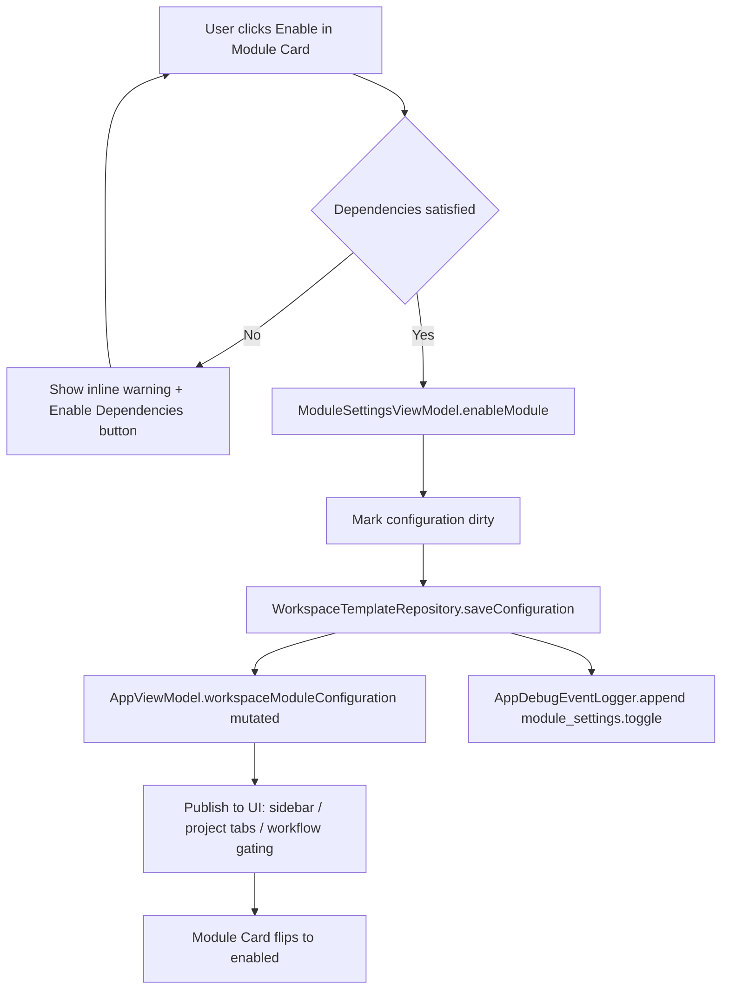
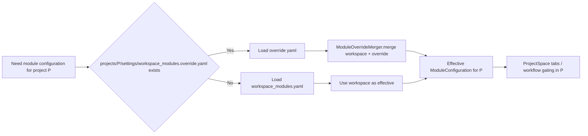
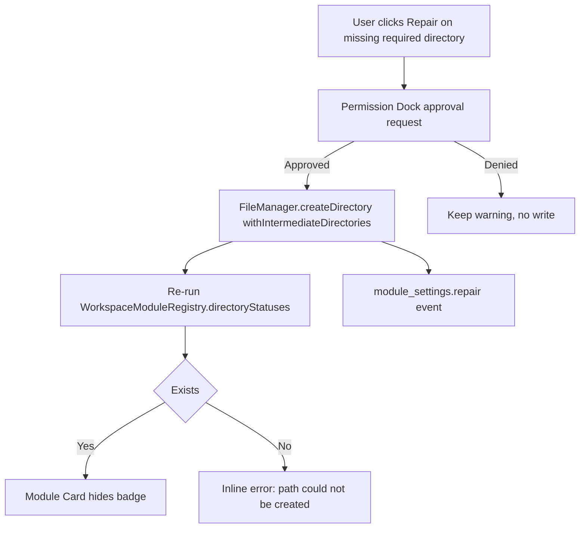

# 任务书 41：Module Customization Settings V1

更新时间：2026-05-08
状态：Implementation complete（P41 Module Customization Settings V1 已完成代码与自动化验证；GUI spot check pending）
优先级：S1 / Roadmap Stage 1
承接：P39 Workspace Module Registry 已落地（`Sci-Station/Workspace/WorkspaceTemplates.swift`）；P40 通过模板创建 workspace，并新增 `WorkspaceCreationWizard` 作为预览/安全目录/目标校验单一 resolver；P41 让用户在创建之后还能逐项 enable / disable / pin / repair / project-override。

---

## 1. 背景

P39 已经把"哪些模块存在"做成了内置 registry，并把 `settings/workspace_modules.yaml` 作为单一持久化点；P40 让创建 workspace 时可以选择模板。但当前 `Sci-Station/UI/SettingsViews.swift:107-164` 的 "Workspace Modules" GroupBox **只是只读摘要**：列出每个 module 的 enabled / disabled / dependency-hidden 状态、warnings、directory statuses，没有任何编辑入口。用户实测想完成下面任何一件事都做不到：

1. 把 `code` 模块（`enabled: false`）打开，让 ProjectSpace 出现 Code tab。
2. 把 `tasks` 模块 pin 到 sidebar 顶端而不是依赖默认顺序。
3. project A 关闭 Calendar、project B 启用 Calendar（project-level override）。
4. 缺失的 `projects/*/wiki/` 目录手工 repair。
5. 看到一个 `Module 'recommendation' depends on disabled module 'citation-graph'` 的清晰提示并跳到对应模块。

P41 不引入新模块，不允许第三方插件，只在 Settings 中提供"读 + 写"`workspace_modules.yaml` 的 UI 闭环。

### 1.1 当前已具备但未利用的能力

```text
Sci-Station/Workspace/WorkspaceTemplates.swift
  WorkspaceModuleRegistry.availableModules(in:)        // dependency-aware filter
  WorkspaceModuleRegistry.availableRoutes(in:)
  WorkspaceModuleRegistry.availableProjectTabs(in:)
  WorkspaceModuleRegistry.availableWorkflows(in:)
  WorkspaceModuleRegistry.warnings(for:)               // 已能产出 dependency / version warnings
  WorkspaceModuleRegistry.directoryStatuses(for:in:)   // 已能区分 required / repairable / exists
  WorkspaceTemplateRepository.saveConfiguration(_:in:) // 已能写回 yaml

Sci-Station/App/AppViewModel.swift
  workspaceModuleConfiguration                          // 单一来源
  workspaceModuleStatusSummary                          // "N/M modules enabled"
  isWorkspaceSectionAvailable(_:)                       // sidebar/route gating
  isProjectModuleTabAvailable(_:)                       // project tab gating
```

P41 的实施工作 80% 是把这些 helpers 接成一个写闭环 UI，并补上 project-level override + directory repair 两块尚未具备的能力。

---

## 2. 本轮目标

1. Settings → Workspace 下新增 "Modules" 子分类页，列出全部 15 个内置模块，每个模块都能 toggle `enabled` 与 `pinned`。
2. 模块卡片展开后显示：依赖模块、提供 routes / project tabs / workflows / artifact kinds / approval scopes、写权限路径、缺失目录列表（含 `Repair` 按钮）。
3. 当依赖未满足时，UI 不允许直接启用，给出可解释 warning + 一键 "Enable Dependencies" 跳转。
4. 当目录缺失时（`required: true && exists: false`）展示橙色 badge，点击 `Repair` 走 Permission Dock approval 后创建。
5. 引入 project-level override：`projects/<project-id>/settings/workspace_modules.override.yaml`（不存在则 fallback 到 workspace 配置）。
6. 写入 `settings/workspace_modules.yaml` 后，sidebar / project tabs / workflow gating 立即刷新，无需重启 App。
7. 全程不引入第三方 module id；不允许新增 module；保持 P39 `validationWarnings` 与 schema_version 1。
8. 所有 toggle / pin / repair / override 都写入 `AppDebugEvent`，便于 P40 Wizard 之外的回归排查。

---

## 3. 流程图

### 3.1 Toggle Module 主路径



### 3.2 Project-Level Override 优先级



### 3.3 Directory Repair



---

## 4. 实施任务

> 命名：所有新增 view / view model 都放在 `Sci-Station/UI/ModuleSettings/` 目录；所有领域逻辑（merge / validation / repair）放在 `Sci-Station/Workspace/`。

- [x] [P41.1] `ModuleSettingsViewModel`（新增 `Sci-Station/UI/ModuleSettings/ModuleSettingsViewModel.swift`）
  - 持有当前 `WorkspaceModuleConfiguration`（从 `AppViewModel.workspaceModuleConfiguration` 注入）。
  - 暴露 `availableModules: [WorkspaceModule]`、`pinnedOrder: [String]`、`warningsByModuleID: [String: [WorkspaceModuleWarning]]`、`directoryStatusesByModuleID: [String: [WorkspaceModuleDirectoryStatus]]`。
  - 提供 `enableModule(id:) / disableModule(id:) / togglePin(id:) / movePin(id:newIndex:) / repairDirectory(moduleID:path:) / projectOverride(projectID:moduleID:enabled:)`。
  - 所有 mutate 调用都返回 `Result<Void, ModuleSettingsError>`，错误类型枚举：`dependencyMissing(missing: [String])`、`pendingPermission`、`repairFailed(path: String, reason: String)`、`overrideConflict(projectID: String, moduleID: String)`。

- [x] [P41.2] `ModuleSettingsView`（新增 `Sci-Station/UI/ModuleSettings/ModuleSettingsView.swift`）
  - 顶部状态行：`workspaceModuleStatusSummary` 文本 + Reset to template default 按钮。
  - 模块列表使用 `LazyVStack`，每行 `ModuleCardView` 展开后显示 dependencies / routes / project tabs / workflows / artifact kinds / approval scopes / writePaths / directories。
  - 启用/禁用以 `Toggle` 表达；pin 用 chevron-up/chevron-down 行为。
  - Warnings 直接渲染在卡片底部，依赖缺失行带 `Enable Dependencies` 按钮（`enableModule` 链式调用直至所有依赖启用为止，整个过程为单一 transaction）。

- [x] [P41.3] Sidebar `Settings` 入口（更新 `Sci-Station/UI/SettingsViews.swift`）
  - `SettingsCategorySidebar` 在 Workspace 下方加 `Modules` 行。
  - 把现有 "Workspace Modules" GroupBox 改为只读 summary（保留），把可写 UI 放进 Modules 子页。

- [x] [P41.4] `WorkspaceModuleConfigurationStore`（实现于 `Sci-Station/Workspace/WorkspaceModuleSettings.swift`）
  - 封装 `WorkspaceTemplateRepository.loadConfiguration` / `saveConfiguration`，加上 atomic temp-file write、防止并发 dirty write。
  - 提供 `subscribeChanges() -> AsyncStream<WorkspaceModuleConfiguration>` 让 `AppViewModel` 监听文件变更（`DispatchSourceFileSystemObject`）。

- [x] [P41.5] Project-level override
  - 新增 `projects/<project-id>/settings/workspace_modules.override.yaml`（schema_version 1，仅记录 `module_overrides: [{ id, enabled }]`，不重复 registry 条目）。
  - 新增 `WorkspaceModuleOverrideRepository` 负责读写。
  - 新增 `ModuleOverrideMerger.effectiveConfiguration(workspace:override:)` 把 override 应用到 workspace configuration（仅允许覆盖 `enabled` 字段，其他字段以 registry 为准）。
  - `AppViewModel.effectiveModuleConfiguration(for:projectID:)` 在 sidebar / project tabs / workflow gating 中替换原 `workspaceModuleConfiguration`。

- [x] [P41.6] Directory repair
  - 新增 `WorkspaceModuleDirectoryRepairer`：接收 `WorkspaceModuleDirectoryStatus`，验证 path 在 `permissions.writePaths` 内，提交 Permission Dock approval（risk: `writesWorkspace`，confirm: yes），通过后 `FileManager.createDirectory(...)`。
  - Wildcard `projects/*/wiki/` 类目录在 repair 时自动展开为当前所有 active project + 触发未来 project 创建时再行检查；不创建外部目录。

- [x] [P41.7] 文件系统监听刷新
  - `WorkspacePreferencesRepository` 已有 file-watch 模式可以参考；为 `workspace_modules.yaml` 加同样监听，外部编辑也能触发 UI 刷新。
  - `AppViewModel.observeWorkspaceModuleConfigurationChanges` 中 dedupe（同一 inode mtime 二次 fire 不重复刷新）。

- [x] [P41.8] Debug 事件
  - 在 `AppDebugEventLogger` 写入 5 类事件（详见 §8）。
  - 全部走 `AppViewModel.recordAppDebugEvent`（已存在），不直接调 logger，以便统一脱敏。

- [x] [P41.9] 自动化与手动测试（详见 §6 / §7）。

- [x] [P41.10] 文档与回归
  - 更新 `docs/development/manual-tests/MT99_ReleaseRegression.md` 在 Sidebar / Settings 段加入 P41 验证用例。
  - 更新 `Sci-Station/Workspace/WorkspaceTemplates.swift` 头部 doc comment（不改 schema），指向 `Proposal41.md`。

---

## 5. 数据模型与伪代码

### 5.1 Project-level override yaml

```yaml
schema_version: 1
project_id: 12345
module_overrides:
  - id: calendar
    enabled: false
  - id: code
    enabled: true
last_updated_at: 2026-05-07T08:00:00Z
```

### 5.2 ModuleSettingsViewModel 状态机伪代码

```swift
@MainActor
final class ModuleSettingsViewModel: ObservableObject {
    @Published private(set) var configuration: WorkspaceModuleConfiguration
    @Published private(set) var warnings: [String: [WorkspaceModuleWarning]]
    @Published private(set) var directoryStatuses: [String: [WorkspaceModuleDirectoryStatus]]
    @Published private(set) var isPersisting: Bool = false

    private let store: WorkspaceModuleConfigurationStore
    private let repairer: WorkspaceModuleDirectoryRepairer
    private let overrides: WorkspaceModuleOverrideRepository
    private let debug: AppDebugEventLogger

    func enableModule(id: String) async -> Result<Void, ModuleSettingsError> {
        guard let module = configuration.module(id: id) else { return .failure(.unknown(id)) }
        let missing = module.dependencies.filter { configuration.module(id: $0)?.enabled != true }
        if !missing.isEmpty {
            return .failure(.dependencyMissing(missing: missing))
        }
        configuration = configuration.with(moduleID: id, enabled: true)
        return await persist(reason: "module_settings.toggle", payload: ["id": .string(id), "enabled": .bool(true)])
    }

    func enableDependencies(of id: String) async -> Result<Void, ModuleSettingsError> {
        // BFS over dependency graph, enabling unmet dependencies first.
        var queue: [String] = [id]
        var visited: Set<String> = []
        var enabledIDs: [String] = []
        while let next = queue.first {
            queue.removeFirst()
            guard let module = configuration.module(id: next) else { continue }
            for dependency in module.dependencies where !visited.contains(dependency) {
                visited.insert(dependency)
                queue.append(dependency)
                if configuration.module(id: dependency)?.enabled == false {
                    configuration = configuration.with(moduleID: dependency, enabled: true)
                    enabledIDs.append(dependency)
                }
            }
        }
        configuration = configuration.with(moduleID: id, enabled: true)
        enabledIDs.append(id)
        return await persist(
            reason: "module_settings.toggle_chain",
            payload: ["enabled_chain": .array(enabledIDs.map { .string($0) })]
        )
    }

    private func persist(reason: String, payload: JSONValue) async -> Result<Void, ModuleSettingsError> {
        isPersisting = true
        defer { isPersisting = false }
        do {
            try await store.save(configuration)
            warnings = WorkspaceModuleRegistry.warnings(for: configuration)
                .reduce(into: [:]) { acc, warning in acc[warning.moduleID ?? "_workspace", default: []].append(warning) }
            directoryStatuses = WorkspaceModuleRegistry
                .directoryStatuses(for: configuration, in: root)
                .reduce(into: [:]) { acc, status in acc[status.moduleID, default: []].append(status) }
            try? await debug.append(AppDebugEvent(event: reason, payload: payload), in: root)
            return .success(())
        } catch {
            return .failure(.persistFailed(error.localizedDescription))
        }
    }
}
```

### 5.3 Override merge 伪代码

```swift
struct ModuleOverrideMerger {
    static func effectiveConfiguration(
        workspace: WorkspaceModuleConfiguration,
        override: WorkspaceModuleOverride?
    ) -> WorkspaceModuleConfiguration {
        guard let override else { return workspace }
        let overrideMap = Dictionary(uniqueKeysWithValues: override.moduleOverrides.map { ($0.id, $0.enabled) })
        let mergedModules = workspace.modules.map { module -> WorkspaceModule in
            var copy = module
            if let overrideEnabled = overrideMap[module.id] {
                copy.enabled = overrideEnabled
            }
            return copy
        }
        return WorkspaceModuleConfiguration(
            schemaVersion: workspace.schemaVersion,
            modules: mergedModules
        )
    }
}
```

### 5.4 Directory repair 伪代码

```swift
struct WorkspaceModuleDirectoryRepairer {
    enum RepairOutcome { case created(URL); case skippedWildcard; case denied; case failed(String) }

    func repair(_ status: WorkspaceModuleDirectoryStatus, in root: ResearchRoot) async -> RepairOutcome {
        guard !status.path.contains("*") else { return .skippedWildcard }
        let url = root.fileURL(for: status.path)
        let module = WorkspaceModuleRegistry.module(id: status.moduleID)
        let permitted = (module?.permissions.writePaths ?? [])
            .contains { WorkspaceModuleRegistry.path(pattern: $0, matches: status.path) }
        guard permitted else { return .denied }

        let approved = await permissionDock.requestApproval(.repairDirectory(path: status.path))
        guard approved else { return .denied }

        do {
            try fileManager.createDirectory(at: url, withIntermediateDirectories: true)
            return .created(url)
        } catch {
            return .failed(error.localizedDescription)
        }
    }
}
```

### 5.5 SwiftUI 卡片折叠状态

```text
ModuleCardView
  ├─ HeaderRow
  │   ├─ Toggle(enabled)         // disabled when dependencies missing
  │   ├─ PinChevron(pinned)
  │   └─ DisclosureChevron
  └─ DetailSection (collapsed by default)
      ├─ Description (静态文案，按 module.id 配)
      ├─ Dependencies row + EnableDependencies button
      ├─ Provides: routes / projectTabs / workflows / artifactKinds / approvalScopes
      ├─ Permissions: writePaths（点击复制）
      └─ Directories list（required/repairable badges + Repair button）
```

---

## 6. 自动化测试

新增到 `Tools/SciStationCoreTestRunner/main.swift`：

```text
moduleSettingsViewModelEnableModuleRequiresDependencies
moduleSettingsViewModelEnableDependenciesEnablesAllAncestors
moduleSettingsViewModelTogglePinPersistsOrder
moduleSettingsViewModelDisablingDependencyHidesRoutes
moduleSettingsViewModelOverrideOnlyAffectsTargetProject
workspaceModuleDirectoryRepairerSkipsWildcardPaths
workspaceModuleDirectoryRepairerRequiresPermissionApproval
workspaceModuleConfigurationStoreNotifiesObserversAtomically
moduleOverrideMergerOnlyMutatesEnabledField
moduleOverrideMergerLeavesUnknownIDsAsNoOp
```

每个测试给定一个干净的 in-memory `ResearchRoot`（沿用 P39 测试的 fixture 路径），不依赖 Xcode UI host。

构建命令：

```bash
swift run SciStationCoreTestRunner
xcodebuild -project Sci-Station.xcodeproj -scheme Sci-Station -destination 'platform=macOS' build
```

---

## 7. 手动测试计划（MT11-P41）

新增到 `docs/development/manual-tests/MT11_ModuleSettings.md`（首次创建）。MT99 partial regression 增加 MT11-P41-01 / 03 / 06。

| ID | 标题 | 期望 |
|---|---|---|
| MT11-P41-01 | 打开 Settings → Modules | 列表显示全部 15 个内置模块；`enabled/disabled/dependency hidden` 状态正确；workspaceModuleStatusSummary 与列表一致 |
| MT11-P41-02 | 启用 `code` 模块（依赖已满足） | Toggle 立即生效，`AppDebugEvent module_settings.toggle` 记录 enabled=true，sidebar 不增加项（Code 主要走 ProjectSpace tab，由 P43 完整接入） |
| MT11-P41-03 | 启用 `recommendation`（依赖 `citation-graph` 未启用） | Toggle 被阻止，inline warning 显示 missing dependency；点击 `Enable Dependencies` 后两个模块都启用，单次 persist |
| MT11-P41-04 | 关闭 `wiki` | UI 立即提示 `wiki` 还是 `recommendation`/`writing` 等模块的依赖；Sidebar Wiki 入口隐藏；wiki workflow 在 AI Lab 工具列表中消失 |
| MT11-P41-05 | Pin `tasks` 到顶端 | Sidebar 重排，`workspace_modules.yaml` 中 `pinned: true`；重启 App 顺序保留 |
| MT11-P41-06 | Repair 缺失 `projects/*/wiki/` | Settings 确认弹窗 / permission request 出现；批准后目录创建；拒绝后保留 warning；wildcard 路径只创建当前 active project 下的实例 |
| MT11-P41-07 | Repair 不在 writePaths 内的目录 | Repairer 拒绝（denied），UI 显示明确原因 |
| MT11-P41-08 | Project A 关闭 calendar，Project B 不受影响 | Override 文件写入；切换 Project 时 sidebar / tabs 立即响应；Project A override 文件删除后自动 fallback 到 workspace 配置 |
| MT11-P41-09 | 外部直接编辑 `workspace_modules.yaml` | App 在不重启的情况下检测到变化并刷新 UI；schema 不合法时回退到上次合法配置 + warning |
| MT11-P41-10 | Reset to template default | 弹确认对话；确认后 `module_settings.reset_to_template` 事件记录 + override 文件清空 |

ResearchWorkspace 真实回放：

1. 打开 ResearchWorkspace（已迁移的 P39 配置），`Modules` 子页能正确展示。
2. 关闭 `pdf-reader`，验证 Library 单论文行的 Open in PDF Reader 按钮变 disabled / 隐藏。
3. 启用 `code`，确认 ProjectSpace 还没有 Code tab（P43 才接入），但 Settings 中提示已启用。

---

## 8. Debug 与日志规范

所有事件经 `AppViewModel.recordAppDebugEvent` 写入 `.sci-station/debug/app_events.jsonl`（已有 `AppDebugEventLogger`）。事件命名空间：`module_settings.*`。

| event | payload 字段 | 触发点 | 备注 |
|---|---|---|---|
| `module_settings.toggle` | `id: String, enabled: Bool, before: Bool, dependencies_satisfied: Bool, persisted_at: ISO8601` | `enableModule` / `disableModule` 持久化成功 | 持久化失败也记录 + `error` 字段，保留 user attempt |
| `module_settings.toggle_chain` | `enabled_chain: [String], reason: "enable_dependencies"` | 一键启用依赖链 | 单 transaction，避免连发 N 条 toggle |
| `module_settings.pin` | `id: String, pinned: Bool, position: Int` | 切换 / 移动 pin |  |
| `module_settings.override_apply` | `project_id: String, id: String, enabled: Bool, fallback_to_workspace: Bool` | Project 级 override 写入或清空 | 清空时 `enabled = workspace.enabled`，并 `cleared: true` |
| `module_settings.dependency_warning_shown` | `id: String, missing: [String]` | 用户尝试启用但依赖未满足 | 用于评估 onboarding 摩擦 |
| `module_settings.repair` | `module_id: String, path: String, outcome: String, reason: String?` | 目录 repair 任意结果 | `outcome ∈ {created, skipped_wildcard, denied, failed}` |
| `module_settings.reset_to_template` | `template_id: String, before_modules: [String], after_modules: [String]` | Reset to default | 不在路径中暴露 user-visible 内容，只记录 module id |

脱敏：所有 payload 不得包含 user paper / wiki / artifact 内容；`path` 字段使用 workspace-relative path（绝对路径过滤，复用 `AppDebugEventLogger` redaction）。

---

## 9. 非目标 / 验收标准 / Questions / 交付记录

### 9.1 非目标

```text
不引入第三方插件机制
不允许新增 module id（仅 builtInModules 15 项可见）
不做 module 安装包 / 下载分发
不做模块权限编辑（permissions.writePaths 由 registry 决定）
不修改 P38 Draft Inbox / Permission Dock V2 行为
不实现 P43 ProjectSpace Tab UI（P41 只暴露 enabled tab id 列表，UI 在 P43 接入）
```

### 9.2 验收标准

1. Settings → Modules 子页能正确读 / 写 `settings/workspace_modules.yaml`，并通过 `ModuleSettingsViewModel` 把 enable / disable / pin / repair 全闭环。
2. 依赖未满足时不允许启用；提供 `Enable Dependencies` 一键链式启用；UI 提示明确。
3. 缺失目录可 repair；wildcard 路径不创建外部目录；非 writePaths 路径被拒绝并解释。
4. project-level override 只覆盖 `enabled` 字段，其他字段不可改；override 文件删除后自动 fallback。
5. 外部编辑 yaml 后 App 检测到变化并刷新；schema invalid 时回退 + warning。
6. 全部 toggle / pin / repair / override / reset 都有对应 `module_settings.*` debug event。
7. `swift run SciStationCoreTestRunner` 与 `xcodebuild` 全绿。
8. MT11-P41-01..10 全部通过；MT99 partial regression 通过。

### 9.3 Questions / 风险

1. project-level override 是否应允许覆盖 `pinned`？本轮决议：不允许；pin 是 workspace/sidebar 顺序，project override 仅覆盖 `enabled`。
2. 外部编辑 yaml 后导致 active project 的 enabled module 不再满足 dependencies 时，是否自动禁用还是仅 warning？本轮决议：仅 warning + dependency-hidden gating，不擅自改用户文件。
3. P40 Wizard 写出的 `workspace_modules.yaml` 与 P41 写回的 yaml 是否完全等价？本轮决议：是；已通过 `templateAndSettingsRoundTripsAreIdentical` 自动化测试覆盖。

### 9.4 交付记录

完成日期：2026-05-08
Git commit：未提交（当前工作区改动）
自动化测试结果：

```text
swift run SciStationCoreTestRunner：通过（新增 module settings dependency / chain enable / pin persistence / route gating / project override / directory repair / file watcher / YAML roundtrip 覆盖）
xcodebuild -project Sci-Station.xcodeproj -scheme Sci-Station -destination 'platform=macOS' build：通过（仍有既有 WebKit actor-isolation warning，非 P41 新增阻塞）
get_errors：P41 编辑的 Swift / SwiftUI 文件无错误
```

手动测试报告：`docs/development/manual-tests/runs/2026-05-08_P41_ModuleCustomizationSettings.md`

已知问题：

```text
本轮未执行真实 macOS GUI spot check；Settings → Modules 的 toggle/pin/repair/override 真实点击流仍需在本机 App UI 中补测。
Directory repair 已使用明确确认弹窗与 AgentPermissionDecision 记录审批结果；尚未复用 AI Lab run-bound Permission Dock 队列。
Project-level override 已影响 ProjectSpace sidebar/project tab gating；模块贡献的完整 ProjectSpace tab UI 仍按 P43 处理。
ChatMarkdownWebView / MarkdownPreviewView 仍有既有 WebKit actor-isolation build warning，未纳入 P41 范围。
```

推迟到 P42 / P43 的事项：Home / Project Dashboard V2、模块贡献的 ProjectSpace tab UI、sidebar 进一步收敛、完整 GUI 回归。
