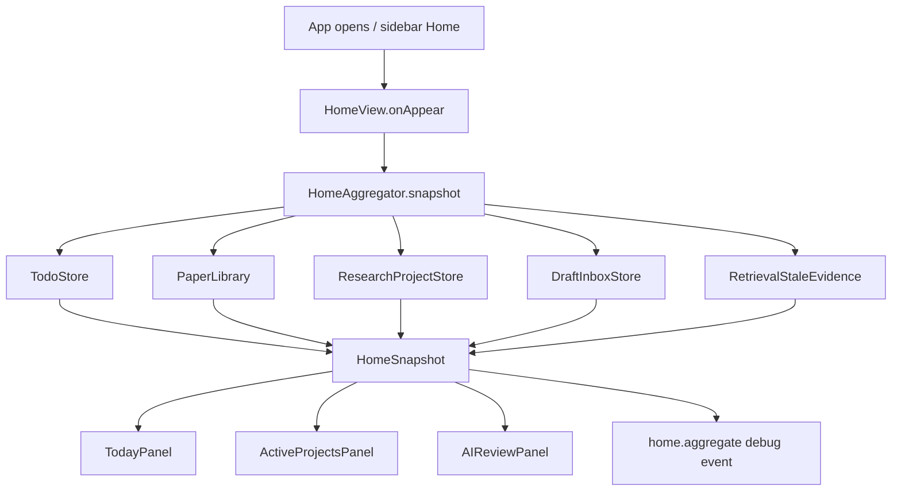
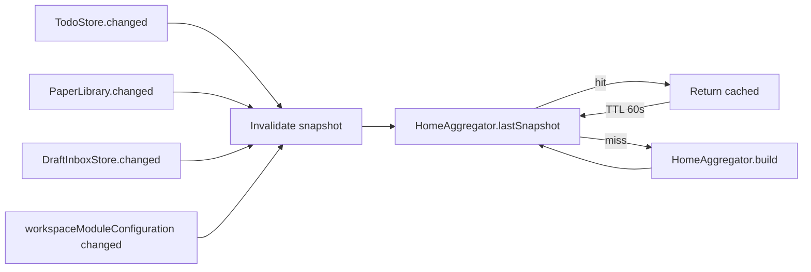
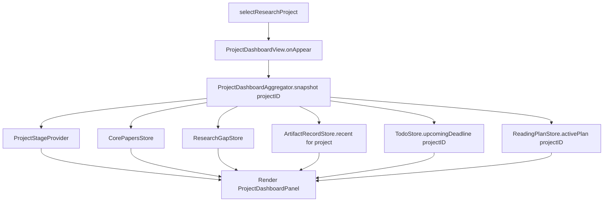

# 任务书 42：Workspace Home 与 Project Dashboard V2

更新时间：2026-05-08
状态：Implemented（代码、自动化用例与手测文档已补齐；GUI spot check pending）
优先级：S1 / Roadmap Stage 1
承接：P41 已完成 module enable/disable/pin/override/repair/file-watch/debug 闭环；P42 把入口体验从"功能列表"升级为"今天该做什么"。

---

## 1. 背景

当前 `Sci-Station/UI/DashboardViews.swift:1-46` 的 `DashboardView` 还是经典的"统计卡 + 项目列表 + 日历 + 待办 + 论文清单"组合：

```text
StatCard(Open Todos / Due Today / Papers)
ResearchProjectsWidget
DashboardCalendarView
TodoDashboardWidget(.global)
DashboardPaperList(Recently Added / Recently Read)
```

这套布局在 P39 之前可以接受，但 P38 已经引入 Draft Inbox / Evidence Health / approval lineage、P37 已经有 stale evidence、P39 已经能精确知道当前启用了哪些 workflow。这些"高价值信号"目前完全没有出现在 Home。`Sci-Station/UI/ProjectOverviewView.swift:1-100` 的 Project Overview 也类似，只展示 metric card + Project Brief + Core Papers，没有把"open gaps"、"recent artifacts"、"next deadline"、"current reading plan"组织成可操作面板。

P42 要把 Home 与 Project Dashboard 改成 **"AI 与人协作的研究主控台"**。核心思路：用户打开 App 第一眼看到 3 件事——

1. **Today**：今日需要处理的待办、阅读队列、即将到期的 deadline、等待审批的 AI draft。
2. **Active Projects**：每个 active project 当前阶段、核心论文、最近 artifact、下个 milestone。
3. **AI Review**：等待审批 / unsupported claim / stale evidence warning 列表。

Project Dashboard 在 Project Overview 之上扩展为 V2，加入 stage / open gaps / recent artifacts / next deadline / current reading plan 五段，并对接 P38 Draft Inbox。

---

## 2. 本轮目标

1. 重写 `DashboardView` 为三段式聚合（Today / Active Projects / AI Review），保留现有 Calendar + Recently Read 区块作为底部 secondary 内容。
2. 新增 `HomeAggregator`（一个 read-only data builder），统一从 todo / paper library / project / draft inbox / retrieval 拉取快照，避免每个面板各自扫描。
3. Project Dashboard V2：在 `ProjectOverviewView` 顶部加 Project Dashboard panel（stage / core papers / open gaps / recent artifacts / next deadline / current reading plan）。
4. 所有面板必须能在 0 个项目、0 个论文、0 个 draft、0 个 todo 的全空状态下显示明确的 onboarding 文案；不能 crash。
5. P42 不引入新数据持久化文件；所有数据都从既有 store 读取。
6. 所有面板渲染都对应一个 `home.aggregate` debug event，便于排查"我看不到 X"类问题。

---

## 3. 流程图

### 3.1 Home 渲染主路径



### 3.2 Snapshot Cache 失效



### 3.3 Project Dashboard V2



---

## 4. 实施任务

> 命名：所有新增 view 放在 `Sci-Station/UI/Home/`；所有 aggregator 放在 `Sci-Station/UI/Home/Aggregators/`。

- [x] [P42.1] `HomeSnapshot` 数据模型（实现于 `Sci-Station/Workspace/HomeSnapshot.swift`，供 SwiftPM core tests 与 UI 共用）
  - 字段：`today: TodayPanelData`、`activeProjects: [ActiveProjectData]`、`aiReview: AIReviewPanelData`、`builtAt: Date`、`generationDuration: TimeInterval`。
  - 子模型：`TodayPanelData(dueTodos: [TodoSummary], readingQueue: [PaperSummary], upcomingDeadlines: [DeadlineSummary], pendingDrafts: [DraftSummary])`；`ActiveProjectData(projectID, stage, coreCount, recentPaperCount, openGapsCount, latestArtifact, nextDeadline)`；`AIReviewPanelData(needsApproval: [DraftSummary], unsupportedClaims: [ClaimSummary], staleEvidenceWarnings: [EvidenceWarningSummary])`。

- [x] [P42.2] `HomeAggregator`（实现于 `Sci-Station/Workspace/HomeAggregator.swift`，UI 通过 `HomeView` 调用）
  - `func snapshot() async -> HomeSnapshot`，60 秒 TTL；任何相关 store 触发 `objectWillChange` 时 `invalidate()`。
  - 注入 `TodoStore / PaperLibrary / DraftInboxStore / ResearchProjectStore / RetrievalStaleEvidenceStore`。
  - 内部 `buildToday()` / `buildActiveProjects()` / `buildAIReview()` 三个纯函数，返回各 panel 数据。

- [x] [P42.3] `HomeView`（新增 `Sci-Station/UI/Home/HomeView.swift`，替换 `DashboardView` 内容）
  - 顶部 hero 行：workspace name + workspaceModuleStatusSummary + workflowReady badge。
  - 三段聚合面板：`TodayPanelView` / `ActiveProjectsPanelView` / `AIReviewPanelView`。
  - 底部保留：`DashboardCalendarView` 与 `Recently Added / Recently Read` 列表（向后兼容）。

- [x] [P42.4] `TodayPanelView` / `ActiveProjectsPanelView` / `AIReviewPanelView`
  - `TodayPanelView`：4 张次卡片——Due Todos、Reading Queue、Upcoming Deadlines、Pending AI Drafts；空状态有明确 onboarding。
  - `ActiveProjectsPanelView`：每行 1 个 project；点击行进入 ProjectSpace（P43 接入）；同行右侧浮动 actions（Open Notes、Open Tasks、Open Wiki、Open AI Lab Drafts）。
  - `AIReviewPanelView`：3 列：Needs Approval / Unsupported Claims / Stale Evidence Warnings；点击行跳到 Draft Inbox 对应条目（路由 id：`draft-inbox/<draftID>?tab=evidence`）。

- [x] [P42.5] `ProjectDashboardAggregator`（实现于 `Sci-Station/Workspace/ProjectDashboardAggregator.swift`，供 SwiftPM core tests 与 UI 共用）
  - 与 HomeAggregator 同构，但范围限于单个 project；缓存 key 含 `projectID`。

- [x] [P42.6] `ProjectDashboardPanel`（新增 `Sci-Station/UI/Home/ProjectDashboardPanel.swift`）
  - 嵌入 `ProjectOverviewView` 顶部（在 metric card 上方）。
  - 6 段：Project Stage / Core Papers / Open Gaps / Recent Artifacts / Next Deadline / Current Reading Plan。

- [x] [P42.7] `ProjectStageProvider` 推断（新增 `Sci-Station/Workspace/ProjectStageProvider.swift`）
  - 输入：project metadata + 最近 14 天 todo / artifact / paper 阅读活动。
  - 输出：`stage ∈ { exploration, planning, drafting, reviewing, on_hold }`，按规则推断；不调用 LLM。
  - 不写文件，仅提供查询。

- [x] [P42.8] 空状态与失败回退
  - 任意 aggregator 失败时，渲染 `Panel temporarily unavailable + Retry` 并写 `home.aggregate.error`。
  - 0 个 project、0 个 paper、0 个 todo 时，分别显示 onboarding CTA：Create Project / Add Paper / Create Todo / Open AI Lab。

- [x] [P42.9] 自动化与手动测试（详见 §6 / §7）。

- [x] [P42.10] 文档与回归
  - 更新 `docs/development/manual-tests/MT12_Home.md`（新建）。
  - 在 `MT99_ReleaseRegression.md` 加 P42 partial regression（Home 打开、空状态、Project Dashboard）。

---

## 5. 数据模型与伪代码

### 5.1 HomeSnapshot 数据结构

```swift
struct HomeSnapshot: Sendable {
    let today: TodayPanelData
    let activeProjects: [ActiveProjectData]
    let aiReview: AIReviewPanelData
    let builtAt: Date
    let generationDuration: TimeInterval
}

struct TodayPanelData: Sendable {
    let dueTodos: [TodoSummary]                     // status != done && dueDate <= today
    let readingQueue: [PaperSummary]                 // recentlyAdded ∪ inProgress paper notes (max 10)
    let upcomingDeadlines: [DeadlineSummary]         // todos / project milestones in next 14 days
    let pendingDrafts: [DraftSummary]                // status == needsReview
}

struct ActiveProjectData: Identifiable, Sendable {
    let id: String
    let title: String
    let stage: ProjectStage
    let coreCount: Int
    let recentPaperCount: Int
    let openGapsCount: Int
    let latestArtifact: ArtifactSummary?
    let nextDeadline: DeadlineSummary?
}

struct AIReviewPanelData: Sendable {
    let needsApproval: [DraftSummary]                // status == needsReview, ordered by createdAt desc
    let unsupportedClaims: [ClaimSummary]            // ArtifactEvidenceHealth.unsupported_core_claim_count > 0
    let staleEvidenceWarnings: [EvidenceWarningSummary] // RetrievalStaleEvidence.fresh == false
}
```

### 5.2 HomeAggregator 伪代码

```swift
actor HomeAggregator {
    private var cached: HomeSnapshot?
    private let cacheTTL: TimeInterval = 60

    func snapshot() async -> HomeSnapshot {
        if let cached, Date().timeIntervalSince(cached.builtAt) < cacheTTL {
            return cached
        }
        let snapshot = await buildSnapshot()
        cached = snapshot
        await debug.append(.init(
            event: "home.aggregate",
            payload: .object([
                "duration_ms": .number(snapshot.generationDuration * 1000),
                "today_due": .number(Double(snapshot.today.dueTodos.count)),
                "today_drafts": .number(Double(snapshot.today.pendingDrafts.count)),
                "active_projects": .number(Double(snapshot.activeProjects.count)),
                "ai_unsupported_claims": .number(Double(snapshot.aiReview.unsupportedClaims.count)),
                "ai_stale_evidence": .number(Double(snapshot.aiReview.staleEvidenceWarnings.count))
            ])
        ), in: root)
        return snapshot
    }

    func invalidate() {
        cached = nil
    }

    private func buildSnapshot() async -> HomeSnapshot {
        let start = Date()
        async let today = buildToday()
        async let active = buildActiveProjects()
        async let aiReview = buildAIReview()
        let snapshot = HomeSnapshot(
            today: await today,
            activeProjects: await active,
            aiReview: await aiReview,
            builtAt: Date(),
            generationDuration: Date().timeIntervalSince(start)
        )
        return snapshot
    }
}
```

### 5.3 ProjectStageProvider 推断规则

```swift
enum ProjectStage: String, Sendable {
    case exploration   // < 5 papers && < 3 wiki pages && no draft
    case planning      // 5+ papers && research_plan artifact saved && open_gaps > 0
    case drafting      // related_work / writing_revision saved within last 14 days
    case reviewing     // unsupported_claim_count > 0 || reviewer_response artifact in flight
    case onHold        // no activity in last 21 days
}

struct ProjectStageProvider {
    func stage(for projectID: String, today: Date) -> ProjectStage {
        let papersCount = library.papers(for: projectID).count
        let wikiCount = wikiStore.pagesCount(for: projectID)
        let draftsByKind = draftInbox.drafts(for: projectID)
        let lastActivity = activityStore.lastActivityAt(for: projectID)
        let openGaps = researchGapStore.openCount(for: projectID)

        if let lastActivity, today.timeIntervalSince(lastActivity) > 21 * 86_400 {
            return .onHold
        }
        if draftsByKind.contains(where: { $0.kind == "writing_revision" || $0.kind == "related_work" }) {
            return .drafting
        }
        if draftsByKind.contains(where: { $0.evidenceHealth.unsupportedClaimCount > 0 }) ||
           draftsByKind.contains(where: { $0.kind == "reviewer_response" }) {
            return .reviewing
        }
        if papersCount >= 5, openGaps > 0,
           draftsByKind.contains(where: { $0.kind == "research_plan" }) {
            return .planning
        }
        if papersCount < 5, wikiCount < 3, draftsByKind.isEmpty {
            return .exploration
        }
        return .planning
    }
}
```

### 5.4 ProjectDashboardPanel 渲染顺序

```text
ProjectDashboardPanel
  ├─ StageBadge(stage)                      // colored chip; tooltip shows derivation rule
  ├─ MetricsRow(papers, core, openGaps, openTodos)
  ├─ RecentArtifactsList(top 3)
  │   ├─ ArtifactRow(kind, status, savedAt)  // tap -> open Draft Inbox / saved artifact
  ├─ NextDeadlineCard(date, item)            // tap -> open Calendar / Tasks
  └─ CurrentReadingPlanCard(plan?)           // tap -> open Reading Plan (P50 接入；P42 仅显示 placeholder)
```

---

## 6. 自动化测试

新增到 `Tools/SciStationCoreTestRunner/main.swift`：

```text
homeAggregatorReturnsEmptyDataForBlankWorkspace
homeAggregatorRespectsCacheTTL
homeAggregatorInvalidatesOnDraftInboxChange
homeAggregatorInvalidatesOnTodoChange
homeAggregatorErrorRecordsDebugEvent
projectDashboardAggregatorReturnsCorrectStage
projectDashboardAggregatorOrdersArtifactsByCreatedDesc
projectStageProviderInfersExplorationForBlankProject
projectStageProviderInfersOnHoldAfter21DaysIdle
projectStageProviderInfersReviewingWhenUnsupportedClaimPresent
homeSnapshotEncodesAndDecodesRoundTrip
```

构建命令：

```bash
swift run SciStationCoreTestRunner
xcodebuild -project Sci-Station.xcodeproj -scheme Sci-Station -destination 'platform=macOS' build
```

---

## 7. 手动测试计划（MT12-P42）

新增到 `docs/development/manual-tests/MT12_Home.md`。

| ID | 标题 | 期望 |
|---|---|---|
| MT12-P42-01 | 打开 Home | 三段聚合面板可见；workspace name 与 module status summary 正确 |
| MT12-P42-02 | 全空 workspace | Today / Active Projects / AI Review 显示 onboarding 文案与 CTA；不 crash |
| MT12-P42-03 | 1 个 project + 0 个 paper + 1 个 todo | Today 中 todo 出现；Active Projects 列出该 project 且 stage = exploration；AI Review 空 |
| MT12-P42-04 | 当前 project 有 1 个 needsReview draft | AI Review.NeedsApproval 显示该 draft，点击跳到 Draft Inbox 对应条目 |
| MT12-P42-05 | 1 个 saved artifact 含 stale evidence | AI Review.StaleEvidenceWarnings 出现条目，点击跳到 Evidence Inspector |
| MT12-P42-06 | Project Dashboard V2 | ProjectOverviewView 顶部出现 Dashboard Panel；StageBadge / metrics / recent artifacts 正确 |
| MT12-P42-07 | 大数据集（100+ todos / 50+ drafts） | snapshot 构建 ≤ 300ms（Debug event 中查 `duration_ms`） |
| MT12-P42-08 | Aggregator 故意失败（mock 注入 throw） | 面板显示 Retry；`home.aggregate.error` 写入 |
| MT12-P42-09 | 切换语言（zh / en） | 所有面板文案随 `appLanguage` 切换 |
| MT12-P42-10 | 模块禁用 `tasks` | Today.DueTodos 自动隐藏，并展示 "Tasks module disabled in Settings → Modules" 引导 |

---

## 8. Debug 与日志规范

| event | payload 字段 | 触发点 |
|---|---|---|
| `home.aggregate` | `duration_ms, today_due, today_drafts, active_projects, ai_unsupported_claims, ai_stale_evidence` | snapshot 构建成功 |
| `home.aggregate.error` | `panel: "today"\|"active"\|"ai_review", reason` | aggregator 抛错 |
| `home.panel.action` | `panel, action_id, target_id` | 用户点击面板内 action（不记录文本内容） |
| `project_dashboard.render` | `project_id, duration_ms, stage, recent_artifacts_count` | Project Dashboard 渲染成功 |
| `project_dashboard.stage_inferred` | `project_id, stage, rule` | Stage Provider 输出 stage |
| `home.cache.invalidate` | `reason: "todo_change"\|"draft_change"\|"module_config_change"` | 缓存失效 |

脱敏：所有事件不包含 todo title / paper title / draft contents；只记录 id 与 count。`stage` 字段是固定枚举不需要脱敏。

---

## 9. 非目标 / 验收标准 / Questions / 交付记录

### 9.1 非目标

```text
不引入新 store / repository（数据全部来自既有 store）
不实现 P50 Reading Plan（CurrentReadingPlanCard 只显示 placeholder）
不实现 P51 Research Timeline（NextDeadline 只取 todo / project deadline）
不重写 Project Overview 整体（只在顶部插入 Dashboard Panel）
不调用 LLM 推断 stage（Stage Provider 是确定性规则）
不引入第三方 charting 库
```

### 9.2 验收标准

1. Home 三段聚合显示正确；空状态 onboarding 友好；模块禁用时面板自动隐藏对应行。
2. Project Dashboard V2 在 ProjectOverviewView 顶部正确渲染；stage 推断符合规则。
3. snapshot 60 秒缓存生效；store 变更后正确 invalidate；无 leak。
4. 所有面板渲染 < 300ms（在 Standard Workspace + 100 todos 场景）。
5. Debug 事件按 §8 完整写入；不含敏感文本。
6. SciStationCoreTestRunner / xcodebuild 全绿。
7. MT12-P42-01..10 全部通过。

### 9.3 Questions / 风险

1. `CurrentReadingPlanCard` 在 P50 之前没有数据源，应显示什么？倾向：placeholder + "Set up reading plan in P50"；不引入临时数据 schema。
2. `pendingDrafts` 是否含所有 project 的 needsReview draft，还是只含当前 project？倾向：Today 显示当前 project 的；AI Review 显示全部 workspace 的。
3. ProjectStageProvider 21 天阈值是否可配？倾向：先固定，后续若反馈强烈再加 setting。
4. AggregatorTTL 60 秒是否合理？外部编辑 yaml / 第三方写文件不会立即触发 invalidate。倾向：先 60 秒；若用户主动点击刷新按钮，强制 `invalidate()`。

### 9.4 交付记录

完成实现后补充：

```text
完成日期：2026-05-08
Git commit：未提交（由用户决定是否 commit）
自动化测试结果：通过 `swift run SciStationCoreTestRunner`；通过 `xcodebuild -project Sci-Station.xcodeproj -scheme Sci-Station -destination 'platform=macOS' build`
手动测试报告：docs/development/manual-tests/runs/2026-05-08_P42_HomeDashboardV2.md（GUI spot check pending）
已知问题：Draft Inbox 尚无独立 store；P42 使用现有 AgentRun / AgentToolResult / retrieval index 状态降级展示 needs approval / artifact / stale evidence。
实现备注：HomeSnapshot/HomeAggregator/ProjectDashboardAggregator 位于 Workspace core target，原因是 SwiftPM 排除了 UI 目录，核心聚合需要进入 SciStationCoreTestRunner。
推迟到 P43 的事项：sidebar / project space 收敛；Active Projects 行动作目前跳现有 Projects/Wiki/Tasks/AI Lab 入口。
推迟到 P50 的事项：Reading Plan 真实数据接入；CurrentReadingPlanCard 当前显示 placeholder。
```
