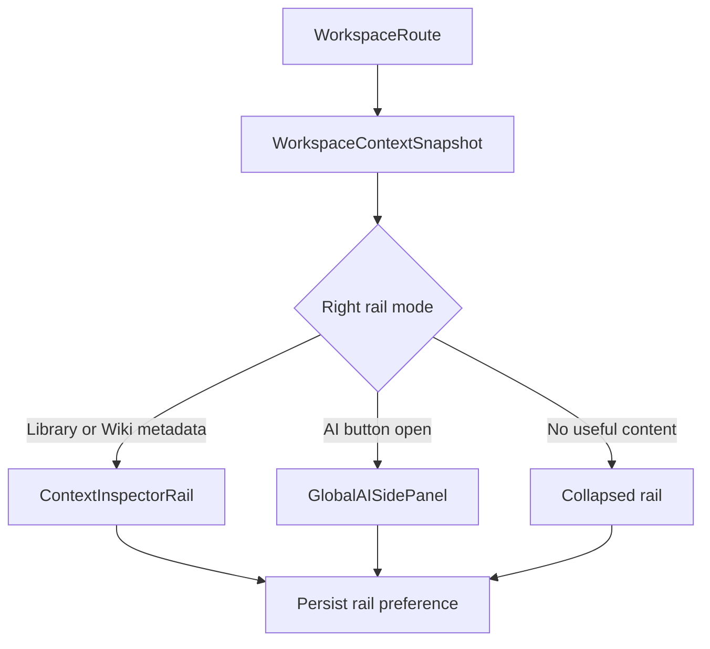
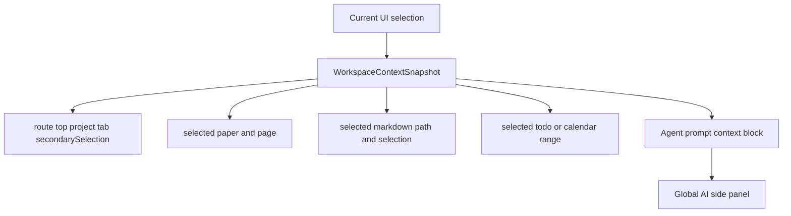
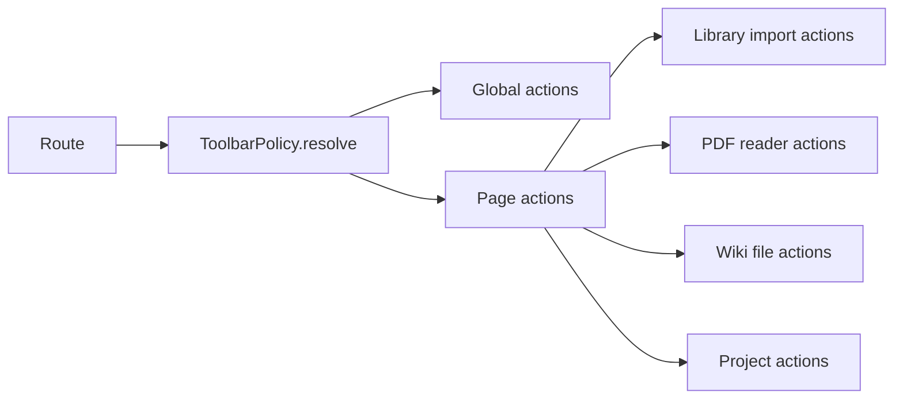

# 任务书 43.5：Shell 右栏重构与全局 AI 侧栏

更新时间：2026-05-08
状态：Completed
优先级：S1 / Roadmap Stage 1.5
承接：P43 已把顶层 Sidebar 收敛为 Home / Projects / Library / Calendar / AI Lab / Settings，并把项目内工作集中到 `ProjectSpaceContainer`。P43.5 在不推翻 P43 routing 的前提下，打磨主壳层、右侧空间、全局 AI 入口、项目树与 toolbar 归属。

---

## 1. 背景

P43 解决了“入口太散”的问题，但从当前截图和代码看，主壳层仍有几个明显的交互缺口：

1. AI Lab 的会话管理弱化。`AgentThread` / `AgentThreadRepository` 仍存在，但用户在 AI Lab 中缺少稳定的左侧 chat/thread 管理区。
2. 右侧 `Inspector` 在 Library / Wiki 之外语义不清。`ContentView.swift` 的第三列常驻，`WorkspaceInspectorView` 对多数页面只显示工作区统计和 Reveal in Finder，造成右侧空间低效。
3. 全局 toolbar 没有清楚区分“页面动作”和“全局动作”。`Import PDF` / `Add by Identifier` 等论文动作在非论文页面也容易出现，干扰 Home / Project / AI Lab。
4. 用户需要类似 Cursor 的可折叠 AI 侧栏：打开 Home / Projects / Todo / Calendar / Paper / Wiki / PDF Reader 时，AI 能知道当前上下文并执行相关操作。
5. Project 仍主要在内容区卡片管理，左侧缺少可折叠项目树、最近项目、删除/归档等常用入口。

当前关键实现位置：

```text
Sci-Station/ContentView.swift                      # NavigationSplitView、toolbar、Inspector 折叠
Sci-Station/UI/MainShellViews.swift                # SidebarView、WorkspaceContentView、WorkspaceInspectorView
Sci-Station/UI/Shell/TopSidebarView.swift          # P43 顶层 sidebar
Sci-Station/UI/Shell/ProjectSpaceContainer.swift   # Project 列表与 ProjectSpace 容器
Sci-Station/App/AppViewModel.swift                 # route、selection、workspace 操作状态机
Sci-Station/Agent/AgentModels.swift                # AgentThread / AgentInteractionMode
```

---

## 2. 本轮目标

1. 恢复 AI Lab 左侧可折叠 chat/thread 管理，不新建聊天模型，复用 `AgentThread`。
2. 将右侧 Inspector 改造成上下文敏感的右栏系统：必要时显示 Inspector，必要时显示 AI/context actions，无有效内容时自动折叠。
3. 新增全局可折叠 AI 侧栏，和当前 route / selection 绑定。
4. 梳理 toolbar policy：全局动作、Library 动作、PDF 动作、Wiki 动作、ProjectSpace 动作分层显示。
5. 左侧 Projects 增加可折叠项目树、搜索、最近项目、删除/归档入口。
6. 所有右栏、AI 侧栏、项目树、toolbar scope 切换写入 debug event。

---

## 3. 非目标

```text
不重写 AI Lab 时间线、工具调用、Permission Dock（P43.6）
不实现 PDF highlight / underline / note（P43.7）
不做全量中文化（P43.8）
不做 Home widget dashboard（P43.9）
不实现 Graph / Recommendation / Writing / Theory 真实内容（P46+）
```

---

## 4. 设计原则

参考 `awesome-design-md-main` 与 Cursor / Claude / Linear / OpenCode 的 DESIGN.md 方向：

1. **低噪声右栏**：无上下文时折叠，不用统计卡片填满空间。
2. **AI 常驻但不抢焦点**：AI 侧栏可通过按钮、快捷键、选区动作打开；关闭后不影响主任务。
3. **动作归属清晰**：导入论文只在 Library / Papers 场景出现；PDF 标注只在 PDF Reader 出现；Wiki 文件动作只在 Wiki 出现。
4. **hairline + compact controls**：右栏、侧栏、toolbar 使用轻量分隔、灰色辅助文案、紧凑按钮，不堆大卡片。
5. **上下文可解释**：AI 侧栏顶部明确显示当前上下文来源，例如 `Home`、`Project: ResearchWorkspace`、`Paper: ...`、`Wiki: ...`。

---

## 5. 流程图

### 5.1 主壳层右栏选择



### 5.2 全局 AI 上下文注入



### 5.3 Toolbar Policy



---

## 6. 实施任务

> 命名：Shell 右栏与全局 AI 侧栏集中在 `Sci-Station/UI/Shell/`；仅 AI 侧栏内部复用 `AILabWorkspaceView` 的组件，不在 P43.5 改 AI 时间线。

- [x] [P43.5.1] `WorkspaceContextSnapshot`
  - 新增轻量上下文模型，集中描述当前 route、project、tab、paper、wiki path、todo/calendar selection、PDF page、selected text。
  - 由 `AppViewModel` 提供 `currentWorkspaceContextSnapshot`。
  - 不记录正文全文，只记录可安全传给 AI 的路径、id、title、选区摘要；全文读取由后续工具按权限读取。

- [x] [P43.5.2] `RightRailMode`
  - 新增 `RightRailMode: inspector | ai | hidden`。
  - `ContentView` 第三列根据 `RightRailMode` 渲染。
  - 用户手动切换保存在 `WorkspacePreferences`，但 route 切换时允许根据上下文自动建议折叠。

- [x] [P43.5.3] `ContextInspectorRail`
  - 从 `WorkspaceInspectorView` 拆出上下文版本。
  - Library 使用现有 `PaperInspectorView`；Wiki 使用现有 `WikiInspectorView`。
  - Home / Projects / Calendar / AI Lab 默认不显示“无意义统计卡片”；改为显示少量 context actions 或自动折叠。
  - PDF Reader 后续由 P43.7 接入标注 Inspector；P43.5 仅预留 rail slot。

- [x] [P43.5.4] `GlobalAISidePanel`
  - 新增可折叠 AI 侧栏。
  - 顶部显示当前上下文 crumb：workspace / project / route / selected document。
  - Composer 支持 `Ask about this view`、`Summarize selection`、`Create todo from selection` 等入口，但写动作仍只发起 draft，不直接落盘。
  - 当前不重写 timeline，只嵌入或复用 `AILabWorkspaceView` 的 project-scoped agent panel。

- [x] [P43.5.5] AI Lab chat/thread 左栏
  - 在 AI Lab 页面恢复左侧可折叠 thread 列表。
  - 数据来自 `AgentThread`，支持 New Chat、搜索、按 project/workspace 过滤、归档显示切换。
  - 选中 thread 后更新 `activeAgentThreadID`；不改变 run history 数据结构。

- [x] [P43.5.6] `ToolbarPolicy`
  - 新增 `ToolbarPolicy.resolve(route:context:) -> ToolbarModel`。
  - `Import PDF` / `Add by Identifier` 只在 Library、ProjectSpace.Papers 或 Library inspector 中出现。
  - Home 只显示 workspace / AI / inspector / refresh 类动作。
  - PDF Reader 显示 page、zoom、search、annotation placeholder；Wiki 显示 new page、save、preview mode。
  - 菜单栏保留全局 Import PDF，但无 workspace 或非 Library 场景时提示跳转 Library。

- [x] [P43.5.7] Sidebar project tree
  - 在 `TopSidebarView` 的 Projects 下增加可折叠项目树。
  - 支持最近项目、搜索、Pin、Archive、Delete。
  - Delete 必须弹出确认，说明将移动/删除哪些 workspace files；默认先实现 Archive，物理删除可放二次确认。
  - 删除或归档当前 project 后，route 回退到 Projects list。

- [x] [P43.5.8] Preferences 与恢复
  - `WorkspacePreferences` 增加 right rail、AI panel、project tree 展开状态。
  - schema version bump；缺失字段使用默认值。
  - 窄窗口下强制 hidden 或 overlay，恢复宽窗口后按用户偏好恢复。

- [x] [P43.5.9] Debug event
  - `shell.right_rail.change`
  - `shell.ai_panel.open`
  - `shell.ai_panel.context_update`
  - `shell.toolbar.policy`
  - `sidebar.project_tree.toggle`
  - `project.delete.requested`
  - `project.delete.confirmed`

---

## 7. 数据模型草案

```swift
struct WorkspaceContextSnapshot: Codable, Hashable, Sendable {
    var topLevelSectionID: String
    var projectID: String?
    var projectTabID: String?
    var selectedPaperID: String?
    var selectedPaperTitle: String?
    var selectedMarkdownPath: String?
    var selectedTodoID: String?
    var calendarDateRange: DateInterval?
    var pdfPageIndex: Int?
    var selectedTextPreview: String?
}

enum RightRailMode: String, Codable, Sendable {
    case inspector
    case ai
    case hidden
}

struct ToolbarModel: Equatable {
    var globalActions: [ToolbarAction]
    var pageActions: [ToolbarAction]
    var overflowActions: [ToolbarAction]
}
```

---

## 8. 自动化测试

新增或扩展 `Tools/SciStationCoreTestRunner/main.swift`：

```text
workspaceContextSnapshotReflectsHomeRoute
workspaceContextSnapshotReflectsProjectPaperSelection
rightRailModePersistsAcrossWorkspaceReload
rightRailAutoHidesWhenNoContext
toolbarPolicyShowsImportOnlyForLibraryContexts
toolbarPolicyHidesPaperActionsOnHome
projectTreeArchiveFallsBackToProjectsRoute
workspacePreferencesSchemaVersionForRightRail
```

---

## 9. 手动测试计划

新增 `docs/development/manual-tests/MT14_ShellRightRail.md`。

| ID | 标题 | 期望 |
|---|---|---|
| MT14-P43.5-01 | Home 打开 | 右栏不再显示无意义 Inspector；可打开 AI 侧栏，AI 显示 Home context |
| MT14-P43.5-02 | Library 打开 | `Import PDF` / `Add by Identifier` 出现在 Library 范围；右栏显示 paper metadata |
| MT14-P43.5-03 | Calendar 打开 | 不显示论文导入按钮；AI 侧栏知道当前日期范围 |
| MT14-P43.5-04 | ProjectSpace.Papers 打开 | 页面动作包含论文相关动作；AI context 含 project + papers tab |
| MT14-P43.5-05 | AI Lab 打开 | 左侧 thread 管理可折叠；选中 thread 后消息区更新 |
| MT14-P43.5-06 | 折叠右栏重启 | 重启后保持用户偏好；窄窗口下自动隐藏 |
| MT14-P43.5-07 | Project tree 删除当前 project | 需要确认；确认后 route 回 Projects list |
| MT14-P43.5-08 | 中文界面 | 新增 Shell/toolbar 文案至少走统一 localization 入口 |

---

## 10. 验收标准

1. AI Lab 有可折叠会话管理区，能创建、切换、搜索、归档 thread。
2. 右侧空间不再在 Home / Calendar / AI Lab 等页面显示低价值通用 Inspector。
3. 全局 AI 侧栏能在 Home / ProjectSpace / Library / Wiki / PDF route 中读取当前上下文摘要。
4. `Import PDF` / `Add by Identifier` 只在论文相关上下文出现。
5. 左侧 Projects 支持折叠项目树和删除/归档确认。
6. 新增 preferences 向后兼容；旧 workspace 打开不 crash。
7. Debug event 完整写入，且不泄露论文标题之外的正文或选区全文。
8. `swift run SciStationCoreTestRunner` 与 `xcodebuild -project Sci-Station.xcodeproj -scheme Sci-Station -destination 'platform=macOS' build` 通过。

---

## 11. 风险与后续

1. 全局 AI 侧栏容易和 AI Lab 页面重复。P43.5 只做外壳与上下文注入；P43.6 再统一时间线和权限事件。
2. Project 删除涉及本地文件。优先实现 Archive；物理删除必须二次确认，并在后续任务补充 Undo 或 Trash 策略。
3. PDF Reader 当前是两列特殊布局，第三列 Inspector 不存在。P43.5 只预留架构，P43.7 再接 PDF 标注侧栏。
4. Toolbar policy 若过度隐藏动作会影响发现性。需要在菜单栏和 empty state 中提供跳转提示。

---

## 12. 本轮完成记录

完成时间：2026-05-08

实现摘要：

1. 新增 `WorkspaceContextSnapshot`、`RightRailMode`、`RightRailPolicy`、`ToolbarPolicy`，并将纯模型纳入 SwiftPM core target。
2. 将主 Shell 第三列改为上下文右栏，支持 Inspector / Global AI / Hidden，并在窄窗口下临时隐藏，恢复宽窗口后按用户偏好显示。
3. 新增全局 AI 侧栏，复用 `AgentPanelView`，顶部展示当前 workspace / project / route / document context。
4. AI Lab 恢复可折叠 thread 左栏，支持 New Chat、搜索、workspace filter、Pin、Archive。
5. Top Sidebar 的 Projects 下新增项目树、搜索、Pinned、Recent、Archive 与 Delete confirmation；Delete 当前按风险策略实现为 archive-only。
6. Toolbar 改由 policy 驱动，论文导入动作只在 Library / Project Papers 相关上下文出现。
7. Preferences schema 升级到 3，新增 right rail、global AI panel、project tree、pinned projects 字段，并保持旧 workspace 默认兼容。
8. 新增 shell/right rail/AI panel/toolbar/project tree/project delete debug events，payload 只记录 id/path/title/presence 等摘要，不记录正文全文。
9. 新增 `docs/development/manual-tests/MT14_ShellRightRail.md` 手动测试协议。

验证：

```text
get_errors: modified Swift files no errors
swift run SciStationCoreTestRunner: passed
xcodebuild -project Sci-Station.xcodeproj -scheme Sci-Station -destination 'platform=macOS' build: passed
```

已知后续：

1. `swift run SciStationCoreTestRunner` 过程中曾出现一次既有 sidecar handshake timeout flaky，复跑通过。
2. Xcode build 仍报告既有 `MarkdownPreviewView.swift` WebKit actor isolation warnings，本轮未改该文件。
3. PDF Reader 右栏目前仅预留 reader context slot；真实 annotation inspector 交给 P43.7。
