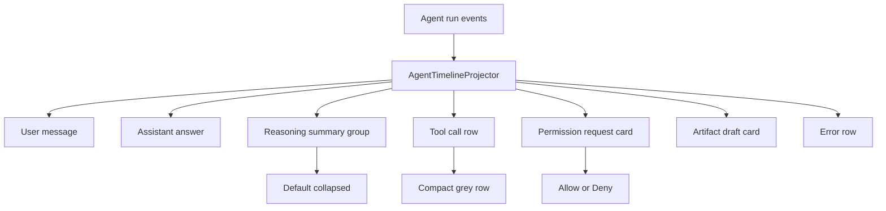
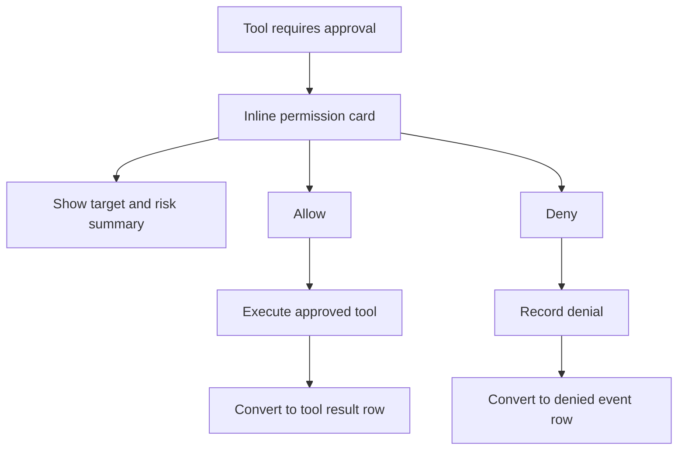
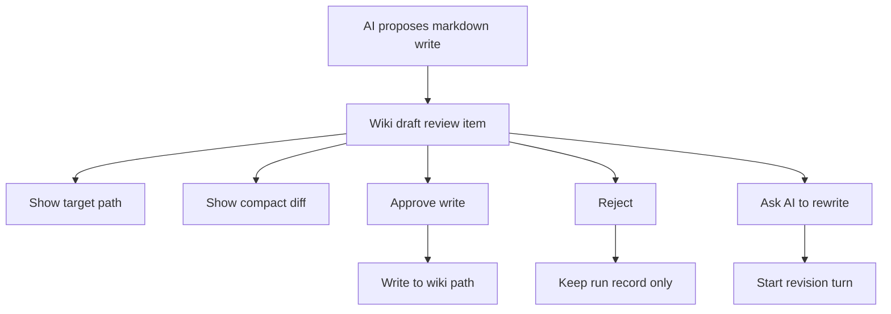

# 任务书 43.6：AI Lab 对话体验、推理时间线与权限审核

更新时间：2026-05-08
状态：Completed
优先级：S1 / Roadmap Stage 1.5
承接：P38 已建立 Draft Inbox / Permission Dock / artifact 审核闭环；P43 已把 AI Lab 放入顶层导航和 ProjectSpace；P43.5 规划全局 AI 侧栏与上下文注入。P43.6 聚焦 AI Lab 内部对话体验、reasoning/tool timeline、权限审核和 Plan/Agent 权限边界。

P43.5 完成承接：Shell 右栏、全局 AI 侧栏、AI Lab thread 左栏、ToolbarPolicy、Projects tree、preferences schema 3、debug events 已实现并通过 SwiftPM core runner 与 Xcode app build。P43.6 可以直接复用 `AgentPanelView`、`AgentThreadSidebarView`、`WorkspaceContextSnapshot` 与全局 AI side panel 外壳，不需要重做 Shell routing。

---

## 1. 背景

当前 AI Lab 已经有比较完整的运行时基础：

```text
Sci-Station/Agent/AgentModels.swift                 # AgentThread / AgentInteractionMode / AgentLoopPolicy
Sci-Station/Agent/AgentThreadRepository.swift       # threads.jsonl
Sci-Station/UI/AILabWorkspaceView.swift             # 主 UI、timeline、composer、permission dock
Sci-Station/Agent/AgentRuntimeSummaries.swift       # timeline projection / permission dock item
Sci-Station/Agent/AgentLoopRunner.swift             # tool approval / reasoning / loop state
Sci-Station/Agent/AgentBuiltInTools.swift           # write_markdown_plan / write_wiki_markdown 等工具
Sci-Station/Agent/AgentRunDirectoryStore.swift      # .sci-station/agent/runs/<runID>/
Sci-Station/LLM/OpenAICompatibleProvider.swift      # reasoning_content 解析
```

但用户看到的体验仍偏粗糙：

1. `conversation / plan / assistant` 三种模式不易理解。用户希望 chat 和 Plan 合并成一个 `Plan`，并清楚看到 `Plan` 与 `Agent` 的权限差异。
2. 思考过程缺少成熟 AI 平台式展示：应该默认折叠，展开后按时间顺序显示 reasoning summary，而不是大块原始输出或简单占位。
3. 工具调用应该压缩展示为灰色、低噪声、可展开的事件行，并保持时间顺序。
4. Permission review 不应占据大块粗糙 UI。对话框内有限高度即可审核，默认只给 `Allow` / `Deny` 两个主选项。
5. AI 写入的 Markdown / Wiki / artifact 路径需要更可见、可审核、可撤回。用户反馈“AI 写的保存文档丢失”，说明输出路径和审核状态没有被 UI 充分表达。
6. 当前 timeline 可能只投影尾部事件，长会话回看不足。

---

## 2. 本轮目标

1. 统一用户可见模式：`Plan` 与 `Agent` 两个主模式。
2. 明确权限差异：`Plan` 默认只读 + 生成草稿；`Agent` 可请求写入/执行工具，但所有写动作仍需审核。
3. 重做 AI 对话时间线：用户消息、AI 回答、推理摘要、工具调用、权限请求、artifact 写入、错误都走统一事件组件。
4. 推理过程默认折叠；工具调用按时间顺序压缩显示，支持展开查看摘要。
5. Permission review 简化为 `Allow` / `Deny`，高级详情折叠。
6. AI 写入文档默认进入 Wiki Draft Review，显示目标路径、diff、来源 run、撤回/重写入口。
7. 长会话支持全量事件回看或分页加载，不再只依赖尾部 120 条 projection。

---

## 3. 非目标

```text
不改变底层 provider 协议，不要求暴露完整 chain-of-thought
不新增外部 LLM provider
不改变 P38 的 Permission Dock 安全边界
不实现 P47 graph-backed agent tools
不在本任务实现 PDF 选区问答（P43.7）
```

---

## 4. 产品语义

### 4.1 用户可见模式

```text
Plan
  用途：讨论、规划、阅读、总结、生成可审核草稿
  默认权限：read-only + draft write request
  自动执行：只读工具可自动；写入只能生成待审核草稿

Agent
  用途：执行明确任务、批量处理、调用工具、准备写入
  默认权限：读工具可自动；写工具、shell、外部副作用必须审核
  UI 强提示：Agent can request changes to your workspace
```

内部兼容：

```text
AgentInteractionMode.conversation -> UI 显示为 Plan
AgentInteractionMode.plan         -> 合并到 Plan 权限策略
AgentInteractionMode.assistant    -> UI 显示为 Agent
```

如果需要保留内部枚举，P43.6 只增加 UI adapter；后续迁移再清理 enum。

### 4.2 思考过程展示

不展示不可公开的完整 chain-of-thought。UI 显示的是：

1. `reasoningSummary`：模型或 runtime 生成的可展示摘要。
2. `step label`：Thinking / Reading / Searching / Editing / Reviewing / Done。
3. `tool call summary`：工具名、目标、耗时、结果摘要。
4. `permission reason`：为什么需要用户允许。

---

## 5. 流程图

### 5.1 对话事件投影



### 5.2 Permission Review



### 5.3 AI 写入 Wiki Draft Review



---

## 6. 实施任务

> 命名：AI Lab UI 组件集中在 `Sci-Station/UI/AI/` 或继续拆分 `AILabWorkspaceView.swift`；运行时 projection 集中在 `Sci-Station/Agent/AgentRuntimeSummaries.swift`。

- [x] [P43.6.1] `AgentVisibleMode`
  - 新增 UI 层枚举：`plan` / `agent`。
  - 映射现有 `AgentInteractionMode`，保持旧 runs 可读。
  - UI 顶部用两段式切换，并显示权限说明 badge。
  - `Plan` 默认不出现“会写入工作区”的暗示；`Agent` 明确提示所有写动作仍需批准。

- [x] [P43.6.2] `AgentTimelineEvent`
  - 新增统一展示模型：`message`、`reasoningGroup`、`toolCall`、`permissionRequest`、`artifactDraft`、`error`、`systemNotice`。
  - 从 `AgentSessionTimelineItem` 迁移或包一层 adapter。
  - 支持 runID、threadID、timestamp、status、collapsed state。

- [x] [P43.6.3] Reasoning group UI
  - 默认折叠，标题如 `Thought process` / `思考过程`。
  - 折叠状态显示 step count、工具 count、耗时。
  - 展开后按时间顺序显示 reasoning summary，不展示原始不可公开思维链。
  - 缺 reasoning 时显示轻量占位，不伪造内容。

- [x] [P43.6.4] Tool call compact row
  - 工具调用行默认单行：icon、tool name、target、duration、status。
  - 输出内容只显示摘要；完整 JSON / stdout 需要展开。
  - 失败工具显示错误分类和可重试建议。
  - Hook / MCP 事件默认折叠到 tool group 中，而不是完全隐藏。

- [x] [P43.6.5] Inline permission card
  - 替代粗糙的大块审批 UI。
  - 默认只显示 `Allow` / `Deny` 两个主按钮。
  - `Details` 折叠显示参数摘要、目标路径、diff preview、risk。
  - Allow 后该 card 转成 `toolCall(status: approved/executed)`；Deny 后转成 `permissionDenied`。

- [x] [P43.6.6] Wiki Draft Review
  - 对 `write_markdown_plan` / `write_wiki_markdown` 统一显示 draft card。
  - 默认目标：project context 存在时 `projects/<project-id>/wiki/...`，否则 global `wiki/...`。
  - UI 显示：target path、preview、diff、source papers/context、run id。
  - 操作：Approve Write、Reject、Ask AI to Rewrite、Open Draft Location。
  - 解决“AI 写的保存文档丢失”问题：任何生成内容在 UI 都能追踪到 run artifact 或 workspace draft。

- [x] [P43.6.7] Timeline pagination
  - 移除或绕开仅尾部 120 条的 UI 限制。
  - 支持 `Load earlier events`。
  - Thread 切换时保留滚动位置。
  - Run history 仍保留摘要，但当前 thread timeline 能完整回看。

- [x] [P43.6.8] Permission 与工具策略校验
  - 修复 Plan 模式工具集交集为空导致“哑火”的风险。
  - 如果用户禁用了 plan 必需工具，UI 明确提示并提供启用入口。
  - `effectiveAgentAllowedToolNames` 为空时禁止启动并显示原因。

- [x] [P43.6.9] 视觉与可访问性
  - 工具调用、reasoning、permission 使用低饱和灰色辅助样式。
  - Allow / Deny 支持键盘操作。
  - 审批 card 有明确 focus ring 和 VoiceOver label。
  - 中英文文案走统一 localization 入口，为 P43.8 全量汉化预留。

---

## 7. 数据模型草案

```swift
enum AgentVisibleMode: String, Codable, Sendable {
    case plan
    case agent
}

struct AgentTimelineEvent: Identifiable, Codable, Sendable {
    enum Kind: String, Codable, Sendable {
        case userMessage
        case assistantMessage
        case reasoningGroup
        case toolCall
        case permissionRequest
        case artifactDraft
        case error
        case systemNotice
    }

    var id: String
    var runID: String
    var threadID: String?
    var kind: Kind
    var timestamp: Date
    var title: String
    var summary: String
    var status: AgentTimelineStatus
    var targetPaths: [String]
    var isCollapsedByDefault: Bool
}

struct AgentDraftReviewItem: Identifiable, Codable, Sendable {
    var id: String
    var runID: String
    var toolCallID: String
    var targetPath: String
    var markdownPreview: String
    var diffPreview: String
    var sourceContextSummary: String
    var status: DraftReviewStatus
}
```

---

## 8. Debug 与审计事件

| event | payload 字段 | 触发点 |
|---|---|---|
| `ai.mode.change` | `from, to, thread_id_present` | 用户切换 Plan / Agent |
| `ai.timeline.project` | `run_id, event_count, hidden_count` | timeline projection |
| `ai.reasoning.toggle` | `run_id, expanded` | 展开/折叠思考过程 |
| `ai.tool_row.toggle` | `tool_name, expanded` | 展开工具详情 |
| `ai.permission.inline_decision` | `tool_name, decision, risk` | Allow / Deny |
| `ai.draft_review.created` | `run_id, target_path_kind` | 生成可审核 draft |
| `ai.draft_review.approved` | `target_path_kind` | 用户同意写入 |
| `ai.draft_review.rewrite_requested` | `reason_present` | 用户要求重写 |

脱敏：debug event 不记录 prompt 全文、markdown 全文、工具输出全文；只记录摘要长度、路径 kind、tool name、状态。

---

## 9. 自动化测试

新增或扩展 `Tools/SciStationCoreTestRunner/main.swift`：

```text
agentVisibleModeMapsConversationAndPlanToPlan
agentVisibleModeMapsAssistantToAgent
planModeRequiresReadableToolSet
agentTimelineProjectionKeepsChronologicalOrder
agentTimelineProjectionGroupsReasoningEvents
toolCallRowsAreCollapsedByDefault
permissionRequestShowsAllowDenyOnlyByDefault
draftReviewDefaultsToProjectWikiWhenProjectContextExists
draftReviewFallsBackToGlobalWikiWithoutProject
timelinePaginationCanLoadEarlierEvents
```

Python sidecar 可增加：

```text
pending_approval_payload_maps_to_inline_permission_card
workflow_artifact_path_is_reported_to_swift_host
```

---

## 10. 手动测试计划

新增 `docs/development/manual-tests/MT15_AILabConversationUX.md`。

| ID | 标题 | 期望 |
|---|---|---|
| MT15-P43.6-01 | Plan 模式问答 | UI 显示 Plan 权限说明；不会直接写工作区 |
| MT15-P43.6-02 | Agent 模式请求写 Wiki | 出现 inline permission card，默认只有 Allow / Deny |
| MT15-P43.6-03 | 展开思考过程 | 看到 reasoning summary 和工具步骤，不显示原始大段 JSON |
| MT15-P43.6-04 | 工具调用失败 | 单行错误摘要可展开，给出可理解原因 |
| MT15-P43.6-05 | 允许写入 | permission card 转为 tool result row，draft card 显示目标路径 |
| MT15-P43.6-06 | 拒绝写入 | 记录 denial，AI 后续回答知道用户拒绝 |
| MT15-P43.6-07 | 要求重写 draft | 新开 revision turn，旧 draft 保留审计记录 |
| MT15-P43.6-08 | 长会话回看 | 能加载更早事件，不丢失 thread history |

---

## 11. 验收标准

1. 用户可见只剩 `Plan` / `Agent` 两个主模式，并能清楚看到权限差异。
2. Reasoning 默认折叠，展开后按时间顺序显示可公开摘要。
3. Tool call 默认压缩成低噪声事件行，展开后能看输入/输出摘要。
4. Permission review 默认只显示 `Allow` / `Deny` 两个主按钮。
5. AI 写入 Markdown / Wiki 的目标路径、diff、run 来源在 UI 中可追踪。
6. Plan 模式工具集为空时有明确提示，不会静默失败。
7. 长会话能加载早期事件。
8. Debug / audit event 完整且脱敏。
9. `swift run SciStationCoreTestRunner`、`python -m pytest AgentRuntime/tests`、`xcodebuild -project Sci-Station.xcodeproj -scheme Sci-Station -destination 'platform=macOS' build` 通过。

---

## 12. 风险与后续

1. reasoning_content 与可展示 reasoning summary 不是同一概念。任务书必须避免要求展示完整私密思维链。
2. Swift host 与 Python sidecar 都有 pending approval 语义，需要统一 UI 映射但不强行合并存储。
3. 旧 run / old timeline event 需要可读。P43.6 应通过 adapter 兼容旧事件。
4. P43.5 的全局 AI 侧栏会复用 P43.6 的 event UI；实现顺序上应先稳定 `AgentTimelineEvent` 组件。

---

## 13. 本轮完成记录

完成时间：2026-05-08

### 13.1 输出不完整修复

修复 P43.5 后 AI 输出看似不完整的主要根因：`AgentVisibleResponseExtractor` 在结构化 JSON 未闭合、key 不匹配或流式中断时不再返回空字符串，而是优先恢复 `final_response_draft` / `response` / `content` / `summary` 等用户可见字段，最后保留有用文本 fallback。停止或失败时 partial assistant response 继续写入 failed/cancelled run。

### 13.2 P43.6 实施摘要

1. 新增 `AgentVisibleMode`，UI 只暴露 `Plan` / `Agent`；旧 `conversation` 与 `plan` 映射为 Plan，`assistant` 映射为 Agent。
2. 新增 `AgentTimelineEvent` / `AgentTimelineStatus` / `AgentDraftReviewItem` adapter，旧 session events 与 legacy runs 继续可读。
3. AI Lab timeline 改为统一事件组件：message、reasoning group、compact tool row、permission request、artifact draft、error/system notice。
4. Reasoning 与 tool details 默认折叠；工具输出、JSON、draft payload 只在展开时显示。
5. Permission review 默认主操作为 `Allow` / `Deny`，Details 内显示参数、路径、diff preview、rewrite/draft 操作。
6. `write_markdown_plan` / `write_wiki_markdown` 的路径与 diff 在 draft review 中可见；sidecar artifact draft 事件独立映射为 `artifactDraft`。
7. Session events 支持全量加载；AI Lab 增加 `加载更早事件` 分页入口，绕开尾部 120 条限制。
8. 当当前 Plan/Agent 模式没有可用工具或 Plan 缺少只读工具时，发送前阻止并显示原因，避免静默失败。
9. 新增 MT15 手动测试协议：`docs/development/manual-tests/MT15_AILabConversationUX.md`。

### 13.3 验证结果

```text
swift run SciStationCoreTestRunner
结果：通过

python -m pytest AgentRuntime/tests
结果：28 passed

xcodebuild -project Sci-Station.xcodeproj -scheme Sci-Station -destination 'platform=macOS' build
结果：BUILD SUCCEEDED
```

### 13.4 下一轮

下一轮任务书：`docs/development/Proposal43.7.md`。重点转向 PDF 标注、paper.md 首次打开修复、Wiki 文件管理、Markdown 编辑器增强，以及 PDF/Wiki 选区进入 P43.6 draft review 的上下文链路。
