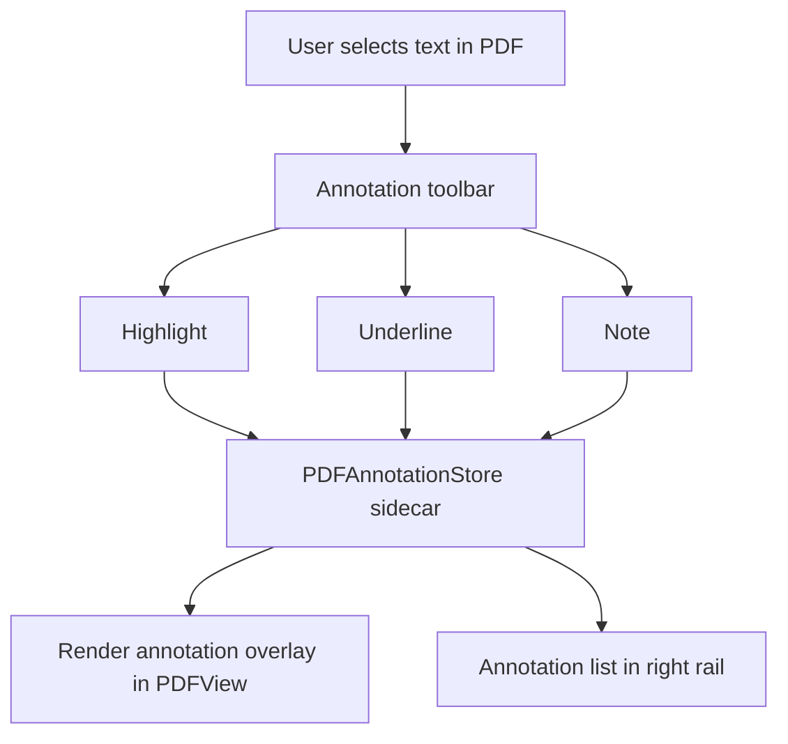
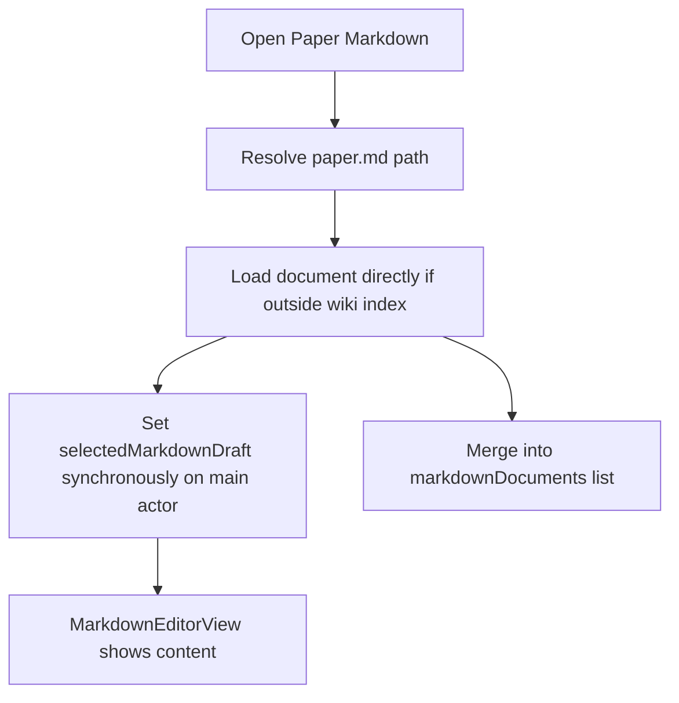
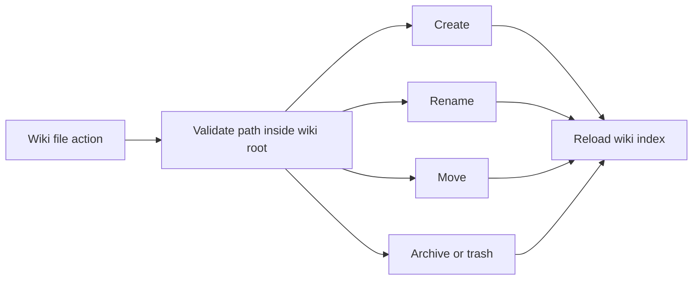
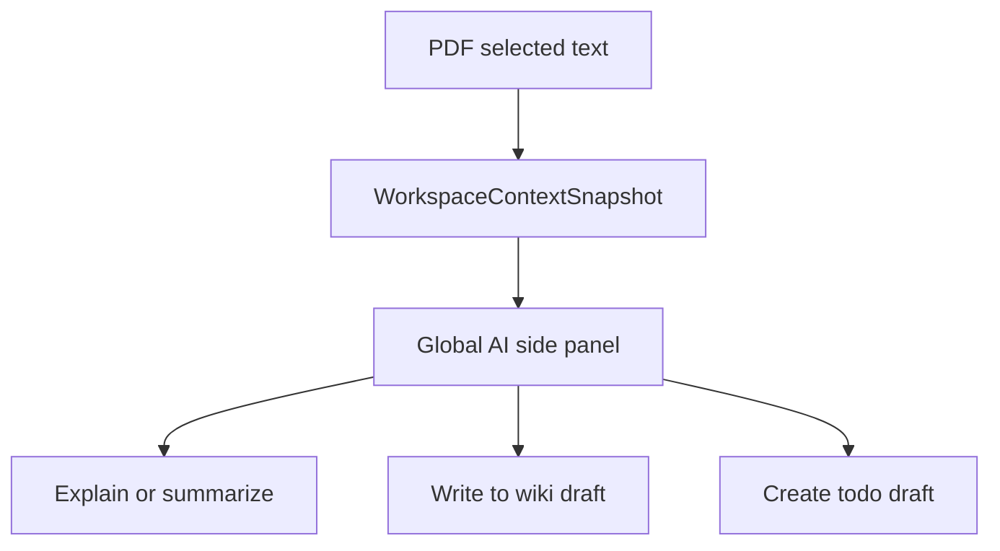

# 任务书 43.7：PDF 标注、论文 Markdown 修复与 Wiki 编辑增强

更新时间：2026-05-08
状态：Implemented / validation passed
优先级：S1 / Roadmap Stage 1.5
承接：P43 已把论文、Wiki、PDF Reader 放入 ProjectSpace / 顶层路由；P43.5 已完成全局 AI 侧栏和右栏；P43.6 已完成 Plan/Agent 模式、统一 timeline、inline permission review、draft review 和长会话回看。P43.7 聚焦科研阅读与写作的核心体验：PDF 标注、paper.md 打开、Wiki 文件管理和 Markdown 编辑能力。

P43.6 完成承接：AI 写入 Wiki / Markdown 已经走 draft review 与 Allow/Deny 审核；P43.7 的 PDF 选区问答、Wiki 写入和 todo draft 必须复用 P43.6 的 draft review，不新增绕过审批的写入路径。

---

## 1. 背景

当前 PDF Reader 与 Wiki 已经能支撑基础阅读和写作，但缺少成熟科研工作站需要的几项关键能力：

1. `EmbeddedPDFReaderView.swift` 基于 PDFKit 显示 PDF、搜索、翻页、缩放，但没有使用 `PDFAnnotation` / selection annotation API；当前侧栏“Notes”是独立文本笔记，不是 PDF 上的高亮/下划线/批注。
2. 用户点击论文 Markdown 时，可能首次显示空白，点击 reload 后才出现。现状中 `MarkdownRepository.loadDocuments` 默认只扫描 wiki 目录，`paper.md` 依赖 `AppViewModel.openMarkdownDocument` 异步补入 selection，容易出现 UI draft 未同步。
3. Wiki 支持 Markdown 编辑、预览、保存和 backlinks，但缺应用内文件管理：新建、重命名、移动、删除文件主要依赖 Finder。
4. Markdown 编辑器仍偏基础，缺少常用编辑动作、明确保存状态和稳定的预览刷新。
5. 论文阅读时 AI 侧栏应理解当前 paper、PDF 页码、选中文本和对应 `paper.md` 路径，支持解释、总结、写入 wiki draft、创建 todo。

关键实现位置：

```text
Sci-Station/PDF/EmbeddedPDFReaderView.swift
Sci-Station/PDF/PDFReaderViewModel.swift
Sci-Station/Library/PaperAnnotationsRepository.swift
Sci-Station/Markdown/MarkdownRepository.swift
Sci-Station/UI/WikiViews.swift
Sci-Station/UI/MarkdownEditorView.swift
Sci-Station/UI/MarkdownPageListView.swift
Sci-Station/App/AppViewModel.swift
Sci-Station/UI/LibraryViews.swift
```

---

## 2. 本轮目标

1. PDF Reader 支持原生 PDFKit 标注：highlight、underline、note。
2. 标注有默认快捷键、toolbar 入口、右栏列表，并能跳转到对应页。
3. PDF 原生标注与现有 `annotations.md` 侧栏笔记共存，明确区分“PDF 标注”和“论文笔记”。
4. 修复论文 `paper.md` 首次打开空白问题，保证打开动作同步选中可编辑 draft。
5. Wiki 增强为应用内文件管理器：新建、重命名、移动、删除 Markdown/文本文件。
6. Markdown 编辑器补齐常用写作能力和未保存状态。
7. 阅读论文时，AI 侧栏可获取当前 page / selected text / paper.md path 的上下文摘要。

---

## 3. 非目标

```text
不实现协同编辑
不引入第三方 PDF 标注库
不做 OCR / PDF 转 Markdown（已有或后续 MinerU pipeline 处理）
不做全量 Zotero 双向同步
不实现复杂 Markdown block editor；仍以 TextEditor + preview 为主
```

---

## 4. 数据与存储原则

1. PDF 原生标注优先写入 PDF 文件或旁路 annotation sidecar，不能无提示破坏原 PDF。
2. 默认建议 sidecar 存储，必要时提供“写回 PDF”显式动作。
3. 论文笔记继续使用 `annotations.md` 或现有 repository，不与 PDF annotation 混写。
4. Wiki 文件管理必须限制在 workspace root 内，禁止路径穿越。
5. 删除 Wiki 文件默认移入 trash/archive，而不是直接不可逆删除。

推荐新增布局：

```text
library/papers/<paper-id>/
  paper.pdf
  paper.md
  annotations.md                 # 现有论文笔记
  pdf_annotations.json           # P43.7 sidecar
  figures/

projects/<project-id>/wiki/
  ...

wiki/
  ...
```

---

## 5. 流程图

### 5.1 PDF 标注



### 5.2 paper.md 打开修复



### 5.3 Wiki 文件管理



### 5.4 PDF 选区进入 AI 侧栏



---

## 6. 实施任务

> 命名：PDF 标注集中在 `Sci-Station/PDF/Annotations/`；Wiki 文件管理集中在 `Sci-Station/Markdown/` 与 `Sci-Station/UI/Wiki/`。

- [x] [P43.7.1] `PDFAnnotationStore`
  - 新增 sidecar store：读写 `pdf_annotations.json`。
  - 数据包含 annotation id、paper id、page index、type、bounds、selected text preview、color、note text、created/updated time。
  - 支持 migrate：没有 sidecar 时返回空列表。
  - 所有写入限制在 paper folder 内。

- [x] [P43.7.2] PDFKit selection 标注
  - 在 `EmbeddedPDFReaderView` 中捕捉当前 selection。
  - 支持 highlight、underline、note 三类 annotation。
  - 快捷键建议：
    - `⌘⇧H` highlight
    - `⌘⇧U` underline
    - `⌘⇧N` note
  - 无 selection 时禁用 highlight / underline。

- [x] [P43.7.3] PDF annotation right rail
  - 右栏显示当前 paper 的 annotation list。
  - 支持按页排序、搜索、点击跳转、编辑 note、删除 annotation。
  - 与 `annotations.md` 分为两个 tab：`PDF Marks` / `Paper Notes`。
  - 删除 annotation 需要确认或可 undo。

- [x] [P43.7.4] PDF annotation 渲染
  - PDF 加载时从 sidecar 恢复 annotation overlay。
  - 翻页、缩放、搜索后 overlay 保持正确位置。
  - 若 sidecar bounds 与 PDF page 不匹配，标记为 stale，不 crash。

- [x] [P43.7.5] `paper.md` 直接加载路径
  - 修复 `AppViewModel.openMarkdownDocument`：当 path 不在 `markdownDocuments` 中时，直接从磁盘读取并设置 `selectedMarkdownDraft`。
  - `MarkdownRepository` 提供 `loadDocument(relativePath:)` 或 `loadExternalMarkdown(relativePath:)`。
  - `paper.md` 合并进当前 documents list，但不污染 wiki root 扫描语义。
  - Reload 不再是显示内容的必要步骤。

- [x] [P43.7.6] Wiki file operations
  - `MarkdownRepository` 增加 create / rename / move / archive/delete。
  - 允许文件类型：`.md`、`.markdown`、`.txt`；默认新建 `.md`。
  - 支持 project wiki 与 global wiki。
  - 所有 path 标准化，禁止 `..`、绝对路径、跨 workspace root。

- [x] [P43.7.7] Wiki file manager UI
  - `MarkdownPageListView` 增加 New Page、New Folder、Rename、Move、Archive/Delete。
  - 支持右键菜单和 toolbar。
  - 操作后保持 selection；重命名当前页后 editor 继续显示新路径。
  - 删除当前页后选择最近邻页或显示 empty state。

- [x] [P43.7.8] Markdown editor improvements
  - 明确 Unsaved / Saved / Saving / Error 状态。
  - 支持常用插入：heading、bold、italic、code block、link、wikilink、task checkbox、table skeleton。
  - Preview 刷新与 source draft 同步，避免旧预览。
  - Frontmatter 折叠显示；无 frontmatter 时提供 Add Frontmatter。

- [x] [P43.7.9] PDF / Wiki AI context
  - P43.5 的 `WorkspaceContextSnapshot` 增加 PDF selection、page index、paper.md path。
  - AI 侧栏显示 `Selected text from page N`。
  - 写入 wiki / todo 仍走 P43.6 draft review，不直接写。

- [x] [P43.7.10] Debug event
  - `pdf.annotation.create`
  - `pdf.annotation.update`
  - `pdf.annotation.delete`
  - `paper_markdown.open_direct`
  - `wiki.file.create`
  - `wiki.file.rename`
  - `wiki.file.archive`
  - `markdown.editor.save_state`

---

## 7. 数据模型草案

```swift
struct PDFAnnotationRecord: Identifiable, Codable, Hashable, Sendable {
    enum Kind: String, Codable, Sendable {
        case highlight
        case underline
        case note
    }

    var id: String
    var paperID: String
    var pageIndex: Int
    var kind: Kind
    var bounds: [PDFAnnotationBounds]
    var selectedTextPreview: String
    var noteText: String?
    var colorHex: String
    var createdAt: Date
    var updatedAt: Date
}

struct PDFAnnotationBounds: Codable, Hashable, Sendable {
    var pageIndex: Int
    var x: Double
    var y: Double
    var width: Double
    var height: Double
}

enum MarkdownSaveState: String, Codable, Sendable {
    case clean
    case dirty
    case saving
    case failed
}
```

---

## 8. 自动化测试

新增或扩展 `Tools/SciStationCoreTestRunner/main.swift`：

```text
pdfAnnotationStoreRoundTripsSidecar
pdfAnnotationStoreRejectsPathTraversal
pdfAnnotationStoreHandlesMissingSidecar
paperMarkdownDirectLoadSelectsDraftWithoutReload
paperMarkdownDirectLoadMergesIntoDocumentList
markdownRepositoryCreatesPageInsideWikiRoot
markdownRepositoryRejectsAbsolutePath
markdownRepositoryRenamesSelectedPage
markdownRepositoryArchivesPageInsteadOfHardDelete
markdownSaveStateTransitionsDirtySavingClean
```

---

## 9. 手动测试计划

新增 `docs/development/manual-tests/MT16_PDFWikiEditing.md`。

| ID | 标题 | 期望 |
|---|---|---|
| MT16-P43.7-01 | PDF 选择文本高亮 | 高亮出现，重开 paper 后仍存在 |
| MT16-P43.7-02 | PDF 下划线 | 下划线随 zoom/page navigation 正确渲染 |
| MT16-P43.7-03 | PDF note | 右栏可编辑 note，点击跳回页码 |
| MT16-P43.7-04 | 删除标注 | 标注从 PDF overlay 和列表消失，有确认或 undo |
| MT16-P43.7-05 | 打开 paper.md | 首次点击即显示内容，不需要 Reload |
| MT16-P43.7-06 | 新建 Wiki 页 | 文件出现在列表，editor 进入可编辑状态 |
| MT16-P43.7-07 | 重命名当前 Wiki 页 | 路径更新，内容不丢失，backlinks 可重建 |
| MT16-P43.7-08 | 删除当前 Wiki 页 | 进入 archive/trash，selection 安全回退 |
| MT16-P43.7-09 | Markdown toolbar | 插入 heading/link/code block 后 preview 正确刷新 |
| MT16-P43.7-10 | PDF 选区问 AI | AI 侧栏知道 page 和 selected text preview |

---

## 10. 验收标准

1. PDF Reader 支持 highlight、underline、note，且重启后可恢复。
2. PDF annotation 与 `annotations.md` 论文笔记在 UI 和存储上清楚区分。
3. 论文 `paper.md` 首次打开稳定显示内容，不需要 reload。
4. Wiki 支持新建、重命名、移动、归档/删除文件。
5. Markdown 编辑器有明确保存状态和基础编辑动作。
6. PDF / Wiki AI context 能把当前 selection 摘要传给 AI 侧栏。
7. 所有文件操作限制在 workspace root，路径穿越被测试覆盖。
8. `swift run SciStationCoreTestRunner` 与 `xcodebuild -project Sci-Station.xcodeproj -scheme Sci-Station -destination 'platform=macOS' build` 通过。

---

## 10.1 实施记录

完成日期：2026-05-08

本轮采用以下默认决策：

1. PDF 标注默认 sidecar-only，写入 `pdf_annotations.json`，不写回原 PDF。
2. Wiki 归档统一进入 `.sci-station/trash/wiki/`，保留恢复路径。
3. PDF 选区 AI context 默认使用 800 字符 preview。
4. `paper.md` 可临时并入当前 `markdownDocuments`，但不改变 Wiki root 扫描语义。
5. AI 写入 Wiki / todo 仍通过现有 Agent draft / approval 流程，不新增直接写入路径。

验证结果：

1. `swift run SciStationCoreTestRunner` 通过。
2. `xcodebuild -project Sci-Station.xcodeproj -scheme Sci-Station -destination 'platform=macOS' build` 通过。
3. VS Code Problems 对本轮主要 Swift 文件检查无错误。

---

## 11. 风险与后续

1. PDFKit annotation 坐标与缩放/旋转有关，需要重点测试不同 PDF 页面尺寸。
2. 写回原 PDF 有破坏原文件风险。P43.7 默认 sidecar；写回 PDF 放后续显式功能。
3. `paper.md` 不属于 wiki tree，但需要在 editor 打开。实现时要避免把所有 paper markdown 混入普通 wiki 列表。
4. Markdown 文件删除必须可恢复，不能直接 hard delete。
5. AI 侧栏读取选中文本时应限制长度，避免把整页 PDF 内容塞进 prompt。

---

## 12. Questions

1. PDF 标注默认存储是否确认采用 sidecar-only（`pdf_annotations.json`），把“写回原 PDF”延后为显式高级动作？
2. Wiki 删除/归档的默认位置是否统一为 `.sci-station/trash/wiki/`，还是放在各 project 的 `archive/` 下以便项目内自包含？
3. Markdown 编辑器本轮优先做 toolbar 插入动作，还是优先做保存状态与 preview 同步稳定性？建议先稳定保存状态，再加编辑动作。
4. PDF 选区注入 AI context 的默认长度是否采用 800 字符 preview，并在需要全文时由只读工具再按权限读取？
5. `paper.md` 打开修复是否允许把当前 paper markdown 临时并入 `markdownDocuments` 列表但不显示在普通 Wiki tree 中？
