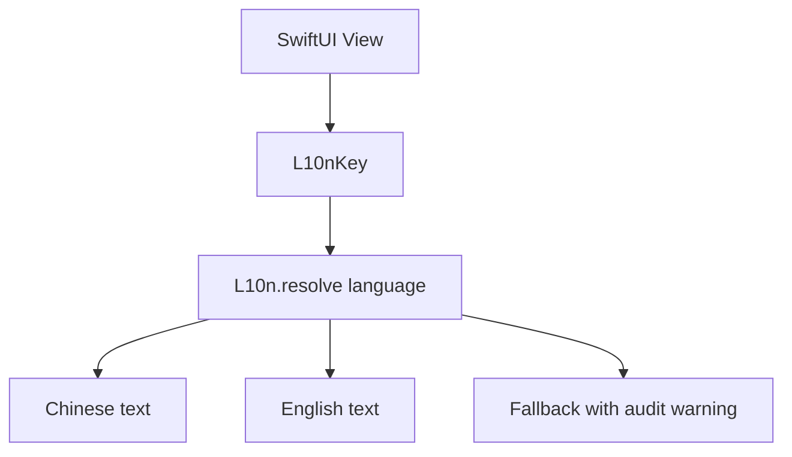
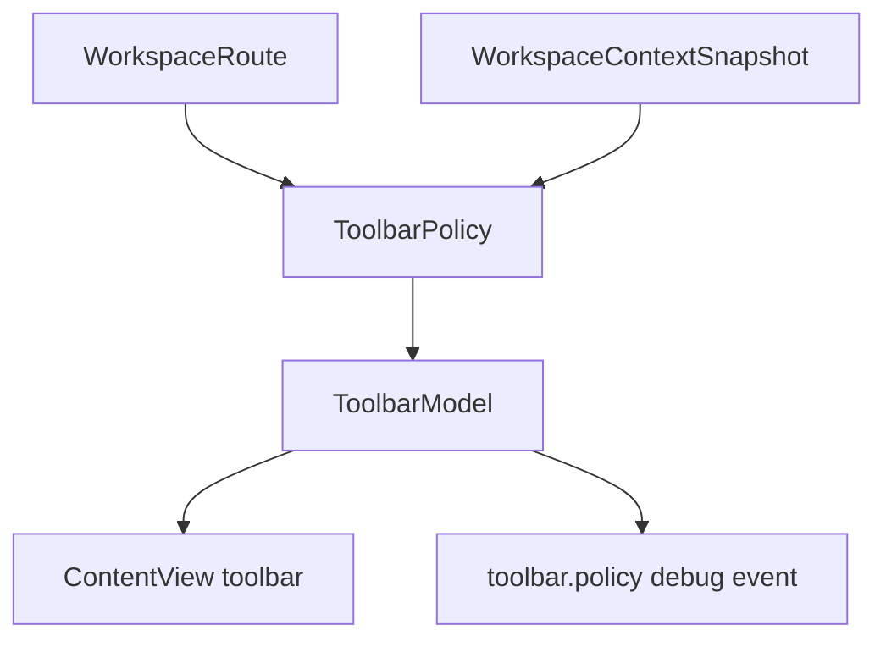
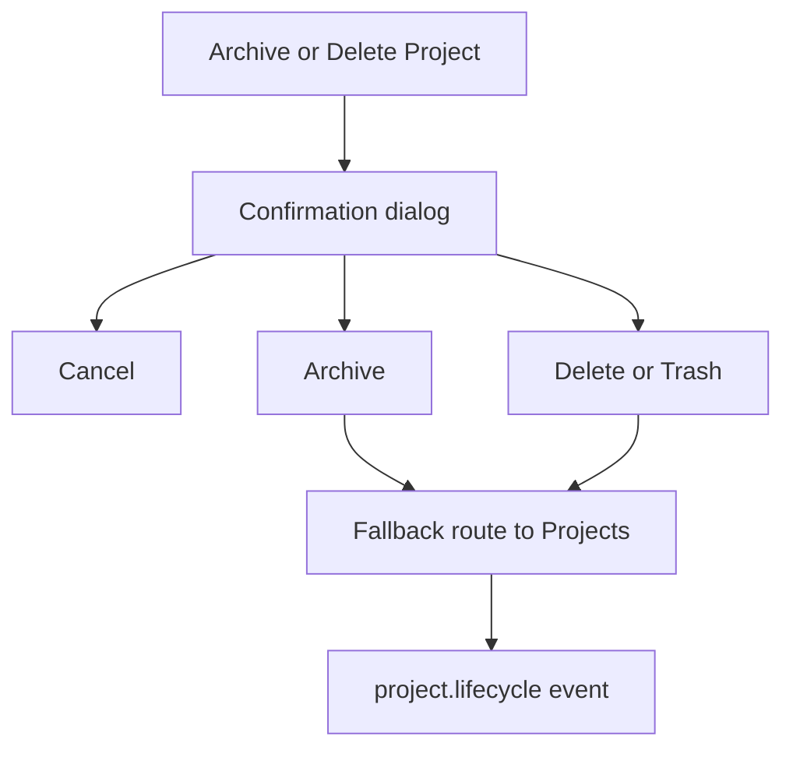

# 任务书 43.8：全量本地化、项目管理与 Toolbar 归属

更新时间：2026-05-08
状态：Completed / scoped handoff to P43.9
优先级：S1 / Roadmap Stage 1.5
承接：P43 已完成主导航收敛；P43.5 规划 Shell 右栏、AI 侧栏、项目树与 toolbar policy；P43.6 已完成 AI draft review / timeline / permission；P43.7 已完成 PDF sidecar 标注、paper.md 直开、Wiki 文件操作、Markdown 编辑器基础增强和 PDF 选区 AI context。P43.8 聚焦跨模块一致性：语言系统、中文补全、项目管理动作和按钮归属。

---

## 0. P43.7 Handoff

已验证状态：

1. PDF 标注采用 sidecar-only：`pdf_annotations.json`。
2. PDF Reader 支持 highlight / underline / note、右栏 PDF Marks、跳转、编辑 note、删除确认和 overlay 恢复。
3. `paper.md` 支持直接加载并并入当前 editor documents，不改变 Wiki root 扫描语义。
4. Wiki 文件操作已支持 create / rename / move / archive，归档进入 `.sci-station/trash/wiki/`。
5. Markdown editor 已有 Saved / Unsaved / Saving / Error 状态、基础格式插入和 frontmatter 折叠展示。
6. AI context 已包含 PDF page、selected text preview、paper.md path；写入类动作仍不绕过 draft review。

本轮验证：

1. `swift run SciStationCoreTestRunner` 通过。
2. `xcodebuild -project Sci-Station.xcodeproj -scheme Sci-Station -destination 'platform=macOS' build` 通过。
3. VS Code Problems 对本轮主要 Swift 文件无错误。

P43.8 需要继承的风险：

1. P43.7 新增文案多为英文硬编码，需纳入本地化 catalog。
2. PDF annotation / Wiki file manager 的 toolbar 归属已初步启用，但仍需按 P43.8 `ToolbarPolicy` 集中化。
3. 中文文案会暴露 PDF/Wiki/AI 右栏的紧凑布局问题，应把高风险布局问题登记给 P43.9 bug bash。

---

## 1. 背景

Sci-Station 当前已有局部语言切换能力：

```text
Sci-Station/App/AppViewModel.swift
  usesEnglishInterface
  localized(_ zh: String, _ en: String)

Sci-Station/UI/Home/HomePanels.swift
Sci-Station/UI/Home/ProjectDashboardPanel.swift
  部分 Home 文案已使用 appModel.localized(...)
```

但整体仍不是完整的本地化系统：

1. Wiki / Markdown editor / PDF Reader / AI Lab / Settings / 菜单栏仍有大量硬编码英文。
2. 用户选择中文后，按钮、空态、错误、Inspector、权限审核、工具调用等仍会混合英文和中文。
3. Project 管理能力分散，侧栏缺少折叠项目列表、删除/归档、最近项目等入口。
4. 顶部按钮归属不清，论文导入类按钮会干扰 Home / Calendar / AI Lab 等页面。
5. P43.5 的 toolbar policy 需要在全应用落地为统一规则，而不是各 view 临时判断。

关键实现位置：

```text
Sci-Station/App/AppViewModel.swift
Sci-Station/ContentView.swift
Sci-Station/Sci_StationApp.swift
Sci-Station/UI/MainShellViews.swift
Sci-Station/UI/Shell/TopSidebarView.swift
Sci-Station/UI/Shell/ProjectSpaceContainer.swift
Sci-Station/UI/LibraryViews.swift
Sci-Station/UI/WikiViews.swift
Sci-Station/UI/MarkdownEditorView.swift
Sci-Station/PDF/EmbeddedPDFReaderView.swift
Sci-Station/UI/AILabWorkspaceView.swift
Sci-Station/UI/SettingsViews.swift
```

---

## 2. 本轮目标

1. 建立统一 localization key 体系，取代散落的 `localized(zh,en)` 临时调用。
2. 全面补齐中文文案，覆盖主导航、Home、ProjectSpace、Library、PDF、Wiki、Markdown editor、AI Lab、Settings、菜单栏、错误与空态。
3. 引入 localization audit，防止新增硬编码英文。
4. 完善 Project 管理：侧栏项目树、搜索、最近项目、归档、删除确认、删除后 route 回退。
5. 将 toolbar policy 从 P43.5 计划落地为全应用规则：每个 route 只显示该 route 相关动作。
6. 统一 destructive action 的确认、文案和审计事件。

---

## 3. 非目标

```text
不引入多语言翻译服务
不要求所有用户生成内容翻译
不改变 workspace 文件名语言
不实现团队/权限管理
不做完整设计系统重皮肤（P43.9 统一 polish）
```

---

## 4. Localization 策略

### 4.1 推荐方向

优先采用 Swift String Catalog 或集中 key registry：

```text
Sci-Station/Resources/Localizable.xcstrings
Sci-Station/Localization/LocalizationKey.swift
Sci-Station/Localization/LocalizationCatalog.swift
```

如果 Xcode / target 集成成本过高，可先建立代码级 catalog：

```swift
enum L10nKey: String, Codable, Sendable {
    case sidebarHome
    case sidebarProjects
    case toolbarImportPDF
    case aiPermissionAllow
    case wikiNewPage
}

struct L10n {
    static func text(_ key: L10nKey, language: AppLanguage) -> String
}
```

### 4.2 文案原则

1. 中文界面默认使用简洁中文，不夹杂 `Import PDF` / `Reload` / `Inspector` 等英文，除非是品牌或文件类型。
2. 工具调用名可以保留 monospace 英文，但用户说明必须中文。
3. 危险动作文案必须包含影响范围，如“归档项目”与“删除本地文件”区分。
4. 空态要告诉用户下一步操作，不只显示“Empty”。
5. 中英文长度差异需要 UI 测试，避免按钮截断。

---

## 5. Toolbar Policy

### 5.1 动作分层

```text
Global actions
  Workspace menu
  Toggle AI side panel
  Toggle right rail
  Refresh current view

Library / Papers actions
  Import PDF
  Add by Identifier
  Manage folders/tags
  Column options

PDF Reader actions
  Page navigation
  Search
  Zoom
  Highlight / Underline / Note

Wiki actions
  New Page
  New Folder
  Save
  Preview mode
  Rename / Move / Archive

Project actions
  New Project
  Edit Project
  Archive Project
  Delete Project
```

### 5.2 禁止项

```text
Home 不显示 Import PDF / Add by Identifier
Calendar 不显示 Import PDF / Add by Identifier
AI Lab 不显示 Import PDF / Add by Identifier
Settings 不显示 Import PDF / Add by Identifier
PDF Reader 不显示 Library table column actions
Wiki 不显示 PDF annotation actions
```

---

## 6. Project 管理模型

项目删除需要区分三种状态：

```text
Active
  正常显示在项目树、Home、ProjectSpace。

Archived
  默认隐藏；文件仍保留；可恢复。

Deleted / Trashed
  移入 workspace trash/archive 区，或调用系统 Trash。必须二次确认。
```

建议先实现 Archive 作为默认 destructive flow；物理删除可作为高级选项：

```text
projects/.archived/<project-id>/
或 .sci-station/trash/projects/<project-id>/
```

---

## 7. 流程图

### 7.1 Localization 解析



### 7.2 Toolbar 解析



### 7.3 Project 删除/归档



---

## 8. 实施任务

> 命名：Localization 集中在 `Sci-Station/Localization/`；Project lifecycle 集中在 `Sci-Station/Workspace/ProjectLifecycle/`；toolbar policy 集中在 `Sci-Station/UI/Shell/ToolbarPolicy.swift`。

- [x] [P43.8.1] Localization catalog
  - 新增 `AppLanguage` 与 `L10nKey`，兼容现有 `workspacePreferences.appLanguage`。
  - 提供 `appModel.t(.key)` 或 environment helper。
  - `AppViewModel.localized(_:_:)` 标记为 migration helper，不再用于新增 UI。

- [x] [P43.8.2] String inventory
  - 扫描 SwiftUI 文件中的硬编码英文文案。
  - 输出 `docs/development/localization/P43.8_string_inventory.md`。
  - 按模块标记状态：migrated / deferred / user-content / code-symbol。

- [x] [P43.8.3] Shell / Home / ProjectSpace 汉化
  - 顶层 sidebar、ProjectSpace tabs、Home panels、Inspector、空态、tooltip 全部走 key。
  - 保证 P43.5 新增的右栏、AI 侧栏、project tree 文案同步双语。

- [ ] [P43.8.4] Library / PDF 汉化（deferred）
  - Library table、metadata inspector、import dialogs、folder/tag 管理、PDF Reader toolbar、annotation 文案双语。
  - `PDF Marks` / `Paper Notes` 等 P43.7 文案纳入 catalog。

- [ ] [P43.8.5] Wiki / Markdown editor 汉化（deferred）
  - Source / Preview / Split / Save / Unsaved / New Page / Rename / Move / Archive / Frontmatter 等全部纳入 catalog。
  - Markdown 语法名可保留英文，但按钮说明中文。

- [ ] [P43.8.6] AI Lab 汉化（deferred）
  - Plan / Agent、permission review、Allow / Deny、tool call、reasoning、draft review、error recovery 双语。
  - 工具名保留英文 monospace，解释文案本地化。

- [x] [P43.8.7] Settings / menu bar 汉化
  - `Sci_StationApp.swift` 菜单、Settings tabs、AI provider 配置、workspace 设置全部双语。
  - 菜单项需符合 macOS 习惯，中文界面也保留必要快捷键。

- [x] [P43.8.8] `ToolbarPolicy` 落地
  - 从 `ContentView` 中移出散落的 toolbar 条件判断。
  - 为每个 top route / project tab 生成 `ToolbarModel`。
  - 页面动作在对应 view 或 toolbar overflow 中显示，不跨上下文污染。

- [x] [P43.8.9] Project lifecycle
  - 增加 `archiveProject`、`restoreProject`、`deleteProjectToTrash`。
  - UI 增加确认 dialog，显示影响范围。
  - 当前 project 被归档/删除后 route 回退。
  - Home / ProjectSpace / Project tree 过滤 archived project，提供 Show Archived。

- [x] [P43.8.10] Localization audit test
  - 新增测试或脚本检查新增 SwiftUI 文案是否未走 catalog。
  - 允许白名单：system image name、tool name、file extension、code snippet、debug event。

---

## 9. 自动化测试

新增或扩展 `Tools/SciStationCoreTestRunner/main.swift`：

```text
l10nCatalogResolvesChineseAndEnglish
l10nCatalogFallsBackWithAuditWarning
toolbarPolicyHidesLibraryActionsOnHome
toolbarPolicyShowsPDFActionsOnlyInPDFReader
toolbarPolicyShowsWikiActionsOnlyInWikiContext
projectArchiveHidesProjectFromActiveList
projectRestoreReturnsProjectToActiveList
projectDeleteMovesToTrashOrArchive
routeFallsBackWhenCurrentProjectArchived
workspacePreferencesLanguageRoundTrips
```

可选脚本：

```text
Tools/LocalizationAudit.swift
```

---

## 10. 手动测试计划

新增 `docs/development/manual-tests/MT17_LocalizationProjectToolbar.md`。

| ID | 标题 | 期望 |
|---|---|---|
| MT17-P43.8-01 | 切换中文 | 主导航、Home、ProjectSpace、Library、Wiki、PDF、AI Lab、Settings 基本文案为中文 |
| MT17-P43.8-02 | 切换英文 | 同一界面恢复英文，无布局错乱 |
| MT17-P43.8-03 | Home toolbar | 不显示论文导入按钮 |
| MT17-P43.8-04 | Library toolbar | 显示 Import PDF / Add by Identifier 或中文等价 |
| MT17-P43.8-05 | PDF toolbar | 显示页码、搜索、缩放、标注，不显示 Library column action |
| MT17-P43.8-06 | Wiki toolbar | 显示新建、保存、预览、文件管理，不显示 PDF 标注 |
| MT17-P43.8-07 | 归档项目 | 项目从 active list 隐藏，可在 Show Archived 恢复 |
| MT17-P43.8-08 | 删除项目 | 二次确认；route 安全回退；审计事件写入 |
| MT17-P43.8-09 | 中文长文案 | 按钮不截断或有合理 tooltip |
| MT17-P43.8-10 | AI 权限中文 | Allow/Deny 等主按钮在中文界面有准确等价文案 |

---

## 11. Debug 与审计事件

| event | payload 字段 | 触发点 |
|---|---|---|
| `l10n.language.change` | `from, to` | 用户切换语言 |
| `l10n.missing_key` | `key, language` | key 缺失 fallback |
| `toolbar.policy.resolve` | `route, action_count, hidden_action_count` | toolbar model 生成 |
| `project.archive.requested` | `project_id_hash` | 点击归档 |
| `project.archive.confirmed` | `project_id_hash` | 确认归档 |
| `project.restore.confirmed` | `project_id_hash` | 恢复项目 |
| `project.delete.requested` | `project_id_hash, mode` | 点击删除 |
| `project.delete.confirmed` | `project_id_hash, mode` | 确认删除 |

脱敏：project id 记录 hash 或 presence，不记录用户项目标题。

---

## 12. 验收标准

1. 中文语言选择覆盖主路径，不再出现明显中英混杂。
2. 新增 UI 文案必须走 localization catalog 或白名单。
3. Toolbar 动作按 route/context 显示，Home / Calendar / AI Lab 不出现论文导入按钮。
4. Project tree 支持搜索、最近项目、归档、恢复、删除确认。
5. 当前项目被归档/删除时 route 安全回退。
6. 危险动作有清楚中文/英文确认文案和审计事件。
7. `swift run SciStationCoreTestRunner` 与 `xcodebuild -project Sci-Station.xcodeproj -scheme Sci-Station -destination 'platform=macOS' build` 通过。

---

## 13. 风险与后续

1. 一次性迁移所有文案容易造成大 diff。建议按 Shell / Library / Wiki / PDF / AI Lab / Settings 分批提交，但同属 P43.8 验收。
2. String Catalog 与自定义 catalog 二选一即可，避免双系统长期并存。
3. 中文文案长度会暴露布局问题，需和 P43.9 UI polish 联动。
4. 物理删除项目有风险。默认归档，真正删除进入高级选项并二次确认。

---

## 13.1 Completion Review（2026-05-11）

本轮完成：

1. 新增 `Sci-Station/Localization/LocalizationCatalog.swift`，提供 `AppLanguage`、`L10nKey`、`L10n` 与轻量 `LocalizationAudit`。
2. `AppViewModel` 新增 `appLanguage`、`t(_:)`、`tf(_:_:)` helper；`localized(_:_:)` 保留为 migration helper。
3. `ToolbarPolicy` 按 route/context/language 生成本地化 `ToolbarModel`；`ContentView` 继续负责渲染，但不再自行决定 action title。
4. 新增项目 lifecycle：archive、restore、delete-to-trash；移入 `.sci-station/trash/projects/`，并在当前项目被归档/删除后 route 回退。
5. Top sidebar / ProjectSpace / Settings / Menu bar 的主路径文案接入 key；项目树增加搜索、Show Archived、Restore、Move to Trash。
6. 输出 string inventory：`docs/development/localization/P43.8_string_inventory.md`。
7. 输出手测协议：`docs/development/manual-tests/MT17_LocalizationProjectToolbar.md`。

验证结果：

1. `swift run SciStationCoreTestRunner` 通过。
2. `xcodebuild -project Sci-Station.xcodeproj -scheme Sci-Station -destination 'platform=macOS' build` 通过。
3. VS Code Problems 对本轮主要 Swift 文件无错误。

显式延期：

1. Library / PDF Reader / Wiki file manager / Markdown editor / AI Lab 深层文案暂不在 P43.8 一次性迁移，已在 string inventory 中按模块登记。
2. 中文长文案造成的布局 polish 进入 P43.9 UI bug bash。
3. hard delete 不实现；本轮删除语义为可恢复 workspace trash。

---

## 14. Questions

本轮实施决策（2026-05-11）：

1. 采用轻量 Swift `L10nKey` registry 作为 P43.8 底层，先保证测试、审计与 SwiftPM 覆盖，后续如需要再迁移到 Apple String Catalog。
2. 优先迁移 Shell / ProjectSpace / Toolbar / Project lifecycle / Settings 语言入口，并用 inventory 明确记录 Library / PDF / Wiki / Markdown / AI Lab 的剩余硬编码文案，避免一次性大 diff 影响 P43.9 polish。
3. Project 删除默认实现为可恢复 trash/archive，不提供 hard delete。
4. `ContentView` 保留 toolbar 渲染入口，action 生成与可见性统一来自 `ToolbarPolicy`，触发动作仍由 `AppViewModel` 分发。
5. Localization audit 先放进 SwiftPM core test runner；单独脚本留作后续增强。

1. P43.8 的 localization 底层采用 Apple String Catalog，还是先用轻量 Swift `L10nKey` registry，后续再迁移到 String Catalog？建议先用 Swift registry 便于测试和审计。
2. P43.8 是否优先迁移 P43.7 新增的 PDF/Wiki/Markdown 文案，避免刚完成的功能在中文界面最显眼地混英？
3. Project 删除默认是否只进入 workspace trash/archive，不提供 hard delete？建议本轮只实现可恢复删除。
4. ToolbarPolicy 是否允许先保留 `ContentView` 的渲染入口，但把 action 生成、enabled 状态、触发路由统一迁到 `ToolbarPolicy` / action dispatcher？
5. Localization audit 是作为 SwiftPM 测试内的轻量字符串扫描，还是单独脚本 `Tools/LocalizationAudit.swift`？建议先做 SwiftPM 内测试，脚本作为后续增强。
