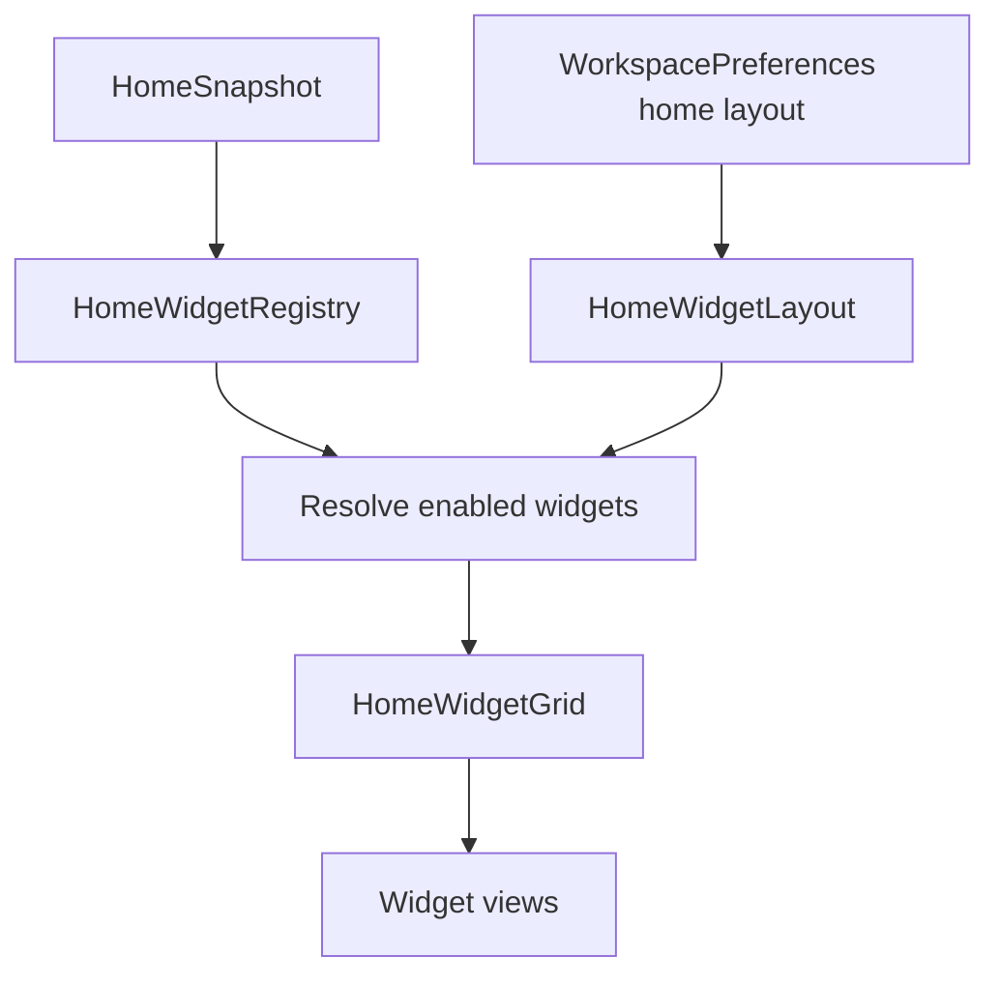
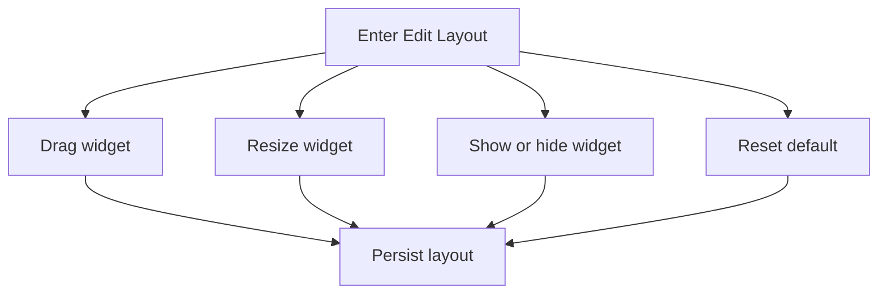
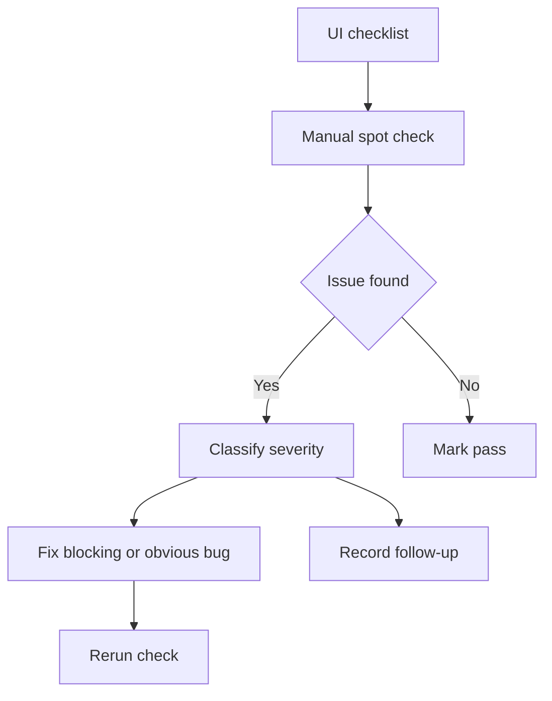

# 任务书 43.9：Home 小组件化、响应式布局与 UI Bug Bash

更新时间：2026-05-08
状态：Done
优先级：S1 / Roadmap Stage 1.5
承接：P43 完成 ProjectSpace 与 sidebar 收敛；P43.5-P43.8 分别规划 Shell/AI/PDF-Wiki/本地化。P43.8 已完成轻量 Swift localization registry、ToolbarPolicy route 隔离、项目 archive/restore/trash 生命周期、string inventory 与 MT17。P43.9 作为 43.5 系列收口，把 Home 改造成可编辑 widget dashboard，并建立一次系统性 UI polish / bug bash 验收。

---

## 0. P43.8 Handoff（2026-05-11）

已验证状态：

1. `Sci-Station/Localization/LocalizationCatalog.swift` 提供 `AppLanguage`、`L10nKey`、`L10n` 与轻量 `LocalizationAudit`。
2. `AppViewModel.t(_:)` / `tf(_:_:)` 已可用于新增 UI；`localized(_:_:)` 仅作为 migration helper。
3. `ToolbarPolicy.resolve(route:context:language:)` 已按 route/context/language 生成 action title；Home / Calendar / AI Lab 不显示论文导入动作。
4. Project lifecycle 支持 archive、restore、delete-to-trash；trash 路径为 `.sci-station/trash/projects/`。
5. Top sidebar / ProjectSpace / Settings / menu bar 主路径已接入 key；项目树支持搜索、Pinned/Recent、Show Archived、Restore、Move to Trash。
6. `docs/development/localization/P43.8_string_inventory.md` 已记录 migrated / partial / deferred / user-content / code-symbol 状态。
7. `docs/development/manual-tests/MT17_LocalizationProjectToolbar.md` 已新增。

本轮验证：

1. `swift run SciStationCoreTestRunner` 通过。
2. `xcodebuild -project Sci-Station.xcodeproj -scheme Sci-Station -destination 'platform=macOS' build` 通过。
3. VS Code Problems 对 P43.8 主要 Swift 文件无错误。

P43.9 继承风险：

1. Library / PDF Reader / Wiki file manager / Markdown editor / AI Lab 的深层文案仍为 deferred，需要在 UI bug bash 中优先迁移高频入口并检查中文长度。
2. Xcode build 仍有既有 WebKit MainActor warning，来源为 `ChatMarkdownWebView` 与 `MarkdownPreviewView`，本轮未改动。
3. Project hard delete 未实现；P43.9 如要暴露更危险操作，必须继续采用二次确认和 audit event。
4. Home widget 化要复用 `L10nKey`，不要新增 `localized(zh,en)` 调用。

---

## 1. 背景

当前 Home 已经具备多面板结构，但还不是用户可编辑的 widget dashboard：

```text
Sci-Station/UI/DashboardViews.swift
Sci-Station/UI/Home/HomeView.swift
Sci-Station/UI/Home/HomePanels.swift
Sci-Station/UI/Home/ProjectDashboardPanel.swift
Sci-Station/Workspace/HomeAggregator.swift
Sci-Station/Workspace/HomeSnapshot.swift
Sci-Station/Workspace/WorkspacePreferences.swift
Sci-Station/Workspace/WorkspacePreferencesRepository.swift
```

现状大致是：

1. `HomeAggregator` 生成 `HomeSnapshot`，`HomeView` 固定布局渲染 Today / Active Projects / AI Review / Calendar / Recently Added / Recently Read。
2. 用户不能像 macOS 桌面小组件一样编辑面板位置、大小、显示/隐藏。
3. P43.5-P43.8 会引入右栏、AI 侧栏、项目树、PDF 标注、Wiki 文件管理、toolbar policy、本地化，必须有统一响应式折叠策略。
4. 需要一次全局 UI bug bash：空态、reload、选择状态、按钮错位、中文截断、深浅色、键盘导航、权限 dock、右栏折叠、AI 事件行等。

---

## 2. 本轮目标

1. Home 改造成可编辑 widget dashboard。
2. 用户可调整 widget 的显示/隐藏、位置、大小，并持久化到 workspace preferences。
3. 将现有 Home panels 统一为 `HomeWidgetRegistry`。
4. 增加 Edit Layout 模式，类似 macOS widget：拖拽、resize、重置默认布局。
5. 定义全应用响应式折叠策略：左侧项目树、右栏、AI side panel、ProjectSpace tabs、Home widgets。
6. 建立 UI bug bash 清单，系统性检查 P43.5-P43.8 引入和暴露的问题。
7. 建立视觉验收规范，吸收 Cursor / Claude / Linear / OpenCode 的低噪声、紧凑、可折叠事件与 hairline 设计方向。

---

## 3. 非目标

```text
不实现云同步布局
不做跨设备 widget marketplace
不引入第三方 dashboard/grid 库
不重写 HomeAggregator 的数据来源
不在 P43.9 修完所有业务 bug；只修 UI 阻断和高置信问题，其余登记 backlog
```

---

## 4. 设计原则

1. **模块化但不花哨**：Widget 以科研工作流为中心，不做装饰性卡片。
2. **可编辑但默认好用**：默认布局必须开箱可用；Edit Layout 是增强能力。
3. **低噪声密度**：卡片使用 hairline、灰色辅助文字、紧凑按钮，不使用大阴影和过重渐变。
4. **响应式优先级明确**：窄窗口先折叠右栏，再折叠项目树，再把 widgets 单列化。
5. **可审计 AI**：AI Review widget 只显示需要用户处理的审批/草稿，不展示大块运行日志。
6. **本地优先**：布局 preferences 存在 workspace settings 中，可检查、可重置。

---

## 5. Home Widget 体系

### 5.1 初始 widgets

```text
today
  今日待办、截止日期、日历摘要

active_projects
  活跃项目、阶段、最近活动、open gaps

ai_review
  需要审核的 AI draft / permission / stale evidence

calendar
  月/周视图摘要

recent_papers
  最近添加/阅读论文

reading_plan
  当前阅读计划和下一篇论文

project_health
  论文数、任务数、open gaps、AI review count

quick_actions
  新建项目、导入论文、打开 Wiki、打开 AI
```

### 5.2 尺寸

```text
small   1 x 1
medium  2 x 1
large   2 x 2
wide    4 x 1
```

每个 widget 声明支持尺寸；不支持的尺寸在 resize handle 中禁用。

---

## 6. 响应式折叠策略

```text
>= 1400 px
  Sidebar + content + right rail / AI panel 可同时存在
  Home widgets 使用 4-column grid

1000-1399 px
  Right rail 默认折叠为 icon rail
  Home widgets 使用 3-column grid
  ProjectSpace tabs 超出进入 More

760-999 px
  AI panel 使用 overlay
  Home widgets 使用 2-column grid
  Project tree 默认折叠

< 760 px
  Home widgets 单列
  Inspector hidden
  Toolbar page actions 进入 overflow
```

---

## 7. 流程图

### 7.1 Home Widget 渲染



### 7.2 Edit Layout



### 7.3 Bug Bash Loop



---

## 8. 实施任务

> 命名：Home widget 代码集中在 `Sci-Station/UI/Home/Widgets/`；layout model 放 `Sci-Station/Workspace/HomeWidgetLayout.swift`。

- [x] [P43.9.0] 前置补齐：无延期执行决策
  - 新增 Home widget / responsive 所需 `L10nKey`，禁止新增 `localized(zh,en)` 调用。
  - `WorkspacePreferences` schema bump，并补 Home layout encode/decode roundtrip。
  - `AppViewModel` 暴露 Home layout 操作 API：enter/exit edit、move、resize、toggle、reset、gallery、debug event。
  - 第一版必须支持键盘可达的排序按钮；自由拖拽也要有基础 `.draggable/.dropDestination`，但不以拖拽作为唯一编辑路径。
  - P43.8 deferred 的 PDF / Wiki / Markdown / AI Lab / Library 文案，在 P43.9 UI bug bash 中不能简单继续延期：至少迁移主路径或记录已修复状态。

- [x] [P43.9.1] `HomeWidgetRegistry`
  - 新增 widget descriptor：id、title key、supported sizes、default size、default order、requires modules。
  - 现有 Today / Active Projects / AI Review / Calendar / Recent Papers 都迁移为 widget。
  - Widget 数据仍来自 `HomeSnapshot`，不改 aggregator 语义。

- [x] [P43.9.2] `HomeWidgetLayout`
  - 新增持久化模型：enabled widget ids、grid position、size、last updated。
  - 写入 `WorkspacePreferences`，schema bump。
  - 缺失或非法布局回退默认布局。

- [x] [P43.9.3] `HomeWidgetGrid`
  - 实现 grid layout，支持 small / medium / large / wide。
  - 根据窗口宽度计算 columns。
  - 冲突位置自动 repack，保证 widget 不重叠。
  - 空 widget 显示明确 empty state。

- [x] [P43.9.4] Edit Layout 模式
  - Home 顶部增加 `Edit Layout`。
  - 支持拖拽排序、resize、显示/隐藏、Reset Default。
  - Edit 模式下 widget 显示 handle 和尺寸选择，不触发业务点击。
  - 退出时保存布局。

- [x] [P43.9.5] Widget gallery
  - 显示所有可用 widget，按 Research / AI / Calendar / Library / Project 分类。
  - 已启用 widget 显示 checked 状态。
  - 模块禁用导致不可用时显示原因。

- [x] [P43.9.6] Responsive layout policy
  - 将 P43.5 的 right rail / AI side panel / project tree 折叠规则集中到 `ResponsiveShellPolicy`。
  - ProjectSpace tab overflow 与 Home widget columns 使用同一窗口宽度判断。
  - Toolbar overflow 与 localization 长文案一起测试。

- [x] [P43.9.7] Visual polish pass
  - 统一卡片边框、间距、caption、secondary text、empty state。
  - AI timeline、tool rows、permission card、Inspector、PDF annotation list、Wiki file list 与 Home widgets 使用一致的 hairline 和灰色辅助文案。
  - 删除无意义大块统计卡片或改为可操作摘要。

- [x] [P43.9.8] Keyboard 与 accessibility
  - Home widget focus order 稳定。
  - Edit Layout 支持键盘移动或至少可通过按钮调整。
  - Toolbar overflow、Allow/Deny、Wiki file actions、PDF annotation list 有 VoiceOver label。

- [x] [P43.9.9] UI Bug Bash
  - 覆盖 P43.5-P43.8 所有主路径。
  - 分类：blocker、major、minor、polish、backlog。
  - 阻断 bug 必须修；非阻断写入 `docs/development/bugs/P43_UI_BugBash.md`。

- [x] [P43.9.10] 文档与截图验收
  - 新增 `docs/development/manual-tests/MT18_HomeWidgetsAndUIPolish.md`。
  - 更新 release regression 加入 P43.5-P43.9 UI paths。
  - 保存关键 UI spot check 记录：Home、Library、ProjectSpace、AI Lab、PDF、Wiki、Settings。

---

## 9. 数据模型草案

```swift
enum HomeWidgetSize: String, Codable, Sendable {
    case small
    case medium
    case large
    case wide
}

struct HomeWidgetDescriptor: Identifiable, Codable, Sendable {
    var id: String
    var titleKey: L10nKey
    var defaultSize: HomeWidgetSize
    var supportedSizes: Set<HomeWidgetSize>
    var defaultOrder: Int
    var requiredModuleIDs: [String]
}

struct HomeWidgetLayoutItem: Identifiable, Codable, Hashable, Sendable {
    var id: String
    var widgetID: String
    var size: HomeWidgetSize
    var column: Int
    var row: Int
    var isEnabled: Bool
}

struct HomeWidgetLayout: Codable, Hashable, Sendable {
    var schemaVersion: Int
    var items: [HomeWidgetLayoutItem]
    var updatedAt: Date
}
```

---

## 10. 自动化测试

新增或扩展 `Tools/SciStationCoreTestRunner/main.swift`：

```text
homeWidgetRegistryIncludesDefaultWidgets
homeWidgetRegistryFiltersDisabledModules
homeWidgetLayoutRoundTripsPreferences
homeWidgetLayoutFallsBackWhenInvalid
homeWidgetGridReflowsForTwoColumns
homeWidgetGridReflowsForSingleColumn
homeWidgetGridRepackAvoidsOverlap
responsivePolicyHidesRightRailBelowThreshold
responsivePolicyMovesToolbarActionsToOverflow
homeWidgetResetRestoresDefaultLayout
```

---

## 11. 手动测试计划

新增 `docs/development/manual-tests/MT18_HomeWidgetsAndUIPolish.md`。

| ID | 标题 | 期望 |
|---|---|---|
| MT18-P43.9-01 | Home 默认布局 | 首次打开显示合理 widget 排列，无空白大洞 |
| MT18-P43.9-02 | Edit Layout 拖拽 | widget 可移动，退出后位置保存 |
| MT18-P43.9-03 | Resize widget | 支持尺寸变化；不支持尺寸不可选 |
| MT18-P43.9-04 | 隐藏 widget | widget 从 Home 消失，可从 gallery 恢复 |
| MT18-P43.9-05 | Reset Default | 恢复默认布局 |
| MT18-P43.9-06 | 窄窗口 | widgets 单列/双列，右栏与 toolbar 合理折叠 |
| MT18-P43.9-07 | 中文界面 | widget 标题和按钮不明显截断 |
| MT18-P43.9-08 | AI Review widget | 只显示需要审核的项目，点击跳到对应 review |
| MT18-P43.9-09 | Keyboard focus | tab 顺序可预测，主要按钮可键盘触发 |
| MT18-P43.9-10 | 深浅色模式 | hairline、卡片、灰字在两种模式可读 |

---

## 12. Bug Bash 清单

### 12.1 Shell / Navigation

```text
Sidebar route selection 是否和内容区一致
Project tree 折叠/展开是否持久化
Right rail 是否在无内容时自动折叠
AI side panel 是否显示正确 context
Toolbar 是否只显示当前页面动作
```

### 12.2 AI Lab

```text
Plan / Agent 权限说明是否清楚
Reasoning 默认折叠
Tool calls 是否时间顺序排列
Permission card 是否只有 Allow / Deny 主按钮
Draft review 是否显示目标路径和 diff
长会话是否可加载早期事件
```

### 12.3 PDF / Wiki

```text
PDF annotation 是否保存和恢复
PDF note list 是否跳页正确
paper.md 首次打开是否不空白
Wiki 新建/重命名/删除是否不丢内容
Markdown preview 是否跟随 draft 更新
```

### 12.4 Localization

```text
中文界面是否仍有明显英文按钮
英文界面是否出现中文残留
长文案是否截断
Tooltip / empty state / error 是否本地化
菜单栏是否跟随语言
```

### 12.5 Visual Polish

```text
卡片间距是否一致
hairline 是否过重或过浅
灰色辅助文字是否可读
空态是否可操作
危险按钮是否有明确层级
深浅色模式是否都可用
```

---

## 13. Debug 与日志事件

| event | payload 字段 | 触发点 |
|---|---|---|
| `home.widget.layout_enter_edit` | `enabled_count` | 进入编辑布局 |
| `home.widget.move` | `widget_id, size, columns` | 移动 widget |
| `home.widget.resize` | `widget_id, from_size, to_size` | 调整大小 |
| `home.widget.toggle` | `widget_id, enabled` | 显示/隐藏 |
| `home.widget.reset_default` | `widget_count` | 重置默认 |
| `shell.responsive_policy.apply` | `width_bucket, right_rail, columns` | 窗口宽度策略应用 |
| `ui.bug_bash.record` | `area, severity` | 记录 bug bash 项 |

---

## 14. 验收标准

1. Home widgets 可显示/隐藏、拖拽、调整大小、重置默认，并持久化。
2. Home 默认布局在中英文、深浅色、常见窗口宽度下可用。
3. P43.5-P43.8 引入的右栏、AI 侧栏、toolbar、PDF/Wiki、Localization 有统一响应式策略。
4. UI Bug Bash 清单已执行，blocker / major 问题已修或有明确 defer 记录。
5. 视觉样式符合低噪声、hairline、紧凑、上下文清晰的设计基线。
6. `swift run SciStationCoreTestRunner` 与 `xcodebuild -project Sci-Station.xcodeproj -scheme Sci-Station -destination 'platform=macOS' build` 通过。
7. 手动测试 `MT18-P43.9-01..10` 完成记录。

---

## 15. 风险与后续

1. 拖拽 grid 在 SwiftUI 中容易复杂。若实现成本过高，第一版可先做“编辑模式 + 上移/下移 + 尺寸选择”，拖拽作为增强。
2. Widget layout 与 HomeSnapshot 数据刷新要解耦，避免数据 reload 打断用户编辑布局。
3. 响应式策略需要和 macOS 多窗口/窗口恢复配合，不能只按启动时宽度判断。
4. Bug Bash 不应无限扩大范围。P43.9 只修 UI 阻断和高置信问题，其余进入后续 roadmap。

---

## 16. Completion Review（2026-05-11）

本轮已完成：

1. 新增 `Sci-Station/Workspace/HomeWidgetLayout.swift`：`HomeWidgetRegistry`、widget descriptor、layout item、default layout、normalize、move/resize/toggle/reset、grid planner 与 overlap 检查。
2. `WorkspacePreferences` schema bump 到 v4，新增 `homeWidgetLayout`，`WorkspacePreferencesRepository` 增加 `home_widget_layout` YAML encode/decode 与非法布局 fallback。
3. 新增 `ResponsiveShellPolicy`：按宽度统一 Home columns、right rail、project tree、toolbar overflow 决策，并接入 `AppViewModel.updateShellWindowWidth`。
4. `HomeView` 改为可编辑 widget dashboard：Edit Layout、Widget Gallery、上移/下移、基础拖放、尺寸菜单、隐藏/恢复、Reset Default。
5. `ContentView` toolbar 支持 narrow overflow，`TopSidebarView` 在 compact/narrow 下默认折叠项目树。
6. 新增 Home widget / gallery / layout 相关 `L10nKey`，本轮新增 UI 未使用新的 `localized(zh,en)` 调用。
7. 新增 core tests：registry、module filter、preferences roundtrip、invalid fallback、grid 1/2 columns、repack overlap、responsive right rail、toolbar overflow、reset default。
8. 新增文档：`docs/development/bugs/P43_UI_BugBash.md`、`docs/development/manual-tests/MT18_HomeWidgetsAndUIPolish.md`，并更新 `MT99_ReleaseRegression.md` P43.9 partial regression。

验证：

```bash
swift run SciStationCoreTestRunner
xcodebuild -project Sci-Station.xcodeproj -scheme Sci-Station -destination 'platform=macOS' build
```

结果：PASS。

残余风险：

1. 当前环境无法驱动真实 macOS GUI 交互，MT18 已作为 release/manual pass 清单补齐；拖拽手感、VoiceOver 与深浅色截图需要人工执行记录。
2. Xcode build 仍有既有 Swift 6 warning，来源不属于 P43.9 改动路径；已登记到 bug bash backlog。
3. 第一版 SwiftUI grid 已支持 column span 与固定高度；core planner 保留 rowSpan，未来如需要真正 masonry 可替换渲染层。

下一任务书：`docs/development/Proposal44.md`（Research Graph Data Model V1）已作为 P43.9 后续启动点。

---

## 17. Questions

1. P43.9 的 Home widget 编辑第一版是否接受“按钮上移/下移 + 尺寸选择 + 显示/隐藏”，把自由拖拽作为后续增强？建议接受，能显著降低 SwiftUI grid 风险。
2. Localization deferred 项是否优先迁移 PDF / Wiki / Markdown editor，再迁 AI Lab 和 Library 深层表单？建议优先 PDF/Wiki/Markdown，因为它们最容易在中文界面暴露 P43.7 新增英文。
3. UI Bug Bash 是否把既有 WebKit MainActor warning 纳入 major 修复，还是仅登记为 build warning backlog？建议登记 backlog，除非它阻断 Markdown/AI 渲染。
4. Home quick actions 是否允许进入 toolbar overflow 复用 `ToolbarPolicy` action id，避免 Home widget 自己重复定义导入/新建动作？建议复用。
5. P43.9 是否需要为 Project hard delete 增加隐藏高级入口？建议暂不做，继续保持 P43.8 的可恢复 workspace trash 语义。
