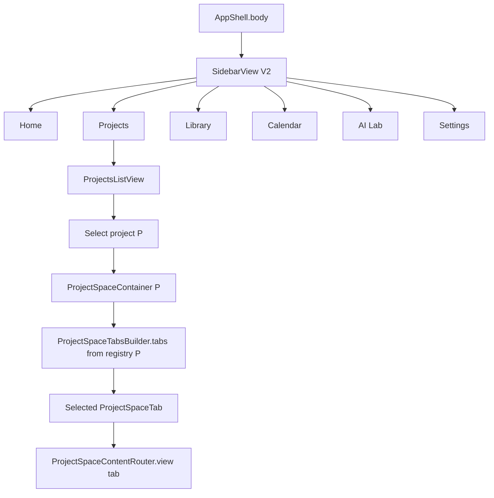
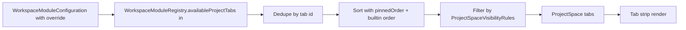
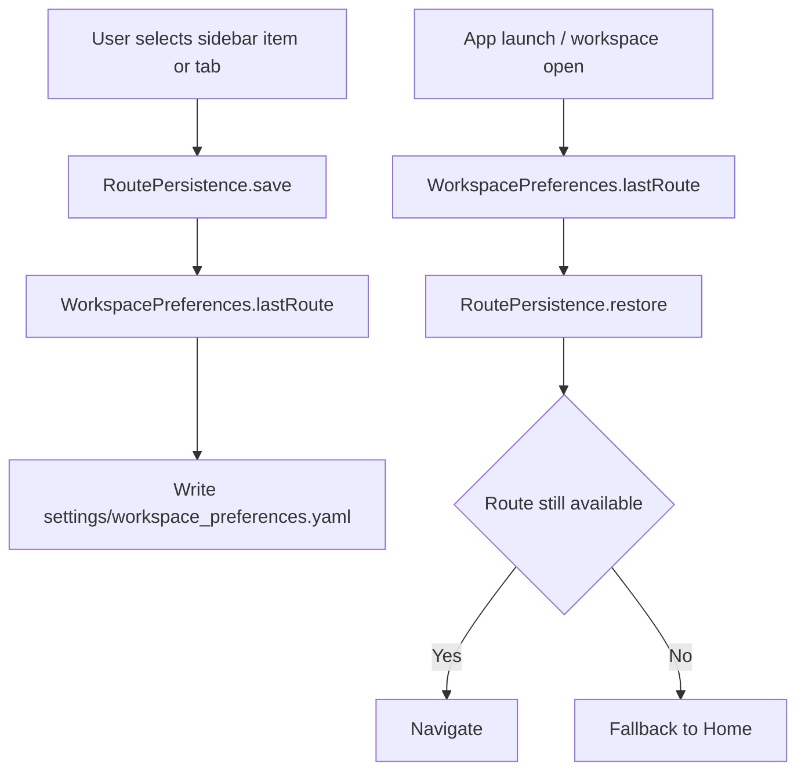

# 任务书 43：ProjectSpace 容器与 Sidebar 收敛

更新时间：2026-05-08
状态：Done（自动化与 Xcode build 通过；MT13 GUI spot check pending）
优先级：S1 / Roadmap Stage 1
承接：P39 已让 `WorkspaceModuleRegistry.availableProjectTabs(in:)` 返回模块贡献的 project tab id；P41 让用户能 enable/disable/pin 模块；P42 已让 Home / Project Dashboard 知道当前阶段并把 Active Projects 行动作暂时落到现有 Projects/Wiki/Tasks/AI Lab 入口。P43 把 Sidebar 收敛为顶层导航，把 project 内部体验改造成 ProjectSpace tabs。

---

## 1. 背景

当前 sidebar 由 `Sci-Station/UI/MainShellViews.swift:8-194` 的 `SidebarView` 渲染，平铺所有 module 入口（Library / PDF / Inbox / Wiki / Tasks / AI Lab / Settings...），仅按 `appModel.isWorkspaceSectionAvailable(_:)` 过滤是否可见。`Sci-Station/UI/WorkspaceSection.swift:24-30` 中已有：

```swift
static var sidebarSections: [WorkspaceSection] {
    [.projects, .materials, .library, .inbox, .wiki, .tasks, .llmLab]
}

static var projectSidebarSections: [WorkspaceSection] {
    [.projects, .library, .wiki, .tasks, .materials]
}
```

这些是硬编码 enum，不会随 `WorkspaceModuleRegistry.availableProjectTabs(in:)` 改变。结果是：

1. P39 注册的 `code / datasets / experiments / citation-graph / recommendation / writing / theory-notes` 即使启用，也不会出现 ProjectSpace 入口。
2. Sidebar 平铺会随模块启用越来越拥挤；新功能（Graph、Recommendation、Writing）没有合适的"进入位置"。
3. Sidebar pin 顺序未持久化；route persistence（关闭 App 重开后回到上次的 ProjectSpace tab）不可用。

P43 要把 sidebar 收敛为 6 项顶层导航：

```text
Home
Projects
Library
Calendar
AI Lab
Settings
```

并把"在某个 project 内做事"集中到 `ProjectSpace` 容器，模块贡献的 tab 由 `WorkspaceModuleRegistry.availableProjectTabs(in:)` 派生。

---

## 2. 本轮目标

1. 顶层 sidebar 收敛为 6 项（Home / Projects / Library / Calendar / AI Lab / Settings）。
2. `ProjectSpaceContainer` 把"选中某个 project"后的所有 view 统一管理；tabs 由模块声明派生：Overview / Papers / Wiki / Tasks / Calendar / Graph / AI Workflows / Code / Data / Experiments / Writing / Theory（仅在对应模块启用时显示）。
3. 模块禁用时 tab 自动隐藏，不再硬编码。
4. Sidebar pin 顺序、最近访问的 ProjectSpace tab、最近访问的 project 写入 `WorkspacePreferences`（schema_version + 1，向后兼容默认值）。
5. 所有 sidebar / tab 选择都对应 `sidebar.render` / `project_space.tab_change` / `route.persist` debug event。
6. P43 不实现 Graph 视图本身（Graph tab 当模块未来由 P46 接入时显示真实内容；P43 期间显示 placeholder）。
7. P43 不重写 Library / Wiki / Tasks 内部内容；只调整其入口位置（顶层 sidebar 还是 ProjectSpace tab）。

---

## 3. 流程图

### 3.1 Sidebar Routing 主路径



### 3.2 ProjectSpace Tab 解析



### 3.3 Route Persistence



---

## 4. 实施任务

> 命名：所有 routing / shell 代码集中在 `Sci-Station/UI/Shell/`。

- [x] [P43.1] 顶层 Sidebar 重写
  - 把 `SidebarView` 拆为 `TopSidebarView`（6 项固定顶层）+ `ProjectsListView`（动态 project 列表）。
  - 删除 `WorkspaceSection.sidebarSections` 硬编码列表，把"哪些项放顶层" 的真理留给 `TopSidebarBuilder`。

- [x] [P43.2] `WorkspaceSection` 整理
  - 保留 enum，但 `dashboard / projects / library / calendar / llmLab / settings` 是顶层；`papers / wiki / tasks / materials / pdfReader / inbox / graph / concepts / methods / gaps` 标记为 `inProjectSpace`（添加新 case `inProjectSpaceOnly: Bool`）。
  - 顶层导航不再依赖 `projectSidebarSections`；`projectSidebarSections` 改成 `legacyProjectSidebarSections` 仅用于 P43 迁移期。

- [x] [P43.3] `ProjectSpaceContainer`（新增 `Sci-Station/UI/Shell/ProjectSpaceContainer.swift`）
  - 输入：当前选中的 `ResearchProject`、`effectiveModuleConfiguration`、`route` （tab id + 子 selection）。
  - 渲染：上方面包屑 / project header（title / stage badge）；中间 tab strip；下方 tab content。

- [x] [P43.4] `ProjectSpaceTabsBuilder`（新增 `Sci-Station/UI/Shell/ProjectSpaceTabsBuilder.swift`）
  - 入口：`func tabs(for projectID: String, configuration: WorkspaceModuleConfiguration, pinnedOrder: [String]) -> [ProjectSpaceTab]`。
  - `ProjectSpaceTab` 含 `id, title, systemImage, originModuleID, contentRoute`。
  - 默认顺序：Overview / Papers / Wiki / Tasks / Calendar / AI Workflows / Graph / Code / Data / Experiments / Writing / Theory；模块禁用时自动剔除。

- [x] [P43.5] `ProjectSpaceContentRouter`（新增 `Sci-Station/UI/Shell/ProjectSpaceContentRouter.swift`）
  - 把 tab id 映射到对应 view：Overview → `ProjectOverviewView`（已含 P42 Project Dashboard Panel）、Papers → `LibraryProjectView`（包装当前 Library Project view）、Wiki → `WikiProjectView`、Tasks → `TasksProjectView`、Calendar → `CalendarProjectView`、AI Workflows → `AILabWorkspaceView` （已存在）、Graph → `GraphPlaceholderView`（P46 接入）、Code/Data/Experiments/Writing/Theory → 各自 placeholder（P55/P56 接入）。

- [x] [P43.6] Sidebar pin 与 route persistence
  - 扩展 `WorkspacePreferences` 加 `pinnedTopLevelOrder: [String]`、`projectSpacePinnedOrder: [String]`、`lastRoute: WorkspaceRoute`，schemaVersion bump 到 2，向后兼容（缺失字段使用默认顺序）。
  - 新增 `Sci-Station/UI/Shell/RoutePersistence.swift` 接 `WorkspacePreferencesRepository`。

- [x] [P43.7] Drag-to-pin
  - `TopSidebarView` 与 `ProjectSpaceTabStrip` 都支持长按拖拽重排；保存到 `pinnedTopLevelOrder` / `projectSpacePinnedOrder`。
  - 不允许把 Settings 拖出顶层；Overview 不允许从 ProjectSpace 拖出（`isPinFixed: true`）。

- [x] [P43.8] 空状态 / 失败回退
  - 选中的 project 不存在或被删除时，回到 ProjectsListView 并显示 toast。
  - 上次 route 指向已禁用模块时，落地到 Overview tab。
  - `ProjectSpaceContentRouter` 任意 view crash（NSException）时，截获并展示 `Tab temporarily unavailable + Retry`，写 `route.persist.error`。

- [x] [P43.9] 自动化与手动测试（详见 §6 / §7）。

- [x] [P43.10] 文档与回归
  - 新建 `docs/development/manual-tests/MT13_ProjectSpace.md`。
  - 在 `MT99_ReleaseRegression.md` 加入 P43 partial regression（顶层导航点击、Project Tab 切换、route 恢复）。
  - 更新 `docs/development/Long Term Plan.md` 中 P43 摘要的"模块贡献的 project tab 已落地"备注。

---

## 5. 数据模型与伪代码

### 5.1 ProjectSpaceTab

```swift
struct ProjectSpaceTab: Identifiable, Hashable, Sendable {
    let id: String                    // "overview" / "papers" / "wiki" / "graph" / "code" ...
    let title: String
    let systemImage: String
    let originModuleID: String?       // nil 表示 P43 内置（overview / projects 这种）
    let contentRoute: WorkspaceContentRoute
    let isPinFixed: Bool              // overview 永远 leftmost
}
```

### 5.2 ProjectSpaceTabsBuilder 伪代码

```swift
struct ProjectSpaceTabsBuilder {
    static let builtIn: [ProjectSpaceTab] = [
        .overview, .papers, .wiki, .tasks, .calendar, .aiWorkflows
    ]

    static func tabs(
        for projectID: String,
        configuration: WorkspaceModuleConfiguration,
        pinnedOrder: [String]
    ) -> [ProjectSpaceTab] {
        let availableTabIDs = Set(WorkspaceModuleRegistry
            .availableProjectTabs(in: configuration)
            .map(\.id))

        let dynamicTabs = WorkspaceModuleRegistry.availableModules(in: configuration)
            .flatMap { module -> [ProjectSpaceTab] in
                module.projectTabs.map { tab in
                    ProjectSpaceTab(
                        id: tab.id,
                        title: tab.title,
                        systemImage: systemImage(for: tab.id),
                        originModuleID: module.id,
                        contentRoute: contentRoute(for: tab.id, projectID: projectID),
                        isPinFixed: false
                    )
                }
            }

        let merged = uniqueByID(builtIn.filter { availableTabIDs.contains($0.id) || $0.isPinFixed } + dynamicTabs)
        return reorder(merged, by: pinnedOrder)
    }

    private static func reorder(_ tabs: [ProjectSpaceTab], by pinnedOrder: [String]) -> [ProjectSpaceTab] {
        let fixed = tabs.filter { $0.isPinFixed }
        let movable = tabs.filter { !$0.isPinFixed }
        let pinned = pinnedOrder.compactMap { id in movable.first { $0.id == id } }
        let pinnedIDs = Set(pinned.map(\.id))
        let leftover = movable.filter { !pinnedIDs.contains($0.id) }
        return fixed + pinned + leftover
    }
}
```

### 5.3 WorkspaceRoute 数据模型

```swift
struct WorkspaceRoute: Codable, Hashable, Sendable {
    enum Top: String, Codable, Sendable { case home, projects, library, calendar, aiLab, settings }
    let top: Top
    let projectID: String?
    let projectTabID: String?
    let secondarySelection: String?   // e.g. selected paper id, selected wiki page path

    static let home = WorkspaceRoute(top: .home, projectID: nil, projectTabID: nil, secondarySelection: nil)
}
```

### 5.4 RoutePersistence 伪代码

```swift
actor RoutePersistence {
    private let preferencesRepo: WorkspacePreferencesRepository
    private let debug: AppDebugEventLogger

    func save(_ route: WorkspaceRoute) async {
        var prefs = await preferencesRepo.load()
        prefs.lastRoute = route
        try? await preferencesRepo.save(prefs)
        try? await debug.append(.init(
            event: "route.persist",
            payload: .object([
                "top": .string(route.top.rawValue),
                "project_id_present": .bool(route.projectID != nil),
                "tab_id": .string(route.projectTabID ?? "")
            ])
        ), in: root)
    }

    func restore() async -> WorkspaceRoute {
        let prefs = await preferencesRepo.load()
        let candidate = prefs.lastRoute ?? .home
        guard validate(candidate) else {
            try? await debug.append(.init(
                event: "route.persist.fallback",
                payload: .object(["reason": .string("module_disabled_or_project_missing")])
            ), in: root)
            return .home
        }
        return candidate
    }
}
```

### 5.5 模块贡献的 ProjectSpace tab 与 P39 register 一致性

P39 已经在 `WorkspaceModuleRegistry` 内部声明：

```text
projects.projectTabs       = [overview]
paper-library.projectTabs  = [papers]
wiki.projectTabs           = [wiki]
materials.projectTabs      = [materials]
tasks.projectTabs          = [tasks]
calendar.projectTabs       = [calendar]
pdf-reader.projectTabs     = [pdf-reader]   // 仅模块启用时出现
ai-lab.projectTabs         = [ai-drafts]
code.projectTabs           = [code]
datasets.projectTabs       = [data]
experiments.projectTabs    = [experiments]
citation-graph.projectTabs = [graph]
recommendation.projectTabs = [recommendations]
writing.projectTabs        = [writing]
theory-notes.projectTabs   = [theory]
```

`ProjectSpaceTabsBuilder` 直接消费上面的 set；P43 不再加任何硬编码 tab。

---

## 6. 自动化测试

新增到 `Tools/SciStationCoreTestRunner/main.swift`：

```text
projectSpaceTabsBuilderHonorsAvailableModules
projectSpaceTabsBuilderRespectsPinnedOrder
projectSpaceTabsBuilderRemovesDisabledModuleTabs
projectSpaceTabsBuilderKeepsOverviewLeftmost
topSidebarBuilderProducesSixFixedItems
routePersistenceRoundTripsLastRoute
routePersistenceFallsBackWhenProjectMissing
routePersistenceFallsBackWhenModuleDisabled
workspacePreferencesSchemaVersion2BackwardCompat
projectSpaceContentRouterMapsAllKnownTabs
```

构建命令：

```bash
swift run SciStationCoreTestRunner
xcodebuild -project Sci-Station.xcodeproj -scheme Sci-Station -destination 'platform=macOS' build
```

---

## 7. 手动测试计划（MT13-P43）

新增到 `docs/development/manual-tests/MT13_ProjectSpace.md`。

| ID | 标题 | 期望 |
|---|---|---|
| MT13-P43-01 | 顶层 sidebar 6 项固定 | Home / Projects / Library / Calendar / AI Lab / Settings；不再出现 Materials / Wiki / Tasks 顶层入口 |
| MT13-P43-02 | 选中 project，看到 ProjectSpace tabs | 默认顺序 Overview / Papers / Wiki / Tasks / Calendar / AI Workflows |
| MT13-P43-03 | 启用 `code` 模块 | ProjectSpace 出现 Code tab；停用后消失，无 crash |
| MT13-P43-04 | 启用 `citation-graph` | ProjectSpace 出现 Graph tab；P43 期间显示 placeholder（"Graph data not built yet, see P44–P46"）|
| MT13-P43-05 | 拖拽重排 ProjectSpace tab | Overview 永远 leftmost，其余可拖；重启 App 顺序保留 |
| MT13-P43-06 | 关闭 App 后再打开 | 自动恢复到上次的 sidebar item / project / tab |
| MT13-P43-07 | 上次 route 指向已禁用模块 | App 启动后回退到 Home（或 ProjectSpace.Overview，如果 project 仍存在）；写 `route.persist.fallback` |
| MT13-P43-08 | 切换 project | Tab strip 重新计算；`project_space.tab_change` 事件含 `from_project_id, to_project_id` |
| MT13-P43-09 | 中文 / 英文切换 | 顶层 sidebar / tab 标签随 `appLanguage` |
| MT13-P43-10 | 关闭 `wiki` 模块 | Wiki tab 消失；如果当前路由停在 Wiki tab，自动落地到 Overview |

---

## 8. Debug 与日志规范

| event | payload 字段 | 触发点 |
|---|---|---|
| `sidebar.render` | `top_items: [String], pinned_order: [String]` | 顶层 sidebar 首次渲染或 pinned 顺序变化 |
| `project_space.tab_change` | `project_id, from_tab, to_tab, available_tabs: [String]` | 切换 ProjectSpace tab |
| `project_space.builder_warn` | `project_id, hidden_tabs: [String], reason` | 模块禁用导致 tab 被剔除 |
| `route.persist` | `top, project_id_present, tab_id` | 路由保存到 preferences |
| `route.persist.fallback` | `reason: "module_disabled" \| "project_missing" \| "schema_invalid"` | restore 时被迫降级 |
| `route.persist.error` | `phase: "save" \| "load", message` | preferences 写入或解析失败 |

脱敏：所有事件不含具体 paper id / wiki path / todo title；仅记录 tab id、route key。

---

## 9. 非目标 / 验收标准 / Questions / 交付记录

### 9.1 非目标

```text
不实现 Graph / Recommendation / Writing / Theory 模块本身的 view 内容
不重写 Library / Wiki / Tasks / Calendar / AI Lab 内部逻辑
不改 Permission Dock / Draft Inbox 行为
不引入第三方 routing 库
不实现 universal links / deeplink（P58 release 阶段再做）
```

### 9.2 验收标准

1. 顶层 sidebar 收敛为 6 项；旧 `sidebarSections` 硬编码删除或迁移到 P43 内部；模块禁用不导致 sidebar crash。
2. ProjectSpace 容器 + tabs 正确派生，模块切换实时反映。
3. Route persistence schema_version 2 落地，向后兼容；不合法 route 安全降级。
4. Drag-to-pin 行为符合预期；Overview 永远 leftmost。
5. 所有 Debug 事件按 §8 完整写入。
6. SciStationCoreTestRunner / xcodebuild 全绿；MT13-P43-01..10 全部通过。

### 9.3 Questions / 风险

1. AI Lab 是顶层 sidebar 项还是 ProjectSpace tab？倾向：**两者都有**。顶层 AI Lab 是 workspace-wide global thread，ProjectSpace 内的 "AI Workflows" tab 是 project-scoped；二者通过 `WorkspaceRoute.projectID` 区分。
2. Calendar 是顶层还是 ProjectSpace？倾向：**两者都有**。顶层 Calendar 显示 workspace 全部 todo + project deadline；ProjectSpace 内 Calendar tab 仅过滤当前 project。
3. ProjectSpace tab strip 是否要支持隐藏（折叠到下拉菜单）？倾向：tabs > 8 时自动把超出部分折叠到 More 菜单；不让 strip 横向滚动。
4. 是否需要 deep-link（如从 Home AI Review 直接跳到 ProjectSpace.AIWorkflows.{draftID}）？倾向：是；通过 `WorkspaceRoute.secondarySelection` 携带 draft id。

### 9.4 交付记录

完成实现后补充：

```text
完成日期：2026-05-08
Git commit：未提交
自动化测试结果：swift run SciStationCoreTestRunner 通过；xcodebuild -project Sci-Station.xcodeproj -scheme Sci-Station -destination 'platform=macOS' build 通过
手动测试报告：docs/development/manual-tests/runs/2026-05-08_P43_ProjectSpaceShell.md（GUI spot check pending）
已知问题：MT13-P43-01..10 尚需 macOS GUI 手动执行；ProjectSpaceContentRouter 已提供 unknown/unavailable tab fallback，未引入 Objective-C NSException bridge
推迟到 P46 的事项：Graph tab 真实内容
推迟到 P55/P56 的事项：Code / Data / Experiments / Writing / Theory tab 内容
```
