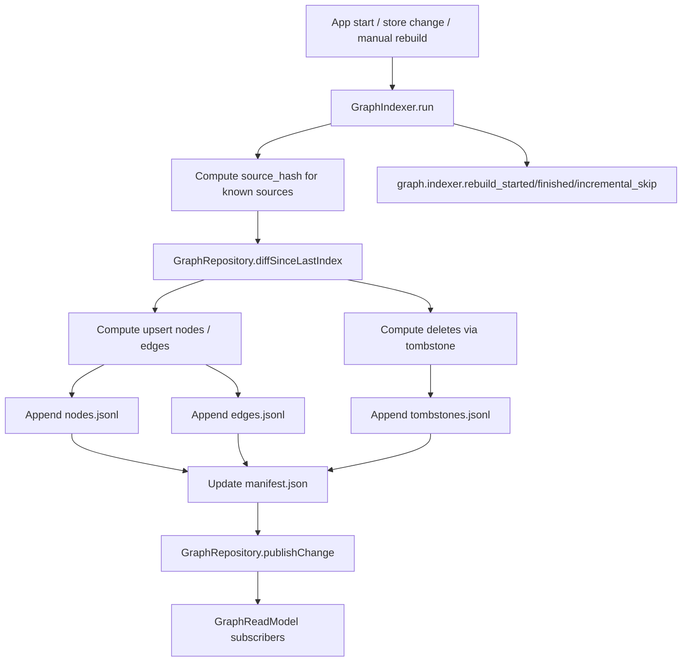
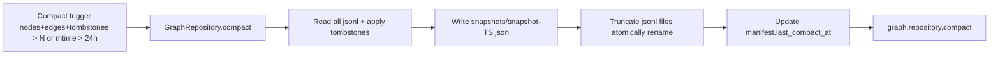
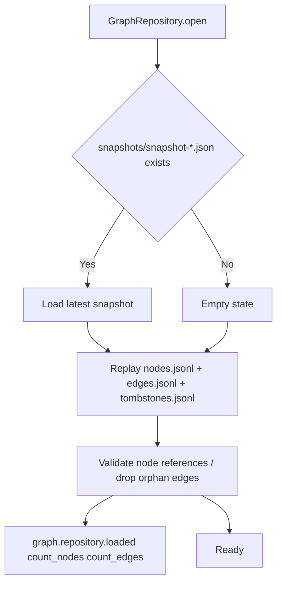

# 任务书 44：Research Graph Data Model V1

更新时间：2026-05-08
状态：Next（P43.9 Home widgets / responsive UI 收口已实现；P44 可启动）
优先级：S1 / Roadmap Stage 2
承接：P39 已声明 disabled 模块 `citation-graph`；P43 已让 Graph tab 在模块启用时出现并显示 P44-P46 placeholder；P44 建立统一 research graph 底座。

---

## 0. P43.9 Handoff（2026-05-11）

P43.9 已完成 Home widget dashboard、workspace preferences layout persistence、responsive shell policy、toolbar overflow、UI bug bash 文档与 MT18。P44 启动前可依赖：

1. `WorkspacePreferences` 当前 schema 为 v5，已有 Home layout YAML roundtrip/fallback 模式可作为 graph settings 的轻量参考。
2. `ResponsiveShellPolicy` 已集中 shell 宽度策略；P46 Graph UI 后续应复用同一 policy，不再在 Graph view 内单独判断窗口宽度。
3. `ToolbarPolicy` 与 `ContentView` overflow 已支持 route/page action 隔离；P46/P47 新增 graph toolbar action 应先进入 policy，而不是直接散落在 view 中。
4. `docs/development/manual-tests/MT18_HomeWidgetsAndUIPolish.md` 与 `docs/development/bugs/P43_UI_BugBash.md` 已补齐；P44 只需新增 graph 专项 MT，不再重复 P43 UI 收口。

验证基线：

```bash
swift run SciStationCoreTestRunner
xcodebuild -project Sci-Station.xcodeproj -scheme Sci-Station -destination 'platform=macOS' build
```

结果：PASS。

---

## 1. 背景

Sci-Station 当前所有"实体之间的关系"都散落在不同 store：

```text
ResearchProjectStore               project ↔ project
PaperRepository / PaperLibrary     paper meta + collections
ProjectPaperLinkRepository         paper ↔ project（已存在）
WikiBacklinkIndex                  wiki page ↔ wiki page（Sci-Station/Markdown/BacklinkIndex.swift）
ArtifactRecordStore                artifact ↔ run / approval / evidenceRefs（P38）
AgentEmbeddingStore                paper / wiki chunk ↔ retrieval（P37）
TodoStore                          todo ↔ project / paper id
```

要做 P45 Citation Graph、P46 Graph UI、P47 Graph-Powered Workflows，必须把这些"分散关系"统一到一个 research graph 底座。否则上层视图与 agent 工具会反复 ad-hoc 拼接，重复劳动且难以测试。

P44 的核心工作：

1. 设计一个 deterministic、增量可重建、文件持久化、查询友好的 graph schema。
2. 把现有 store 已知的关系导入：paper / project / wiki concept-method / artifact lineage / evidence。
3. 不引入外部 SQLite 依赖（当前 codebase 无 sqlite library；`AgentEmbeddingStore` 也是 JSON snapshot fallback）；使用 JSONL append + 定期 compact 的方案。
4. 提供 `GraphReadModel` 给 P46 UI 与 P47 agent 工具。

### 1.1 持久化方案选型

| 方案 | 优点 | 缺点 | 是否选 |
|---|---|---|---|
| 自建 JSONL | 与现有 `runs.jsonl / events.jsonl / app_events.jsonl` 一致；无新依赖；可 diff & 检查 | 大规模查询慢（需要全量加载到内存） | **是**，规模 < 50 万节点 / 边 |
| 单 JSON snapshot | 类似 `AgentEmbeddingStore`，简单 | 写放大严重，增量更新难 | 否 |
| SQLite via FMDB / SQLite.swift | 查询友好；事务安全 | 引入新依赖；需要 schema 迁移；Sci-Station 现在没有 SQLite 用户 | 否（保留为 V2 可选） |
| sqlite-vec | 已经规划用于 embedding；但 graph 用不到向量 | 复杂度过高 | 否 |

P44 选 **JSONL append + 索引内存加载 + 定期 compact**：

```text
.sci-station/graph/
  ├─ nodes.jsonl                  # one node per line, append-only
  ├─ edges.jsonl                  # one edge per line, append-only
  ├─ tombstones.jsonl             # deletion records
  ├─ snapshots/
  │   └─ snapshot-2026-05-07T...json   # periodic compact snapshot, only kept latest 3
  └─ manifest.json                 # schema version, last compact at, counts
```

### 1.2 仍需未来扩展的能力（不在 P44）

```text
分布式 / 多 workspace 共享          # 不做
向量化 graph search（GNN）           # 不做
跨 workspace federation             # 不做
graph 驱动的实时通知                # 不做（用 Combine 简单 publish-subscribe 即可）
```

---

## 2. 本轮目标

1. 定义 `GraphSchema`（节点 12 类 + 边 11 类）与持久化布局。
2. 实现 `GraphRepository`：append-only write + 内存索引 + periodic compact + crash-safe load。
3. 实现 `GraphIndexer`：从 paper / project / wiki / artifact / evidence / run / approval 等 store 增量构建 graph，按 `source_hash` 与 `updated_at` 决定是否更新。
4. 提供 `GraphReadModel`：典型查询接口（neighbors、subgraph、ancestors、descendants、path）。
5. Schema 迁移：manifest 含 `schema_version`，第一次启动时执行 V0 → V1（无 V0 数据时跳过）。
6. P44 不实现 citation_edges 抽取（属 P45），不实现 graph UI（P46），不接入 agent 工具（P47）。
7. 所有 indexer / repository 操作都对应 debug event。

---

## 3. 流程图

### 3.1 Graph Indexer 增量主路径



### 3.2 Compact 流程



### 3.3 Crash-safe Load



---

## 4. 实施任务

> 命名：所有 graph 代码集中在 `Sci-Station/Graph/`。

- [ ] [P44.1] `GraphSchema.swift`（新增 `Sci-Station/Graph/GraphSchema.swift`）
  - 定义 `GraphNodeKind` enum：`paper / project / concept / method / dataset / claim / evidence / task / artifact / calendar_event / run / approval`。
  - 定义 `GraphEdgeKind` enum：`cites / mentions / supports / contradicts / extends / uses / belongs_to / related_to / generated_by / approved_by / scheduled_for`。
  - 定义 `GraphNode` / `GraphEdge` 数据模型（含 `id, kind, displayName, payload, createdAt, updatedAt, sourceHash, lastIndexedAt`）。
  - 定义 `GraphSchemaVersion = 1`。

- [ ] [P44.2] `GraphRepository.swift`（新增 `Sci-Station/Graph/GraphRepository.swift`）
  - actor，封装 `.sci-station/graph/` 下文件。
  - 接口：`open() / close() / upsertNode / upsertEdge / deleteNode / deleteEdge / replay / compact / publishChanges`。
  - 内存索引：`nodesByID: [String: GraphNode]`、`outEdges: [String: [GraphEdge]]`、`inEdges: [String: [GraphEdge]]`、`edgesByID: [String: GraphEdge]`。
  - 写入：每次 mutate 同步 append jsonl，等到 commit batch 才 fsync；崩溃时下次 replay 自动恢复。

- [ ] [P44.3] `GraphIndexer.swift`（新增 `Sci-Station/Graph/GraphIndexer.swift`）
  - actor，监听 paper / project / wiki / artifact / evidence / run / approval store 的变化。
  - 提供 `func run(force: Bool = false) async throws`：
    - `force == true` 时全量重建；
    - 否则按 `source_hash + updated_at` 增量更新。
  - 拆分子方法：`indexPapers / indexProjects / indexWikiConceptMethods / indexArtifactsAndEvidence / indexTasks / indexCalendarEvents / indexRunsAndApprovals`。

- [ ] [P44.4] `GraphReadModel.swift`（新增 `Sci-Station/Graph/GraphReadModel.swift`）
  - read-only 视图：`func node(id:) / func neighbors(id:depth:kinds:) / func subgraph(centerNodeID:depth:kinds:) / func path(from:to:maxDepth:) / func ancestors(id:relation:) / func descendants(id:relation:)`。
  - 不允许 mutate；publish via `AsyncStream<GraphChange>`，让 P46 UI 与 P47 agent 工具订阅。

- [ ] [P44.5] WikiConceptMethodExtractor
  - 复用 `BacklinkIndex` 已经具备的 wiki page parsing。
  - 简单规则：`# concept: <name>` / `# method: <name>` 标题为 wiki concept / method 节点；正文中 `[[concept:X]]` / `[[method:Y]]` 引用产生 `mentions` 边。
  - P44 仅做"标题 + 显式 wiki link"模式；不做 NLP 概念抽取。

- [ ] [P44.6] Evidence Bridge
  - 把 P38 的 `ArtifactRecord.evidenceRefs` 转成 `evidence` 节点 + `supports` 边。
  - claim 节点先做"per artifact 一个隐式 root claim"（因为 P38 的 claim-level 拆分尚未持久化，只有 `unsupported_core_claim_count` 字段）；后续 P56 Writing Module 会引入显式 claim id，再补 `claim` 节点上的多 supports 边。

- [ ] [P44.7] Manifest + 版本迁移
  - `manifest.json`：`{ schema_version, generated_at, last_compact_at, last_indexed_at, count_nodes, count_edges, app_version }`。
  - 启动时，如果 `schema_version < currentVersion`，运行 `GraphMigrationRunner`。当前 V0 → V1 仅是初始化（V0 不存在）。
  - 不允许跳级迁移（V1 → V2 时再加 `migrate_v1_v2`）。

- [ ] [P44.8] Compact 调度
  - `GraphRepository.shouldCompact` 规则：`nodesCount + edgesCount + tombstonesCount > 50_000` 或 `Date().timeIntervalSince(manifest.lastCompactAt) > 24 * 3600`。
  - Compact 仅保留最近 3 个 snapshot；老 snapshot 删除。
  - Compact 失败不影响读路径；保留 jsonl + tombstone 作为权威。

- [ ] [P44.9] 自动化与手动测试（详见 §6 / §7）。

- [ ] [P44.10] 文档与回归
  - 新建 `docs/development/manual-tests/MT14_ResearchGraph.md`。
  - 在 `MT99_ReleaseRegression.md` 加 P44 partial regression（rebuild graph、compact、crash-safe load）。

---

## 5. 数据模型与伪代码

### 5.1 Schema

```swift
public enum GraphNodeKind: String, Codable, Hashable, Sendable {
    case paper, project, concept, method, dataset, claim, evidence, task, artifact, calendarEvent = "calendar_event", run, approval
}

public enum GraphEdgeKind: String, Codable, Hashable, Sendable {
    case cites, mentions, supports, contradicts, extends, uses, belongsTo = "belongs_to", relatedTo = "related_to", generatedBy = "generated_by", approvedBy = "approved_by", scheduledFor = "scheduled_for"
}

public struct GraphNode: Codable, Hashable, Sendable, Identifiable {
    public let id: String              // "<kind>:<stable-id>", e.g. "paper:garani2017", "project:proj-12"
    public let kind: GraphNodeKind
    public let displayName: String
    public let payload: JSONValue      // kind-specific extra fields, e.g. paper { year, doi, arxiv_id }
    public let createdAt: Date
    public let updatedAt: Date
    public let sourceHash: String?
    public let lastIndexedAt: Date
}

public struct GraphEdge: Codable, Hashable, Sendable, Identifiable {
    public let id: String              // "<from>:<kind>:<to>", deterministic
    public let kind: GraphEdgeKind
    public let from: String
    public let to: String
    public let weight: Double
    public let payload: JSONValue
    public let createdAt: Date
    public let updatedAt: Date
    public let sourceHash: String?
    public let lastIndexedAt: Date
}
```

### 5.2 GraphRepository 主接口

```swift
public actor GraphRepository {
    public init(directoryURL: URL, debug: AppDebugEventLogger)

    public func open(in root: ResearchRoot) async throws
    public func close() async

    public func upsertNode(_ node: GraphNode) async throws
    public func upsertEdge(_ edge: GraphEdge) async throws
    public func deleteNode(id: String) async throws
    public func deleteEdge(id: String) async throws
    public func batch(_ apply: (GraphRepository) async throws -> Void) async throws

    public func snapshot() async -> GraphSnapshot
    public func subscribeChanges() -> AsyncStream<GraphChange>

    public func compactIfNeeded() async throws -> CompactResult
    public func forceCompact() async throws -> CompactResult
}

public enum GraphChange: Sendable {
    case upsertNode(GraphNode)
    case upsertEdge(GraphEdge)
    case deleteNode(String)
    case deleteEdge(String)
    case bulkReloaded
}
```

### 5.3 GraphIndexer 伪代码

```swift
actor GraphIndexer {
    private let repo: GraphRepository
    private let papers: PaperRepository
    private let projects: ResearchProjectStore
    private let wiki: BacklinkIndex
    private let drafts: DraftInboxStore
    private let approvals: ArtifactApprovalStore
    private let runs: AgentRunDirectoryStore
    private let todos: TodoStore
    private let calendar: CalendarEventStore
    private let debug: AppDebugEventLogger

    public func run(force: Bool = false) async throws {
        try? await debug.append(.init(event: "graph.indexer.rebuild_started", payload: ["force": .bool(force)]), in: root)
        let start = Date()
        let snapshot = await repo.snapshot()

        try await repo.batch { repo in
            try await indexPapers(repo, snapshot: snapshot, force: force)
            try await indexProjects(repo, snapshot: snapshot, force: force)
            try await indexWikiConceptMethods(repo, snapshot: snapshot, force: force)
            try await indexArtifactsAndEvidence(repo, snapshot: snapshot, force: force)
            try await indexTasks(repo, snapshot: snapshot, force: force)
            try await indexCalendarEvents(repo, snapshot: snapshot, force: force)
            try await indexRunsAndApprovals(repo, snapshot: snapshot, force: force)
        }

        try? await debug.append(.init(
            event: "graph.indexer.rebuild_finished",
            payload: .object([
                "duration_ms": .number(Date().timeIntervalSince(start) * 1000),
                "force": .bool(force)
            ])
        ), in: root)
    }

    private func indexPapers(_ repo: GraphRepository, snapshot: GraphSnapshot, force: Bool) async throws {
        for paper in await papers.allPapers() {
            let nodeID = "paper:\(paper.identifier)"
            let hash = paper.computeSourceHash()
            if !force, let existing = snapshot.node(id: nodeID), existing.sourceHash == hash {
                try? await debug.append(.init(event: "graph.indexer.incremental_skip", payload: ["node_id": .string(nodeID)]), in: root)
                continue
            }
            try await repo.upsertNode(GraphNode(
                id: nodeID,
                kind: .paper,
                displayName: paper.title,
                payload: paper.graphPayload,
                createdAt: existingCreatedAt(snapshot, nodeID) ?? Date(),
                updatedAt: Date(),
                sourceHash: hash,
                lastIndexedAt: Date()
            ))
            for projectID in paper.linkedProjectIDs {
                try await repo.upsertEdge(GraphEdge(
                    id: "paper:\(paper.identifier):belongs_to:project:\(projectID)",
                    kind: .belongsTo,
                    from: "paper:\(paper.identifier)",
                    to: "project:\(projectID)",
                    weight: 1.0,
                    payload: .object([:]),
                    createdAt: Date(), updatedAt: Date(), sourceHash: hash, lastIndexedAt: Date()
                ))
            }
        }
    }
}
```

### 5.4 GraphReadModel 查询伪代码

```swift
public struct GraphReadModel: Sendable {
    public func neighbors(of nodeID: String, depth: Int = 1, kinds: Set<GraphEdgeKind> = []) async -> [GraphEdge] {
        var visited: Set<String> = [nodeID]
        var frontier: [String] = [nodeID]
        var collected: [GraphEdge] = []
        for _ in 0..<depth {
            var nextFrontier: [String] = []
            for node in frontier {
                let outgoing = await repo.outEdges(of: node).filter { kinds.isEmpty || kinds.contains($0.kind) }
                let incoming = await repo.inEdges(of: node).filter { kinds.isEmpty || kinds.contains($0.kind) }
                let all = outgoing + incoming
                for edge in all {
                    let other = (edge.from == node) ? edge.to : edge.from
                    if !visited.contains(other) {
                        visited.insert(other)
                        nextFrontier.append(other)
                    }
                    collected.append(edge)
                }
            }
            frontier = nextFrontier
            if frontier.isEmpty { break }
        }
        return collected
    }

    public func subgraph(centerNodeID: String, depth: Int = 2, kinds: Set<GraphEdgeKind> = []) async -> GraphSubgraph {
        let edges = await neighbors(of: centerNodeID, depth: depth, kinds: kinds)
        let nodeIDs = Set(edges.flatMap { [$0.from, $0.to] }).union([centerNodeID])
        let nodes = await repo.nodes(ids: nodeIDs)
        return GraphSubgraph(center: centerNodeID, nodes: Array(nodes.values), edges: edges)
    }

    public func path(from source: String, to target: String, maxDepth: Int = 6) async -> [GraphEdge]? {
        // BFS with parent tracking
        var queue: [(String, [GraphEdge])] = [(source, [])]
        var visited: Set<String> = [source]
        while let (current, trail) = queue.first {
            queue.removeFirst()
            if current == target { return trail }
            if trail.count >= maxDepth { continue }
            let edges = await repo.outEdges(of: current) + await repo.inEdges(of: current)
            for edge in edges {
                let other = (edge.from == current) ? edge.to : edge.from
                if !visited.contains(other) {
                    visited.insert(other)
                    queue.append((other, trail + [edge]))
                }
            }
        }
        return nil
    }
}
```

### 5.5 节点 id 命名约定

```text
paper:<paper-id>                // paper-id 取 PaperRepository.identifier，已有规范
project:<project-id>            // ResearchProject.id
concept:<slug>                  // wiki concept 标题 normalized
method:<slug>                   // 同上
dataset:<dataset-id>            // 来自 datasets 模块（P55 才填，P44 期间 placeholder）
claim:<artifact-id>:<claim-key> // 默认 claim-key="root"
evidence:<evidence-id>          // 来自 evidenceRefs.id
task:<todo-id>                  // TodoItem.id
artifact:<artifact-id>          // ArtifactRecord.id
calendar_event:<event-id>
run:<run-id>
approval:<approval-id>
```

边 id：`<from>:<kind>:<to>`，保证 deterministic 与 dedupe。

---

## 6. 自动化测试

新增到 `Tools/SciStationCoreTestRunner/main.swift`：

```text
graphRepositoryAppendsAndReloadsAtomically
graphRepositoryDropsOrphanEdgesAfterTombstone
graphRepositoryCompactPreservesEffectiveState
graphRepositoryCrashRecoveryReplaysJSONL
graphIndexerIndexesPaperBelongsToProjectEdges
graphIndexerSkipsUnchangedSourceHash
graphIndexerForceRebuildOverwritesAll
graphIndexerWikiConceptMethodExtractsTitlesAndLinks
graphIndexerArtifactEvidenceCreatesSupportsEdges
graphReadModelSubgraphRespectsDepth
graphReadModelPathReturnsBFSResult
graphSchemaMigrationV0ToV1NoOpForBlankWorkspace
graphRepositoryEmitsBulkReloadedAfterReplay
```

构建命令：

```bash
swift run SciStationCoreTestRunner
xcodebuild -project Sci-Station.xcodeproj -scheme Sci-Station -destination 'platform=macOS' build
```

---

## 7. 手动测试计划（MT14-P44）

新增到 `docs/development/manual-tests/MT14_ResearchGraph.md`。

| ID | 标题 | 期望 |
|---|---|---|
| MT14-P44-01 | Standard Workspace 启动 | 自动 indexer 运行；`.sci-station/graph/manifest.json` 写入；count_nodes 与 paper / project 总数一致 |
| MT14-P44-02 | 修改一篇 paper 的 meta.yaml | 下次 indexer 只更新该 paper 节点（`graph.indexer.incremental_skip` 数量 ≈ 总数 - 1）|
| MT14-P44-03 | 删除一个 project | 删除节点写入 tombstones；下次 load 后该 project 节点不再出现 |
| MT14-P44-04 | 强制 force rebuild | 全量重建；`graph.indexer.rebuild_started.force=true` 事件正确 |
| MT14-P44-05 | Compact 触发 | 通过 `forceCompact` 手动触发；`snapshots/snapshot-*.json` 写入；jsonl 被截断；reopen 后状态等价 |
| MT14-P44-06 | Crash 中断 indexing | 关闭 App 进程模拟 crash；下次启动 replay；状态等于 crash 前 + 任何已 fsync 数据 |
| MT14-P44-07 | Schema invalid | 手动改坏一行 jsonl；replay 时跳过该行并写 warning；不阻塞启动 |
| MT14-P44-08 | 大数据量 | 1000+ paper / 5000+ edge 时 cold open ≤ 1.5s；查询 `subgraph(centerNodeID, depth=2)` ≤ 50ms |

---

## 8. Debug 与日志规范

| event | payload 字段 | 触发点 |
|---|---|---|
| `graph.indexer.rebuild_started` | `force: Bool, reason` | indexer.run 开始 |
| `graph.indexer.rebuild_finished` | `duration_ms, count_nodes, count_edges, count_tombstones, force` | indexer.run 结束 |
| `graph.indexer.incremental_skip` | `node_id` 或 `edge_id, source_hash` | hash 未变跳过 |
| `graph.repository.write` | `kind: "node"\|"edge"\|"tombstone", id` | 单次 append |
| `graph.repository.batch_commit` | `nodes: Int, edges: Int, tombstones: Int, duration_ms` | batch 提交 |
| `graph.repository.compact` | `before_lines, after_lines, duration_ms, snapshot_path` | compact 完成 |
| `graph.repository.compact.error` | `reason, fallback_to_jsonl: Bool` | compact 失败 |
| `graph.repository.loaded` | `count_nodes, count_edges, dropped_orphan_edges` | open 完成 |
| `graph.repository.replay_skip` | `line_number, reason` | replay 跳过损坏行 |
| `graph.repository.error` | `phase, reason` | 任意 IO 失败 |

脱敏：所有 `payload` 字段不得含 paper / wiki / artifact 文本内容；id / count 是允许的。`snapshot_path` 仅写 workspace-relative。

---

## 9. 非目标 / 验收标准 / Questions / 交付记录

### 9.1 非目标

```text
不抽 citation_edges（属 P45）
不画 graph UI（属 P46）
不接入 agent 工具（属 P47）
不引入 SQLite（保留为 V2 可选）
不做 NLP 概念抽取（仅显式 wiki link）
不跨 workspace 同步
不引入向量化 graph search
不在 P44 中触发自动 compact 后台线程；compact 由 App 启动时与显式 indexer.run 调度
```

### 9.2 验收标准

1. `.sci-station/graph/` 文件结构按 §1.1 落地；schema_version=1。
2. P44 实施后所有自动化测试绿；手动测试 MT14-P44-01..08 全部通过。
3. 任意时刻可以删除 `nodes.jsonl / edges.jsonl / tombstones.jsonl` 中的最后一行（模拟 crash），下次启动不阻塞 App。
4. 1000 paper / 5000 edge 规模下 cold open ≤ 1.5s，subgraph(depth=2) 查询 ≤ 50ms。
5. Debug 事件按 §8 完整写入；无敏感文本。
6. SciStationCoreTestRunner / xcodebuild 全绿。

### 9.3 Questions / 风险

1. concept / method / dataset 节点的 displayName 是否要做 normalization（lowercase + dash-join）？倾向：是，且 `concept:dark-matter` 与 `concept:Dark Matter` 必须 dedupe。
2. paper-paper 的 `cites` 边是否在 P44 就建？倾向：否。P44 留 schema 但不抽边；P45 才扫描 BibTeX/references。
3. evidence 节点的 stable id 怎么定？倾向：取 `EvidenceRef.id`（P38 已规定）；如果某 evidence 来自 retrieval 没有 stable id，则用 `evidence:<artifact_id>:<index>` 兜底。
4. 节点的 createdAt 与 updatedAt 在重建时如何保留？倾向：先查 snapshot 中已有 createdAt（保留），updatedAt 永远是最新写入时间。
5. compact 期间是否阻塞读？倾向：是，但 compact 一般 < 1s；P44 不优化为并行 compact。

### 9.4 交付记录

完成实现后补充：

```text
完成日期：
Git commit：
自动化测试结果：
手动测试报告：docs/development/manual-tests/runs/YYYY-MM-DD_P44_ResearchGraphDataModel.md
已知问题：
推迟到 P45 的事项：citation_edges 抽取
推迟到 V2 的事项：SQLite 后端、并行 compact、跨 workspace federation
```
