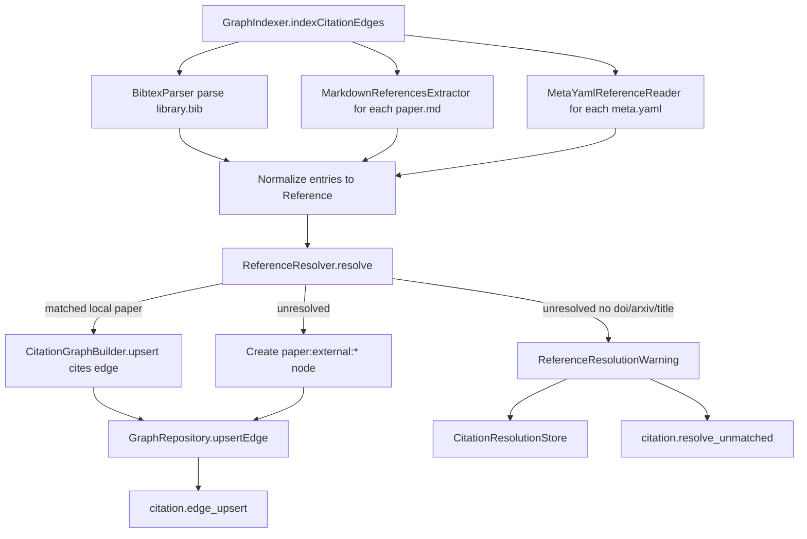
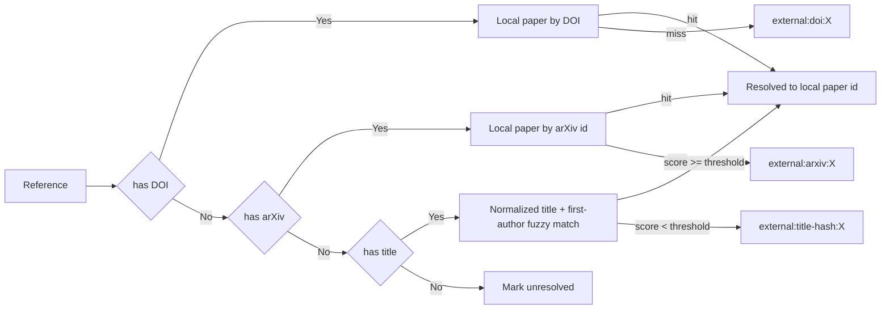
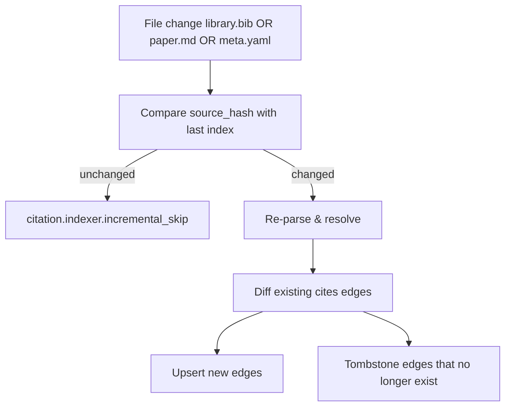

# 任务书 45：Citation Graph V1

更新时间：2026-05-07
状态：Draft（待 P44 Research Graph Data Model V1 落地后启动实施）
优先级：S1 / Roadmap Stage 2
承接：P44 已建立 `GraphRepository / GraphIndexer / GraphReadModel` 与 `paper / project / claim / evidence` 节点；P45 在此之上抽取本地论文之间的 `cites` 边。

---

## 1. 背景

P44 已经支持 `cites` 边的 schema，但 indexer 没有实际产出任何 citation edges。Sci-Station 当前与"引用关系"相关的能力只有：

```text
Sci-Station/Library/BibTeXFormatter.swift   // 写出 BibTeX；无解析能力
Sci-Station/Library/PaperRepository.swift   // 已能读 paper meta.yaml
library/refs/library.bib                     // workspace 里集中维护的 BibTeX 文件
library/papers/<id>/meta.yaml                // 单篇 paper 元数据（DOI、arXiv、title、authors、year）
library/papers/<id>/paper.md                 // 论文 Markdown，可能含 References / Bibliography section
```

P45 要把这些"分散在文件里的引用记录"聚合成 `cites` 边写入 graph，并对**本地无法解析**的引用产出 `unresolved warning`，以便 P46 UI / P47 agent 能展示 external placeholder。

### 1.1 设计约束

- **Local-only**：P45 不引入 Crossref / Semantic Scholar / Inspire 在线 API；这是 Sci-Station local-first 的硬约束。
- **不强制改写用户文件**：解析失败不会修改 meta.yaml / library.bib / paper.md。
- **可解释**：每条 `cites` 边必须能说出"来自 BibTeX entry X / paper.md References section line Y / meta.yaml `references` 字段"。
- **External Paper Placeholder**：当 reference 不能匹配到本地论文时，仍创建 `paper:external:<doi-or-arxiv-or-hash>` 节点，标记 `is_external: true`，让 P46 视图能区分。

---

## 2. 本轮目标

1. 实现 `BibtexParser`：解析 `library/refs/library.bib`，输出 `[BibtexEntry]`，含 `key, type, fields`（title、author、doi、eprint/arxiv、year、journal）。
2. 实现 `MarkdownReferencesExtractor`：从单篇 `paper.md` 中提取 References / Bibliography section 下的引用条目。
3. 实现 `MetaYamlReferenceReader`：读取 `meta.yaml` 中可选的 `references:` 字段（arr of `{ doi / arxiv_id / title / authors / year }`）。
4. 实现 `ReferenceResolver`：把抽取的 reference 解析到本地 paper id；优先 DOI / arXiv，fallback 到 normalized title + first-author 模糊。
5. 实现 `CitationGraphBuilder`：调用 P44 的 `GraphRepository` 写入 `cites` 边与 external paper 节点。
6. 把 `CitationGraphBuilder` 接入 P44 的 `GraphIndexer`，作为 `indexCitationEdges` 子方法。
7. 不解析的 reference 落到 `unresolved warning`（Project Dashboard、Graph UI 可见）。
8. 不引入网络请求；resolver 只用本地 metadata。
9. P45 的所有事件走 `citation.*` 命名空间。

---

## 3. 流程图

### 3.1 Citation Indexing 主路径



### 3.2 Reference Resolver 优先级



### 3.3 Incremental Update



---

## 4. 实施任务

> 命名：所有 citation 代码集中在 `Sci-Station/Graph/Citation/`。

- [ ] [P45.1] `BibtexParser`（新增 `Sci-Station/Graph/Citation/BibtexParser.swift`）
  - 纯 Swift 解析器，无第三方依赖。
  - 支持常见 BibTeX entry types：`@article / @inproceedings / @book / @misc / @techreport / @phdthesis / @incollection`。
  - 字段：`title / author / doi / eprint or arxiv / year / journal / pages / volume`；string concat、`@string` 简化处理；comments 忽略。
  - 提供 `parse(_:String) throws -> [BibtexEntry]`。

- [ ] [P45.2] `MarkdownReferencesExtractor`（新增 `Sci-Station/Graph/Citation/MarkdownReferencesExtractor.swift`）
  - 在 `paper.md` 中找 `## References` / `## Bibliography` heading，抽取下面的 list / numbered items。
  - 对每行 reference text，调用 `ReferenceTextNormalizer` 提取 DOI / arXiv id / title / first author / year。
  - 不解析的行保留原文，作为 `Reference.rawText`，让 resolver 后续 fuzzy 匹配。

- [ ] [P45.3] `MetaYamlReferenceReader`（新增 `Sci-Station/Graph/Citation/MetaYamlReferenceReader.swift`）
  - 读取 `meta.yaml` 中可选 `references:` array，每项含 `{ doi, arxiv, title, authors, year }`。
  - 不要求所有 paper 都填该字段；缺失即跳过。

- [ ] [P45.4] `ReferenceResolver`（新增 `Sci-Station/Graph/Citation/ReferenceResolver.swift`）
  - 输入：`[Reference]`、本地 paper index（DOI map、arXiv map、normalized title list）。
  - 优先级：DOI → arXiv → title fuzzy。
  - Fuzzy 算法：normalize title（lowercase、strip punctuation、合并 whitespace）+ first-author last name 比对；`Levenshtein <= 2 && first-author exact` 视为 match；阈值在测试中可调。
  - 不抛错；返回 `[ResolvedReference]`，每条带 `outcome: .matchedLocal(paperID) | .matchedExternal(externalNodeID, source: "doi" | "arxiv" | "title-hash") | .unresolved(rawText)`。

- [ ] [P45.5] `CitationGraphBuilder`（新增 `Sci-Station/Graph/Citation/CitationGraphBuilder.swift`）
  - 输入：source paper id + `[ResolvedReference]`。
  - 写入：
    - `cites` edge：`from = paper:<source>`, `to = paper:<target>`；payload 含 `evidence_source: "bibtex" | "paper_md" | "meta_yaml"`、`bibtex_key`（如有）、`raw_text` 截断到 200 字符（去敏感）。
    - external paper 节点：`paper:external:doi:<doi>` / `paper:external:arxiv:<id>` / `paper:external:title-hash:<sha1>`。
    - tombstone：上次 index 留下但本次没有的 edge。

- [ ] [P45.6] `CitationResolutionStore`（新增 `Sci-Station/Graph/Citation/CitationResolutionStore.swift`）
  - 持久化 `unresolved warnings`：`{ source_paper_id, raw_text, reason, last_seen_at }`，写入 `.sci-station/graph/citation_warnings.jsonl`。
  - 用于 P46 UI 中"Unresolved References" panel 与 Project Dashboard "Missing References Warnings"。

- [ ] [P45.7] 接入 `GraphIndexer`（修改 P44 `GraphIndexer.swift`）
  - 在 `run()` 中追加 `indexCitationEdges` 子步骤；按 `source_hash`（`library.bib` + 单篇 paper.md + meta.yaml）增量。

- [ ] [P45.8] AppViewModel 暴露 citation summary
  - `var citationSummary: CitationSummary { resolvedCount, unresolvedCount, externalCount, byProject }`。
  - 让 P42 Project Dashboard / P46 Graph UI 直接消费。

- [ ] [P45.9] 自动化与手动测试（详见 §6 / §7）。

- [ ] [P45.10] 文档与回归
  - 新建 `docs/development/manual-tests/MT15_CitationGraph.md`。
  - 在 `MT99_ReleaseRegression.md` 加 P45 partial regression（library.bib 解析、paper.md References 抽取、unresolved warnings 显示）。

---

## 5. 数据模型与伪代码

### 5.1 Reference 数据模型

```swift
public struct Reference: Hashable, Sendable {
    public let sourcePaperID: String       // local paper id
    public let evidenceSource: EvidenceSource
    public let bibtexKey: String?
    public let rawText: String
    public let doi: String?
    public let arxivID: String?
    public let normalizedTitle: String?
    public let firstAuthorLastName: String?
    public let year: Int?
}

public enum EvidenceSource: String, Codable, Sendable {
    case bibtex                            // library.bib
    case paperMarkdown = "paper_md"        // paper.md References section
    case metaYaml = "meta_yaml"            // meta.yaml references field
}

public enum ResolutionOutcome: Hashable, Sendable {
    case matchedLocal(paperID: String)
    case matchedExternal(externalNodeID: String, source: ExternalSource)
    case unresolved(reason: String)
}

public enum ExternalSource: String, Sendable {
    case doi, arxiv, titleHash
}
```

### 5.2 BibtexParser 主接口

```swift
public struct BibtexEntry: Hashable, Sendable {
    public let key: String                      // bibtex key, e.g. "garani2017"
    public let type: String                     // "article" / "inproceedings" / ...
    public let fields: [String: String]         // lowercase key
}

public struct BibtexParser {
    public func parse(_ text: String) throws -> [BibtexEntry]
}
```

简化解析规则：

```text
- Skip @comment / @preamble / @string blocks.
- Each entry begins with `@<type>{<key>,` and ends with matching `}`.
- Fields are `name = {value}` or `name = "value"`; nested braces preserved.
- Unicode escape (\textemdash etc.) 保留原文。
- 容错：遇到无法解析的 entry 时跳过 + 写 `citation.parse.skip` debug，不阻塞。
```

### 5.3 MarkdownReferencesExtractor 伪代码

```swift
struct MarkdownReferencesExtractor {
    static let referencesHeadings: Set<String> = [
        "references", "bibliography", "参考文献", "引用文献"
    ]

    func extract(from markdown: String) -> [String] {
        var lines = markdown.split(separator: "\n", omittingEmptySubsequences: false).map(String.init)
        guard let startIndex = lines.firstIndex(where: { isReferencesHeading($0) }) else { return [] }
        var collected: [String] = []
        var index = startIndex + 1
        while index < lines.count, !isAnotherTopHeading(lines[index]) {
            let line = lines[index].trimmingCharacters(in: .whitespacesAndNewlines)
            if isListItem(line) {
                collected.append(stripListMarker(line))
            } else if !line.isEmpty, var last = collected.last {
                last.append(" \(line)")
                collected[collected.count - 1] = last
            }
            index += 1
        }
        return collected
    }
}
```

### 5.4 ReferenceResolver 伪代码

```swift
struct ReferenceResolver {
    func resolve(
        _ reference: Reference,
        localIndex: LocalPaperIndex
    ) async -> ResolvedReference {
        if let doi = reference.doi {
            if let local = localIndex.byDOI[doi.lowercased()] {
                return ResolvedReference(reference: reference, outcome: .matchedLocal(paperID: local))
            }
            return ResolvedReference(reference: reference, outcome: .matchedExternal(
                externalNodeID: "paper:external:doi:\(doi.lowercased())",
                source: .doi
            ))
        }
        if let arxiv = reference.arxivID {
            if let local = localIndex.byArxiv[arxiv] {
                return ResolvedReference(reference: reference, outcome: .matchedLocal(paperID: local))
            }
            return ResolvedReference(reference: reference, outcome: .matchedExternal(
                externalNodeID: "paper:external:arxiv:\(arxiv)",
                source: .arxiv
            ))
        }
        if let title = reference.normalizedTitle {
            if let candidate = localIndex.fuzzyMatch(title: title, firstAuthor: reference.firstAuthorLastName) {
                return ResolvedReference(reference: reference, outcome: .matchedLocal(paperID: candidate.paperID))
            }
            let hash = SHA1.hex(title + (reference.firstAuthorLastName ?? ""))
            return ResolvedReference(reference: reference, outcome: .matchedExternal(
                externalNodeID: "paper:external:title-hash:\(hash)",
                source: .titleHash
            ))
        }
        return ResolvedReference(reference: reference, outcome: .unresolved(reason: "no_doi_arxiv_or_title"))
    }
}
```

### 5.5 CitationGraphBuilder 写入伪代码

```swift
actor CitationGraphBuilder {
    func updateCitations(for sourcePaperID: String, references: [ResolvedReference]) async throws {
        let nodeID = "paper:\(sourcePaperID)"
        let existing = await readModel.outgoingEdges(of: nodeID, kind: .cites)
        var keepEdgeIDs: Set<String> = []

        for reference in references {
            let targetID: String
            switch reference.outcome {
            case .matchedLocal(let paperID):
                targetID = "paper:\(paperID)"
            case .matchedExternal(let externalNodeID, let source):
                targetID = externalNodeID
                try await ensureExternalNode(externalNodeID, source: source, reference: reference)
            case .unresolved:
                try await warningStore.append(.init(
                    sourcePaperID: sourcePaperID,
                    rawText: reference.reference.rawText,
                    reason: "no_doi_arxiv_or_title",
                    lastSeenAt: Date()
                ))
                continue
            }

            let edgeID = "\(nodeID):cites:\(targetID)"
            keepEdgeIDs.insert(edgeID)
            try await repo.upsertEdge(GraphEdge(
                id: edgeID,
                kind: .cites,
                from: nodeID,
                to: targetID,
                weight: 1.0,
                payload: .object([
                    "evidence_source": .string(reference.reference.evidenceSource.rawValue),
                    "bibtex_key": .stringOrNull(reference.reference.bibtexKey),
                    "raw_text": .string(String(reference.reference.rawText.prefix(200)))
                ]),
                createdAt: Date(),
                updatedAt: Date(),
                sourceHash: reference.reference.computeHash(),
                lastIndexedAt: Date()
            ))
        }

        // Tombstone removed edges
        for edge in existing where !keepEdgeIDs.contains(edge.id) {
            try await repo.deleteEdge(id: edge.id)
            try? await debug.append(.init(event: "citation.edge_tombstone", payload: ["edge_id": .string(edge.id)]), in: root)
        }
    }
}
```

### 5.6 LocalPaperIndex

```swift
struct LocalPaperIndex {
    let byDOI: [String: String]                     // doi.lowercased() -> paperID
    let byArxiv: [String: String]                   // arxiv id -> paperID
    let byNormalizedTitle: [String: [PaperEntry]]   // normalizedTitle -> [paperID + firstAuthor + year]
    let titleNormalizer: TitleNormalizer

    func fuzzyMatch(title: String, firstAuthor: String?) -> PaperEntry? {
        // 1. exact normalized title match -> filter by author
        if let candidates = byNormalizedTitle[title] {
            if let firstAuthor, let exact = candidates.first(where: { $0.firstAuthorLastName == firstAuthor }) {
                return exact
            }
            return candidates.first
        }
        // 2. Levenshtein <= 2
        return byNormalizedTitle.lazy.compactMap { (key, candidates) -> PaperEntry? in
            guard Levenshtein.distance(key, title) <= 2 else { return nil }
            if let firstAuthor, let exact = candidates.first(where: { $0.firstAuthorLastName == firstAuthor }) {
                return exact
            }
            return candidates.first
        }.first
    }
}
```

### 5.7 Title Normalizer 规则

```text
- Lowercase
- Strip Markdown / LaTeX commands (\textit, \emph, $...$, **...**)
- Replace 中英文空白 -> single space
- Drop punctuation . , : ; ? ! ' " ` ( ) [ ] { } -- — ‐
- Trim whitespace
- 例：`The "Solar Capture" of Dark Matter` -> `the solar capture of dark matter`
```

---

## 6. 自动化测试

新增到 `Tools/SciStationCoreTestRunner/main.swift`：

```text
bibtexParserHandlesArticleAndInproceedings
bibtexParserSkipsCommentAndStringBlocks
bibtexParserPreservesNestedBraces
bibtexParserSkipsMalformedEntryWithoutCrash
markdownReferencesExtractorReadsReferencesSection
markdownReferencesExtractorMergesContinuationLines
metaYamlReferenceReaderRoundTripsArrayField
referenceResolverDOIWinsOverTitle
referenceResolverArxivFallsBackWhenNoDOI
referenceResolverFuzzyMatchUsesFirstAuthor
referenceResolverFuzzyMatchSkipsBelowThreshold
referenceResolverProducesExternalNodeOnMiss
citationGraphBuilderTombstonesRemovedEdges
citationGraphBuilderDedupesByEdgeID
citationGraphIndexerSkipsUnchangedSourceHash
citationResolutionStoreAppendsAndRoundtrips
localPaperIndexNormalizesTitlePunctuation
```

构建命令：

```bash
swift run SciStationCoreTestRunner
xcodebuild -project Sci-Station.xcodeproj -scheme Sci-Station -destination 'platform=macOS' build
```

---

## 7. 手动测试计划（MT15-P45）

新增到 `docs/development/manual-tests/MT15_CitationGraph.md`。

| ID | 标题 | 期望 |
|---|---|---|
| MT15-P45-01 | 预置 5 篇 paper + library.bib | indexer 完成后 graph 中 cites 边数与 BibTeX 引用条目一致；project dashboard 显示 citation summary |
| MT15-P45-02 | 引用未导入论文 | external paper 节点出现；标记 `is_external = true`；UI 显示 placeholder（P46 期间用文字 placeholder） |
| MT15-P45-03 | 完全无 DOI / arXiv / Title | unresolved warning 写入 `.sci-station/graph/citation_warnings.jsonl`；project dashboard 显示数量 |
| MT15-P45-04 | 修改 library.bib 删除一条 entry | 下次 indexer 后对应 cites 边被 tombstone；UI 不再显示 |
| MT15-P45-05 | paper.md 中 References section 异常（中文标题、缺失、无序列表） | 抽取不 crash；缺失时只跳过该 paper |
| MT15-P45-06 | 中文 title 模糊匹配 | normalized title 比较使用 lowercase + punctuation strip；中文 paper 之间也能 match |
| MT15-P45-07 | meta.yaml 中 `references` 与 BibTeX 同时存在 | 同一目标的两条来源去重为一个 edge；payload 中保留 `evidence_source` 集合 |
| MT15-P45-08 | 大数据：100+ paper, 1500+ references | indexer 完整跑 ≤ 5s（cold），增量 ≤ 1.5s |

---

## 8. Debug 与日志规范

| event | payload 字段 | 触发点 |
|---|---|---|
| `citation.parse.bibtex` | `entries_count, skipped_count, duration_ms` | BibTeX 解析完成 |
| `citation.parse.skip` | `bibtex_key, reason` | 单条 entry 解析失败 |
| `citation.parse.markdown` | `paper_id, refs_count, duration_ms` | paper.md References 抽取 |
| `citation.resolve_matched` | `source_paper_id, target_paper_id, via: "doi" \| "arxiv" \| "title_fuzzy"` | resolver 命中本地 |
| `citation.resolve_external` | `source_paper_id, external_node_id, via` | resolver 命中外部 |
| `citation.resolve_unmatched` | `source_paper_id, reason, has_doi: Bool, has_arxiv: Bool, has_title: Bool` | resolver 未命中 |
| `citation.edge_upsert` | `edge_id, from, to, evidence_sources: [String]` | 写入 cites edge |
| `citation.edge_tombstone` | `edge_id, reason` | tombstone 已不存在的 edge |
| `citation.indexer.incremental_skip` | `source: "library.bib" \| "paper.md:<id>" \| "meta.yaml:<id>"` | source_hash 未变 |
| `citation.indexer.error` | `phase, reason` | 任意阶段失败 |

脱敏：`raw_text` 在 debug event 中只截断 80 字符；避免在 debug 文件留下完整 reference 文本。

---

## 9. 非目标 / 验收标准 / Questions / 交付记录

### 9.1 非目标

```text
不调用 Crossref / Semantic Scholar / Inspire 在线 API
不修改用户 BibTeX / paper.md / meta.yaml
不实现 citation 自动补全（用户主动添加 reference 才被识别）
不抽取 inline 引用 \cite{X} 的行号（仅记录 References section 整体）
不做 paper-claim 级 citation（仅 paper-paper）
不做 cluster / community detection（属 P46）
不实现 citation graph UI（属 P46）
```

### 9.2 验收标准

1. P45 实施后 `cites` 边按本地数据正确写入 `GraphRepository`；external paper 节点正确创建；unresolved warnings 持久化。
2. 修改 library.bib / paper.md / meta.yaml 后 indexer 增量正确，删除条目后 edge 被 tombstone。
3. 100 paper / 1500 references 规模 indexer ≤ 5s cold，≤ 1.5s 增量。
4. Debug 事件按 §8 完整写入；不含完整 reference 全文。
5. SciStationCoreTestRunner / xcodebuild 全绿；MT15-P45-01..08 全部通过。

### 9.3 Questions / 风险

1. arXiv id 在 BibTeX 中字段名不统一（`eprint` / `archivePrefix` / `arxivId`）。倾向：扫描这 3 个字段，第一个非空者作为 arxiv id。
2. fuzzy match 阈值是否暴露给 Settings？倾向：不暴露；先固定 Levenshtein ≤ 2，记录 mismatch 给 P49 Recommendation 调参。
3. paper.md References section heading 多语言（中、英、日、法）。倾向：列入 §5.3 已知集合，未涵盖语言留 warning 而非抛错。
4. inline `\cite{X}` 是否处理？倾向：不处理；只识别 References / Bibliography section 整段。
5. cites 边是否需要附引用上下文（"according to [X], ..."）？倾向：P45 不附；待 P56 Writing Module 引入 claim id 后再加。

### 9.4 交付记录

完成实现后补充：

```text
完成日期：
Git commit：
自动化测试结果：
手动测试报告：docs/development/manual-tests/runs/YYYY-MM-DD_P45_CitationGraph.md
已知问题：
推迟到 P46 的事项：Citation Graph UI、unresolved warning panel UI
推迟到 P47 的事项：missing core paper 检测、reading path
推迟到 P56 的事项：claim 级 citation
```
