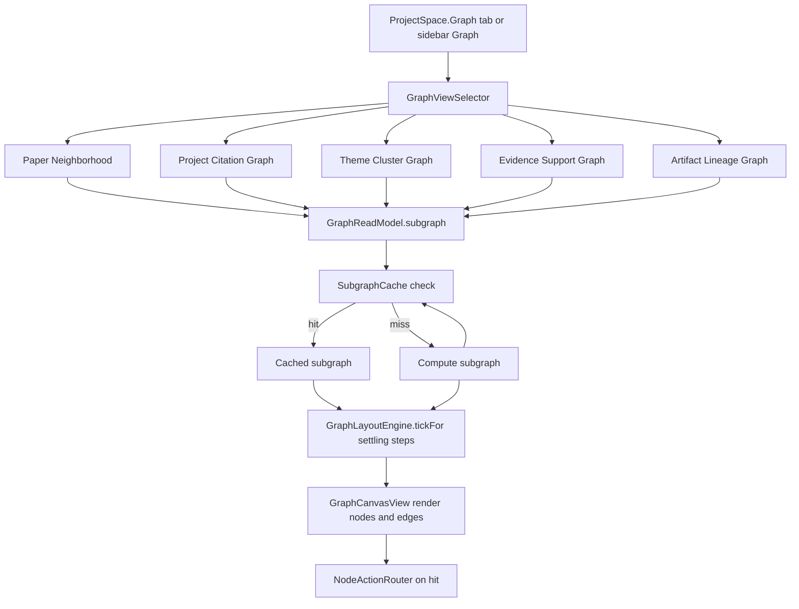
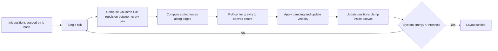
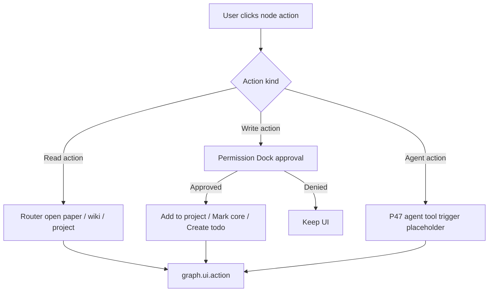

# 任务书 46：Graph UI V1

更新时间：2026-05-07
状态：Draft（待 P45 Citation Graph V1 落地后启动实施）
优先级：S1 / Roadmap Stage 2
承接：P44 提供 `GraphRepository / GraphReadModel`；P45 写入 `cites` 边与 external paper 节点；P43 已让 ProjectSpace 出现 Graph tab 当模块启用时；P46 把 graph 真正可视化。

---

## 1. 背景

P44 / P45 把 graph 数据准备到了"完整可读"的地步，但 Sci-Station 至今没有一个真正能交互的 graph 视图：

```text
Sci-Station/UI/WorkspaceSection.swift:.graph        // sidebar item 占位（P43 期间显示 placeholder）
Sci-Station/UI/...                                   // 无 GraphView 实现
```

P46 的核心工作不是"画一个炫酷的关系网"，而是"做一个**可操作**的工作面板"。每个节点必须能：

```text
Open Paper             跳到 Library 详情 / paper.md
Open Note              跳到 Wiki 页
Add to Project         把 paper 加入当前 project（走 ProjectPaperLinkRepository）
Mark as Core Paper     设置 project core paper（写入 project core_papers.md）
Create Todo            生成待办（走 TodoStore + Permission Dock）
Generate Reading Order 触发 P47 reading_path 工具
Explain Connection     触发 P47 explain_connection 工具（短答）
Find Bridge Papers     触发 P47 find_bridge_papers 工具
```

P46 自实现轻量 force-directed layout，不引入第三方依赖；以 `Canvas` + `GeometryReader` + 时间步进。规模优化：默认 depth=2、最多 200 节点显示，超出截断并提示。

---

## 2. 本轮目标

1. 5 个图谱视图：
   - **Paper Neighborhood**（中心一篇 paper，邻居 cites/cited_by/mentions）
   - **Project Citation Graph**（一个 project 的所有 paper 节点 + cites 边）
   - **Theme Cluster Graph**（按 wiki concept / method 节点聚类，paper 节点按 mentions 边相邻）
   - **Evidence Support Graph**（artifact → claim → evidence → paper）
   - **Artifact Lineage Graph**（artifact → run → approval → saved record）
2. 自实现 force-directed layout（Verlet integration + repulsion + spring + center gravity），固定种子保证测试可重现。
3. 节点动作：上述 8 个 action，写动作走 Permission Dock，读动作直接跳路由。
4. Subgraph 查询缓存（按 `(centerNodeID, depth, kindFilter)` 维度）；查询 ≤ 50ms。
5. 所有 GraphView 状态变化（subgraph 查询、layout tick、节点 action）写入 debug event。
6. P46 不实现 P47 的 graph-powered agent 工具；UI 只通过 placeholder action 触发"待 P47 接入"的提示。
7. P46 不引入第三方依赖（不引入 SwiftViz / Charts 之外）；只用 `SwiftUI Canvas`、`Path`、`Animation`。

---

## 3. 流程图

### 3.1 Graph View 渲染主路径



### 3.2 Layout Engine 主循环



### 3.3 Node Action Routing



---

## 4. 实施任务

> 命名：所有 graph UI 集中在 `Sci-Station/UI/Graph/`；layout 引擎集中在 `Sci-Station/Graph/Layout/`。

- [ ] [P46.1] `GraphView`（新增 `Sci-Station/UI/Graph/GraphView.swift`）
  - 顶部分段控件：5 个 view 切换；右上有 zoom / depth slider / kind filter 控件。
  - 中部 `GraphCanvasView` 渲染节点 + 边；底部 `NodeInspectorPanel` 显示选中节点详情与 actions。

- [ ] [P46.2] `GraphCanvasView`（新增 `Sci-Station/UI/Graph/GraphCanvasView.swift`）
  - 用 `Canvas` API 一帧画完所有节点与边。
  - 节点形状：paper = 圆点（按 cited_by 数量调直径）；project = 圆角方；concept/method = 菱形；artifact = 六边形；evidence = 小方块；external = 灰色环。
  - 边：cites = 实线箭头；mentions = 虚线；supports = 绿色；contradicts = 红色；其余按 P44 schema 约定上色。

- [ ] [P46.3] `GraphLayoutEngine`（新增 `Sci-Station/Graph/Layout/GraphLayoutEngine.swift`）
  - 输入 `GraphSubgraph`、`canvasSize`、`seed`。
  - 算法：每帧应用 Coulomb-style repulsion、Hooke spring、中心 gravity；damping 0.85；step 内 cap velocity；固定迭代次数（默认 200）或 energy 阈值收敛。
  - 输出 `[NodeID: CGPoint]`，确定性（同一输入 + 同一 seed 出同一结果）。

- [ ] [P46.4] `SubgraphCache`（新增 `Sci-Station/Graph/Layout/SubgraphCache.swift`）
  - key：`(viewKind, centerNodeID, depth, kindFilter)`；value：`GraphSubgraph + lastBuiltAt`。
  - LRU 容量 32；接收 `GraphReadModel.subscribeChanges()` 失效。

- [ ] [P46.5] `NodeActionRouter`（新增 `Sci-Station/UI/Graph/NodeActionRouter.swift`）
  - 8 个 action 的统一入口；写动作集中走 Permission Dock。
  - "Add to Project" 调 `ProjectPaperLinkRepository`；"Mark as Core" 调 `ProjectCorePapersStore`；"Create Todo" 走 P38 Draft Inbox（生成 `todo_draft` artifact）；"Generate Reading Order" / "Explain Connection" / "Find Bridge Papers" 写 placeholder（P47 才接入）。

- [ ] [P46.6] `NodeInspectorPanel`（新增 `Sci-Station/UI/Graph/NodeInspectorPanel.swift`）
  - 显示节点 displayName、kind、connected counts、payload（脱敏）。
  - Action 按钮按节点 kind 动态启用：paper 节点能 Open / Add to Project / Mark Core / Create Todo / Generate Reading Order；artifact 节点显示 lineage 跳转；external paper 显示 External Placeholder + Add Local Paper 提示。

- [ ] [P46.7] 5 个视图实现
  - **Paper Neighborhood**：以选中 paper 为中心 depth=2，kind filter 默认 `{cites, mentions, supports}`。
  - **Project Citation Graph**：以 project 节点为中心，扩到 belongs_to 的 paper，再 cites 一跳。
  - **Theme Cluster Graph**：取 project 内 wiki concept / method 节点 + 通过 mentions 连接的 paper；按 louvain-like 简单聚类（仅按 mentions 共同邻居数）。
  - **Evidence Support Graph**：从一个 artifact 节点出发，沿 supports / generated_by 反向，到 evidence / paper。
  - **Artifact Lineage Graph**：从 artifact 节点出发沿 generated_by / approved_by 到 run / approval。

- [ ] [P46.8] 性能与降级
  - subgraph 节点数 > 200 时，自动收缩 depth；UI 顶部显示 `Showing 200 of N nodes (try lowering depth)` 提示。
  - 每秒 layout tick 自动停止（settled 后只在交互时重启）；CPU 不应持续占用。

- [ ] [P46.9] 自动化与手动测试（详见 §6 / §7）。

- [ ] [P46.10] 文档与回归
  - 新建 `docs/development/manual-tests/MT16_GraphUI.md`。
  - 在 `MT99_ReleaseRegression.md` 加 P46 partial regression（Graph tab 打开、5 个视图切换、节点 action）。

---

## 5. 数据模型与伪代码

### 5.1 GraphViewKind

```swift
enum GraphViewKind: String, CaseIterable, Sendable {
    case paperNeighborhood = "paper_neighborhood"
    case projectCitation = "project_citation"
    case themeCluster = "theme_cluster"
    case evidenceSupport = "evidence_support"
    case artifactLineage = "artifact_lineage"
}

struct GraphViewState: Equatable {
    var kind: GraphViewKind
    var centerNodeID: String?
    var depth: Int
    var kindFilter: Set<GraphEdgeKind>
    var zoom: CGFloat
    var pan: CGPoint
    var selectedNodeID: String?
}
```

### 5.2 Force-Directed Layout 伪代码

```swift
struct GraphLayoutEngine {
    struct Config {
        var repulsion: Double = 6_000
        var springLength: Double = 80
        var springStrength: Double = 0.05
        var gravity: Double = 0.02
        var damping: Double = 0.85
        var maxVelocity: Double = 12
        var maxIterations: Int = 200
        var energyThreshold: Double = 0.5
    }

    func layout(_ subgraph: GraphSubgraph, canvasSize: CGSize, seed: UInt64, config: Config = .init()) -> [String: CGPoint] {
        var positions = initialPositions(subgraph, canvasSize: canvasSize, seed: seed)
        var velocities = positions.mapValues { _ in CGPoint.zero }

        for iteration in 0..<config.maxIterations {
            var forces = positions.mapValues { _ in CGPoint.zero }

            // Repulsion (O(n^2), node count <= 200)
            for (i, a) in positions.enumerated() {
                for (j, b) in positions.enumerated() where j > i {
                    let dx = a.value.x - b.value.x
                    let dy = a.value.y - b.value.y
                    let dist = max(sqrt(dx*dx + dy*dy), 0.01)
                    let force = config.repulsion / (dist * dist)
                    let fx = force * (dx / dist)
                    let fy = force * (dy / dist)
                    forces[a.key]! += CGPoint(x: fx, y: fy)
                    forces[b.key]! += CGPoint(x: -fx, y: -fy)
                }
            }

            // Springs along edges
            for edge in subgraph.edges {
                guard let pa = positions[edge.from], let pb = positions[edge.to] else { continue }
                let dx = pa.x - pb.x
                let dy = pa.y - pb.y
                let dist = max(sqrt(dx*dx + dy*dy), 0.01)
                let displacement = dist - config.springLength
                let force = displacement * config.springStrength
                let fx = force * (dx / dist)
                let fy = force * (dy / dist)
                forces[edge.from]! -= CGPoint(x: fx, y: fy)
                forces[edge.to]! += CGPoint(x: fx, y: fy)
            }

            // Gravity to centre
            let centre = CGPoint(x: canvasSize.width / 2, y: canvasSize.height / 2)
            for key in positions.keys {
                let toCentre = CGPoint(x: centre.x - positions[key]!.x, y: centre.y - positions[key]!.y)
                forces[key]! += CGPoint(x: toCentre.x * config.gravity, y: toCentre.y * config.gravity)
            }

            // Update velocities and positions
            var totalEnergy = 0.0
            for key in positions.keys {
                var velocity = velocities[key]! + forces[key]!
                velocity = velocity.scaled(by: config.damping)
                velocity = velocity.clamped(to: config.maxVelocity)
                velocities[key] = velocity
                positions[key]! = (positions[key]! + velocity).clamped(to: canvasSize)
                totalEnergy += velocity.x * velocity.x + velocity.y * velocity.y
            }

            if totalEnergy < config.energyThreshold {
                debug("graph.ui.layout_tick", payload: ["iterations": .number(Double(iteration)), "energy": .number(totalEnergy)])
                break
            }
        }
        return positions
    }
}
```

### 5.3 SubgraphCache 伪代码

```swift
actor SubgraphCache {
    struct Key: Hashable {
        let viewKind: GraphViewKind
        let centerNodeID: String
        let depth: Int
        let kindFilter: Set<GraphEdgeKind>
    }

    private var lru: [(Key, GraphSubgraph)] = []
    private let capacity = 32

    func get(_ key: Key) -> GraphSubgraph? {
        guard let index = lru.firstIndex(where: { $0.0 == key }) else { return nil }
        let entry = lru.remove(at: index)
        lru.append(entry)
        return entry.1
    }

    func put(_ key: Key, _ subgraph: GraphSubgraph) {
        if let index = lru.firstIndex(where: { $0.0 == key }) {
            lru.remove(at: index)
        }
        lru.append((key, subgraph))
        if lru.count > capacity {
            lru.removeFirst()
        }
    }

    func invalidateAll() {
        lru.removeAll()
    }
}
```

### 5.4 节点形状 / 边样式约定

```text
GraphNodeKind        Shape          Size signal              Color
-------------        ------         ----------               ------
paper                circle         degree(cited_by)         primary
project              rounded rect   fixed                    accent
concept              diamond        deg(mentions)            secondary
method               diamond        deg(mentions)            secondary
dataset              diamond        deg(uses)                tertiary
claim                rounded square fixed                    warning
evidence             square         fixed                    secondary
task                 circle small   fixed                    accent
artifact             hexagon        fixed                    accent
calendar_event       triangle       fixed                    secondary
run                  octagon        fixed                    secondary
approval             star small     fixed                    accent
external paper       circle ring    smaller                  greyed

GraphEdgeKind        Style
cites                solid arrow
mentions             dashed line
supports             green solid
contradicts          red dashed
extends              orange solid
uses                 grey solid
belongs_to           thin grey
related_to           dotted thin
generated_by         purple
approved_by          brown
scheduled_for        thin dashed
```

### 5.5 NodeActionRouter API

```swift
enum NodeAction: Hashable {
    case openPaper(paperID: String)
    case openWikiPage(path: String)
    case addToProject(paperID: String, projectID: String)
    case markAsCore(paperID: String, projectID: String)
    case createTodo(targetNodeID: String, title: String)
    case generateReadingOrder(centerPaperID: String)        // P47 placeholder
    case explainConnection(fromID: String, toID: String)    // P47 placeholder
    case findBridgePapers(fromID: String, toID: String)     // P47 placeholder
}

actor NodeActionRouter {
    func handle(_ action: NodeAction, in viewState: GraphViewState) async {
        switch action {
        case .openPaper(let paperID):
            await appModel.openPaper(id: paperID)
            await debug.append(.init(event: "graph.ui.action", payload: ["action": .string("open_paper"), "node": .string("paper:\(paperID)")]), in: root)
        case .addToProject(let paperID, let projectID):
            let approved = await permissionDock.requestApproval(.linkPaperToProject(paperID: paperID, projectID: projectID))
            guard approved else { return }
            try? await projectPaperLinks.link(paperID: paperID, projectID: projectID)
        case .markAsCore(let paperID, let projectID):
            let approved = await permissionDock.requestApproval(.updateCorePapers(paperID: paperID, projectID: projectID))
            guard approved else { return }
            try? await corePapersStore.mark(paperID: paperID, projectID: projectID)
        case .createTodo(let targetNodeID, let title):
            try? await draftInbox.appendDraft(.init(kind: "todo_draft", title: title, evidenceRefs: [.graphNode(targetNodeID)]))
        case .generateReadingOrder, .explainConnection, .findBridgePapers:
            await appModel.showGraphActionPlaceholder(reason: "available_in_p47")
        case .openWikiPage(let path):
            await appModel.openMarkdownDocument(relativePath: path)
        }
    }
}
```

---

## 6. 自动化测试

新增到 `Tools/SciStationCoreTestRunner/main.swift`：

```text
graphLayoutEngineDeterministicWithFixedSeed
graphLayoutEngineConvergesUnderEnergyThreshold
graphLayoutEngineRespectsMaxIterations
subgraphCacheLRUEvictsOldestKey
subgraphCacheInvalidatesOnGraphChange
nodeActionRouterRequiresApprovalForWriteActions
nodeActionRouterCreatesTodoDraftViaInbox
graphViewKindFilterRemovesUnselectedEdges
paperNeighborhoodHonorsDepthLimit
artifactLineageReturnsRunAndApprovalNodes
graphCanvasViewRenderingDoesNotLayoutWhenSettled
graphCanvasViewSnapshotMatchesGoldenForSeed42
```

构建命令：

```bash
swift run SciStationCoreTestRunner
xcodebuild -project Sci-Station.xcodeproj -scheme Sci-Station -destination 'platform=macOS' build
```

---

## 7. 手动测试计划（MT16-P46）

新增到 `docs/development/manual-tests/MT16_GraphUI.md`。

| ID | 标题 | 期望 |
|---|---|---|
| MT16-P46-01 | 打开 Graph tab | 5 个视图分段控件可见；默认 Paper Neighborhood；空数据状态显示提示 |
| MT16-P46-02 | 切换视图 | 5 个视图都能渲染，layout 收敛 ≤ 1s（150 节点） |
| MT16-P46-03 | 调整 depth slider | depth 1/2/3 切换；节点数变化；超出 200 时自动截断 + 提示 |
| MT16-P46-04 | 节点选中 + Inspector | 点击节点显示 Inspector；Open Paper / Add to Project / Mark Core / Create Todo 按钮按 kind 动态启用 |
| MT16-P46-05 | Mark as Core 走 Permission Dock | 弹出审批；批准后 `projects/<id>/wiki/projects/core_papers.md` 更新；拒绝后无变化 |
| MT16-P46-06 | Create Todo from node | Draft Inbox 出现 todo_draft；evidenceRefs 含 graph node id |
| MT16-P46-07 | Generate Reading Order | UI 显示 placeholder ("available_in_p47")；写 graph.ui.action 事件 |
| MT16-P46-08 | External paper 节点 | 灰色环；Inspector 显示 External + 不允许 Add to Project（提示先导入论文） |
| MT16-P46-09 | Theme Cluster Graph | concept/method 节点为菱形；mentions 边为虚线 |
| MT16-P46-10 | Evidence Support Graph | claim → supports → evidence → paper 链路渲染正确 |
| MT16-P46-11 | Artifact Lineage Graph | artifact → run → approval 链路渲染正确 |
| MT16-P46-12 | 大数据 | 500 节点时 layout 仍能渲染（自动截断到 200）；CPU 在 settle 后降到空闲 |

---

## 8. Debug 与日志规范

| event | payload 字段 | 触发点 |
|---|---|---|
| `graph.ui.subgraph_query` | `view_kind, center_node_id, depth, kind_filter, hit: Bool, node_count, edge_count, duration_ms` | 每次 subgraph 加载 |
| `graph.ui.layout_tick` | `view_kind, iterations, energy, settled: Bool, duration_ms` | layout 收敛或截止 |
| `graph.ui.action` | `action, node, target_id, view_kind, approved: Bool?` | 节点动作 |
| `graph.ui.view_change` | `from, to` | 5 个视图切换 |
| `graph.ui.node_select` | `node_id, kind` | 节点选中 |
| `graph.ui.degraded` | `reason: "node_cap_exceeded" \| "depth_reduced" \| "no_data"` | UI 自动降级 |

脱敏：所有 payload 不含 paper title / claim 文本 / evidence 全文；只 id + kind + count。

---

## 9. 非目标 / 验收标准 / Questions / 交付记录

### 9.1 非目标

```text
不引入第三方 layout / charting 库
不实现 GraphView 与 Markdown 拖拽融合（仅独立 tab）
不接入 P47 agent 工具（generate_reading_order / explain_connection / find_bridge_papers 仅 placeholder）
不做大于 500 节点的优化（采用截断）
不做 GPU layout（pure CPU）
不做 graph 编辑（节点创建 / 边添加只走 indexer）
不引入 universal links / deeplink
```

### 9.2 验收标准

1. 5 个视图渲染正确；layout 在 200 节点规模 ≤ 1s 收敛；超出截断并提示。
2. 节点动作按 §5.5 闭环；写动作走 Permission Dock；agent 动作显示 P47 placeholder。
3. SubgraphCache LRU 行为正确；GraphRepository 变更后自动失效。
4. Layout 在固定 seed 下 deterministic（自动化测试 golden 对比）。
5. Debug 事件按 §8 完整写入；不含敏感文本。
6. SciStationCoreTestRunner / xcodebuild 全绿；MT16-P46-01..12 全部通过。

### 9.3 Questions / 风险

1. force-directed 在 200 节点已经 O(n^2)；是否需要 Barnes-Hut quadtree 优化？倾向：暂不；200 节点 O(n^2) ≈ 40k 比较，可接受。
2. Theme Cluster 是否引入聚类算法？倾向：使用简单 "shared mentions count" 给每对 concept 加边权，layout 自然聚类；不做 Louvain。
3. external paper 是否允许 "Convert to Local"（导入论文）？倾向：UI 显示按钮但实际跳到 Library 导入流程；不在 Graph 视图内做导入。
4. 节点放大率（按 cited_by）是否会让 hub paper 太大？倾向：log scale + clamp `radius ∈ [6, 20]`。
5. 性能瓶颈是否会在大量边？倾向：是；500 边以上 stroke 渲染会卡顿；P46 不优化，留 P58 release hardening。

### 9.4 交付记录

完成实现后补充：

```text
完成日期：
Git commit：
自动化测试结果：
手动测试报告：docs/development/manual-tests/runs/YYYY-MM-DD_P46_GraphUI.md
已知问题：
推迟到 P47 的事项：generate_reading_order / explain_connection / find_bridge_papers 工具
推迟到 P58 的事项：500+ 节点性能优化
```
