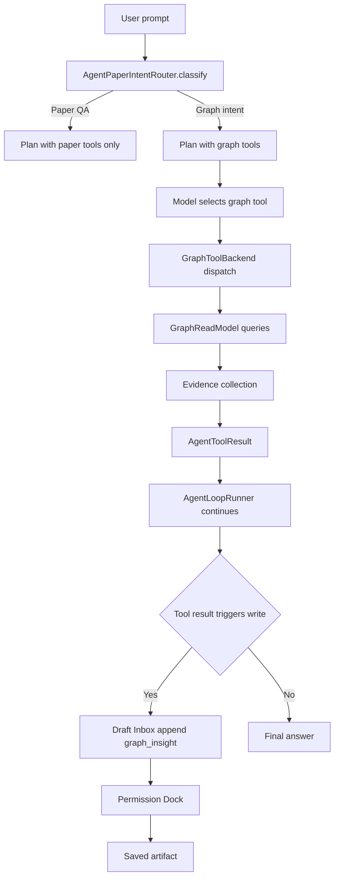

# 任务书 47：Graph-Powered Research Workflows

更新时间：2026-05-07
状态：Done（2026-05-12 已实现；手动 MT17 待执行）
优先级：S1 / Roadmap Stage 2
承接：P44 提供 graph schema；P45 写入 cites 边；P46 让用户能在 UI 中浏览 graph；P47 让 agent 反向利用 graph 推动研究工作。

---

## 1. 背景

Graph 落地后最有价值的不是"看一眼图"，而是让 agent **基于 graph 做研究操作**：

- 我项目的核心论文里，缺哪几篇高引用 paper 没引？
- 这两篇 paper 之间有 path 吗？通过哪几篇 bridge？
- 哪些 saved artifact 含 unsupported claim 或 stale evidence？
- 我读完这 5 篇 paper 之后下一步该读哪篇？

P39 已经声明 `citation-graph / recommendation` 模块；P39 的 `workflowRequirements` 也已经预留 `citation_graph_review` workflow。但 agent 的工具集合（`Sci-Station/Agent/AgentBuiltInTools.swift`）里还没有任何 graph 工具：

```text
list_papers, read_paper, read_paper_section, search_papers, write_markdown_plan, ...
（无 graph 工具）
```

P47 在不破坏 P38 Draft Inbox / Permission Dock 闭环的前提下，给 agent 增加 7 个 graph-backed 工具，并把这些工具按 module 路由插到 `related_work / gap_planning / paper_reading / citation_graph_review / research_queue_update` workflow。

---

## 2. 本轮目标

1. 实现 7 个 graph-backed agent 工具：

   ```text
   find_missing_core_papers
   generate_reading_path
   detect_stale_citations
   find_unsupported_artifact_claims
   find_stale_saved_artifacts
   find_method_lineage
   find_bridge_papers
   ```

2. 工具一律 `risk: .readOnly`，但任何"由工具结果触发的写入"（创建 todo / 修改 core papers / 新建 wiki）必须落到 P38 Draft Inbox 并由 Permission Dock 审批。
3. 扩展 `AgentPaperIntentRouter` 识别 graph 相关意图（"哪些 paper 我没引"、"读完之后下一篇是什么"），自动选择 graph 工具。
4. 把 7 个工具按 module 注册到 `WorkspaceModuleRegistry.workflowRequirements`，让 P39 / P41 的 workflow gating 自动接管。
5. P46 UI 中 `Generate Reading Order / Explain Connection / Find Bridge Papers` 三个 placeholder 真正接到工具。
6. 工具结果归档到 `evidence` 节点 + Draft Inbox（kind = `graph_insight`），让用户在 Draft Inbox 里看到 "由 X 工具产生的发现"。
7. 不引入新的网络请求；所有计算都在 P44 GraphReadModel 之上。
8. 所有工具调用都对应 `agent.tool.graph_*` debug event。

---

## 3. 流程图

### 3.1 Agent 调用 graph 工具的主路径



### 3.2 generate_reading_path 主路径

```mermaid
flowchart LR
    request[generate_reading_path centerPaperID, projectID, k=10] --> subgraph[GraphReadModel.subgraph paper depth=3 cites]
    subgraph --> rank[ReadingPathRanker.score by]
    rank --> a[deg cited by within project]
    rank --> b[recency year]
    rank --> c[on path from project core]
    rank --> d[frescness of evidence]
    a --> path[Topological order over cites edges]
    b --> path
    c --> path
    d --> path
    path --> result[Reading path top k papers]
```

### 3.3 find_unsupported_artifact_claims

```mermaid
flowchart TD
    request[find_unsupported_artifact_claims projectID] --> drafts[ArtifactRecordStore.savedArtifacts projectID]
    drafts --> claims[For each artifact iterate claim nodes]
    claims --> graph[GraphReadModel.outEdges of claim filter supports]
    graph --> health[Compute support coverage and freshness]
    health --> filtered[Where support coverage < threshold or any stale]
    filtered --> result[List of unsupported claims with evidence ids]
    result --> debug[agent.tool.graph_query]
```

---

## 4. 实施任务

> 命名：所有 graph 工具集中在 `Sci-Station/Agent/Graph/`；工具 dispatch 注册在 `Sci-Station/Agent/AgentBuiltInTools.swift` 的 register 表里。

- [x] [P47.1] `GraphToolBackend`（新增 `Sci-Station/Agent/Graph/GraphToolBackend.swift`）
  - actor，注入 `GraphReadModel / DraftInboxStore / ProjectCorePapersStore / ArtifactRecordStore / PaperRepository`。
  - 提供 7 个 `func handle<ToolName>(_ args: ToolArgs) async throws -> AgentToolResult`。

- [x] [P47.2] `find_missing_core_papers`
  - 输入：`{ project_id: String, k: Int = 10, min_citations: Int = 3 }`。
  - 算法：
    1. 取 project core papers set `C`。
    2. 取 graph 中所有被 `C` 中 paper cites 的 target paper 集合 `T`（一跳 cited）。
    3. 过滤 `T` 中已经在 project 内的 paper（`belongs_to`）。
    4. 按 `cited_by` 度数（来自 `C` 内）降序排序，取前 k 个。
    5. 输出 `{ candidates: [{ paper_id_or_external, cited_by_count, sample_citing_papers }], project_id }`。

- [x] [P47.3] `generate_reading_path`
  - 输入：`{ center_paper_id: String, project_id: String?, k: Int = 10 }`。
  - 算法：
    1. 取 center paper 的 cites + cited_by 子图，depth ≤ 3。
    2. 对子图节点打分（deg / recency / on path from project core / freshness）。
    3. 按 cites 边做拓扑排序，得到合理阅读顺序。
    4. 输出 `{ ordered_papers: [{ paper_id, score, reason }], total_count }`。

- [x] [P47.4] `detect_stale_citations`
  - 输入：`{ project_id: String?, threshold_days: Int = 730 }`。
  - 算法：找出 `cites` 边中 `target paper.year + threshold_days < now` 且 `target paper` 没有更新版本（无 `extends` 边指向较新 paper）的 cites。
  - 输出 `{ stale_edges: [{ from, to, target_year, suggested_newer: String? }] }`。

- [x] [P47.5] `find_unsupported_artifact_claims`
  - 输入：`{ project_id: String?, severity: "warning" | "error" = "warning" }`。
  - 算法：迭代 `artifact` 节点 → 查 `claim` 节点（含 `:root` 隐式 claim）→ 查 `supports` 边的 `evidence` 节点；coverage 不足或 evidence stale 时输出。
  - 输出 `{ items: [{ artifact_id, claim_id, missing_evidence: Bool, stale_evidence: [evidence_id] }] }`。

- [x] [P47.6] `find_stale_saved_artifacts`
  - 输入：`{ project_id: String?, threshold_days: Int = 90 }`。
  - 算法：扫描 `artifact` 节点 with `status == saved`；如果 `lastIndexedAt + threshold_days < now` 或任意 supporting evidence 已被 P37 标 stale，则输出。
  - 输出 `{ items: [{ artifact_id, last_indexed_at, reason }] }`。

- [x] [P47.7] `find_method_lineage`
  - 输入：`{ method_node_id: String, depth: Int = 3 }`。
  - 算法：对 `method` 节点向 `extends` / `uses` 双向 BFS，构造 lineage chain；返回 ordered chain。

- [x] [P47.8] `find_bridge_papers`
  - 输入：`{ from_paper_id: String, to_paper_id: String, max_depth: Int = 5 }`。
  - 算法：`GraphReadModel.path(from:to:maxDepth:)`；输出 path 上的 paper 节点（去掉 project / artifact 节点）。

- [x] [P47.9] `AgentPaperIntentRouter` 升级（修改 `Sci-Station/Agent/AgentPaperIntentRouter.swift`）
  - 加 graph intent 识别关键词：
    - `没引 / 漏引 / missing / not cited` → `find_missing_core_papers`
    - `读完 / 之后 / next paper / reading order` → `generate_reading_path`
    - `引文是否过时 / outdated / stale citation` → `detect_stale_citations`
    - `unsupported / 缺乏证据 / which claims` → `find_unsupported_artifact_claims`
    - `两篇之间 / between / bridge` → `find_bridge_papers`
    - `方法发展 / lineage / evolved from` → `find_method_lineage`
  - 不破坏现有 paper QA 路由。

- [x] [P47.10] AgentBuiltInTools 注册
  - 在 `Sci-Station/Agent/AgentBuiltInTools.swift` 的工具注册表中加入 7 个新工具。
  - 每个工具的 `permissionKey` 都是 `graph.read`，`risk: .readOnly`，`requiresConfirmation: false`。

- [x] [P47.11] WorkspaceModuleRegistry workflows 更新
  - 在 `WorkspaceModuleRegistry.workflowRequirements` 中给以下 workflow 加 graph 依赖：

    ```text
    related_work       += [citation-graph]
    gap_planning       += [citation-graph]
    citation_graph_review += [citation-graph]
    research_queue_update += [citation-graph, recommendation]
    ```

  - 注意：依赖加上后，模块未启用时这些 workflow 自动隐藏（P39 已实现 gating）。

- [x] [P47.12] Draft Inbox 集成
  - 工具结果中"值得保存"的发现（`find_missing_core_papers / find_unsupported_artifact_claims / find_stale_saved_artifacts`）自动追加 `graph_insight` artifact draft，evidenceRefs 含 graph node id 列表。
  - 用户可以在 Draft Inbox 看到："Missing core paper 推荐 5 篇"，点击 review → Permission Dock → save 到 wiki / project。

- [x] [P47.13] P46 placeholder action 接入
  - `NodeActionRouter.handle(.generateReadingOrder)` / `.explainConnection` / `.findBridgePapers` 不再显示 placeholder，而是触发 `agent.run(workflow: "graph_insight", initialPrompt: ...)`。
  - 触发后跳到 AI Lab 显示 run timeline。

- [x] [P47.14] 自动化与手动测试（详见 §6 / §7）。

- [x] [P47.15] 文档与回归
  - 新建 `docs/development/manual-tests/MT17_GraphWorkflows.md`。
  - 在 `MT07_AILab.md` 与 `MT99_ReleaseRegression.md` 加 P47 partial regression（graph 工具调用、Draft Inbox graph_insight 条目、Permission Dock writeback）。
  - 更新 `Long Term Plan.md` 中 P47 摘要的"已落地"备注。

---

## 5. 数据模型与伪代码

### 5.1 `find_missing_core_papers` 伪代码

```swift
struct FindMissingCorePapersHandler {
    func handle(_ args: FindMissingCorePapersArgs, context: AgentToolContext) async throws -> AgentToolResult {
        let projectID = try args.projectID.required()
        let coreIDs = try await corePapersStore.coreIDs(for: projectID)
        guard !coreIDs.isEmpty else {
            return AgentToolResult(succeeded: true, message: "Project has no core papers; mark some first", payload: .object([:]))
        }

        var candidateScores: [String: Int] = [:]
        var sampleCitingPapers: [String: [String]] = [:]
        for coreID in coreIDs {
            let outgoing = await readModel.outgoingEdges(of: "paper:\(coreID)", kind: .cites)
            for edge in outgoing {
                if let projectMembership = await readModel.edge(id: "\(edge.to):belongs_to:project:\(projectID)") {
                    _ = projectMembership
                    continue                                         // already in project
                }
                candidateScores[edge.to, default: 0] += 1
                sampleCitingPapers[edge.to, default: []].append(coreID)
            }
        }

        let filtered = candidateScores
            .filter { $0.value >= args.minCitations }
            .sorted { $0.value > $1.value }
            .prefix(args.k)
            .map { (id, count) -> JSONValue in
                .object([
                    "paper_node_id": .string(id),
                    "cited_by_count": .number(Double(count)),
                    "sample_citing_papers": .array(sampleCitingPapers[id, default: []].map { .string("paper:\($0)") })
                ])
            }

        await debug.append(.init(event: "agent.tool.graph_query", payload: .object([
            "tool": .string("find_missing_core_papers"),
            "project_id": .string(projectID),
            "result_size": .number(Double(filtered.count))
        ])), in: root)

        try await draftInbox.append(.init(
            kind: "graph_insight",
            title: "Missing core papers — project \(projectID)",
            evidenceRefs: filtered.compactMap { extractNodeID($0) }
        ))

        return AgentToolResult(
            succeeded: true,
            message: "Found \(filtered.count) candidate(s). See Draft Inbox > graph_insight to review.",
            payload: .object(["candidates": .array(Array(filtered)), "project_id": .string(projectID)])
        )
    }
}
```

### 5.2 `generate_reading_path` 伪代码

```swift
struct ReadingPathRanker {
    func score(_ candidate: GraphNode, in subgraph: GraphSubgraph, projectID: String?) -> Double {
        let degree = Double(subgraph.degree(of: candidate.id, kind: .cites))
        let recency = candidate.year.map { 1.0 / max(Double(2026 - $0), 1.0) } ?? 0
        let onPathFromCore = projectID.flatMap { id in
            subgraph.path(from: "project:\(id)", to: candidate.id, kinds: [.belongsTo, .cites])
        } != nil ? 0.3 : 0.0
        let freshness = candidate.payload.bool("evidence_fresh") == true ? 0.2 : 0
        return degree * 0.5 + recency * 0.2 + onPathFromCore + freshness
    }
}

struct GenerateReadingPathHandler {
    func handle(_ args: GenerateReadingPathArgs, context: AgentToolContext) async throws -> AgentToolResult {
        let center = try args.centerPaperID.required()
        let subgraph = await readModel.subgraph(centerNodeID: "paper:\(center)", depth: 3, kinds: [.cites, .belongsTo])
        let ranker = ReadingPathRanker()
        let scored = subgraph.nodes
            .filter { $0.kind == .paper && $0.id != "paper:\(center)" }
            .map { ($0, ranker.score($0, in: subgraph, projectID: args.projectID)) }
            .sorted { $0.1 > $1.1 }
        let topology = TopologicalSort.over(edges: subgraph.edges.filter { $0.kind == .cites })

        let ordered = topology
            .filter { id in scored.contains { $0.0.id == id } }
            .prefix(args.k)
            .compactMap { id -> JSONValue? in
                guard let pair = scored.first(where: { $0.0.id == id }) else { return nil }
                return .object([
                    "paper_node_id": .string(pair.0.id),
                    "score": .number(pair.1),
                    "reason": .string(makeReason(for: pair.0, score: pair.1))
                ])
            }

        return AgentToolResult(
            succeeded: true,
            message: "Recommended reading order (\(ordered.count) papers).",
            payload: .object([
                "ordered_papers": .array(Array(ordered)),
                "total_candidates": .number(Double(scored.count))
            ])
        )
    }
}
```

### 5.3 工具签名表

| 工具名 | 入参 | 出参 (payload kind) | 是否生成 graph_insight draft |
|---|---|---|---|
| `find_missing_core_papers` | `project_id, k=10, min_citations=3` | `graph_missing_core_papers` | 是 |
| `generate_reading_path` | `center_paper_id, project_id?, k=10` | `graph_reading_path` | 否（顺序结果直接展示） |
| `detect_stale_citations` | `project_id?, threshold_days=730` | `graph_stale_citations` | 是（warnings） |
| `find_unsupported_artifact_claims` | `project_id?, severity` | `graph_unsupported_claims` | 是 |
| `find_stale_saved_artifacts` | `project_id?, threshold_days=90` | `graph_stale_artifacts` | 是 |
| `find_method_lineage` | `method_node_id, depth=3` | `graph_method_lineage` | 否 |
| `find_bridge_papers` | `from_paper_id, to_paper_id, max_depth=5` | `graph_bridge_papers` | 否 |

### 5.4 Draft Inbox 接入约束

```text
graph_insight artifact draft 必须含：
- title                       # 简短描述（"Missing core papers — project X"）
- summary                     # 工具结果文本摘要（不超过 1k 字符）
- evidenceRefs                # 全部相关 graph node id（带 source: "graph"）
- tool_call_id                # 触发的工具调用 id（链回 run timeline）
- project_id                  # 可选

draft.status = .needsReview
draft.kind = "graph_insight"
draft.evidenceHealth.unsupportedCoreClaimCount = 0  # 不直接触发 unsupported claim
```

### 5.5 Workflow gating

```swift
WorkspaceModuleRegistry.workflowRequirements = [
    "paper_reading": ["ai-lab", "paper-library", "pdf-reader"],
    "related_work": ["ai-lab", "paper-library", "wiki", "citation-graph"],
    "gap_planning": ["ai-lab", "wiki", "tasks", "projects", "citation-graph"],
    "citation_graph_review": ["citation-graph"],
    "research_queue_update": ["recommendation", "citation-graph"],
    "graph_insight": ["citation-graph"]                          // P47 引入新 workflow id
    // 其余保持不变
]
```

---

## 6. 自动化测试

新增到 `Tools/SciStationCoreTestRunner/main.swift`：

```text
findMissingCorePapersFiltersByMinCitations
findMissingCorePapersIgnoresAlreadyLinkedPapers
findMissingCorePapersTopKOrderedByCitedByCount
findMissingCorePapersAppendsGraphInsightDraft
generateReadingPathProducesTopologicalOrder
generateReadingPathScoresByDegreeAndRecency
generateReadingPathHandlesEmptySubgraph
detectStaleCitationsRespectsThreshold
detectStaleCitationsSuggestsNewerWhenExtendsEdgeExists
findUnsupportedArtifactClaimsHonorsSeverityFilter
findUnsupportedArtifactClaimsLinksToEvidenceNodes
findStaleSavedArtifactsRespectsThreshold
findMethodLineageReturnsOrderedChain
findBridgePapersReturnsShortestPath
findBridgePapersReturnsNilWhenDisconnected
agentPaperIntentRouterClassifiesGraphIntents
graphToolApprovalGatingNotRequiredForReadOnlyTools
graphToolWriteFollowupRequiresPermissionDock
graphInsightDraftCarriesEvidenceRefs
graphWorkflowGatedByCitationGraphModule
```

构建命令：

```bash
swift run SciStationCoreTestRunner
xcodebuild -project Sci-Station.xcodeproj -scheme Sci-Station -destination 'platform=macOS' build
```

---

## 7. 手动测试计划（MT17-P47）

新增到 `docs/development/manual-tests/MT17_GraphWorkflows.md`。MT07 / MT99 partial regression 增加 MT17-P47-01 / 03 / 06 / 09。

| ID | 标题 | 期望 |
|---|---|---|
| MT17-P47-01 | 启用 `citation-graph` 模块后看到 graph 工具 | AI Lab tool picker 出现 7 个新工具；模块禁用后立即消失 |
| MT17-P47-02 | "我的项目里漏了哪些核心 paper" | Intent router 选 `find_missing_core_papers`；Draft Inbox 出现 graph_insight；点击进入 review |
| MT17-P47-03 | "下一篇该读什么" | 选 `generate_reading_path`；返回 top k；不写 Draft Inbox（仅展示） |
| MT17-P47-04 | "哪些引文太老了" | 选 `detect_stale_citations`；返回 stale_edges 列表 |
| MT17-P47-05 | "哪些 saved artifact 还没有 evidence" | 选 `find_unsupported_artifact_claims`；返回 items |
| MT17-P47-06 | Graph view 中点击 "Generate Reading Order" | 跳到 AI Lab 自动触发 `generate_reading_path` workflow；run timeline 可见 |
| MT17-P47-07 | "两篇 paper 之间有什么关联" | 选 `find_bridge_papers`；返回 path |
| MT17-P47-08 | external paper 节点 | 工具能引用 external node id；Draft Inbox 可识别 external 标记 |
| MT17-P47-09 | Permission Dock writeback | Draft Inbox approve & save 后 wiki/papers/<id>.md 写入；新增 `## AI Insight` 段落 |
| MT17-P47-10 | 关闭 `citation-graph` 模块 | graph 工具消失；intent router 不再误推；如果对话中已有 graph 工具结果，UI 显示 "module disabled" 但不删除历史 |

---

## 8. Debug 与日志规范

| event | payload 字段 | 触发点 |
|---|---|---|
| `agent.tool.graph_query` | `tool, project_id?, args_summary, duration_ms, result_size` | 任意 graph 工具调用完成 |
| `agent.tool.graph_result_size` | `tool, result_size, truncated: Bool` | 结果集合大于上限被截断 |
| `agent.tool.graph_error` | `tool, phase, reason` | 工具执行抛错 |
| `agent.tool.graph_insight_draft` | `tool, draft_id, project_id?, evidence_count` | 自动追加到 Draft Inbox |
| `agent.intent.graph_routed` | `intent, tool` | intent router 选 graph 工具 |
| `agent.tool.graph_blocked_by_module` | `tool, module: "citation-graph"` | 模块禁用时被拦截 |

脱敏：所有 payload 不含 paper title / claim 全文 / evidence 全文；`args_summary` 只记录入参字段名 + 计数，不写值。

---

## 9. 非目标 / 验收标准 / Questions / 交付记录

### 9.1 非目标

```text
不引入网络请求（不调用 SemanticScholar / Crossref）
不让 graph 工具直接写 workspace（仅 Draft Inbox）
不实现 P49 Recommendation Engine 的 ML 部分（只做 deterministic 评分）
不引入新的 graph 边类型（仍然使用 P44 的 11 类）
不做 graph 增量推断（仅查询 + 排序，不写新边）
不重写 Permission Dock 行为
```

### 9.2 验收标准

1. 7 个 graph 工具全部可调用；通过 `WorkspaceModuleRegistry.workflowRequirements` 与 `availableModules` gating 由模块开关控制。
2. 工具结果按 §5.3 格式返回；`find_missing_core_papers / detect_stale_citations / find_unsupported_artifact_claims / find_stale_saved_artifacts` 都自动产 `graph_insight` artifact draft。
3. P46 节点 placeholder action 真正接入 P47 工具。
4. AgentPaperIntentRouter 能识别 6 类 graph 意图，不影响现有 paper QA 路由。
5. Debug 事件按 §8 完整写入；不含敏感文本。
6. SciStationCoreTestRunner / xcodebuild 全绿。
7. MT17-P47-01..10 全部通过；MT07/MT99 partial regression 通过。

### 9.3 Questions / 风险

1. `find_missing_core_papers` 是否要包含 external paper（用户没导入的 cited paper）？倾向：是；推荐时优先 local，但当 local 无 candidate 时也允许 external（用户后续可手动导入）。
2. `graph_insight` artifact 保存路径在哪？倾向：`projects/<id>/wiki/insights/<artifactID>.md`，复用 P38 saved artifact lineage；或合并到 `projects/<id>/wiki/projects/insights.md` 单文件，让历史 insight 在一处可比对。最终决定写入文件由 P38 的 save mode 决定，P47 不强制单 mode。
3. `generate_reading_path` 排序里 freshness 信号当前没有明确数据源。倾向：先 placeholder（始终 0），P50 引入 reading plan 真实数据后补。
4. tool 结果体大于 16k 字符是否截断？倾向：是；超出时只返回前 N 项 + `truncated: true`；记录 `agent.tool.graph_result_size`。
5. graph 工具是否要被 `agentDisabledToolNamesByScope` 控制？倾向：是；让用户能在 AI Lab tool picker 一键禁用某些 graph 工具，与现有工具一致。

### 9.4 交付记录

```text
完成日期：2026-05-12
Git commit：未提交（本轮按工作区修改交付）
自动化测试结果：swift run SciStationCoreTestRunner 通过；xcodebuild -project Sci-Station.xcodeproj -scheme Sci-Station -destination 'platform=macOS' build 通过
手动测试报告：未执行；新增 docs/development/manual-tests/MT17_GraphWorkflows.md 作为执行脚本
已知问题：Graph 工具当前基于已有 graph snapshot / PaperRepository deterministic 查询；artifact/claim/evidence 的精细边质量取决于后续 writing/evidence 模块写入质量
实现备注：当前代码库无独立 DraftInboxStore / ProjectCorePapersStore / ArtifactRecordStore，P47 以 PaperRepository、GraphReadModel.snapshot() 与 AgentArtifactDraft(graph_insight) payload 嵌套落地；HomeAggregator / AI Lab 已能识别 nested graph_insight_draft
推迟到 P49 的事项：可解释推荐评分模型
推迟到 P50 的事项：reading freshness 真实数据
推迟到 P56 的事项：claim 级 supports 边精细化（writing module 引入 explicit claim id）
```
