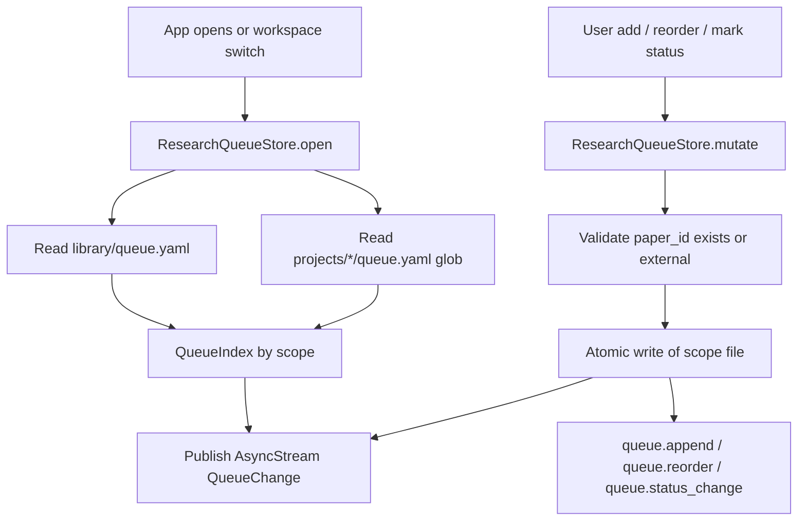
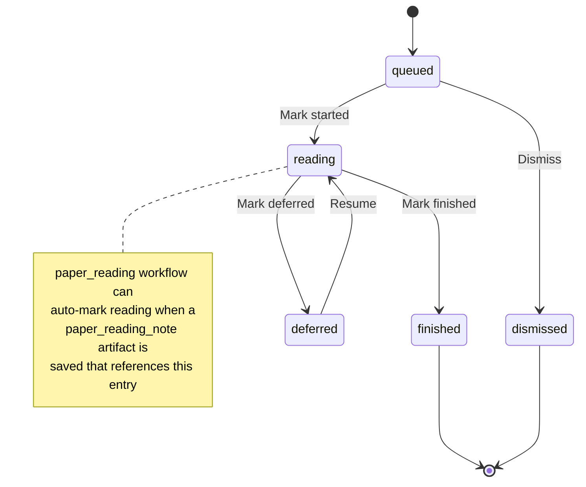
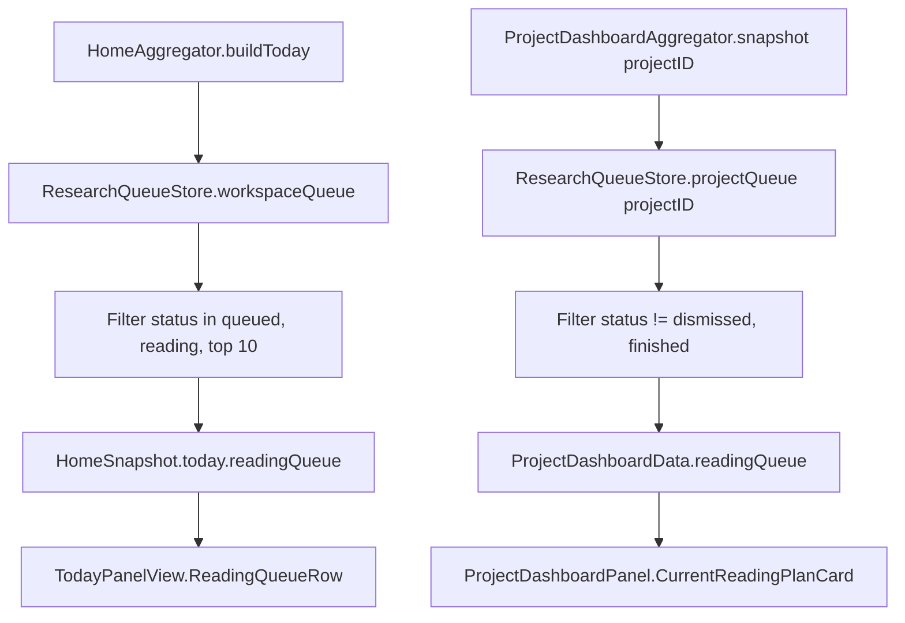

# 任务书 48：Research Queue V1

更新时间：2026-05-17
状态：已落地（2026-05-17；Research Queue core、ProjectSpace Queue UI、Home / Project Dashboard 接入、P48 自动化与 MT19 文档完成）
优先级：S1 / Roadmap Stage 3
承接：P38 Permission Dock / AgentApprovalRequest 闭环；P44 Research Graph 提供 paper / project / artifact 节点；P47 提供 `generate_reading_path / find_missing_core_papers` 等 graph 工具；P49 Recommendation Engine 与 P50 Reading Plan 反向依赖本任务书产出的 `ResearchQueueStore`。

## 0. P47 Handoff（2026-05-12）

已验证状态：

```text
P47 已实现 7 个 graph read-only tools，并注册到默认 AgentToolRegistry。
AgentPaperIntentRouter 已能识别 graph intents，并在参数足够时执行 deterministic preflight。
Graph view 的 Generate Reading Order / Explain Connection / Find Bridge Papers 已跳到 AI Lab graph_insight run。
graph_insight draft 当前以 AgentArtifactDraft nested payload 暴露给 HomeAggregator / AI Lab；尚未直接落 queue。
Workflow gating 已改为基于 dependency-valid available modules；citation-graph 默认启用，禁用后 graph workflows/tools 隐藏。
自动化：swift run SciStationCoreTestRunner 已通过；xcodebuild -project Sci-Station.xcodeproj -scheme Sci-Station -destination 'platform=macOS' build 已通过。
```

对 P48 的直接约束：

```text
Research Queue 不能直接消费 graph tool result 写 workspace；必须从 graph_insight / recommendation_note 经 Permission Dock 批准后入队。
P48 可以读取 P47 graph_insight draft payload，但应定义新的 queue_candidates / recommendation_note schema，避免把 graph tool payload 当长期存储格式。
如果 citation-graph 被关闭，manual queue 仍应可用；AI recommendation / research_queue_update 才被 graph/recommendation gating 控制。
```

## 0.5 当前代码观察（2026-05-17）

本节钉住代码现状，避免把 P38 任务书里的概念名当成现成 API 引用：

```text
[Queue/Recommendation/ReadingPlan 目录]
  当前不存在 Sci-Station/Queue、Sci-Station/Recommendation、Sci-Station/ReadingPlan；本任务书将新建 Sci-Station/Queue/。

[既有的 readingQueue 字段]
  Sci-Station/Workspace/HomeSnapshot.swift:63 已声明 TodayPanelData.readingQueue: [PaperSummary]。
  Sci-Station/Workspace/HomeAggregator.swift:476-492 用 priority/status 启发式产出（P42 占位）。
  Sci-Station/UI/Home/HomePanels.swift:41-60 已绑定该字段。
  本任务书必须以 additive 字段（readingQueueEntries）覆盖该兜底，不能直接替换类型。

[既有 Current Reading Plan 卡片]
  Sci-Station/UI/Home/ProjectDashboardPanel.swift:125-140 内联渲染；ProjectDashboardSnapshot.currentReadingPlan: String? (HomeSnapshot.swift:363) 始终传 nil。
  P50 任务书已经把这张卡（连带 currentReadingPlan 字段）留给真实 ReadingPlan；P48 不动它，而是新增独立 "Reading Queue" 卡。

[Artifact 生命周期]
  当前无 ArtifactApprovalStore / ArtifactRecord / savedRecordsStream 类型。
  AgentArtifactDraft (AgentRuntimeProtocol.swift:272-316) 是聊天载荷，不是持久化记录。
  审批走 AgentApprovalRequest (AgentLoopModels.swift:585) + AgentLoopRunner.resume；用户批准后由 WriteWikiMarkdownAgentTool.invoke (AgentBuiltInTools.swift:473-504) 直接 markdownRepository.saveContents 落盘。
  最接近的“已保存 artifact”聚合通道是 HomeAggregator.artifactSummaries(from: agentRuns) (HomeAggregator.swift:391-428)；本任务书的 ResearchQueueIngestor 复用同一扫描方式。

[paper_reading_note 形态]
  目前 paper_reading_note 仅以 AgentArtifactDraft{kind:"paper_reading_note", proposedPath:"wiki/papers/<id>.md", content: markdown} 形态出现，payload 中没有 paper_id / finished 字段。
  自动状态机不能假设这两个字段；本任务书改为读取 Paper.status / Paper.lastReadAt 这种已有的确定性信号。

[recommendation_note 形态]
  WorkspaceTemplates.swift:875-886 声明了 recommendation 模块（disabled-by-default）及 artifactKinds: recommendation_note, weekly_review。
  当前没有 producer；只有 P49 落地后才会产生 recommendation_note 工具结果。本任务书的 Ingestor Layer B 在 P49 前是“空跑”路径。

[paper-library 模块当前 writePaths]
  WorkspaceTemplates.swift:737 → ["library/papers/", "library/refs/"]；本任务书追加 ["library/queue.yaml", "projects/*/queue.yaml"]。

[ProjectSpace tab 来源]
  Sci-Station/UI/Shell/ProjectSpaceTabsBuilder.swift:38-41 已含 "recommendations" / "papers" 等顺序键；新增的 queue tab 需要补在 defaultOrder。
```

---

## 1. 背景

到 P47 结束时，用户可以：

```text
从 Paper Library / Graph view 浏览论文
让 AI 工具产生 `graph_insight` 推荐
在 Draft Inbox 审批推荐并保存到 wiki
```

但**"我接下来要按顺序读哪几篇 paper、现在读到哪了、读完之后下一步要做什么"** 这条工作流目前是断的：

```text
Paper Library 只有 "Recently Added / Recently Read"，无顺序
TodoStore 可以建 todo 但 todo 没有 paper 阅读状态机
Draft Inbox 中的 graph_insight 一次性事件，approve 之后没有持续视图
ProjectDashboardPanel.CurrentReadingPlanCard 当前为 P50 placeholder
P39 已声明 `recommendation` 模块，但其唯一 workflow `research_queue_update` 尚无实现
```

P48 要建立"研究阅读队列"这一长寿命对象（per project + workspace 级），让 reading order、status、source（manual / graph / recommendation）都被显式记录、可审计、可被 P49/P50 反向消费。

### 1.1 命名澄清

- **Research Queue**：长寿命的"接下来要按顺序处理的论文 / artifact"列表。一个项目可有一个 project queue；workspace 可有一个 workspace queue（跨项目）。
- **Reading Plan**（P50）：基于 queue 的"本周读哪几篇"短期计划。P50 任务书定义。
- **Recommendation Note**（P49）：AI 给出的"建议把这篇加入 queue 或加入 reading plan"提案，必须走 Draft Inbox。P49 任务书定义。

P48 只实现 Queue 本身与 Queue 的人工 / AI 入口；不实现 P49 的评分器，也不实现 P50 的周计划生成器。

### 1.2 Module 归属

P39 `recommendation` 模块（`enabled = false, dependencies = [paper-library, citation-graph, ai-lab]`）声明了 workflow `research_queue_update` 与 artifact kind `recommendation_note / weekly_review`。但 Queue 必须在 `recommendation` 模块**未启用**时也能工作，否则用户没法手动维护一个阅读队列。

P48 因此把 Queue 拆成两个能力层：

```text
Layer A: 手动 queue 维护（无 AI）
  归属：paper-library 模块
  新增 artifact kind: reading_queue_entry
  新增 writePath:    library/queue.yaml, projects/*/queue.yaml
  新增 workflow:     reading_queue_curate
  默认随 paper-library 启用

Layer B: AI 推荐进入 queue（P49 上线前为空跑通道）
  归属：recommendation 模块（保持 enabled = false）
  既有 artifact kind: recommendation_note（已声明）
  既有 workflow:      research_queue_update（已声明）
  数据通道：ResearchQueueIngestor 复用 HomeAggregator.artifactSummaries(from: agentRuns)
          的扫描思路，订阅 AppViewModel.agentRunHistory 改变流，匹配 kind ==
          recommendation_note 且 requiresConfirmation == false 的 toolResult
          payload，把 queue_candidates 映射成 reading_queue_entry。
  约束：仍走 AgentApprovalRequest + Permission Dock；不绕过 P38 / P47 既有闭环。
  P49 producer 上线前 Layer B 通道为空跑，不影响 Layer A 工作。
```

这样 P49 落地前，用户也可以使用纯人工 queue；P49 落地后，AI 推荐通过 approve 接入，但 queue 文件本身的 schema 与读写路径不变。

---

## 2. 本轮目标

1. 定义 `ResearchQueueEntry` schema 与 `library/queue.yaml`、`projects/*/queue.yaml` 文件格式（schema_version=1）。
2. 实现 `ResearchQueueStore`（actor）：read / append / update / mark-status / reorder / remove；YAML 持久化；source-of-truth 单一文件。
3. 实现 `ResearchQueueIngestor`：扫描 `AppViewModel.agentRunHistory` 中 `requiresConfirmation == false`（即已批准并保存）的 `recommendation_note` toolResult，把 `queue_candidates` 转入 queue；P49 producer 落地前该通道为空跑。**不**依赖任何尚未存在的 `ArtifactApprovalStore.savedRecordsStream` API。
4. UI：
   - 在 `ProjectSpace` 增加 `Queue` tab（由 `paper-library` 贡献，模块禁用时自动隐藏）。
   - 在 `HomeView.TodayPanel.ReadingQueue` 接入真实 queue 数据（替换 P42 占位）。
   - 在 `Paper Library` 行为入口加 `Add to queue / Move up / Move down / Mark started / Mark finished` 命令。
5. 扩展 `paper-library` 模块声明：`reading_queue_entry` artifact kind、`reading_queue_curate` workflow、`library/queue.yaml` + `projects/*/queue.yaml` writePath。
6. 接入 `WorkspaceModuleRegistry.workflowRequirements`：`reading_queue_curate = [paper-library]`；保留 `research_queue_update = [recommendation, citation-graph]`。
7. Debug 事件：`queue.append / queue.reorder / queue.status_change / queue.ingest_from_recommendation / queue.load / queue.save_error`。
8. 全程不引入网络请求，不上传论文全文，不引入第三方依赖；queue 仅引用本地 `paper_id`（或 external placeholder id）。

---

## 3. 流程图

### 3.1 Queue 文件加载与单写主路径



### 3.2 AI 推荐接入 queue（实际代码路径）

```mermaid
flowchart LR
    tool[Agent tool find_missing_core_papers / generate_reading_path / P49 recommendation pipeline]
    tool --> requires[AgentToolResult requiresConfirmation = true]
    requires --> approval[AgentApprovalRequest + Permission Dock]
    approval --> resume[AgentLoopRunner.resume]
    resume --> rerun[Tool re-runs writesWorkspace and writes recommendation_note via repositories]
    rerun --> run[AgentRun.toolResults updated requiresConfirmation = false]
    run --> publish[AppViewModel.agentRunHistory @Published change]
    publish --> scan[ResearchQueueIngestor scans new toolResults dedup by run callID]
    scan --> match[kind == recommendation_note and payload has queue_candidates]
    match --> map[Map candidates to ResearchQueueEntry rows]
    map --> append[ResearchQueueStore.appendBatch rows scope projectID]
    append --> debug[queue.ingest_from_recommendation]
```



### 3.3 Status 状态机



### 3.4 Home/Project Dashboard 消费 queue



---

## 4. 实施任务

> 命名：所有 queue 代码集中在 `Sci-Station/Queue/`；UI 在 `Sci-Station/UI/Queue/`；测试在 `Tools/SciStationCoreTestRunner/main.swift`。

- [x] [P48.1] `ResearchQueueEntry` 数据模型（新增 `Sci-Station/Queue/ResearchQueueEntry.swift`）
  - 字段见 §5.1；遵循 `Codable / Hashable / Sendable`。
  - 添加 `QueueScope = .workspace | .project(String)` 枚举区分 queue 文件位置。

- [x] [P48.2] `ResearchQueueStore`（新增 `Sci-Station/Queue/ResearchQueueStore.swift`）
  - actor，注入 `fileManager`、`ResearchWorkspace`、`AppDebugEventLogger`。
  - 内部内存索引：`entries: [QueueScope: [String: ResearchQueueEntry]]`；按 `order` 字段稳定排序。
  - 公开接口见 §5.2。

- [x] [P48.3] YAML 序列化（在 `ResearchQueueStore` 内部 + 独立 `ResearchQueueYAMLEncoder`）
  - 与现有 `tasks/calendar.yaml` 同风格：手写 YAML（避免引入第三方 lib）。
  - 文件 schema 见 §5.3；schema_version=1。
  - 加载失败时不抛出，转写 `queue.load.error` warning，并保留旧的内存索引；不覆盖原文件。

- [x] [P48.4] `ResearchQueueIngestor`（新增 `Sci-Station/Queue/ResearchQueueIngestor.swift`）
  - actor，不订阅任何不存在的 `ArtifactApprovalStore` API；改为接受两路输入：
    1. **`AgentRun.toolResults` 扫描**：外部调用方（`AppViewModel`）在 `agentRunHistory` 变化后调用 `ingest(runs:)`；ingestor 复用 `HomeAggregator.artifactSummaries(from:)` 同型扫描逻辑，按 `(runID, callID)` 去重并持久化 cursor。匹配 `kind == "recommendation_note"` 且其 `AgentToolResult.requiresConfirmation == false` 且 `succeeded == true` 且 `payload` 含 `queue_candidates` 的记录，把 candidates 映射成 `ResearchQueueEntry` 并 append 到 `store`。
    2. **`Paper.status` 变更扫描**：ingestor 同时接收 `ingest(papers:previous:)`，按 §4.10 的转换规则同步 queue entry 状态。
  - 不直接消费 graph 工具结果；P47 graph 工具如需入队依然走“产生 recommendation_note artifact → Permission Dock approve → ingestor 扫描”这条路。
  - P49 producer 落地前，Layer B 扫描仍会运行，但 0 hit。Debug 事件 `queue.ingest_scanned` 会写 hit_count=0 以便调试。

- [x] [P48.5] `WorkspaceModuleRegistry` 更新（修改 `Sci-Station/Workspace/WorkspaceTemplates.swift`）
  - `paper-library` 模块：
    - `artifactKinds += ["reading_queue_entry"]`
    - `workflows += ["reading_queue_curate"]`
    - `writePaths += ["library/queue.yaml", "projects/*/queue.yaml"]`
  - `workflowRequirements["reading_queue_curate"] = ["paper-library"]`
  - `recommendation` 模块保持 disabled-by-default；其 `workflows` / `artifactKinds` 不变。
  - 注：`writePaths` 已含 `library/papers/` 与 `library/refs/`，本次新增的 `library/queue.yaml` 不会与既有路径冲突。

- [x] [P48.6] UI: `QueueTabView`（新增 `Sci-Station/UI/Queue/QueueTabView.swift`）
  - ProjectSpace 内 tab；从 `WorkspaceModuleRegistry.availableProjectTabs(in:)` 派生，paper-library 禁用时自动隐藏。
  - 列表视图：左列 status badge / 中列 paper 标题 / 右列 source badge + order arrows + actions menu。
  - 上方 toolbar：scope 切换（Project / Workspace）、status 过滤、source 过滤、`Add from Library...`。
  - 当 `library/queue.yaml` 不存在 / 为空时显示 onboarding CTA "Add a paper from Library / Graph to start your queue."

- [x] [P48.7] UI: HomeView 接入（修改 `Sci-Station/UI/Home/HomeView.swift` + `Sci-Station/UI/Home/HomePanels.swift` + `Sci-Station/Workspace/HomeAggregator.swift` + `Sci-Station/Workspace/HomeSnapshot.swift`）
  - `HomeAggregationInput` 新增 `queueEntries: [ResearchQueueEntrySnapshot]` 输入项；由 `AppViewModel` 从 `ResearchQueueStore.workspaceQueue + projectQueue(active projects)` 拼装。
  - `TodayPanelData` **新增** `readingQueueEntries: [ReadingQueueEntrySummary]`（保留既有 `readingQueue: [PaperSummary]` 作为 P42 兑底启发式列）；status ∈ {queued, reading} 的前 10 条入 `readingQueueEntries`。
  - `HomePanels.swift` 的 Reading Queue 卡：`readingQueueEntries` 非空时优先渲染该列；为空时回退到 `readingQueue` 启发式列（保证 paper-library 启用但 queue 为空时 UI 不退化）。
  - 行点击：external entry 显示 "Import to Library" CTA；library entry 跳 PDF Reader（如启用）或 paper detail。

- [x] [P48.8] UI: Paper Library 命令集成（修改 `Sci-Station/UI/LibraryViews.swift`：`singlePaperContextMenu(for:)` / `batchEditMenu` / `PaperClassificationMenuItems`）
  - 每行 paper 增加 menu：`Add to Project Queue / Add to Workspace Queue / Move to top / Mark finished`。
  - 已在 queue 中时显示 ✓ + scope。
  - 行为通过 `ResearchQueueStore` 直接写入；不进 Draft Inbox（用户显式动作）。

- [x] [P48.9] UI: ProjectDashboardPanel 接入（修改 `Sci-Station/UI/Home/ProjectDashboardPanel.swift` + `Sci-Station/Workspace/HomeSnapshot.swift` + `Sci-Station/Workspace/ProjectDashboardAggregator.swift`）
  - **不动** `@/Users/funyday/Documents/Sci-Station/Sci-Station/UI/Home/ProjectDashboardPanel.swift:125-140` 现有 "Current Reading Plan" 卡与 `snapshot.currentReadingPlan` 字段；该卡与字段留给 P50。
  - 在 `ProjectDashboardSnapshot` **新增** `readingQueuePreview: [ReadingQueueEntrySummary]`；Aggregator 从 project queue 与 workspace queue（仅限关联 `projectID`）取 status ∈ {queued, reading} 前 3 条。
  - 新增独立卡 "Reading Queue"（图标 `tray.full`），与 "Current Reading Plan" 卡并存；为空时显示 onboarding CTA “Add a paper from Library / Graph to start your queue.”。
  - 点击行跳到 ProjectSpace 的 Queue tab，scroll-to-entry。

- [x] [P48.10] Paper status → queue entry 自动状态切换。说明：原草稿基于 `paper_reading_note` payload 的 `paper_id` / `finished` 字段触发的方案被否决——`AgentArtifactDraft{kind:"paper_reading_note"}` 当前不携带这些字段（见 §0.5）。改为采用已存在的确定性信号：
  - **触发源**：`Paper.status` / `Paper.lastReadAt` 变化。`AppViewModel` 在产生 `papers` diff 后调用 `ingestor.ingest(papers:previous:)`。
  - **转换规则**（在 `Paper.id == entry.paperID` 且 `entry.status ∉ {finished, dismissed}` 时生效）：
    - `unread → skimmed | deepRead`：entry `queued` → `reading`，写 `startedAt`。
    - `skimmed | deepRead → summarized | used`：entry `reading | queued` → `finished`，写 `finishedAt`。
    - `* → rejected`：entry → `dismissed`。
  - **事件**：`queue.status_change(source: paper_status, from, to, paper_id, entry_id)`。
  - **后续**：若 V2 为 `paper_reading_note` 引入 frontmatter 元数据（`paper_id` + `finished`），可在 ingestor 内补 `paper_reading_note` 通道与 Paper status 通道并存；本轮不实现。

- [x] [P48.11] CLI / debug 工具
  - 在 `Tools/SciStationCoreTestRunner/main.swift` 中增加临时 fixture：生成 5 条 queue entry 用例并验证 reload 一致。
  - 不需要新建独立 CLI 命令。

- [x] [P48.12] 自动化与手动测试（详见 §6 / §7）。

- [x] [P48.13] 文档与回归
  - 新建 `docs/development/manual-tests/MT19_ResearchQueue.md`。
  - 在 `MT99_ReleaseRegression.md` 加 P48 partial regression（add → reorder → mark finished → reload）。
  - 更新 `docs/development/Long Term Plan.md` 第六节，把 P48 标记为已落地并指向本文件。

---

## 5. 数据模型与伪代码

### 5.1 Schema

```swift
public struct ResearchQueueEntry: Codable, Hashable, Sendable, Identifiable {
    public let id: String                   // "queue:<scope>:<paperID>" 或 "queue:<scope>:ext:<externalKey>"
    public var paperID: String?             // 已入 library 的 paper.identifier；外部 paper 为 nil
    public var externalKey: String?         // 当 paperID == nil 时填 doi / arxiv / title-hash
    public var displayTitle: String         // 缓存的标题，避免每次依赖 PaperRepository
    public var scope: QueueScope            // .workspace 或 .project(projectID)
    public var status: QueueStatus          // queued / reading / finished / deferred / dismissed
    public var source: QueueSource          // manual / recommendation / graph_tool / paper_reading_note
    public var order: Int                   // 排序键；同 scope 内单调递增；reorder 时重写
    public var addedAt: Date
    public var startedAt: Date?
    public var finishedAt: Date?
    public var lastTouchedAt: Date
    public var noteSummary: String?         // 1 行简介，便于 HomeView 展示，不存论文摘要
    public var sourceRefs: [String]         // tool_call_id / artifact_id / graph node id；脱敏
}

public enum QueueScope: Codable, Hashable, Sendable {
    case workspace
    case project(String)

    public var fileRelativePath: String {
        switch self {
        case .workspace: return "library/queue.yaml"
        case .project(let id): return "projects/\(id)/queue.yaml"
        }
    }
}

public enum QueueStatus: String, Codable, Sendable {
    case queued, reading, finished, deferred, dismissed
}

public enum QueueSource: String, Codable, Sendable {
    case manual                  // 用户在 Paper Library / Graph view 手动加
    case recommendation          // 来自 approved recommendation_note (P49)
    case graphTool = "graph_tool"// 直接由 P47 工具填入 candidate list 后被 approve
    case paperStatus = "paper_status" // 由 Paper.status 转换触发的状态同步（见 §4.10）
}
```

### 5.2 `ResearchQueueStore` 主接口

```swift
public actor ResearchQueueStore {
    public init(
        workspace: ResearchWorkspace,
        fileManager: FileManager = .default,
        debug: AppDebugEventLogger
    )

    public func open() async throws
    public func close() async

    // Read
    public func entries(in scope: QueueScope) async -> [ResearchQueueEntry]   // ordered by `order`
    public func entry(id: String) async -> ResearchQueueEntry?
    public func workspaceQueueTop(limit: Int) async -> [ResearchQueueEntry]   // status ∈ {queued, reading}, ordered
    public func projectQueueTop(projectID: String, limit: Int) async -> [ResearchQueueEntry]

    // Write
    public func append(_ entry: ResearchQueueEntry) async throws
    public func appendBatch(_ entries: [ResearchQueueEntry], scope: QueueScope) async throws
    public func updateStatus(id: String, status: QueueStatus, at: Date) async throws
    public func reorder(scope: QueueScope, orderedIDs: [String]) async throws
    public func remove(id: String) async throws

    // Subscriptions
    public func subscribeChanges() -> AsyncStream<QueueChange>
}

public enum QueueChange: Sendable {
    case appended(ResearchQueueEntry)
    case statusChanged(id: String, from: QueueStatus, to: QueueStatus)
    case reordered(scope: QueueScope)
    case removed(id: String)
    case bulkReloaded(scope: QueueScope)
}
```

### 5.3 YAML 文件格式

`library/queue.yaml`（workspace 级；项目级文件结构相同，仅 scope 字段不同）：

```yaml
schema_version: 1
generated_at: "2026-05-12T10:31:00Z"
entries:
  - id: "queue:workspace:garani2017"
    paper_id: "garani2017"
    external_key: null
    display_title: "Sample Paper Title"
    scope: workspace
    status: queued
    source: manual
    order: 1
    added_at: "2026-05-10T11:02:00Z"
    started_at: null
    finished_at: null
    last_touched_at: "2026-05-10T11:02:00Z"
    note_summary: null
    source_refs: []
  - id: "queue:workspace:ext:arxiv-2410.12345"
    paper_id: null
    external_key: "arxiv:2410.12345"
    display_title: "External Paper (not yet imported)"
    scope: workspace
    status: queued
    source: recommendation
    order: 2
    added_at: "2026-05-11T08:00:00Z"
    started_at: null
    finished_at: null
    last_touched_at: "2026-05-11T08:00:00Z"
    note_summary: "Cited by 4 of my core papers"
    source_refs:
      - "artifact:rec-2026-05-11-001"
      - "graph:paper:ext:arxiv-2410.12345"
```

### 5.4 `ResearchQueueIngestor` 伪代码

Ingestor 接受两路输入，不依赖任何尚未存在的 `ArtifactApprovalStore` API。`AppViewModel` 在 `@Published var agentRunHistory` 与 `@Published var papers` 变化后分别调用 `ingest(runs:)` 与 `ingest(papers:previous:)`。

```swift
actor ResearchQueueIngestor {
    private let store: ResearchQueueStore
    private let workspace: ResearchRoot
    private let debug: AppDebugEventLogger
    private var scannedToolCalls: Set<String> = [] // "<runID>:<callID>" 去重游标。close 时 flush 到 .sci-station/queue/ingest_cursor.json。

    public init(store: ResearchQueueStore, workspace: ResearchRoot, debug: AppDebugEventLogger) {
        self.store = store
        self.workspace = workspace
        self.debug = debug
    }

    // Layer B 入口：扫描 agent runs，拽出已批准保存的 recommendation_note tool results。
    // 必须在主线程以外调用；该函数幂等，不会重复 append。
    public func ingest(runs: [AgentRun]) async {
        for run in runs {
            for result in run.toolResults {
                let key = "\(run.id):\(result.callID)"
                guard !scannedToolCalls.contains(key) else { continue }
                // 仅接受已批准且成功的 toolResult。
                guard !result.requiresConfirmation, result.succeeded else { continue }
                defer { scannedToolCalls.insert(key) }
                guard
                    let payload = result.payload,
                    payloadKind(payload) == "recommendation_note",
                    let candidates = payload.objectValue?["queue_candidates"]?.arrayValue,
                    !candidates.isEmpty
                else { continue }
                let scope = scope(from: payload, fallback: run.projectID ?? run.currentProjectID)
                await ingestCandidates(candidates, scope: scope, runID: run.id, callID: result.callID)
            }
        }
    }

    // §4.10 入口：按 Paper.status 转换规则同步 entry 状态。
    public func ingest(papers: [Paper], previous: [String: Paper]) async {
        for paper in papers {
            let before = previous[paper.id]?.status
            let after = paper.status
            guard before != after else { continue }
            await store.applyPaperStatusTransition(
                paperID: paper.id,
                from: before,
                to: after,
                at: paper.lastReadAt ?? paper.updatedAt
            )
        }
    }

    private func ingestCandidates(_ candidates: [JSONValue], scope: QueueScope, runID: String, callID: String) async {
        var rows: [ResearchQueueEntry] = []
        let nextOrderBase = (await store.entries(in: scope).map(\.order).max() ?? 0) + 1
        for (index, candidate) in candidates.enumerated() {
            guard let id = candidate.objectValue?["paper_id"]?.stringValue
                ?? candidate.objectValue?["external_key"]?.stringValue else { continue }
            let isExternal = candidate.objectValue?["paper_id"]?.stringValue == nil
            rows.append(.init(
                id: "queue:\(scope.identifier):\(id)",
                paperID: isExternal ? nil : id,
                externalKey: isExternal ? id : nil,
                displayTitle: candidate.objectValue?["display_title"]?.stringValue ?? id,
                scope: scope,
                status: .queued,
                source: .recommendation,
                order: nextOrderBase + index,
                addedAt: Date(),
                startedAt: nil,
                finishedAt: nil,
                lastTouchedAt: Date(),
                noteSummary: candidate.objectValue?["reason"]?.stringValue,
                sourceRefs: ["run:\(runID)", "tool_call:\(callID)"]
            ))
        }
        do {
            try await store.appendBatch(rows, scope: scope)
            await debug.append(.init(event: "queue.ingest_from_recommendation", payload: .object([
                "run_id": .string(runID),
                "tool_call_id": .string(callID),
                "added": .number(Double(rows.count)),
                "scope": .string(scope.identifier)
            ])), in: workspace)
        } catch {
            await debug.append(.init(event: "queue.ingest_error", payload: .object([
                "run_id": .string(runID),
                "tool_call_id": .string(callID),
                "reason": .string("append_failed")
            ])), in: workspace)
        }
    }

    private func payloadKind(_ payload: JSONValue) -> String? {
        payload.objectValue?["kind"]?.stringValue ?? payload.objectValue?["artifact_kind"]?.stringValue
    }

    private func scope(from payload: JSONValue, fallback projectID: String?) -> QueueScope {
        if let scopeValue = payload.objectValue?["queue_scope"]?.stringValue {
            switch scopeValue {
            case "workspace": return .workspace
            case let other where other.hasPrefix("project:"):
                return .project(String(other.dropFirst("project:".count)))
            default: break
            }
        }
        if let projectID, !projectID.isEmpty { return .project(projectID) }
        return .workspace
    }
}

extension ResearchQueueStore {
    /// §4.10 决定性转换。仅在 entry.paperID == paperID 且 entry.status ∉ {finished, dismissed} 时生效。
    public func applyPaperStatusTransition(
        paperID: String,
        from: ReadingStatus?,
        to: ReadingStatus,
        at: Date
    ) async {
        for scope in knownScopes() {
            guard let entry = entries(in: scope).first(where: { $0.paperID == paperID }) else { continue }
            guard entry.status != .finished, entry.status != .dismissed else { continue }
            let target: QueueStatus? = mapped(transition: (from, to), current: entry.status)
            guard let target, target != entry.status else { continue }
            try? await updateStatus(id: entry.id, status: target, at: at)
            await emitStatusChangeDebug(entry: entry, target: target, paperID: paperID)
        }
    }

    private func mapped(transition: (ReadingStatus?, ReadingStatus), current: QueueStatus) -> QueueStatus? {
        switch transition.1 {
        case .skimmed, .deepRead:
            return current == .queued ? .reading : nil
        case .summarized, .used:
            return (current == .queued || current == .reading) ? .finished : nil
        case .rejected:
            return .dismissed
        case .unread:
            return nil
        }
    }
}
```

### 5.5 排序与 Reorder 算法

```swift
extension ResearchQueueStore {
    public func reorder(scope: QueueScope, orderedIDs: [String]) async throws {
        var current = try await loadScope(scope)
        let map = Dictionary(uniqueKeysWithValues: current.map { ($0.id, $0) })
        var rebuilt: [ResearchQueueEntry] = []
        for (index, id) in orderedIDs.enumerated() {
            guard var entry = map[id] else { continue }
            entry.order = index + 1
            entry.lastTouchedAt = Date()
            rebuilt.append(entry)
        }
        // Append any unspecified id at the tail in original relative order.
        let remaining = current
            .filter { !orderedIDs.contains($0.id) }
            .sorted { $0.order < $1.order }
        for var entry in remaining {
            entry.order = rebuilt.count + 1
            rebuilt.append(entry)
        }
        try await persistScope(scope, entries: rebuilt)
        await publish(.reordered(scope: scope))
        await debug.append(.init(event: "queue.reorder", payload: .object([
            "scope": .string(scope.identifier),
            "count": .number(Double(rebuilt.count))
        ])), in: workspace)
    }
}
```

### 5.6 Module Registry diff

```text
WorkspaceModuleRegistry.workflowRequirements["reading_queue_curate"] = ["paper-library"]

paper-library:
  artifactKinds:    [paper_reading_note, related_work] + [reading_queue_entry]
  workflows:        [paper_reading, related_work]     + [reading_queue_curate]
  permissions.writePaths:
                    [library/papers/, library/refs/]   + [library/queue.yaml,
                                                          projects/*/queue.yaml]
recommendation 模块保持不变；其 workflows[research_queue_update] 仍生效，
作为 Layer B (AI 推荐 -> queue) 入口的 workflow id。
```

---

## 6. 自动化测试

新增到 `Tools/SciStationCoreTestRunner/main.swift`：

```text
researchQueueStoreAppendPersistsAndReloads
researchQueueStoreAppendBatchPreservesOrderWithinBatch
researchQueueStoreReorderRewritesOrderField
researchQueueStoreReorderHandlesPartialIDList
researchQueueStoreUpdateStatusRecordsTimestamps
researchQueueStoreRemoveDoesNotAffectOtherScopes
researchQueueStoreLoadIgnoresMalformedEntriesAndLogsWarning
researchQueueStoreWorkspaceQueueTopRespectsLimitAndStatusFilter
researchQueueStoreProjectQueueIsolatedPerProjectID
researchQueueIngestorMapsRecommendationCandidatesToEntries
researchQueueIngestorDeduplicatesByRunAndCallID
researchQueueIngestorIgnoresUnapprovedOrFailedToolResults
researchQueueIngestorFlipsToReadingWhenPaperStatusBecomesSkimmedOrDeepRead
researchQueueIngestorFlipsToFinishedWhenPaperStatusBecomesSummarizedOrUsed
researchQueueIngestorMarksDismissedWhenPaperStatusBecomesRejected
researchQueueIngestorIgnoresPaperStatusTransitionsForFinishedOrDismissedEntries
paperLibraryModuleDeclaresReadingQueueArtifactKindAndWorkflow
workspaceModuleRegistryWorkflowGatingForReadingQueueCurate
homeAggregatorPopulatesReadingQueueEntriesWhenQueueAvailable
homeAggregatorFallsBackToHeuristicReadingQueueWhenQueueEmpty
projectDashboardSnapshotIncludesReadingQueuePreview
projectDashboardPanelKeepsCurrentReadingPlanCardForP50
researchQueueYAMLEncodingRoundtripIsStable
researchQueueYAMLDecoderSkipsUnknownFieldsForward
researchQueueDebugEventsScrubSensitiveFields
```

构建命令：

```bash
swift run SciStationCoreTestRunner
xcodebuild -project Sci-Station.xcodeproj -scheme Sci-Station -destination 'platform=macOS' build
```

---

## 7. 手动测试计划（MT19-P48）

新增到 `docs/development/manual-tests/MT19_ResearchQueue.md`。MT99 partial regression 增加 MT19-P48-01 / 03 / 06 / 09。

| ID | 标题 | 期望 |
|---|---|---|
| MT19-P48-01 | Paper Library "Add to Project Queue" | 选中一篇 paper -> 行 menu -> Add to Project Queue；ProjectSpace 出现 Queue tab；新条目可见，status = queued |
| MT19-P48-02 | Add to Workspace Queue | 在 Library / Graph view 加入 workspace queue；HomeView.TodayPanel.ReadingQueue 显示该条 |
| MT19-P48-03 | Reorder by drag handle | 拖动 entry 上下移；reload App 后顺序保持 |
| MT19-P48-04 | Mark started / finished | 点 Mark started -> 状态 reading；Mark finished -> finished；时间戳写入 |
| MT19-P48-05 | Paper.status 自动回填 | 在 Paper Library 把一本 queue 中的 paper status 从 `unread` 改为 `skimmed`，该 entry 自动切到 reading；再改为 `summarized` 后切到 finished；改为 `rejected` 后切到 dismissed |
| MT19-P48-06 | 关闭 paper-library 模块 | Queue tab 消失；queue.yaml 不被删除；重新启用后内容仍在 |
| MT19-P48-07 | Recommendation note approve | 在 Draft Inbox approve 一个 `recommendation_note`（含 `queue_candidates`）；queue 追加新条 source = recommendation |
| MT19-P48-08 | External paper entry | `paper_id == nil, external_key == "arxiv:..."`；entry 可显示与重排，状态机仍工作；不会因为 PaperRepository 找不到而 crash |
| MT19-P48-09 | YAML 手工破坏 | 在 queue.yaml 末尾随手敲一行非法字符；下次启动 store 写 `queue.load.error` warning；未损坏的条目仍可加载；不阻塞 App |
| MT19-P48-10 | 大规模性能 | 200 条 entry 加载 / reorder / 状态变更；HomeAggregator 构建 ≤ 350ms |

---

## 8. Debug 与日志规范

| event | payload 字段 | 触发点 |
|---|---|---|
| `queue.load` | `scope, count` | store.open 完成 |
| `queue.load.error` | `scope, file, reason` | YAML 解析失败 |
| `queue.append` | `scope, paper_id?, external_key?, source` | append / appendBatch |
| `queue.reorder` | `scope, count` | reorder |
| `queue.status_change` | `entry_id, from, to, source` | updateStatus；source 枚举 ∈ {`manual`, `paper_status`, `recommendation`, `graph_tool`} |
| `queue.remove` | `entry_id, scope` | remove |
| `queue.ingest_scanned` | `run_count, hit_count, scope?` | ingestor.ingest(runs:) 运行后写入；P49 前 hit_count 预期为 0 |
| `queue.ingest_from_recommendation` | `run_id, tool_call_id, added, scope` | ingestor 从 toolResult 转入 entry |
| `queue.ingest_error` | `run_id, tool_call_id, reason` | ingestor 失败 |
| `queue.save_error` | `scope, reason` | atomic write 失败 |
| `queue.module_gating` | `scope, allowed: Bool, missing_modules` | UI 隐藏 / display 用 |

脱敏：所有事件不得携带 paper title / note_summary 全文；只写 paper_id / external_key / count。`reason` 限定枚举（`yaml_parse_failure / write_failed / paper_not_found / ...`），不含路径外的用户数据。

---

## 9. 非目标 / 验收标准 / Questions / 交付记录

### 9.1 非目标

```text
不实现 P49 Recommendation Engine 的评分（仅消费 recommendation_note）
不实现 P50 Reading Plan 的周计划生成；P50 仍会用现有 "Current Reading Plan" 卡 / `currentReadingPlan` 字段，本任务书不动它
P48 不实现任何 ArtifactApprovalStore / savedRecordsStream 类型；AI 推荐入队仅够复用 AgentRun.toolResults 扫描通道，仍走 AgentApprovalRequest + Permission Dock 闭环
不读取 paper_reading_note artifact payload 的元数据（字段当前不存在）；状态机仅以 Paper.status / lastReadAt 为准
不引入网络下载论文 PDF
不在 queue 中存论文全文 / 摘要 / 摘录
不实现跨 workspace 队列同步
不替换 TodoStore；queue 与 todo 是两条独立轴（todo 是行动，queue 是阅读顺序）
不在 P48 中实现 graph-tool 直接落 queue 的"快捷通道"；所有 AI 来源仍走 Permission Dock approve
不实现 sub-queue / nested queue（V2 才考虑）
```

### 9.2 验收标准

1. `library/queue.yaml` 与 `projects/*/queue.yaml` 按 §5.3 落地；schema_version=1；reload 后字段稳定。
2. `paper-library` 模块 artifactKinds / workflows / writePaths 已扩展；模块禁用时 Queue tab 自动隐藏，但 queue.yaml 不被删除。
3. `ResearchQueueStore` 的所有 mutation 都是 atomic write（先写 tmp 再 rename），中途中断不会留下半文件。
4. `ResearchQueueIngestor` 在 §4.4 / §4.10 两条路径正确触发：AgentRun.toolResults 中已批准的 `recommendation_note` 被转为 entry；Paper.status 转换被同步到 entry。使用 `(runID, callID)` 去重，不会重复追加同一条目。
5. HomeView.TodayPanel 的 Reading Queue 卡与 ProjectDashboardPanel 新增的 Reading Queue 卡显示真实 queue 数据；queue 为空时 Today 卡回退到启发式列，Project 卡显示 onboarding CTA；原有 "Current Reading Plan" 卡依然在位，不被 P48 改动。
6. Debug 事件按 §8 完整写入，不含敏感文本。
7. SciStationCoreTestRunner / xcodebuild 全绿。
8. MT19-P48-01..10 全部通过；MT99 partial regression 通过。

### 9.3 Questions / 风险

1. **Queue 是否绑定 project？** 倾向：双 scope。workspace queue 与 project queue 并存；同一 paper 可同时在两个 scope（用于 "我个人想读 / 项目相关"），不强制 dedupe。
2. **Reorder 的 UX 用拖拽还是 ↑↓ 按钮？** 倾向：先 ↑↓ 按钮，避免引入 SwiftUI drag-drop 兼容性问题；P50 周计划再加拖拽。
3. **External paper 不在 library 时是否阻止入 queue？** 倾向：不阻止，允许 external placeholder；显示 "Import from Library to read" CTA。但 PDF Reader 不能直接打开 external entry。
4. **Recommendation note 中的 candidates 是单条还是多条？** 倾向：多条（list）。P49 实施时按 candidates 数组追加，而非一条 note 对应一条 entry。
5. **自动 mark finished 依据？** 倾向：P48 仅以 `Paper.status` 转换（§4.10）为准，不从 `paper_reading_note` payload 推导。V2 若为 `paper_reading_note` 引入 frontmatter `paper_id` / `finished`，可添加第二条路径。
6. **Queue size cap？** 倾向：单 scope 软上限 500；超过时只警告，不拒绝（很少有人长期保留 500 条 queue）。
7. **是否允许 entry 关联多 project（cross-project tagging）？** 倾向：不允许（V1 简化）；同一 paper 想在多个 project queue 中就建多条 entry。

### 9.4 交付记录

```text
完成日期：2026-05-17
Git commit：待用户提交
自动化测试结果：
  - swift run --quiet SciStationCoreTestRunner → All SciStation core checks passed.
  - xcodebuild -project Sci-Station.xcodeproj -scheme Sci-Station -destination 'platform=macOS' build → BUILD SUCCEEDED.
手动测试报告：docs/development/manual-tests/MT19_ResearchQueue.md；run 报告待用户补记录
已知问题：
  - P50 尚未实现真实 Reading Plan；Project Dashboard 的 Current Reading Plan 卡仍由 P50 接管。
  - Recommendation producer 只依赖 P49 Core payload；Recommendation UI / Scheduler 未完成。
推迟到 P49 的事项：local-first explainable scoring（generate candidates with reasons）
推迟到 P50 的事项：weekly reading plan + retrospective view
推迟到 V2 的事项：跨 workspace 队列同步、sub-queue、拖拽 reorder、queue export
```
