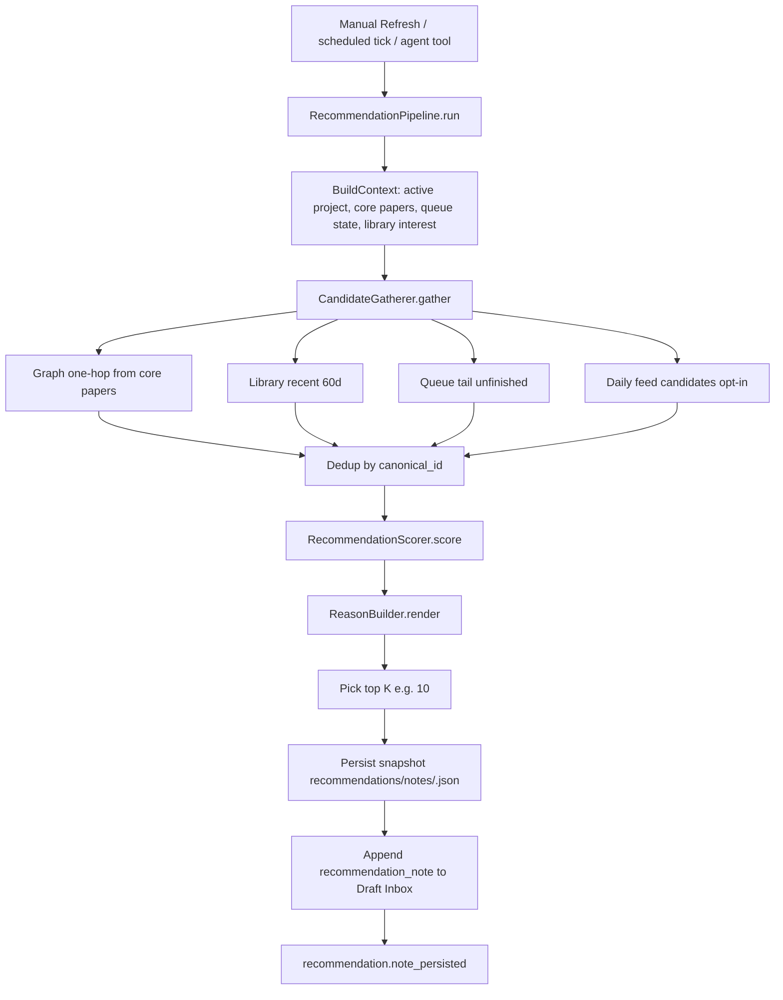
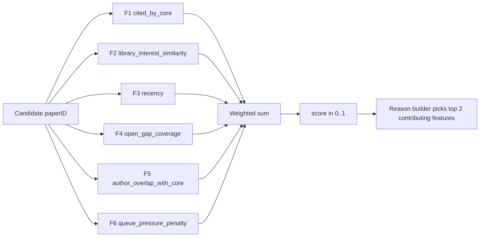
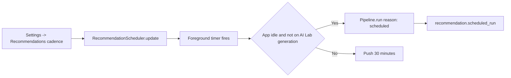

# 任务书 49：Recommendation Engine V1（Local-first, Explainable）

更新时间：2026-05-17
状态：Core 已落地；UI / Scheduler / live external retrieval 待后续层补齐
优先级：S1 / Roadmap Stage 3
承接：P37 `AgentEmbeddingStore` 已提供 paper/wiki chunk embedding；P44 提供 `GraphReadModel`；P47 提供若干 graph 工具；P48 定义 `ResearchQueueStore` 与 `recommendation_note` ingest 协议。P49 在不引入 LLM 排序、不上传论文内容的前提下，给出可解释推荐评分器，并吸收 `zotero-arxiv-daily` 的“每日新论文候选 + 本地文库兴趣重排”设计。

---

## 1. 背景

到 P48 结束时：

```text
用户可以维护一个 Research Queue（manual / approved 来源）
P47 已能产生 graph_insight / reading_path / missing_core_papers 类推荐
但 "我该往 queue 里加哪几篇 paper" 没有统一评分逻辑：
  - find_missing_core_papers 是 graph-degree 排序
  - generate_reading_path 是基于拓扑 + recency 的混合
  - 用户阅读历史、retrieval similarity、当前 open gaps 都没参与评分
```

P49 引入一个统一、deterministic、可审计、可解释的推荐评分器 `RecommendationScorer`。**不是 LLM ranking**；是若干显式信号（feature）按显式权重相加；每次评分都能输出 "为什么这篇排第 1" 的 reason 字段；不上传任何论文全文 / abstract / 用户 prompt。

### 1.1 `zotero-arxiv-daily` 审阅结论

`zotero-arxiv-daily` 的核心价值不是“发邮件”本身，而是：

```text
1. daily new papers：每天从 arXiv / bioRxiv / medRxiv 等来源拉取新论文。
2. library-conditioned reranking：用用户已有 Zotero 文库作为兴趣语料。
3. retriever abstraction：不同外部来源统一成 Paper protocol。
4. similarity + time decay：候选与文库相似度结合新鲜度。
5. digest delivery：最终以 email 摘要投递。
```

Sci-Station 不能直接照搬：

```text
1. 不抓 PDF full text 作为推荐输入；不把 full text / abstract 交给 LLM。
2. 不用 LLM 生成 TL;DR / affiliation / reason。
3. 不以 email 为终点；推荐必须进入 recommendation_note → Draft Inbox → Permission Dock → Research Queue。
4. 外部网络必须 explicit opt-in；默认 local-only。
```

因此 P49 调整为：**local-first 推荐核心 + 可选 daily external candidate source**。V1 Core 已实现“导入 daily feed candidate 并按本地文库兴趣重排”；live arXiv / bioRxiv / medRxiv retriever 作为后续层补齐。

### 1.2 设计原则

```text
1. local-first：默认所有信号来自本地 store；外部 daily feed 必须显式启用
2. explainable：每篇推荐必须有 reason 字段（5–60 字），并保留 feature 拆分
3. deterministic：同一 input 永远 same output；feature weights / thresholds 写在 config
4. privacy-preserving：候选 candidate 只携带 paper_id / external_key / display_title /
   feature scores / reason；不携带 abstract / 用户 prompt / draft 内容
5. low-cost：scorer 单次运行 ≤ 1s（5000 paper 规模）；不阻塞主线程
6. opt-in：recommendation 模块仍 disabled-by-default；只有显式启用后才进 HomeView /
   Draft Inbox / agent tool
```

### 1.3 与 P47 / P48 的关系

P47 的 7 个 graph 工具不被替换；P49 复用它们作为 candidate 生成器，但把"打分 + reason 生成"集中到 `RecommendationScorer`：

```text
P47 工具 = candidate 来源（"哪几篇可能值得读"）
P49 scorer = 候选评分 + 解释（"为什么这篇排第一 / 它和我有什么关系"）
P48 queue + Draft Inbox = 用户决定接受 / 拒绝
```

---

## 2. 本轮目标与分层交付

### 2.1 Layer A：Core（已落地）

本轮先实施可测试、可复用的 Core：

1. 定义 `RecommendationCandidateSource / RecommendationDailySourceConfig / RecommendationConfig / RecommendationCandidate / RecommendationScore`。
2. 实现 `RecommendationConfigStore`：读写 `.sci-station/recommendations/config.yaml`。
3. 实现 `DailyFeedCandidateImporter`：把外部 daily feed JSON / JSONL 转成候选，支持 arXiv canonicalization。
4. 实现 `RecommendationCandidateGatherer`：聚合 library recent、queue tail、daily feed、graph one-hop，并 dedup。
5. 实现 `RecommendationScorer`：显式 feature + weighted sum + queue penalty。
6. 实现 `ReasonBuilder`：ZH / EN 模板 reason，不调用 LLM。
7. 实现 `RecommendationPipeline`：top-K、30 分钟 hash dedup、snapshot、history、P48 `queue_candidates` payload。
8. 注册最小 `request_recommendation_refresh` agent tool。

### 2.2 Layer B：App UI / Settings（待补）

1. `RecommendationView`（route `/recommendations`）替换 placeholder。
2. HomeView `RecommendationsPanel`。
3. Settings → Recommendations：cadence、scope、weights、daily source。
4. module gating：禁用 recommendation 时隐藏 route / panel / tool。

### 2.3 Layer C：Scheduler / live external retrieval（待补）

1. Foreground-only `RecommendationScheduler`。
2. opt-in arXiv / bioRxiv / medRxiv retriever。
3. 不抓 PDF full text，不生成 LLM TL;DR，不发送 email。
4. live retriever 结果仍只进入 `RecommendationCandidate`，最终必须经 `recommendation_note` 审批。

---

## 3. 流程图

### 3.1 推荐主路径



### 3.2 Feature 计算分支



### 3.3 Schedule 模式



---

## 4. 实施任务

> 命名：所有 recommendation 代码集中在 `Sci-Station/Recommendation/`；UI 在 `Sci-Station/UI/Recommendation/`。

- [x] [P49.1] `RecommendationFeature` 与 `RecommendationScore` 数据模型（新增 `Sci-Station/Recommendation/RecommendationModels.swift`）
  - 字段见 §5.1；序列化为 snapshot json 时保留 feature 拆分。

- [x] [P49.2] `RecommendationConfig`（新增 `Sci-Station/Recommendation/RecommendationConfigStore.swift`）
  - 默认权重、阈值、scope 设置；从 `.sci-station/recommendations/config.yaml` 读取，文件不存在时使用默认。
  - Settings 写入 UI 待 Layer B 补齐。
  - schema_version=1。

- [x] [P49.3] `DailyFeedCandidateImporter`（新增 `Sci-Station/Recommendation/DailyFeedCandidateImporter.swift`）
  - JSON / JSONL daily feed → `RecommendationCandidate`。
  - arXiv `2604.22012v1` canonicalize 为 `arxiv:2604.22012`。

- [x] [P49.4] `RecommendationCandidateGatherer`（新增 `Sci-Station/Recommendation/RecommendationCandidateGatherer.swift`）
  - actor，聚合 `GraphReadModel / Paper / ResearchQueueEntry / dailyFeedCandidates`。
  - 4 个来源：`gatherGraphOneHop / gatherLibraryRecent / gatherQueueTail / dailyFeedCandidates`。
  - Dedup by canonical id：`paper:<paperID>` 或 `external:<externalKey>`。

- [x] [P49.5] `RecommendationScorer`（新增 `Sci-Station/Recommendation/RecommendationScorer.swift`）
  - actor，加载 `RecommendationConfig`。
  - 公开接口：`func score(_ candidates: [RecommendationCandidate], context: RecommendationContext) async -> [RecommendationScore]`。
  - 内部 6 个 feature 计算函数（见 §5.2-§5.3）。

- [x] [P49.6] `ReasonBuilder`（位于 `RecommendationScorer.swift`）
  - 输入 score + feature breakdown；输出 1 行 reason（≤ 80 字符）。
  - 规则：选 top-2 贡献最高的 feature，按模板拼字符串；i18n 支持英文 + 中文（`appLanguage`）。
  - 严禁 LLM；纯字符串模板。

- [x] [P49.7] `RecommendationPipeline`（新增 `Sci-Station/Recommendation/RecommendationPipeline.swift`）
  - actor，编排 gather → score → topK → persist → draft。
  - 产出 `recommendation_note` payload，payload 含 `queue_candidates`（P48 ingestor 协议）。
  - 把完整快照（含 feature 拆分）写到 `.sci-station/recommendations/notes/<id>.json`，便于事后回溯。
  - 重复 dedup：30 分钟内同一 candidate set hash 不重复生成 draft，写 `recommendation.skipped`。

- [x] [P49.8] Agent tool 最小接入
  - 新增 `RequestRecommendationRefreshAgentTool`，注册到 `SciStationAgentService` 默认工具集。
  - 当前返回 count-only 本地响应；完整 App pipeline trigger 待 Layer B/C。

- [ ] [P49.9] `RecommendationScheduler`（新增 `Sci-Station/Recommendation/RecommendationScheduler.swift`）
  - 前台计时器；从 settings 读 `cadence ∈ { off, daily, weekly }`。
  - App 在后台或 AI Lab 生成中时延迟 30 分钟；不创建系统后台进程，不写 launchd。

- [ ] [P49.10] Settings 子页：Settings → Recommendations
  - UI 项：cadence、scope（active project only / all projects / workspace）、feature weights（slider 显示当前值，允许 reset）、top-K（5–20）。
  - 写入 `.sci-station/recommendations/config.yaml`；保留可读 YAML，便于版本控制 & 检查。

- [ ] [P49.11] UI：`RecommendationView`（新增 `Sci-Station/UI/Recommendation/RecommendationView.swift`）
  - 顶 toolbar：scope picker、Refresh button、Open Draft Inbox link。
  - 列表：每行 paper title + score badge + reason；行展开看到 feature breakdown（6 个 progress bar）。
  - 当 list 为空：onboarding "No recommendations yet. Click Refresh."；解释"Recommendations 始终需要审批"。

- [ ] [P49.12] HomeView 集成
  - 新增 `RecommendationsPanel`（仅在 recommendation 模块启用时显示），位置在 AI Review 之后。
  - 显示最近一次 pipeline 的 top 3；右侧 `Open Recommendations` 跳到 RecommendationView。

- [ ] [P49.13] Agent workflow 接入
  - `research_queue_update` workflow 启动时，agent 调用一个新内置工具 `request_recommendation_refresh`（risk: .readOnly + side effect 是 pipeline.run）。
  - 工具结果直接告知用户 "5 recommendations added to Draft Inbox"，不返回 paper 标题列表（隐私 + 防止 hallucinate）。

- [ ] [P49.14] WorkspaceModuleRegistry 更新
  - `recommendation` 模块保持 disabled-by-default，但确认其 `artifactKinds` 已含 `recommendation_note`（已 P39 落地）。
  - 工具 `request_recommendation_refresh` 加入 `ai-lab` artifactKinds 不必要；仅 register 到工具列表。
  - workflowRequirements 保持：`research_queue_update = [recommendation, citation-graph]`。

- [x] [P49.15] Core 自动化测试（详见 §6）。

- [ ] [P49.16] 文档与回归
  - 新建 `docs/development/manual-tests/MT20_Recommendation.md`。
  - 在 `MT99_ReleaseRegression.md` 加 P49 partial regression（refresh → Draft Inbox → approve → queue）。
  - 更新 `Long Term Plan.md` 第六节，把 P49 状态改为 Draft + 指向本文件。

---

## 5. 数据模型与伪代码

### 5.1 Schema

```swift
public enum RecommendationCandidateSource: String, Codable, Sendable {
    case graphOneHop = "graph_one_hop"
    case libraryInterest = "library_interest"
    case libraryRecent = "library_recent"
    case queueTail = "queue_tail"
    case dailyFeed = "daily_feed"
}

public enum RecommendationDailySourceKind: String, Codable, Sendable {
    case arxiv
    case biorxiv
    case medrxiv
}

public struct RecommendationCandidate: Hashable, Sendable {
    public let canonicalID: String          // "paper:<id>" 或 "external:<key>"
    public let paperID: String?
    public let externalKey: String?
    public let displayTitle: String
    public let authors: [String]
    public let publishedYear: Int?
    public let sourceTags: Set<RecommendationCandidateSource>
    public let categories: [String]
    public let abstractText: String?        // in-memory scoring only; snapshot 不写 raw abstract
}

public struct RecommendationContext: Sendable {
    public let projectID: String?
    public let corePaperIDs: Set<String>
    public let queueStatusByID: [String: QueueStatus]
    public let openGapKeywords: [String]              // 来自 ResearchGapStore（P44 后续；P49 落地时可为空）
    public let interestPapers: [Paper]                // 本地文库兴趣语料
    public let evaluatedAt: Date
}

public struct RecommendationFeatureBreakdown: Codable, Hashable, Sendable {
    public let citedByCore: Double         // 0..1
    public let libraryInterestSimilarity: Double // 0..1
    public let recency: Double             // 0..1
    public let openGapCoverage: Double     // 0..1
    public let authorOverlapWithCore: Double // 0..1
    public let queuePressurePenalty: Double  // 0..1，对已在 queue 中的候选给予负权
}

public struct RecommendationScore: Codable, Hashable, Sendable, Identifiable {
    public var id: String                  // candidate.canonicalID
    public let candidate: RecommendationCandidate
    public let features: RecommendationFeatureBreakdown
    public let total: Double               // weighted sum, clipped to 0..1
    public let rank: Int                   // 1-indexed after sort
    public let reason: String              // i18n string
    public let evaluatedAt: Date
}
```

### 5.2 Feature 计算

```text
cited_by_core:
  - graph one-hop / citedByCorePaperIDs 命中越多越高。

library_interest_similarity:
  - V1 Core 使用本地 token vector + cosine + time-decay。
  - 候选文本 = title + abstractText(in-memory only) + categories。
  - 语料 = interestPapers 的 title + abstract + tags + categories。
  - 后续可切换到 AgentEmbeddingStore，但字段语义不变。

recency:
  - 当年 / 近一年 = 1.0；2–3 年 = 0.8；4–5 年 = 0.5；6–10 年 = 0.2；更旧 = 0.05。
  - dailyFeed 无 year 时默认 1.0。

open_gap_coverage:
  - 用 openGapKeywords 与候选 tokens 的 overlap；ResearchGapStore 未接入时为 0。

author_overlap_with_core:
  - 候选作者与 core papers 作者字符串归一化后 overlap。

queue_pressure_penalty:
  - reading=0.6, queued=0.4, deferred=0.2, finished/dismissed=0.95。
```

### 5.3 评分加权与 clipping

```swift
extension RecommendationScorer {
    func score(_ candidate: RecommendationCandidate,
               in context: RecommendationContext) async -> RecommendationScore {
        let f = RecommendationFeatureBreakdown(
            citedByCore: await feature(citedByCore: candidate, context: context),
            libraryInterestSimilarity: feature(libraryInterestSimilarity: candidate, context: context),
            recency: feature(recency: candidate, context: context),
            openGapCoverage: await feature(openGapCoverage: candidate, context: context),
            authorOverlapWithCore: await feature(authorOverlap: candidate, context: context),
            queuePressurePenalty: feature(queuePressurePenalty: candidate, context: context)
        )
        let w = config.weights
        let raw =
            f.citedByCore           * w.citedByCore
          + f.libraryInterestSimilarity * w.libraryInterestSimilarity
          + f.recency               * w.recency
          + f.openGapCoverage       * w.openGapCoverage
          + f.authorOverlapWithCore * w.authorOverlapWithCore
          - f.queuePressurePenalty  * w.queuePressurePenalty
        let total = max(0, min(1, raw))
        return RecommendationScore(
            id: candidate.canonicalID,
            candidate: candidate,
            features: f,
            total: total,
            rank: 0,                       // 排序后填
            reason: "",                    // ReasonBuilder 填
            evaluatedAt: context.evaluatedAt
        )
    }
}

public struct RecommendationWeights: Codable, Sendable {
    public var citedByCore: Double = 0.20
    public var libraryInterestSimilarity: Double = 0.40
    public var recency: Double = 0.15
    public var openGapCoverage: Double = 0.10
    public var authorOverlapWithCore: Double = 0.10
    public var queuePressurePenalty: Double = 0.45   // 单独减项
}
```

### 5.4 ReasonBuilder 模板

```swift
struct ReasonBuilder {
    enum Locale { case en, zh }

    func render(_ score: RecommendationScore, locale: Locale) -> String {
        let parts: [(String, Double)] = [
            ("cited_by_core", score.features.citedByCore),
            ("library_interest_similarity", score.features.libraryInterestSimilarity),
            ("recency", score.features.recency),
            ("open_gap_coverage", score.features.openGapCoverage),
            ("author_overlap_with_core", score.features.authorOverlapWithCore)
        ]
        let top = parts
            .filter { $0.1 >= 0.20 }
            .sorted { $0.1 > $1.1 }
            .prefix(2)
        guard !top.isEmpty else {
            return locale == .en
                ? "Weak signals across all features."
                : "各信号均较弱"
        }
        return top.map { template(for: $0.0, locale: locale) }.joined(separator: locale == .en ? "; " : "；")
    }

    private func template(for key: String, locale: Locale) -> String {
        switch (key, locale) {
        case ("cited_by_core", .en):           return "cited by several core papers"
        case ("cited_by_core", .zh):           return "被多篇核心论文引用"
        case ("library_interest_similarity", .en): return "matches recent library interests"
        case ("library_interest_similarity", .zh): return "匹配近期文献兴趣"
        case ("recency", .en):                 return "recently published"
        case ("recency", .zh):                 return "发表时间较新"
        case ("open_gap_coverage", .en):       return "touches your open research gaps"
        case ("open_gap_coverage", .zh):       return "涉及当前 open research gap"
        case ("author_overlap_with_core", .en):return "by an author of your core papers"
        case ("author_overlap_with_core", .zh):return "由核心论文作者撰写"
        default: return ""
        }
    }
}
```

### 5.5 Pipeline 伪代码

```swift
actor RecommendationPipeline {
    public func run(reason: TriggerReason) async throws {
        let context = try await contextBuilder.build(forActiveProject: appState.activeProjectID)
        let candidates = await gatherer.gather(context: context)
        await debug.append(.init(event: "recommendation.candidates_gathered", payload: .object([
            "count": .number(Double(candidates.count)),
            "scope": .string(context.projectID ?? "workspace"),
            "trigger": .string(reason.rawValue)
        ])), in: root)

        let hash = canonicalHash(of: candidates)
        if let last = lastSnapshotHash, last == hash, Date().timeIntervalSince(lastRunAt) < 30 * 60 {
            await debug.append(.init(event: "recommendation.skipped",
                payload: .object(["hash": .string(hash)])), in: root)
            return
        }

        let scored = await scorer.scoreAll(candidates, context: context)
        let ranked = scored.sorted { $0.total > $1.total }
        let topK = Array(ranked.prefix(config.topK))
            .enumerated()
            .map { idx, s -> RecommendationScore in
                var copy = s
                copy.rank = idx + 1
                copy.reason = reasonBuilder.render(copy, locale: appState.localeForReasons)
                return copy
            }

        try await persistSnapshot(topK, candidates: candidates, context: context)
        try await appendDraftInbox(topK, context: context, trigger: reason)
        lastSnapshotHash = hash
        lastRunAt = Date()
    }

    private func appendDraftInbox(_ topK: [RecommendationScore],
                                  context: RecommendationContext,
                                  trigger: TriggerReason) async throws {
        let payload = JSONValue.object([
            "kind": .string("recommendation_note"),
            "artifact_kind": .string("recommendation_note"),
            "queue_candidates": .array(topK.map { score in
                .object([
                    "canonical_id": .string(score.id),
                    "paper_id": score.candidate.paperID.map(JSONValue.string) ?? .null,
                    "external_key": score.candidate.externalKey.map(JSONValue.string) ?? .null,
                    "display_title": .string(score.candidate.displayTitle),
                    "rank": .number(Double(score.rank)),
                    "total": .number(score.total),
                    "reason": .string(score.reason)
                ])
            }),
            "queue_scope": .string(context.projectID.map { "project:\($0)" } ?? "workspace"),
            "trigger": .string(trigger.rawValue),
            "snapshot_id": .string(currentSnapshotID)
        ])

        try await draftInbox.append(.init(
            kind: "recommendation_note",
            title: makeDraftTitle(topK: topK, scope: context.projectID),
            summary: makeDraftSummary(topK: topK),
            evidenceRefs: topK.map { "graph:\($0.candidate.canonicalID)" },
            payload: payload
        ))
        await debug.append(.init(event: "recommendation.note_persisted",
            payload: .object([
                "snapshot_id": .string(currentSnapshotID),
                "top_k": .number(Double(topK.count)),
                "trigger": .string(trigger.rawValue)
            ])), in: root)
    }
}
```

### 5.6 持久化布局

```text
.sci-station/recommendations/
  ├─ config.yaml                  # 用户可调权重 / cadence / scope / top-K
  ├─ notes/
  │   └─ rec-2026-05-12-001.json  # 单次 pipeline 完整 snapshot（含 feature 拆分）
  ├─ history.jsonl                # 每次 run 的 hash + topK ids，便于审计
  └─ schedule.yaml                # 待 Layer C：last_run_at, next_planned_at, cadence
```

写入受 `recommendation` 模块 `writePaths = [.sci-station/recommendations/, tasks/]` 控制；P39 已经准入。

---

## 6. 自动化测试

已新增到 `Tools/SciStationCoreTestRunner/main.swift`：

```text
recommendationConfigYAMLRoundTripsDailySourceSettings
dailyFeedCandidateImporterMapsExternalArxivCandidates
recommendationCandidateGathererDedupsDailyFeedAndQueueTail
recommendationScorerRanksByLibraryInterestAndSuppressesFinished
recommendationPipelineWritesSnapshotAndQueuePayload
```

后续 Layer B/C 需补：

```text
recommendationCandidateGathererRespectsScopeProjectOnly
reasonBuilderPicksTop2FeaturesAboveThreshold
recommendationSchedulerDelaysWhenAgentRunningOrAppBackgrounded
recommendationModuleGatingHidesHomePanelWhenDisabled
requestRecommendationRefreshToolReturnsCountOnlyMessage
recommendationDebugEventsScrubAbstractsAndPrompts
```

构建命令：

```bash
swift run SciStationCoreTestRunner
xcodebuild -project Sci-Station.xcodeproj -scheme Sci-Station -destination 'platform=macOS' build
```

---

## 7. 手动测试计划（MT20-P49）

新增到 `docs/development/manual-tests/MT20_Recommendation.md`。

| ID | 标题 | 期望 |
|---|---|---|
| MT20-P49-01 | 启用 recommendation 模块 | Settings → Modules 启用后 `/recommendations` route 与 HomeView panel 出现 |
| MT20-P49-02 | Refresh recommendations | RecommendationView Refresh 后 Draft Inbox 新增 `recommendation_note`；list 显示 top-K + reason |
| MT20-P49-03 | Approve 一个 recommendation_note | Permission Dock approve 后 P48 ResearchQueueStore 追加对应 entry；source = recommendation |
| MT20-P49-04 | Feature breakdown 展开 | 行展开显示 6 个 progress bar；数值与 snapshot json 一致 |
| MT20-P49-05 | i18n（zh / en） | reason 字段随 appLanguage 切换；不出现混合语言 |
| MT20-P49-06 | 30 分钟内重复 Refresh | 第二次返回 "No new recommendations"；写 `recommendation.skipped` |
| MT20-P49-07 | 已完成 paper 不再出现 | 之前 mark finished 的 paper 在下一轮 top-K 中被压制；不出现 |
| MT20-P49-08 | scope = workspace 与 active project | 切换 scope 后 candidate 集合明显不同；context.projectID 与 snapshot 一致 |
| MT20-P49-09 | recommendation 模块禁用后 | HomeView panel 隐藏；`/recommendations` route 隐藏；既有 snapshot 文件不被删除 |
| MT20-P49-10 | cadence = daily | 第二天进入 App 触发自动 pipeline.run；`recommendation.scheduled_run` 写入 |
| MT20-P49-11 | 权重调整 | Settings 中调小 `citedByCore` 权重，重新 Refresh 后 ranking 明显变化（断言至少前 3 名顺序变动） |

---

## 8. Debug 与日志规范

| event | payload 字段 | 触发点 |
|---|---|---|
| `recommendation.candidates_gathered` | `count, scope, trigger, sources_breakdown` | gatherer 完成 |
| `recommendation.scored` | `top_total, lowest_total, count, duration_ms` | scorer 全部完成 |
| `recommendation.note_persisted` | `snapshot_id, top_k, trigger` | Draft Inbox 写入 |
| `recommendation.skipped` | `hash, reason` | dedupe / 用户禁用 / context 不足 |
| `recommendation.scheduled_run` | `cadence, last_run_at, scope` | scheduler 触发 run |
| `recommendation.config.updated` | `field, old, new` | Settings 写入 config.yaml |
| `recommendation.external_fetch` | `source, category_count, result_count, duration_ms` | live retriever 完成（Layer C） |
| `recommendation.error` | `phase, reason` | pipeline / scorer / gatherer 异常 |

脱敏：所有事件**不得**含 paper abstract、reason 全文（仅 reason 模板的 key）、用户 prompt、Draft 详细内容；只记 ids / counts / durations。

---

## 9. 非目标 / 验收标准 / Questions / 交付记录

### 9.1 非目标

```text
不引入 LLM 生成 reason / 排序（reason 是模板字符串）
不上传论文 abstract / 全文到任何 provider
不实现协同过滤（不存其他用户行为）
不引入第三方 ranking lib（如 LightGBM）
不实现 P50 reading plan 选取（pipeline 只产 candidate list，不挑"本周"）
不修改 P47 graph 工具的算法；仅复用其结果作为 candidate 之一
不引入后台守护进程；scheduler 仅在 App 运行时计时
不写 paper full text 到 recommendations/notes/<id>.json（仅写 id + features + reason）
不发送 email digest；Sci-Station 的终点是 Draft Inbox / Research Queue
```

### 9.2 验收标准

Core 层：

1. Config YAML round-trip 稳定，daily source 设置不丢失。
2. 同一 input 永远产出 same output；config.yaml 改动后立刻影响下一次 run。
3. Daily feed JSON / JSONL 能转成 canonical candidate，arXiv version suffix 被移除。
4. 每条 RecommendationScore 都有 reason 字段，且 reason ≤ 80 字符；feature breakdown 6 个值均在 0..1。
5. `recommendation_note` payload 严格符合 P48 ingestor 协议（`queue_candidates` 字段为 list of `{paper_id?, external_key?, display_title, rank, total, reason}`）。
6. 30 分钟内同一 candidate hash 不重复生成 run。
7. SciStationCoreTestRunner 全绿。

App 完整层：

1. RecommendationScorer 在 5000 paper 规模下单次 score ≤ 1s；pipeline 含 IO ≤ 3s。
2. recommendation 模块禁用时 HomeView panel / `/recommendations` route / agent 工具 `request_recommendation_refresh` 全部隐藏或拒绝。
3. Debug 事件按 §8 完整写入，不含敏感文本。
4. xcodebuild 全绿；MT20-P49-01..11 通过。

### 9.3 Questions / 风险

1. **是否允许 reason 包含具体数字（"cited by 4 core papers"）？** 倾向：是，但仅限"count 类"，避免泄漏论文内容。
2. **library_interest_similarity 在 paper abstract 缺失时怎么办？** 倾向：只用 title / tags / categories；不阻塞 pipeline。
3. **open_gap_coverage 在 ResearchGapStore 未实现时 fallback 是什么？** 倾向：暂时 `context.openGapKeywords` 为空 → feature = 0；当 P52 落地后再补真实数据。
4. **scheduler cadence 默认值？** 倾向：`off`。用户必须显式选择 daily / weekly。避免"App 一打开自动产生 draft"。
5. **重复推荐已 dismissed 的 paper 多久后允许？** 倾向：90 天。`queuePressurePenalty` 对 dismissed 给 0.95，但 90 天后 penalty 降到 0.4。
6. **author_overlap_with_core 在 author disambiguation 不准确时如何处理？** 倾向：纯字符串归一化（lowercase / strip period），不引入第三方 author disambiguation；存在 false positive 也接受。
7. **是否允许跨 workspace 共享 recommendations？** 倾向：否。每个 workspace 自己的 config + history。
8. **agent 工具 `request_recommendation_refresh` 是否允许在 paper_reading workflow 自动调用？** 倾向：否。仅 `research_queue_update` workflow 可用。

### 9.4 交付记录

```text
完成日期：2026-05-17（Core Layer）
Git commit：待用户提交
自动化测试结果：
  - swift run --quiet SciStationCoreTestRunner → All SciStation core checks passed.
手动测试报告：待 Layer B/C 后补 docs/development/manual-tests/runs/YYYY-MM-DD_P49_RecommendationEngineV1.md
已知问题：
  - UI / Settings / Scheduler 尚未接入。
  - request_recommendation_refresh 当前为最小本地工具响应，尚未直接触发完整 App pipeline。
  - Live external retrieval 尚未实现；当前支持导入 daily feed candidates。
推迟到 P50 的事项：基于 candidates 的 weekly reading plan 选取（取 top-K 但要平衡 status / scope / 已读完）
推迟到 P52 的事项：open_gap_coverage 接入 ResearchGapStore 真实数据
推迟到 Layer B 的事项：RecommendationView / Home panel / module gating / manual tests
推迟到 Layer C 的事项：opt-in arXiv/bioRxiv/medRxiv retriever
推迟到 V2 的事项：用户反馈循环（learn from approve / dismiss 行为）；reason 多语种扩展
```
