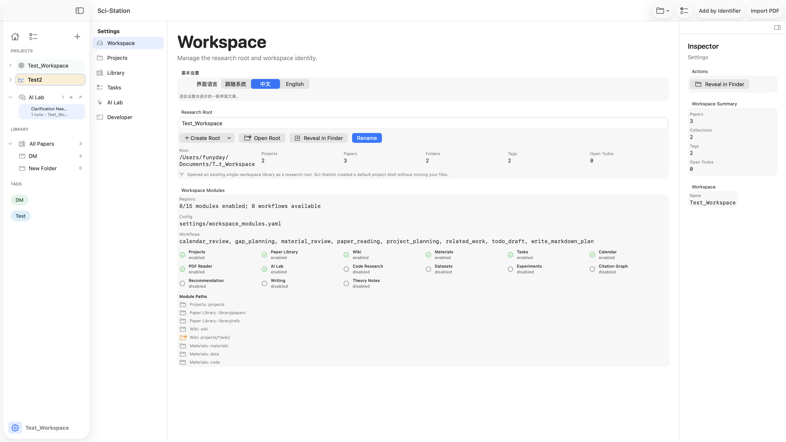
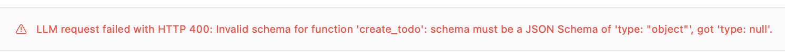
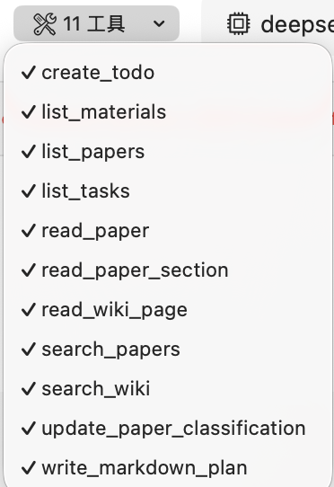
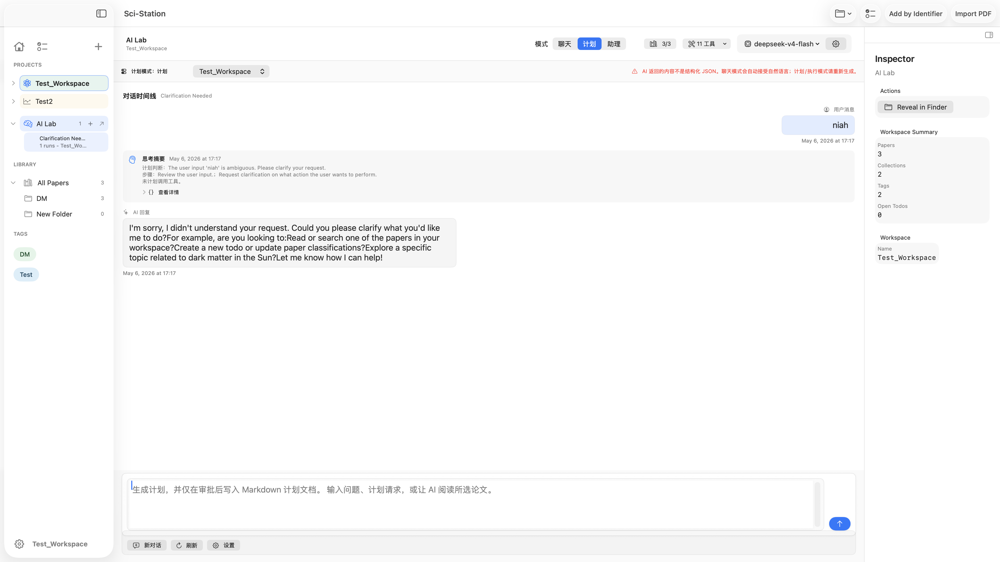
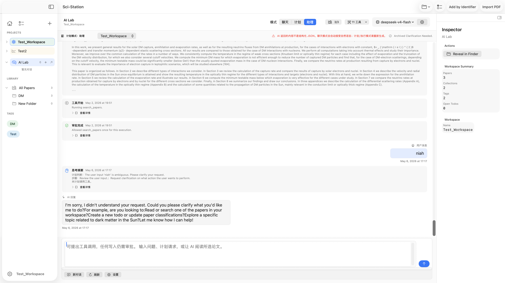
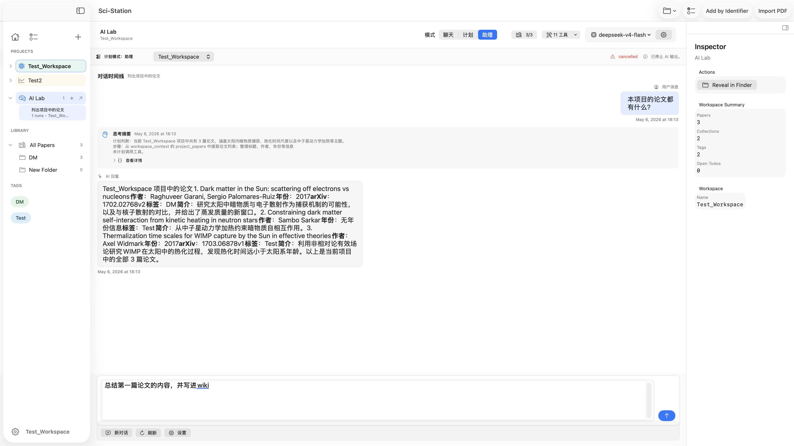
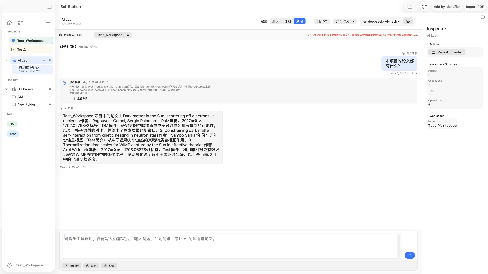
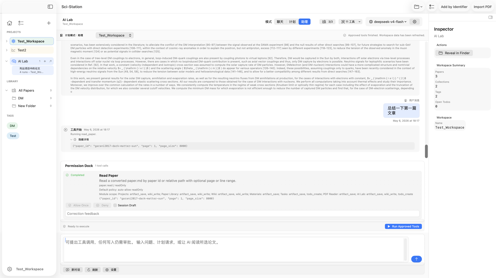

# P39 手动测试记录

## 使用说明

- 先填写 Basic Info、前置准备和自动化基线。
- 执行时在 Done 列打勾，并为每个用例填写 Status、Actual / Evidence。
- 单项状态建议使用：PASS / FAIL / BLOCKED / SKIPPED。
- 整体结论只使用：PASS / CONDITIONAL PASS / BLOCKED / INCOMPLETE。
- 如果自动化基线失败，请在结论中明确标注“本轮手动测试仅作为探索性记录，不作为最终验收”。

## Basic Info

- Date: 2026-05-06
- Tester: Funyday
- Task: 测试 AI Lab 基本功能，并补充 P39 相关手动验收
- Module: AI Lab / Sidecar Runtime / Evidence Artifact / Workspace Modules
- Commit:
- macOS:
- Xcode:
- Clean build:
- Workspace:
- AI enabled:
- Sidecar enabled:
- Embedding enabled:
- Overall Status:
- Summary:

## 本轮范围

- P39 主验收：MT10-P39-01 ~ MT10-P39-08
- AI Lab 基础：MT07-01 / MT07-02 / MT07-06 / MT07-07 / MT07-09 / MT07-12
- Sidecar Runtime 基础：MT08-02 / MT08-04 / MT08-05 / MT08-09 / MT08-10 / MT08-11
- Evidence / Artifact 基础：MT09-01 / MT09-02 / MT09-03 / MT09-07 / MT09-08 / MT09-09 / MT09-11
- Regression mini-pass：Workspace open / Sidebar / AI Lab / Settings / Artifact 预览

## 前置准备

- [x] Standard Workspace 已准备
- [ ] Legacy Workspace 已准备，且缺少 settings/workspace_modules.yaml
- [ ] Broken Workspace 已准备，至少包含 stale source 或 missing source
- [ ] 至少 1 个 project 和 1 篇 paper 可用于 AI Lab / Evidence 验证
- [ ] 如需 Sidecar 验证，Python sidecar 可启动；若不可启动，准备记录 fallback 验证

## 自动化基线

| Done | Check | Result | Notes |
|---|---|---|---|
| [x] | swift run SciStationCoreTestRunner |  |  |
| [x] | /Users/funyday/Documents/Sci-Station/.venv/bin/python -m pytest AgentRuntime/tests |  |  |
| [x] | xcodebuild -project Sci-Station.xcodeproj -scheme Sci-Station -destination 'platform=macOS' build |  |  |

## 建议执行顺序

1. 先做 Workspace Modules P39 主验收，确认模块配置、gating、warning、隐私边界正常。
2. 再做 AI Lab 基础主路径，确认项目作用域、plan、Permission Dock、历史 replay 正常。
3. 接着做 Sidecar Runtime，确认 runtime selector、fallback、restart、debug bundle 正常。
4. 然后做 Evidence / Artifact，确认 evidenceRefs、source jump、stale / missing warning、critic 阻断正常。
5. 最后做 regression mini-pass，并汇总问题分级与结论。

## P0 必测 Todo

| Done | ID | 模块 | 操作提示 | 预期 | Status | Actual / Evidence |
|---|---|---|---|---|---|---|
| [ ] | ENV-01 | 环境 | 补齐 Basic Info 中的 Commit、macOS、Xcode、Workspace、AI/Sidecar/Embedding 状态 | 报告前置条件完整 | ai给我填 |  |
| [x] | ENV-02 | 基线 | 运行自动化基线，若失败则记录为 exploratory | 基线结果可追踪 |  |  |
| [x] | WM-01 | Workspace Modules | 用缺少 settings/workspace_modules.yaml 的旧 workspace 打开 App | 自动生成默认 workspace_modules.yaml，workspace 可继续打开 | 正常 | 可以自动生成 |
| [x] | WM-02 | Workspace Modules | 打开 Settings 的 Workspace Modules 面板 | 可看到 enabled / disabled / warning / module paths 等信息 |  可以|  |
| [？] | WM-03 | Workspace Modules | 禁用 paper-library 后重新打开 workspace | Library / PDF Reader 入口隐藏，用户数据仍在磁盘 | 能看到模块列表，不知道在哪里禁用，点击也没用 |  |
| [？] | WM-04 | Workspace Modules | 制造依赖缺失，例如启用依赖 ai-lab 的模块但关闭 ai-lab | UI 显示 dependency warning，不崩溃，不删除数据 | same |  |
| [？] | WM-05 | Workspace Modules | 切换模块启用状态后进入 AI Lab | workflow 列表跟随 enabled modules 变化 |  |  |
| [？] | WM-06 | Workspace Modules | 触发需要审批的写操作 | Permission Dock 显示 module approval scope，但仍需用户审批 |  |  |
| [ ] | WM-07 | Workspace Modules | 检查 future / experimental modules 的默认表现 | 模块在 registry 中存在，但默认隐藏或禁用 |  |  |
| [ ] | WM-08 | Workspace Modules | 检查 settings/workspace_modules.yaml 和 debug bundle 预览 | 不包含 API key、.env、Keychain、prompt/response 明文、private path inventory |  |  |
| [x] | AI-01 | AI Lab | 打开 AI Lab 页面 | 页面显示正常，不崩溃，空状态清楚 | 正常 |  |
| [x] | AI-02 | AI Lab | 在不同 project 之间切换 project scope | composer / context 与当前 project 对齐，不串项目 | 出现了串项目的问题 |  |
| [ ] | AI-03 | AI Lab | 发起一次 plan 生成 | timeline / artifact draft / run 状态清楚可见 |  |  |
| [ ] | AI-04 | AI Lab | 观察 Permission Dock 风险提示 | 写操作风险可见，只读操作不混淆为写操作 |  |  |
| [ ] | AI-05 | AI Lab | 让 workflow 触发 write tool | 默认 ask，不自动写 workspace |  |  |
| [ ] | AI-06 | AI Lab | 打开历史 run 或 replay，然后改变 selector 再重开旧 run | 历史 replay 仍按原 run metadata 展示 |  |  |
| [ ] | SC-01 | Sidecar Runtime | selector 设为 LangGraph Sidecar 后发起新 run | 新 run 使用 sidecar；若失败，必须显示 fallback reason |  |  |
| [ ] | SC-02 | Sidecar Runtime | sidecar 不可用时再次发起 run | UI 显示可理解 fallback reason，不崩溃 |  |  |
| [ ] | SC-03 | Sidecar Runtime | 点击 Restart sidecar | health 状态更新，失败有错误提示 |  |  |
| [ ] | SC-04 | Sidecar Runtime | 改变 selector 后重开旧 run | replay 不受当前 selector 改变影响 |  |  |
| [ ] | SC-05 | Sidecar Runtime | 为已完成 run 导出 debug bundle | 成功生成真实 zip 和 manifest |  |  |
| [ ] | SC-06 | Sidecar Runtime | 解包或预览 debug bundle 清单 | 不含 API key、.env、Keychain、private path inventory |  |  |
| [ ] | EV-01 | Evidence / Artifact | 生成一份 reading artifact 或类似 artifact draft | artifact draft 含 evidenceRefs 与 critic report |  |  |
| [ ] | EV-02 | Evidence / Artifact | 展开 evidenceRefs | 显示 source、line range、confidence、source_hash 状态 |  |  |
| [ ] | EV-03 | Evidence / Artifact | 点击 evidence 跳转到 paper.md 或 annotations.md 对应行 | 成功定位或显示可理解 fallback reason |  |  |
| [ ] | EV-04 | Evidence / Artifact | 制造 stale evidence 或 missing source 场景 | preview 与保存路径都显示 stale / missing warning，不崩溃 |  |  |
| [ ] | EV-05 | Evidence / Artifact | 制造 unsupported claim 场景 | critic 阻断 final approval，不能无提示通过 |  |  |
| [ ] | EV-06 | Evidence / Artifact | 保存 artifact 或 citation block 后复查 | run_id、evidenceRefs、confidence/source 状态仍可追踪 |  |  |
| [ ] | REG-01 | Regression | 走一遍 Workspace open、Sidebar、AI Lab、Settings、Artifact 预览 | 主入口可用，无明显回归 |  |  |

## P1 补充 Todo

| Done | ID | 模块 | 操作提示 | 预期 | Status | Actual / Evidence |
|---|---|---|---|---|---|---|
| [ ] | AI-07 | AI Lab | New Chat 但不发送 | pending thread 不误写历史 |  |  |
| [ ] | AI-08 | AI Lab | 在 project A 输入 draft，切换 project B 再切回 A | prompt draft 可按项目恢复，不串项目 |  |  |
| [ ] | AI-09 | AI Lab | 注入损坏 JSONL 行后打开历史 | 损坏行被跳过或给出提示，不阻止历史读取 |  |  |
| [ ] | SC-07 | Sidecar Runtime | selector 设为 Auto fallback，分别测 ready / not ready | ready 走 sidecar，not ready 走 Swift fallback |  |  |
| [ ] | SC-08 | Sidecar Runtime | 对已完成 run 使用 Open run directory | 打开真实 run directory |  |  |
| [ ] | SC-09 | Sidecar Runtime | Disable sidecar for workspace 后发起新 run | 新 run 不使用 sidecar，设置持久化 |  |  |
| [ ] | SC-10 | Sidecar Runtime | 如能稳定注入 crash，测试 last checkpoint / replay / fallback | crash 后 UI 仍可解释；若无法注入，可标注 SKIPPED 并写替代验证 |  |  |
| [ ] | EV-07 | Evidence / Artifact | 如 fixture 有 page mapping，点击 evidence 跳转 PDF 页 | 打开 PDF Reader 并定位到页码；无 fixture 可标注 SKIPPED |  |  |

## 问题反馈

- 问题1: 无法正常编辑workspace的名字：报错显示：`“Test_Workspace” couldn’t be moved because you don’t have permission to access “Documents”.`
- 问题2: 缺少删除project的选项。
- 问题3: 左侧边栏的折叠动画需要修复，子栏目展开的时候，先出现在主栏上边，再向下移动展开，反过来也是，正确的UI显示应该是子栏应该在主栏图层后边被遮盖，只有主栏下方才会显示自栏的内容。
- 问题4: 栏目折叠延迟比较高，修复一下。折叠按钮本身的点击区域过小，优化一下。
- 问题5: 点击library，无法展开，可以改为，点击进入总文库，双击打开折叠。
- 子栏目点击区域太小，应该是整个块都是可以点击的才对
- 问题6: 如图：， 聊天模式仍然出现问题，请修复。
- 问题7: 如图， 工具管理改为多选框支持全选，并且不要出现点击一个工具，选项栏目就收走了
- 问题8: 顶栏点击设置，进入了一个独立的设置窗口，而且和原界面的设置是同步的，这样很奇怪，我希望做一下同步，统一都是进入一个独立的窗口
- 问题9: ai lab功能问题： 点击ai lab无问题，在一个已经存在的对话里切换项目，出现了进入新对话的问题，同时选择不同project，的时候侧栏状态也显示切换不同的project，但我觉得这个设计很奇怪，不应该有目前处在哪个项目这种东西，也就是不要有选中哪个项目的设计，而对话本身的项目归属我觉得需要重新思考这个ai lab的UI设计和交互逻辑。（**值得思考**）
- 问题10: 如图： 我发了一个`请生成一个阅读本项目论文的计划` ai进行了思考，但是出现了右上角的报错，并且不保存我输出的消息，因此不仅要修复这个问题，还要保存即使出现错误的对话记录，同时也支持保存思考过程中点击暂停后，发送的消息回到到自己的输入框里。
- 增加ai输出的内容的复制信息键
- 问题11: 如图： 本对话进行归档后，仍然留存在本界面，这是不对的，选择本对话进行归档，应该自动跳转到新对话页面，同时ai lab内无保存的对话时，点击ai lab也应该是进入新对话的页面。
- 问题12:  优化中文输入，当我输入内容的时候，有输入框，按回车就发送了消息了，这是不对的。
- 问题13: 如图 我发送了`总结第一篇文章，并写入wiki`，但是没有回复，而且出现右上角的报错
- 问题14: 如图 阅读论文，出现如此审批，且我点击了run键没有正常输出内容，意义不明，且阅读内容这种工具不需要审批，所有模式都是。
